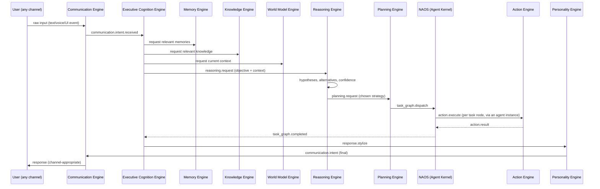

# 03 — Backend Architecture

## 1. Architectural style

**Modular Monolith deployed as independently addressable services** (ADR-001). Each
engine in the [Service Inventory](00-overview-and-decisions.md) is:

- A standalone FastAPI application with its own lifespan, database connections, and
  Event Bus connection.
- Runnable in two modes:
  - **`embedded`** — imported and run as an in-process component inside the single
    `nova-host` supervisor process (local-first default).
  - **`standalone`** — run as its own OS process / container, communicating over the
    network Event Bus (enterprise/cloud default).
- Internally organized as a **layered domain architecture** (Clean Architecture, per
  Part 1's mandate):

```
 ┌───────────────────────────────────────────┐
 │  api/            (HTTP handlers — thin)     │
 ├───────────────────────────────────────────┤
 │  events/         (bus publishers/consumers) │
 ├───────────────────────────────────────────┤
 │  domain/         (business logic — the      │
 │                    "intelligence" of the     │
 │                    engine; framework-free)   │
 ├───────────────────────────────────────────┤
 │  repository/     (persistence — Postgres,   │
 │                    Neo4j, Redis adapters)     │
 └───────────────────────────────────────────┘
```

`domain/` never imports FastAPI, SQLAlchemy, or the Event Bus SDK directly — it depends
on repository/event **interfaces** defined in `domain/ports.py`, and `api/`, `events/`,
`repository/` implement those ports. This is what lets an engine's persistence or
transport be swapped without touching its actual cognitive logic — directly satisfying
every engine's Bible-mandated "Architectural Requirements" section (e.g., Part 8:
"reasoning logic belongs to NOVA... replacing the underlying model must not require
redesigning the reasoning architecture").

## 2. `nova-host` — the local-first supervisor process

`nova-host` is the process a single user actually runs. Its only job is orchestration
(mirrors Part 20's NOVA Core boot sequence exactly):

```python
# services/nova-core/src/nova_core/host.py  (illustrative shape, not final code)
class NovaHost:
    async def boot(self) -> None:
        await self._phase_1_bootstrap()      # config, integrity, security layer, event bus
        await self._phase_2_data_engines()    # memory, knowledge, personality, world model, digital twin
        await self._phase_3_cognitive_engines() # perception, planning, reasoning, communication, action, autonomy, capability
        await self._phase_4_agents()          # agent runtimes, external integrations
        await self._phase_5_health_checks()
        await self._phase_6_context_sync()
        await self._phase_7_ready()
```

Every phase corresponds 1:1 to Part 20's "System Boot Sequence." In `embedded` mode this
runs each engine's FastAPI app via `asgi` mounting inside one process (single port,
path-routed: `/memory/*`, `/knowledge/*`, ...) for zero-ops local deployment. In
`standalone` mode `nova-host` instead starts a lightweight **Service Registry client**
that waits for each engine's own container to report ready via heartbeat (Part 20
"Heartbeat System"), rather than mounting them.

## 3. Request lifecycle (the Thinking Pipeline, concretely)

Every user-facing request, regardless of entry channel, becomes a single pipeline
executed as an event chain — this is Part 2's "Thinking Pipeline" made literal:



`NAOS (Agent Kernel)` above stands in for the full NOVA Agent Operating System
([12](12-agent-architecture.md)) — internally this single arrow expands into
Kernel Scheduler dispatch, Supervisor delegation, and one or more agent instances
executing, per [12 §7](12-agent-architecture.md#7-agent-kernel--process-management--scheduling).

Every arrow above is an **event on the bus** (see
[10](10-inter-engine-communication.md) for the full topic catalogue), never a direct
function call — this is what keeps the modular monolith honest as a monolith-shaped
*deployment* of a true microservices-shaped *architecture*.

## 4. Concurrency model

- Every engine runs a single-process **asyncio event loop**; CPU-bound work (embedding
  generation, local model inference) is offloaded to a `ProcessPoolExecutor` or, for
  GPU work, to Ollama's own server process over HTTP — the engine process itself never
  blocks the loop.
- Background/scheduled work (Part 2 "Continuous Background Thinking", Part 6
  "Background Cognition") runs as Arq workers reading from dedicated low-priority
  queues so foreground user interaction is never starved.
- Long-running agent executions are modeled as **sagas**: a durable record in
  PostgreSQL (`task_graph`, `task_node` tables) plus events, so a crashed engine can
  resume exactly where it stopped (Part 6 "Cognitive Memory": "if interrupted, NOVA
  resumes exactly where it stopped").

## 5. Error handling & resilience

Every engine implements the same middleware stack (provided by `nova-observability`
and `nova-eventbus-sdk` so it is not reimplemented 17 times):

1. **Circuit breaker** around every outbound call (model gateway, other engine RPC,
   external API) — Part 12's "Retry System" (immediate → delayed → exponential backoff
   → alternative strategy) implemented once, reused everywhere.
2. **Dead-letter topic** per event subscription — a handler that fails after retries
   publishes to `<topic>.dead-letter` instead of dropping the event, satisfying Part 20's
   "replay missed events."
3. **Graceful degradation**: if a dependency engine is unreachable, the calling engine
   falls back to cached/last-known state (from Redis) and flags the response with a
   lowered confidence score (Part 8 "Confidence Estimation") rather than failing the
   whole pipeline.

## 6. Configuration & multi-environment support

- Twelve-factor: all config via environment variables, loaded through a typed
  `pydantic-settings` class per engine; local defaults committed in
  `infra/docker/.env.local.example`.
- Execution Modes (Part 20: Interactive, Silent, Developer, Research, Presentation,
  Gaming, Travel, Offline, Emergency) are represented as a single `SystemMode` value
  broadcast on the bus (`nova.mode.changed`) that every engine subscribes to and may
  react to (e.g., Communication Engine silences notifications in Gaming mode per Part
  13's Communication Policies) — modes change behavior, never architecture.
