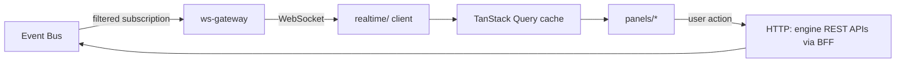

# 04 — Frontend Architecture (Web Command Center)

## 1. Product framing

Per Part 1: "Opening NOVA should feel like entering the control center of an advanced
artificial intelligence." The frontend is architected as a **live command center**, not
a chat window with a sidebar. Concretely: the chat/conversation surface is one panel
among several simultaneously-live panels, never the entire application.

## 2. Application shape

```
apps/web-client/
├── src/
│   ├── app/                    # Routing (TanStack Router), layout shell
│   ├── panels/                 # One directory per "Live X Dashboard" from the Bible
│   │   ├── conversation/       # Communication Engine surface (Part 13)
│   │   ├── reasoning/          # Reasoning visualization (Part 8)
│   │   ├── planning/           # Execution dashboard (Part 9)
│   │   ├── memory-timeline/    # Memory timeline & visualization (Part 3)
│   │   ├── knowledge-graph/    # Visual knowledge map (Part 10)
│   │   ├── world-model/        # Visual world map (Part 5/18)
│   │   ├── agents/             # Multi-agent activity (Part 4)
│   │   ├── autonomy/           # Autonomy dashboard (Part 14)
│   │   ├── digital-twin/       # Digital Twin center (Part 16)
│   │   ├── personality/        # Personality dashboard (Part 17)
│   │   ├── executive/          # Executive cognition dashboard (Part 19)
│   │   └── system/             # NOVA Core live dashboard (Part 20)
│   ├── entities/                # Typed data-layer hooks per domain entity (from nova-contracts)
│   ├── realtime/                 # WebSocket client, event → cache reconciliation
│   ├── shared/                   # Cross-panel utilities
│   └── main.tsx
```

Each `panels/*` module is self-contained (its own components, hooks, and local state)
and subscribes only to the event topics relevant to it — mirroring ADR-004's
"engines only get what's relevant" principle (Part 11 "Agent Awareness") at the UI
layer as well.

## 3. Data flow



- **Reads** are event-driven: the `ws-gateway` (a thin service, see [09](09-event-bus-architecture.md))
  subscribes to bus topics scoped to the authenticated user/session and forwards them
  over WebSocket; `realtime/` reconciles them directly into the TanStack Query cache
  (`queryClient.setQueryData`), so panels re-render from live push data with no polling.
- **Writes** (sending a message, approving an autonomous action, editing a memory) go
  through a conventional REST call to the owning engine's API (via an API Gateway, see
  [11](11-api-architecture.md)), which then produces the events that flow back through
  the same real-time path — the UI never mutates local state optimistically for
  anything that affects shared cognitive state, avoiding drift between what the user
  sees and what NOVA actually believes.

## 4. The "living interface" requirement, implemented

Part 1: "Even while idle the system should display meaningful activity... nothing
should appear static for long periods." Concretely:

- Every panel has an **idle state** driven by real background-engine telemetry
  (`nova.heartbeat`, `memory.consolidation.progress`, `knowledge.indexing.progress`,
  etc.) — never a decorative fake animation. Part 6 is explicit: "never generate fake
  animations."
- A persistent **System Pulse** component in the shell header visualizes the NOVA Core
  heartbeat (Part 20) at all times, regardless of which panel is focused.
- Framer Motion drives transitions; motion is data-driven (bound to real event
  cadence/confidence values), not scripted for effect.

## 5. State management

| State category | Tool | Example |
|---|---|---|
| Server/shared cognitive state | TanStack Query, hydrated by `realtime/` | Active thoughts, agent status, memory timeline |
| Ephemeral UI state | Zustand | Which panel is expanded, theme, local filters |
| Form/input state | React Hook Form + zod (generated from `nova-contracts`) | Composing a message, editing a policy |
| Auth/session | A dedicated `useSession()` hook backed by httpOnly cookies (see [13](13-auth-and-security.md)) | Current user/device identity |

## 6. Accessibility & internationalization

- WCAG 2.1 AA baseline; all live-updating panels use `aria-live` regions so the
  "always active" interface doesn't become a screen-reader hazard.
- `react-i18next`, keys generated alongside `nova-contracts` locale strings, satisfying
  Part 13's "Multi Language Support" at the UI layer (backend already handles detection
  and translation; the frontend must not hardcode English strings).

## 7. Performance targets

- First meaningful paint of the command center shell: < 1.5s on a mid-range laptop.
- Steady-state panels update from bus events at up to 30 events/sec without dropped
  frames (virtualized lists for memory timeline / knowledge graph beyond ~500 visible
  nodes).
- Code-split per panel (`React.lazy`) so a user who never opens the Knowledge Graph
  panel never pays its D3 bundle cost.
