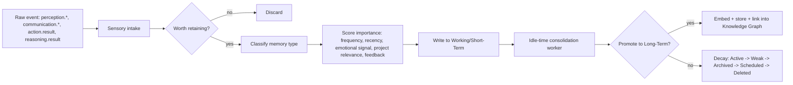

# 08 — Memory Architecture

This document specifies how Part 3's nine memory categories map onto concrete storage
and services. It is distinct from [07 — Database Architecture](07-database-architecture.md),
which describes *where bytes live*; this document describes *how memory behaves as a
cognitive system* — the part the Bible calls "a living cognitive memory system," not a
database.

## 1. The memory hierarchy as a service layer

`memory-engine`'s `domain/` package has one module per Bible memory type, each
implementing a shared `MemoryStore` protocol (`write`, `retrieve`, `decay`,
`consolidate`) but with type-specific retention and scoring rules:

```
memory-engine/src/nova_memory_engine/domain/
├── sensory.py       # Part 3: capture-then-discard unless promoted
├── working.py        # Redis-backed, task-scoped, auto-expires
├── short_term.py      # Postgres, hours-to-days TTL
├── long_term.py       # Postgres+pgvector, importance-scored, never hard-deleted
├── semantic.py        # facts/concepts — delegates heavily to knowledge-engine via events
├── procedural.py      # skills/how-to — structured as reusable workflow templates
├── episodic.py         # experiences — context+participants+timeline+outcome+lessons
├── project.py           # one memory namespace per project (Part 3 "Project Memory")
├── relationship.py       # entity-to-entity links — delegates to knowledge-engine's graph
├── preference.py          # user preference key/value with confidence + evidence count
└── decision.py             # decision + alternatives + reasoning + tradeoffs + outcome (Part 3 & 8)
```

## 2. The memory lifecycle pipeline

Every incoming observation — whether from a user conversation, a completed task, or a
Perception Engine event — passes through one pipeline (Part 3 "Memory Philosophy: the
objective is not to remember everything, the objective is to remember the right
things"):



The importance score (Part 3 "Memory Importance Score") is a weighted function
recomputed on every access, not just at write time — recency and frequency are live
features, not fixed at creation.

## 3. Retrieval — the "Memory First Principle"

Part 3: "Whenever NOVA receives a new request, memory should always be consulted
before generating a response." This is enforced structurally, not by convention: the
Reasoning Engine's pipeline step "Load memories" (see [06](06-ai-layer-architecture.md))
is a non-optional, non-skippable stage in `reasoning-engine`'s state machine — there is
no code path that reaches model inference without first calling
`memory-engine.retrieve()`.

Retrieval supports every mode listed in Part 3 "Memory Search," implemented as
composable query strategies against the stores in [07](07-database-architecture.md):

| Search mode | Backing store/technique |
|---|---|
| Semantic / vector search | pgvector HNSW cosine similarity |
| Graph traversal | Neo4j Cypher via knowledge-engine |
| Timeline search | Postgres range query on `created_at` / episodic timestamps |
| Relationship search | Neo4j |
| Intent-based / natural language | Query rewritten by Reasoning Engine into a hybrid semantic+graph query |
| Similarity search | Same as semantic, different entry point (memory-to-memory, not query-to-memory) |

Results are re-ranked by a single `MemoryRanker` combining relevance, confidence,
recency, importance, and current World Model context (Part 3 "Memory Ranking" is
actually specified under Knowledge, Part 10 — this implementation shares the ranker
between both engines via `packages/nova-eventbus-sdk`'s scoring utilities to avoid
divergent ranking behavior between Memory and Knowledge, which would break the "one
mind" illusion).

## 4. Consolidation, compression, and forgetting

Runs as a scheduled Arq job (`memory-engine`'s idle-time worker, Part 3 "Memory
Consolidation" / Part 2 "Continuous Background Thinking") that:

1. Finds near-duplicate long-term memories (cosine similarity above threshold) and
   merges them, preserving all source references.
2. Generates higher-level summary memories from clusters of related episodic memories
   (Part 3 "Generate summaries," "create higher level abstractions").
3. Advances `lifecycle_state` for memories whose importance has decayed below stage
   thresholds (Active → Weak → Archived → Scheduled → Deleted), per [07 §6](07-database-architecture.md#6-data-lifecycle--the-bibles-memory-forgetting-model).
4. Emits `memory.consolidation.completed` with a diff summary, which the frontend's
   Memory Timeline panel renders as a visible "NOVA is organizing its memory" activity
   — directly satisfying Part 1's "living interface" and Part 3's "Memory
   Visualization."

## 5. Decision Memory — shared contract with the Reasoning Engine

Part 3 and Part 8 both specify "Decision Memory" (why a technology was chosen, what
alternatives existed, confidence, outcome). Rather than two engines each owning a
partial copy, `decision.py` in `memory-engine` is the single owner; `reasoning-engine`
writes to it via a `memory.decision.record` event at the end of every Level 3/4
reasoning session, and reads from it as part of "Analogical Reasoning" (Part 8: "search
for similar situations... transfer useful knowledge") when starting a new one.

## 6. Project Memory

Every project object (also referenced by Digital Twin Engine and World Model Engine)
has a dedicated memory namespace: `project.py` scopes all four memory search modes to a
`project_id` filter, so resuming a project months later (Part 3: "if the project
resumes months later, NOVA should immediately understand its full context") is a single
`retrieve(project_id=..., mode="project_resume")` call that pulls the project's
architecture, milestones, known bugs, and decision history in one pass, pre-assembled
for the Reasoning Engine's context window (see Prompt Orchestration, [06 §4](06-ai-layer-architecture.md#4-prompt-orchestration)).

## 7. Privacy & isolation

Personal memory (Part 10 "Personal Knowledge": preferences, current projects, business
plans) is stored under the local user's namespace and, per
[18 — Local-First & Cloud Sync](18-local-first-and-cloud-sync.md), never leaves the
device unless the user opts into cloud sync. In enterprise/multi-tenant mode, every row
across every memory table is scoped by `tenant_id` + `user_id` with row-level security
enforced at the Postgres level, not just in application code — defense in depth for the
"external brain" the Bible describes in Part 3's "Digital Brain" section.
