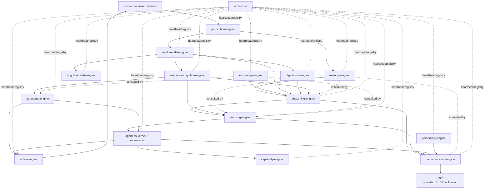

# 10 — Communication Flow Between Every Engine

This document exists because the user asked for it explicitly, distinct from the
general [Event Bus Architecture](09-event-bus-architecture.md): a concrete map of which
engine talks to which, about what, and in response to what — grounded in the specific
cross-engine scenarios the Bible itself narrates (Part 11's meeting example, Part 18's
deployment example, Part 20's boot sequence, etc.).

## 1. Engine dependency graph

All arrows are Event Bus subjects (ADR-004) — no direct calls. `nova-core` (dotted
lines) does not sit in the data path; it only tracks liveness/registry per Part 20.
`agent-os-kernel + supervisors` is drawn as one node here for readability; its internal
structure (kernel, supervisors, agent instances, execution backends) is the full
[NOVA Agent Operating System](12-agent-architecture.md) — this diagram shows NAOS's
external interface to the rest of NOVA, not its internals.

## 2. Canonical event-flow table

Every row cites the Bible passage it implements.

| # | Trigger | Publisher → Subject | Subscribers & reaction | Bible source |
|---|---|---|---|---|
| 1 | User opens VS Code | Companion → `perception.desktop.observed` | perception-engine normalizes → `world_model.object.updated` (Window, Project) | Part 11 example |
| 2 | Project context changes | world-model-engine → `world_model.context.changed` | cognitive-state-engine re-evaluates Focus (Part 6); digital-twin-engine updates Workflow Model | Part 6 "Focus System"; Part 16 "Workflow Model" |
| 3 | User sends a message | communication-engine → `communication.intent.received` | executive-cognition-engine begins pipeline (see [03 §3](03-backend-architecture.md#3-request-lifecycle-the-thinking-pipeline-concretely)) | Part 13 "Communication Principle" |
| 4 | Executive needs context | executive-cognition-engine → `memory.retrieve.request` / `knowledge.retrieve.request` / `world_model.context.request` (request/reply) | memory-engine, knowledge-engine, world-model-engine reply synchronously | Part 2 "Thinking Pipeline" |
| 5 | Reasoning concludes | reasoning-engine → `reasoning.process.completed` (with confidence, `objective_text`, `chosen_description`) | planning-engine consumes to build/adjust Task Graph; memory-engine writes Decision Memory | Part 8 "Reasoning Memory"; Part 3 "Decision Memory" |
| 6 | Plan ready | planning-engine → `planning.task_graph.created` | agent-os-kernel's Scheduler assigns nodes to agent instances via the relevant Supervisor ([12 §7](12-agent-architecture.md#7-agent-kernel--process-management--scheduling)); communication-engine may notify user of roadmap | Part 9 "Roadmap Generation" |
| 7 | Agent needs to act | an agent instance (via its Supervisor) → `action.execute` | action-engine validates permissions/risk, executes via companion or cloud adapter, replies `action.result` | Part 12 "Action Principle" |
| 8 | Action carries risk | action-engine → `autonomy.approval.requested` | autonomy-engine evaluates Autonomy Level/Trust/Policy, replies `autonomy.decision.made`; if approval required, communication-engine prompts the user | Part 14 "Approval Workflows" |
| 9 | Meeting begins (multi-modal fusion example) | perception-engine (calendar) → `perception.calendar.observed`; (mic) → `perception.voice.observed` | world-model-engine fuses both into `world_model.context.changed {activity: "meeting"}`; communication-engine reduces notification priority; planning-engine postpones background tasks; autonomy-engine pauses proactive suggestions | Part 18 "Situational Awareness" example (verbatim scenario) |
| 10 | Deployment triggered | a `devops-agent` instance (under the Operations Supervisor) → `action.execute {type: deployment}` | action-engine runs Dry Run first if configured, then executes; world-model-engine updates Project State; knowledge-engine reindexes docs; memory-engine stores the event; digital-twin-engine updates workflow model | Part 18 "Event Propagation" example (verbatim scenario) |
| 11 | Repository updated | perception-engine (filesystem/git) → `perception.filesystem.observed` | knowledge-engine reindexes documentation; memory-engine stores event; planning-engine updates roadmap; capability-engine refreshes dependency graph; communication-engine notifies user | Part 18 "Event Propagation" example |
| 12 | Contradiction found | knowledge-engine → `knowledge.contradiction.detected` | reasoning-engine is notified before using the affected knowledge node; nothing auto-overwrites | Part 10 "Contradiction Detection" |
| 13 | Autonomous opportunity detected | autonomy-engine → `autonomy.opportunity.detected` | executive-cognition-engine scores against Cognitive Priority Matrix; if pursued, planning-engine creates a task graph | Part 14 "Initiative Engine" |
| 14 | Response ready | reasoning-engine / planning-engine / agent-os-kernel (via Executive Cognition) → `communication.intent.ready` | personality-engine validates tone/consistency (synchronous call, request/reply); communication-engine renders to the active channel(s) | ADR-005; Part 17 "Validate Personality Consistency" |
| 15 | Task/decision completed | an agent instance → its Supervisor → agent-os-kernel → `agent_os.task.completed` | reasoning-engine and cognitive-state-engine trigger Self Reflection/Retrospective; memory-engine stores lessons learned; Agent Registry updates the instance's performance score ([12 §6](12-agent-architecture.md#6-agent-registry--discovery-install-versioning-hot-loadunload)) | Part 2 "Self Improvement Engine"; Part 6 "Reflection Engine" |
| 16 | System boot | nova-core → phase-gated `nova.module.status_changed` events | every engine registers, then reports healthy before the next boot phase proceeds | Part 20 "System Boot Sequence" |
| 17 | Engine crash | nova-core detects missed heartbeat → `nova.module.status_changed {status: down}` | nova-core restarts the module; on recovery the module replays missed JetStream events; dependent engines are notified | Part 20 "Fault Tolerance", "Recovery Engine" |
| 18 | Mode change (e.g., user starts gaming) | any engine or user action → `nova.mode.changed {mode: "gaming"}` | communication-engine silences non-critical notifications; autonomy-engine adjusts interruption thresholds; world-model-engine raises Attention on performance monitoring | Part 6 "Attention shifts... if gaming begins, performance monitoring becomes dominant"; Part 13 "Communication Policies" |

> **Added 2026-09-23 (Phase 4F.6), additively.** Rows 8 and 13 predicted how
> autonomy would be reached. The initiative path as actually built is:
> **`cognitive-state-engine` → `autonomy.decision.requested`** (internal
> request/reply) **→ `autonomy-engine`**. It fires when a thought carrying a
> complete `ProposedAction` is promoted to the `IMMEDIATE` attention layer.
> `autonomy-engine` derives the decision's identity from the envelope's
> `event_id` and reads level, policies and grants server-side for
> `primary_user_id`. It then runs the existing Policy → Permission → Trust →
> Level decision. **Only at Level 2**, with every TDD 4F.5 §22.4 precondition
> met, does it request **`action.execute`** from `action-engine`. The producer
> never publishes `action.execute` and never names a user or a decision
> identity. See [TDD 4F.6](../design/phase-4/10-tdd-4f6-initiative-trigger.md)
> §19. Rows 8 and 13 are left as written: neither of their subjects exists.

> **Added 2026-09-26 (Phase 4F.7), additively.** A second cross-engine flow
> reaches `cognitive-state-engine`:
> **`perception-engine` → outbox → `perception.sensor.health_changed` →
> `cognitive-state-engine`** (and, as before, `ws-gateway`). `perception-engine`
> reports each real sensor lifecycle transition with the `SensorState` value it
> reached (A-4F7-2); `cognitive-state-engine` validates it, accepts only those
> six values, and keeps the latest per sensor in `cognitive_state.sensor_state`
> for its read-only `/v1/cognitive-state/sensors`. **ADR-004 holds**:
> `cognitive-state-engine` never calls `perception-engine`'s
> `GET /v1/perception/sensors`, and neither engine imports the other — the
> vocabulary is restated, with a test that parses `perception-engine`'s source to
> keep the two identical. See
> [TDD 4F.7](../design/phase-4/11-tdd-4f7-cognitive-state-panel.md) §8–§10.

## 3. Synchronous vs. asynchronous calls

Not every cross-engine interaction should be a fire-and-forget event — some steps in
the Thinking Pipeline are logically blocking (Executive Cognition cannot proceed to
Reasoning without memory/knowledge/context back). These use NATS **request/reply**
(still routed through the bus, still schema-validated, still logged — ADR-004 is not
violated, only the delivery pattern differs):

| Interaction | Pattern | Timeout / fallback |
|---|---|---|
| Retrieve memories/knowledge/world context | Request/Reply | 500ms timeout → proceed with partial context, confidence penalty |
| Personality consistency validation | Request/Reply | 200ms timeout → fall back to last-known-good style profile |
| Autonomy approval check before execution | Request/Reply | No timeout bypass — action blocks until a decision or explicit user timeout policy fires |
| Everything else (state changes, notifications, learning updates) | Async publish | N/A — eventually consistent by design |

## 4. Consistency model

NOVA is **eventually consistent across engines, strongly consistent within an engine**.
The World Model is the closest thing to a shared "current truth," and even it resolves
conflicting inputs via confidence/recency/policy (Part 18 "Conflict Resolution") rather
than assuming a single global transaction. This matches the Bible's own framing of the
World Model as "a continuously synchronized graph" (implying convergence over time, not
instantaneous global locks) and keeps engines independently deployable/scalable
([19](19-scalability-strategy.md)) without a distributed-transaction coordinator, which
would reintroduce the tight coupling ADR-001/004 are designed to eliminate.
