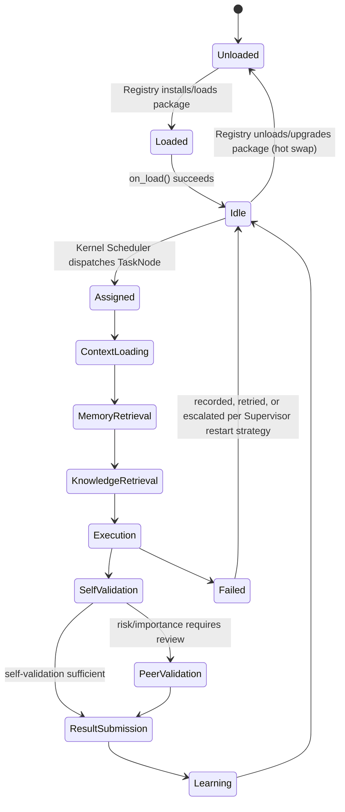
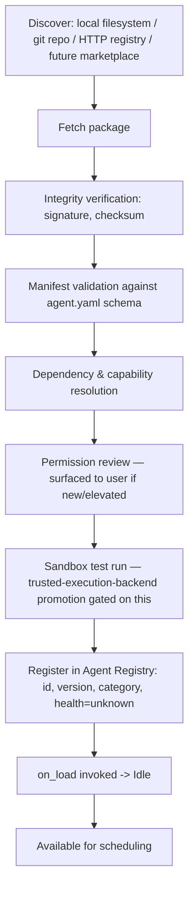
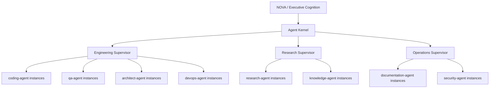

# 12 — Agent Architecture: The NOVA Agent Operating System (NAOS)

Status note: this document supersedes the v1 "Agent Orchestrator as one more engine"
design, per **ADR-008** ([00 §Architecture Decision Records](00-overview-and-decisions.md#adr-008--the-agent-orchestrator-becomes-the-nova-agent-operating-system-naos)).
The Bible (Part 4) describes an entire AI organization — hundreds of specialized
agents, peer review, conflict resolution, temporary agent composition, and an explicit
scale target of "10,000 micro-agents... without redesigning the core orchestration
system." An orchestrator that runs each agent as an in-process async task does not
survive that target. NAOS is designed, from Phase 3 onward, as an operating system
whose processes happen to be agents — not a job queue with agent-shaped jobs.

## 1. Agents are not engines

A critical distinction the Bible draws (Part 4) and this architecture preserves
structurally: **engines** (Reasoning, Planning, Memory, ...) are always-on cognitive
subsystems that constitute NOVA's mind. **Agents** (Coding Agent, Research Agent,
DevOps Agent, ...) are task-scoped workers that NOVA's mind delegates to, spun up and
torn down per the lifecycle in Part 4. Agents are dynamically discoverable, loadable,
unloadable, and versioned units running *on* NAOS, the same way a process runs on an
operating system kernel — they are not part of the always-running engine surface, and
NAOS itself contains no domain-specific agent logic, exactly as `nova-core` contains no
engine-specific logic (Part 20: "it owns no business logic... its responsibility is
orchestration").

## 2. The operating-system metaphor, made concrete

Every NAOS concept below has a direct, deliberate analogue in a conventional operating
system — this is not decoration, it is the design method: OS kernels solved "run many
independent, untrusted, resource-bounded, restartable units of work, safely, at scale"
decades ago, and Part 4's requirements (isolated responsibilities, defined APIs,
independent testability, graceful failure, hundreds-to-thousands of concurrent units)
are that exact problem restated for agents.

| OS concept | NAOS equivalent | Bible grounding |
|---|---|---|
| Kernel | Agent Kernel (`agent-os/kernel`) | Part 4 "Agent Orchestrator... no agent should start working independently without approval from NOVA" |
| Process | Agent Instance (one running execution of an agent) | Part 4 Agent Lifecycle |
| Executable / installed program | Agent Package (`agents/<name>-agent`) | Part 4 "every agent must be modular, replaceable" |
| Device driver / kernel module | Agent (implements the standardized Agent SDK interface) | Part 15's Capability model, applied to agents |
| Syscall interface | Agent SDK (`agent-os/sdk`) | Part 4 "structured messages... every agent must expose a defined API" |
| Process scheduler | Kernel Scheduler | Part 4 "Execution Strategy," Part 19 Cognitive Priority Matrix |
| Inter-process communication (message passing, never shared memory) | Agent Mailbox over the Event Bus | ADR-004, Part 4 "departments never communicate directly" |
| Process table / `ps` | Agent Registry | Part 4 "Agent Evolution," Part 15 Capability Registry pattern |
| Supervisor tree (Erlang/OTP) | Supervision Trees | Part 4 "Chief Executive Principle," conflict resolution, peer review |
| Container / VM / remote host | Execution Backend (in-process / subprocess / container / remote) | Part 20 "Distributed Execution," Part 4 "Future Scalability" |
| Package manager / app store | Agent Registry's discovery & install pipeline | Part 15 "Marketplace Ready," applied to agents |

## 3. The Agent Package format

An agent is a versioned, self-contained package — never a hand-wired class imported by
the kernel:

```
agents/<name>-agent/
├── agent.yaml              # manifest — see below
├── src/
│   └── handler.py           # implements the Agent SDK's AgentHandler protocol
└── tests/
```

```yaml
# agent.yaml — the Agent Package manifest
id: coding-agent
version: 1.3.0
category: coding                    # Part 4 taxonomy: research, architect, backend,
                                     # frontend, ai-engineering, ml, coding, devops,
                                     # database, cybersecurity, vision, voice, browser,
                                     # desktop-control, knowledge, memory, automation,
                                     # calendar, communication, gaming, finance, health,
                                     # education, creative, product-manager, qa, ...
display_name: "Coding Agent"
required_capabilities:              # resolved by capability-engine at execution time
  - git
  - filesystem
  - terminal
required_permissions:                # checked by nova-auth (Part 14 Permission Matrix)
  - filesystem:write:project-scope
  - terminal:execute
supported_execution_backends:        # which backends this agent may run under
  - inprocess
  - subprocess
  - container
resource_profile:
  cpu: standard
  memory: standard
  gpu: none
health_check:
  interval_seconds: 30
compatibility:
  min_kernel_version: "1.0.0"
```

**Consequence.** The Agent Registry ([§6](#6-agent-registry-discovery-install-versioning-hot-loadunload))
can validate, install, version, and reason about an agent entirely from its manifest,
before ever importing its code — the same separation a package manager maintains
between package metadata and package contents.

## 4. The Agent SDK — the standardized interface (the "syscall" contract)

Every agent, regardless of category or author, implements this interface from
`agent-os/sdk/python` (or `agent-os/sdk/rust` for future performance-critical agents).
This is deliberately richer than the v1 `AgentHandler` protocol it replaces — it is
where "standardized capabilities, lifecycle events, health monitoring, permissions,
communication interfaces and performance metrics" (the user's explicit requirement)
become one concrete contract instead of five separate ad hoc mechanisms:

```python
class AgentHandler(Protocol):
    # Lifecycle (Part 4 Agent Lifecycle, §5 below)
    async def on_load(self, manifest: AgentManifest) -> None: ...
    async def on_unload(self) -> None: ...
    async def on_assign(self, task: TaskNode, context: AgentContext) -> None: ...
    async def execute(self) -> AgentResult: ...
    async def on_pause(self) -> None: ...
    async def on_resume(self) -> None: ...
    async def self_validate(self, result: AgentResult) -> ValidationOutcome: ...

    # Health (Part 4 "report uncertainty... fail gracefully")
    async def health_check(self) -> AgentHealth: ...

    # Communication (kernel-mediated only — see §8)
    async def on_message(self, message: AgentMessage) -> AgentMessage | None: ...

    # Metrics (Part 4 "Agent Evolution": improve execution speed, memory usage, ...)
    def metrics_snapshot(self) -> AgentMetrics: ...
```

```python
class AgentContext(BaseModel):
    task: TaskNode
    world_model_slice: WorldModelView     # pre-scoped, per Part 11 "Agent Awareness"
    relevant_memory: list[MemoryRecord]   # pre-scoped
    relevant_knowledge: list[KnowledgeNode]
    granted_permissions: PermissionSet
    granted_capabilities: list[CapabilityHandle]
    correlation_id: UUID

class AgentHealth(BaseModel):
    status: Literal["healthy", "degraded", "unhealthy"]
    latency_ms: float
    error_rate: float
    resource_usage: ResourceUsage

class AgentMetrics(BaseModel):
    tasks_completed: int
    tasks_failed: int
    average_duration_ms: float
    average_confidence: float
    resource_efficiency: float
```

An agent never queries Memory, Knowledge, or the World Model directly — it receives a
pre-scoped `AgentContext` (Part 11: "this reduces unnecessary processing while
preserving complete awareness"), and it never imports the Event Bus SDK directly for
peer communication — all agent-to-agent and agent-to-kernel communication goes through
`on_message`, dispatched by the kernel (§8). This keeps ADR-004's boundary intact for
agents, not just for engines.

## 5. Agent lifecycle (Part 4, implemented as a supervised state machine)



Every transition emits `agent.<instance_id>.<state>` on the Event Bus (see
[10 §2 row 15](10-inter-engine-communication.md)), which is what powers the frontend's
Agent Activity panel — a direct visualization of this exact state machine, not a
simulated status indicator. Note the two states the v1 design didn't have —
`Unloaded`/`Loaded` — which exist specifically to support hot install/upgrade/removal
without a kernel restart (§6).

## 6. Agent Registry — discovery, install, versioning, hot load/unload

`agent-os/registry` is structurally the Capability Registry (Part 15) applied to
agents, because the Bible specifies nearly identical requirements for both
("discovery," "installation pipeline," "version management," "marketplace ready"):



- **Multiple versions coexist.** The Registry can hold `coding-agent@1.2.0` and
  `coding-agent@1.3.0` simultaneously; the Kernel Scheduler selects a version per
  policy (latest-stable by default, pinned per-project where required) — this is what
  makes rollback ("this version regressed") a scheduling decision, not a redeploy.
- **Hot load/unload.** Installing, upgrading, or removing an agent package never
  requires restarting `agent-os-kernel`. In-flight instances of the *old* version
  finish under supervision; new assignments route to the *new* version once it reports
  healthy — directly satisfying Part 20's "Hot Reload... replace capabilities, agents,
  AI models... restarting the entire system should become rare," applied specifically
  to agents.
- **Scoring feeds scheduling.** The Registry tracks the same fields Part 4's "Agent
  Evolution" and "Organizational Memory" call for — historical success rate, average
  execution time, resource efficiency — computed from the `AgentMetrics` every
  instance emits (§4), and the Kernel Scheduler (§7) uses this score, not just
  category match, to choose among multiple healthy candidates for a task.

## 7. Agent Kernel — process management & scheduling

`agent-os/kernel` is deliberately thin: it does not know what a Coding Agent does, only
how to run, supervise, and schedule *any* conformant Agent Handler.

**Kernel Scheduler.** Matches a `TaskNode.assigned_agent_category` (set by Planning
Engine) to a concrete, healthy, versioned agent instance:

1. Query Registry for healthy instances/candidates in the required category.
2. Score candidates (Registry historical performance + current load + resource
   availability + Executive Cognition's Cognitive Priority Matrix, per Part 19).
3. Select an execution backend for the winning candidate (§8) based on the agent's
   `supported_execution_backends`, current concurrency level, and trust/sandboxing
   requirements (Part 15 "Sandbox Execution").
4. Dispatch, tracked as a supervised instance (§9).

**Parallel dispatch.** Independent Task Graph nodes are scheduled simultaneously
(Part 4 "Parallel Execution"), each as an independently supervised instance — the
Kernel Scheduler does not serialize unrelated work waiting on a single dispatch loop,
which is precisely the bottleneck a flat, non-OS-shaped orchestrator would hit well
before reaching hundreds of concurrent agents.

**Resource allocation.** Before spawning an additional concurrent instance, the
Scheduler checks Executive Cognition's resource allocation signal (CPU/GPU/memory
budget, [06 §5](06-ai-layer-architecture.md#5-executive-cognition-engine--coordination-layer))
— the same mechanism that gates Reasoning Engine load, so agent concurrency and
reasoning load compete for resources through one arbitration point, not two
independent ones that could starve each other.

## 8. Execution Backends — how "distributed from day one" actually works

One interface, four implementations, selected per-instance by the Scheduler:

```python
class AgentExecutionBackend(Protocol):
    async def spawn(self, agent: AgentPackage, context: AgentContext) -> AgentInstanceHandle: ...
    async def send(self, handle: AgentInstanceHandle, message: AgentMessage) -> None: ...
    async def health(self, handle: AgentInstanceHandle) -> AgentHealth: ...
    async def terminate(self, handle: AgentInstanceHandle) -> None: ...
```

| Backend | Isolation | When used | Introduced |
|---|---|---|---|
| `inprocess` | None (asyncio task in the kernel process) | Default for trusted, lightweight, first-party agents in local-first mode | Phase 3 (v1 default — intentionally the *only* backend at first) |
| `subprocess` | OS process boundary | Agents needing crash isolation or a different runtime | Phase 4+ |
| `container` | Docker/Firecracker | Untrusted, resource-heavy, or third-party agents; required before an agent is promoted out of sandboxed trust ([13](13-auth-and-security.md#7-sandboxing-capabilities-and-agent-execution)) | Phase 7+ (alongside capability sandboxing hardening) |
| `remote` | Separate machine (`agent-os-worker` node) | Distributed/enterprise deployments — desktop, cloud, home server, or (per Part 20's "Future Evolution") a robot or vehicle, each running a `agent-os-worker` that registers with the kernel | Phase 8 |

Because every backend satisfies the same `AgentExecutionBackend` Protocol, and every
agent satisfies the same `AgentHandler` Protocol, **scaling from 10 agents to 10,000,
or from one machine to a fleet, is a scheduling and infrastructure decision — never a
rewrite of NAOS or of any agent.** This is the direct, load-bearing answer to the 10x
Test for this subsystem: the v1 implementation only turns on `inprocess`, but the
interfaces that let the other three backends exist without touching agent code are
part of the Phase 3 design, not a "future refactor."

`agent-os-worker` (used only once `remote` is enabled) is a thin process that hosts
one or more execution backends on a remote machine and speaks the same
`AgentExecutionBackend` protocol back to the kernel over the Event Bus — architecturally
it is to NAOS what a Kubernetes kubelet is to the Kubernetes control plane.

## 9. Supervision Trees — hierarchical supervision, peer review, conflict resolution

A flat registry of hundreds of agents reporting to one kernel does not scale
organizationally any better than it would in a real company — this is why Part 4
frames NOVA as a company with departments, not a single manager with hundreds of
direct reports. NAOS implements this literally as an **Erlang/OTP-style supervision
tree**:



- **Supervisors are themselves agents** (built against the same Agent SDK, category
  `supervisor`), living in `agent-os/supervisors/` because they ship with NAOS rather
  than being optional/third-party — but architecturally they are not privileged kernel
  code, which keeps the kernel itself free of domain logic (§2).
- **Restart strategies**, directly borrowed from OTP because the problem is identical
  (a failed unit of concurrent work needs a policy-driven recovery, not an ad hoc
  retry): `one_for_one` (restart only the failed instance — the default), `one_for_all`
  (restart every sibling instance under the same supervisor — used when siblings share
  state that a partial failure could have corrupted), `rest_for_one` (restart the
  failed instance and everything started after it — used for pipeline-shaped agent
  groups). This directly implements Part 12's "Retry System" and Part 20's "Recovery
  Engine" at the agent-instance granularity.
- **Peer review** (Part 4: Coding Agent's output reviewed by an Architect agent
  instance and a QA agent instance) is a message the Engineering Supervisor sends to
  reviewer instances via the Agent Mailbox (§10), collecting their `AgentResult`
  before the primary result is accepted — implemented once at the Supervisor level, so
  every domain supervisor gets peer review "for free" rather than every agent
  reimplementing it.
- **Conflict resolution** (Part 4: agents disagree) escalates first to the owning
  Supervisor (which has domain context and can often resolve it directly — e.g., the
  Engineering Supervisor knows Coding Agent's output failed QA agent's test and can
  decide without going further up), and only escalates to `reasoning-engine` for an
  evidence-weighted decision (as in the v1 design) when the Supervisor itself cannot
  resolve it — recorded to Decision Memory (Part 3) either way, so the same conflict
  pattern resolves faster next time at whichever level it was actually resolved.
- **Delegation** — Executive Cognition Engine (Part 19) delegates at the Supervisor
  level ("Engineering, take this objective"), not at the level of individual agent
  instances; the Supervisor performs the finer-grained assignment. This is what keeps
  Executive Cognition's own complexity bounded as the number of agents grows — it
  coordinates a handful of supervisors, not thousands of leaf instances directly,
  which is the same reason real organizations have middle management.

## 10. Communication — the Agent Mailbox

Every agent instance has an inbox subject on the Event Bus:
`agent_os.instance.<instance_id>.inbox`. All communication — kernel-to-agent,
supervisor-to-agent, and (never direct) agent-to-agent — flows through this mailbox,
dispatched to `on_message` (§4). Message types are a closed, versioned set in
`nova-contracts`, not free-form text:

```python
class AgentMessageType(str, Enum):
    ASSIGN = "assign"
    PAUSE = "pause"
    RESUME = "resume"
    PEER_REVIEW_REQUEST = "peer_review_request"
    PEER_REVIEW_RESULT = "peer_review_result"
    CONFLICT_ESCALATION = "conflict_escalation"
    DELEGATION = "delegation"
    HEALTH_PING = "health_ping"
```

Agent-to-agent "communication" is therefore always kernel/supervisor-mediated message
routing, never a direct call or a direct bus subscription between two agent instances
— the same ADR-004 boundary applied one layer down, and the mechanism that makes peer
review and conflict resolution *auditable* (every message is a schema-validated,
logged event) rather than an opaque in-process function call.

## 11. Autonomous task decomposition

Planning Engine performs top-level objective decomposition ([06 §3](06-ai-layer-architecture.md#3-planning-engine)),
but a Supervisor receiving a Task Graph node still too coarse for a single leaf agent
can itself request further decomposition — a `planning.decompose.request` call back to
Planning Engine scoped to that subtree — and spawn additional sub-instances under
itself. This is what makes Part 4's "Temporary Agents" example (an ad hoc composition
of Architecture Review, Security Audit, Performance Analysis, Database Review, and
Documentation agents assembled for one request, then torn down) a natural consequence
of the architecture rather than a special-cased feature: it is ordinary Supervisor
delegation at one additional level of recursion.

## 12. Permissions

Every `agent.yaml`'s `required_permissions` is checked against `nova-auth`'s
Permission Grant model ([13 §4](13-auth-and-security.md#4-authorization-model)) at
install time (Registry, §6) and re-validated at every `execute()` invocation (Kernel,
§7) — an agent's declared permissions are a ceiling enforced at two independent points
(defense in depth, matching the same two-engine-must-agree pattern used for Action
Engine risk in [13 §7](13-auth-and-security.md#7-sandboxing-capabilities-and-agent-execution)),
never a one-time check whose result is cached and trusted indefinitely.

## 13. Health monitoring & performance metrics

Every agent instance is health-checked on the interval declared in its manifest
(`health_check.interval_seconds`); the Kernel aggregates instance health into
per-category and per-supervisor health scores, published as `agent_os.health.snapshot`
— feeding both the frontend's Agent Activity panel and the Registry's scoring (§6).
An instance reporting `unhealthy` beyond a configured threshold is terminated and
restarted by its Supervisor per the applicable restart strategy (§9), never left
silently degraded.

## 14. Chief Executive boundary (unchanged, restated for NAOS)

Per ADR-005, no agent, supervisor, or kernel component may publish
`communication.intent.*` events directly (enforced by the Event Bus publish
allow-list, [09 §6](09-event-bus-architecture.md#6-boundary-enforcement)) — an agent's
only output is its `AgentResult`, routed up through its Supervisor to the Agent
Kernel, then to Executive Cognition Engine, which alone decides what (if anything)
reaches the user via Communication Engine. NAOS being architecturally elevated to a
core pillar does not change this: it is still, in Part 4's words, a department —
several layers of departments, now — that works *for* NOVA and never speaks over it.

## 15. What ships in Phase 3 vs. what the architecture already supports

This section exists so "the first implementation is simple" and "the architecture
must support hundreds of agents without redesign" are both visibly true at once:

| Capability | Phase 3 (v1) | Already designed for (no redesign needed) |
|---|---|---|
| Execution backend | `inprocess` only | `subprocess`, `container`, `remote` — Phase 4/7/8 |
| Supervision | Flat (Kernel supervises leaf instances directly) | Multi-level supervisor trees — Phase 3 ships one supervisor (`engineering`) to prove the pattern before adding more |
| Registry | Filesystem-based (agents declared in the monorepo) | Git-repo / HTTP registry / marketplace discovery — Phase 8+, same install pipeline |
| Peer review | Implemented at Supervisor level for the first 5 agents | Scales to any category by configuration, not code |
| Versioning | Single version per agent | Multi-version coexistence — mechanism exists from Phase 3, exercised as soon as two versions of one agent actually need to coexist |
| Agents shipped | 5 (`research`, `coding`, `qa`, `architect`, `documentation` — see [Roadmap Phase 3](../roadmap/ENGINEERING_ROADMAP.md)) | The remaining Part 4 categories are additive Agent Packages, never kernel changes |

**Implementation status, 2026-08-29 (Phase 3E Gate Review).** Every row of
the "Phase 3 (v1)" column above is now built, on the unmerged branch
`phase-3e-agent-os` (last production-source commit `60934ac`); the
"already designed for" column is
unchanged and still describes future phases. Verified against the source
this pass, not assumed:

- **Execution backend** — `InprocessExecutionBackend`
  (`agent-os/kernel/domain/execution_backend.py`) is the only backend;
  `agent-os/execution-backends/` does not exist, per TDD 3E §2's deliberate
  decision not to create the `subprocess`/`container`/`remote`
  subdirectories ahead of their phase.
- **Supervision** — flat, one Supervisor (`engineering`),
  `agent-os/supervisors/`.
- **Registry** — filesystem discovery only, over the eight-stage install
  pipeline (`agent-os/registry/domain/pipeline.py`).
- **Peer review** — implemented at Supervisor level via the
  `agent_os.supervisor.peer_review.request` RPC; `coding-agent` is the only
  package declaring `peer_reviewer_category` (`architect`), so it is the
  only pairing exercised.
- **Versioning** — the Registry keys on `(category, version)` from day one
  and `agent-os/registry/domain/selection.py` picks the highest `healthy`
  version. All five shipped packages are at `0.1.0`, so the coexistence
  mechanism is proven by tests (`registry` real-Postgres two-version
  coexistence and healthy-fallback cases; kernel
  `test_hot_load_version_pinning.py`) rather than by two versions actually
  shipping — exactly the "exercised as soon as two versions need to
  coexist" wording this table already used.
- **Agents shipped** — all five exist under `agents/`.

**Three §5/§13 capabilities this section does not cover are named here so
the table is not read as complete.** `agent.<instance_id>.<state>`
lifecycle events (§5) and the aggregated `agent_os.health.snapshot` (§13)
are **not published by Phase 3E** — neither has a payload in
`nova-contracts` and neither appears in any component's
`PUBLISHABLE_SUBJECTS`. Kernel-side `execute()`-time permission
re-validation (§7) is likewise not implemented, per TDD 3E §5's
already-approved declared-intent-only resolution of the `nova-auth` gap.
Full disclosure and status in
[`08-tdd-3e-agent-os.md`](../design/phase-3/08-tdd-3e-agent-os.md) §10 and
[`phase-3e-agent-os-gate-review.md`](../roadmap/architecture-reviews/phase-3e-agent-os-gate-review.md)
§8/§10.
