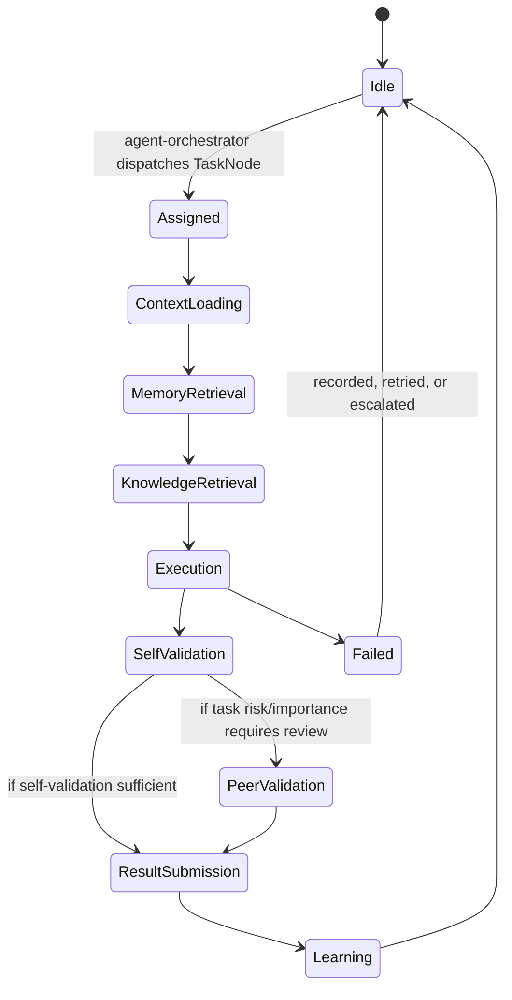

# 12 — Agent Architecture

## 1. Agents are not engines

A critical distinction the Bible draws (Part 4) and this architecture preserves
structurally: **engines** (Reasoning, Planning, Memory, ...) are always-on cognitive
subsystems that constitute NOVA's mind. **Agents** (Coding Agent, Research Agent,
DevOps Agent, ...) are task-scoped workers that NOVA's mind delegates to, spun up and
torn down per the lifecycle in Part 4. Agents live in `agents/`, not `services/`,
because they are not part of the always-running orchestration surface — they are
executed *by* `agent-orchestrator` on demand.

## 2. Agent runtime shape

```
agents/<name>-agent/
├── agent.yaml            # manifest: category, required capabilities, permission scope
├── src/
│   └── handler.py         # implements the AgentHandler protocol
└── tests/
```

```python
class AgentHandler(Protocol):
    async def on_assign(self, task: TaskNode, context: AgentContext) -> None: ...
    async def execute(self) -> AgentResult: ...
    async def self_validate(self, result: AgentResult) -> ValidationOutcome: ...
```

`AgentContext` is populated by `agent-orchestrator` from exactly the World
Model/Memory/Knowledge slice relevant to the agent's category (Part 11 "Agent
Awareness": "the Coding Agent receives development context... this reduces unnecessary
processing while preserving complete awareness") — an agent never queries Memory or
Knowledge directly; it receives a pre-scoped context object, keeping ADR-004 intact for
agents too.

## 3. Agent lifecycle (Part 4, implemented as a state machine)



Every state transition emits `agent.<id>.<state>` on the bus (see
[10 §2 row 15](10-inter-engine-communication.md)), which is what powers the frontend's
Agent Activity panel — a direct visualization of this exact state machine, not a
simulated status indicator.

## 4. Agent Orchestrator responsibilities (Part 4 "Agent Orchestrator")

`services/agent-orchestrator` owns:

- **Selection** — matching a `TaskNode.assigned_agent_category` (set by Planning
  Engine) to a concrete, healthy agent implementation from the Agent Registry.
- **Resource allocation** — respecting Executive Cognition's Cognitive Priority Matrix
  before spawning additional concurrent agent executions.
- **Parallel dispatch** — independent Task Graph nodes are dispatched simultaneously
  (Part 4 "Parallel Execution"), tracked as sibling sagas.
- **Peer review coordination** — for tasks flagged high-risk/high-importance, routes
  the primary agent's result to one or more reviewer agents (e.g., Coding Agent's
  output reviewed by a Software Architect agent instance and a QA agent instance, per
  Part 4's "Peer Review" example) before accepting the result.
- **Conflict resolution** — when agents disagree (Part 4 "Conflict Resolution"),
  collects arguments + confidence from each, and (for anything beyond simple cases)
  escalates to `reasoning-engine` for an evidence-weighted decision, which is then
  recorded to Decision Memory (Part 3) so the same conflict pattern resolves faster
  next time.
- **Temporary agent creation** — for novel objectives (Part 4's "Analyze this
  company's architecture" example), the Orchestrator can instantiate an ad hoc
  composition of existing agent categories rather than requiring a hand-authored agent
  in the repo for every possible task shape; only genuinely new *capabilities* require
  new code (see [Capability Engine](06-ai-layer-architecture.md) integration below).

## 5. Agent Registry

A Postgres table (`agent_orchestrator.agent_registry`) tracking every installed agent
category: identifier, category (matching Part 4's taxonomy — Research, Software
Architect, Backend, Frontend, AI Engineering, ML, Coding, DevOps, Database,
Cybersecurity, Vision, Voice, Browser, Desktop Control, Knowledge, Memory, Automation,
Calendar, Communication, Gaming, Finance, Health, Education, Creative, Product
Manager, QA, ...), required capabilities (from Capability Engine), required
permissions, historical success rate, and average execution time — feeding the
Orchestrator's selection scoring exactly as Part 4's "Agent Evolution" describes.

## 6. Agents consume Capabilities, not tools directly

An agent never hardcodes "run `git`" or "call the GitHub API." It declares required
**capabilities** (Part 15) in `agent.yaml`, and `capability-engine` resolves those to
concrete, versioned, sandboxed implementations at execution time. This is what lets a
single Coding Agent implementation work across "control VS Code," "control a terminal,"
or "call a cloud CI API" without a code change — new tool integrations are Capability
Engine plugins, not agent rewrites, matching Part 15's explicit goal: "NOVA should
never be redesigned to learn a new skill."

## 7. Chief Executive boundary (Part 4 "Chief Executive Principle")

`agent-orchestrator` and every agent implementation are structurally prevented from
publishing `communication.intent.*` events directly (enforced by the publish allow-list
in [09 §4](09-event-bus-architecture.md#4-boundary-enforcement)) — an agent's only
output channel is `agent.<id>.completed`/`failed` back to the Orchestrator, which
forwards results to Executive Cognition, which alone decides what (if anything) reaches
the user via Communication Engine. This is ADR-005 applied specifically to agents: no
department talks to the user; only NOVA does.
