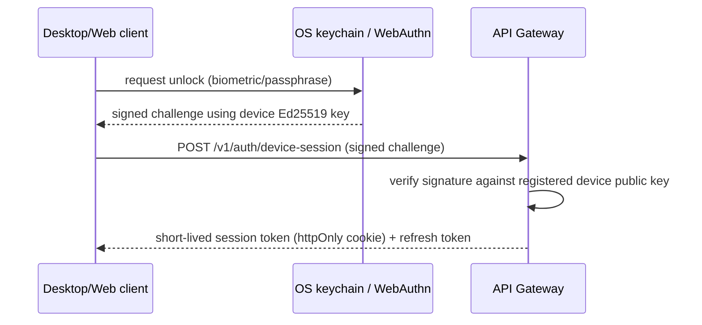

# 13 — Authentication & Security Architecture

## 1. Two identity models, one abstraction

NOVA has to authenticate two very different things depending on deployment mode
(mirroring [18](18-local-first-and-cloud-sync.md)):

| Mode | Who/what is authenticated | Mechanism |
|---|---|---|
| Local-first (default) | A single user's *devices* | Ed25519 device keypair generated on first run, unlocked by OS-native biometrics/passphrase; no external identity provider required |
| Enterprise/cloud | Multiple users across an organization | OpenID Connect (OIDC), federating to the org's existing IdP (Okta, Azure AD, Google Workspace, or self-hosted Keycloak) |

Both are implemented behind one `packages/nova-auth` interface (`authenticate`,
`authorize`, `current_principal`), so engine code never branches on deployment mode —
it only ever asks "is this principal allowed to do X," per Part 20's requirement that
the Core "coordinates authentication, authorization... security remains centralized."

## 2. AuthN flow (local-first)



No password is ever transmitted or stored by NOVA in local-first mode — the private
key never leaves the OS keychain/secure enclave. This directly serves Part 16's
"Privacy First" and Part 3's "Memory Security" without requiring a hosted auth service
for a single-user install.

## 3. AuthN flow (enterprise)

Standard OIDC Authorization Code + PKCE flow terminating at the API Gateway, which
exchanges the IdP's ID token for a NOVA-issued short-lived JWT (asymmetric, rotated
signing keys) used for all subsequent internal calls — engines validate this JWT
locally (public key cached, no per-request IdP round trip) to avoid making the IdP a
bottleneck for every internal request.

## 4. Authorization model

**RBAC + attribute-based policy, unified with the Autonomy Engine's permission
concepts** rather than a bolted-on separate system — Part 14's Permission Matrix
(Read/Analyze/Recommend/Create/Modify/Delete/Execute/Deploy/Purchase/Communicate) *is*
NOVA's authorization model, not a parallel one:

```python
class PermissionGrant(BaseModel):
    principal: PrincipalRef          # user, device, agent, or capability
    resource_scope: str              # e.g. "project:nova", "capability:git", "*"
    actions: set[PermissionAction]   # Part 14's ten categories
    autonomy_ceiling: AutonomyLevel  # Part 14 Levels 0-5 — the max level this grant allows
    granted_by: PrincipalRef
    expires_at: datetime | None
```

Every check (human user action, agent action, autonomous decision) goes through the
same `nova-auth.authorize(principal, resource, action)` call, which is why Autonomy
Engine's "Trust Engine" (Part 14) and this security model are the same system viewed
from two angles: security answers "is this ever allowed," autonomy answers "should this
happen *right now, without asking.*"

## 5. Secrets management

- **Local-first:** SOPS-encrypted files at rest, decrypted with an `age` key stored in
  the OS keychain — no secrets in plaintext on disk, no external secret service
  required (zero-budget constraint, Part 7).
- **Enterprise/cloud:** cloud KMS (AWS KMS / GCP KMS) or HashiCorp Vault, behind the
  same `SecretsProvider` interface.
- Model provider API keys, database credentials, and the NOVA JWT signing key are all
  retrieved through this interface — never read from plain environment variables in
  production builds.

## 6. Data protection

| Layer | Control |
|---|---|
| At rest | Postgres/Neo4j volumes encrypted (LUKS locally, provider-managed encryption in cloud); MinIO/S3 server-side encryption |
| In transit | mTLS between engines in enterprise mode (via service mesh, e.g., Linkerd); TLS 1.3 for all external API/WebSocket traffic |
| Field-level | Highly sensitive memory/knowledge fields (per Part 7's privacy classification) additionally encrypted with a user-held key, so even an operator with database access cannot read them |
| PII minimization | Perception Engine normalizes raw sensor payloads (Part 11) before they ever reach durable storage — e.g., aggregated input activity, never raw keystroke content, per Part 11 §"input_activity" |

## 7. Sandboxing capabilities and agent execution

Directly implements Part 15's "Sandbox Execution" and Part 12's "Safety Layers":

- New capabilities run in a gVisor/Firecracker-isolated sandbox on install and on every
  execution until explicitly promoted to trusted status by the user.
- Action Engine's risk classification (Negligible → Critical, Part 12) gates whether an
  action executes automatically, requires confirmation, or is refused outright by
  policy — enforced in `action-engine` *and* re-checked by `autonomy-engine`
  (defense in depth: two engines must agree, neither can unilaterally authorize a
  Critical action).

## 8. Audit logging

Every authorization decision, autonomous decision (Part 14 "Autonomy Memory"), and
Critical/High-risk action is written to an append-only Postgres table
(`autonomy.decision_log`, [07 §2](07-database-architecture.md)) plus mirrored to the
observability pipeline — satisfying Part 20's "Audit Logging" under Security
Coordination and giving Part 19's Explainability requirement ("why was this
prioritized... why was a recommendation rejected") a queryable source of truth.

## 9. Vulnerability management

- Dependency scanning (`pip-audit`, `cargo audit`, `npm audit`) and container image
  scanning (Trivy) run in CI on every PR ([17](17-cicd-pipeline.md)).
- Capability code signing (Part 15 "Security Validation") required before a capability
  is eligible for anything beyond sandboxed execution.
- Quarterly threat-model review as the agent/capability ecosystem grows, owned by the
  (future) Security Agent category itself dogfooding NOVA on NOVA.
