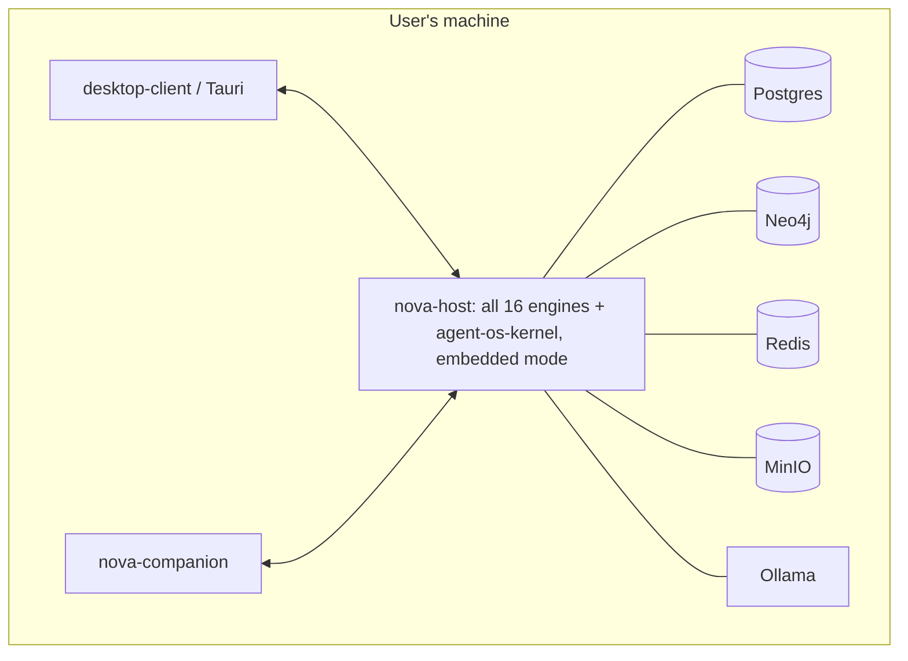
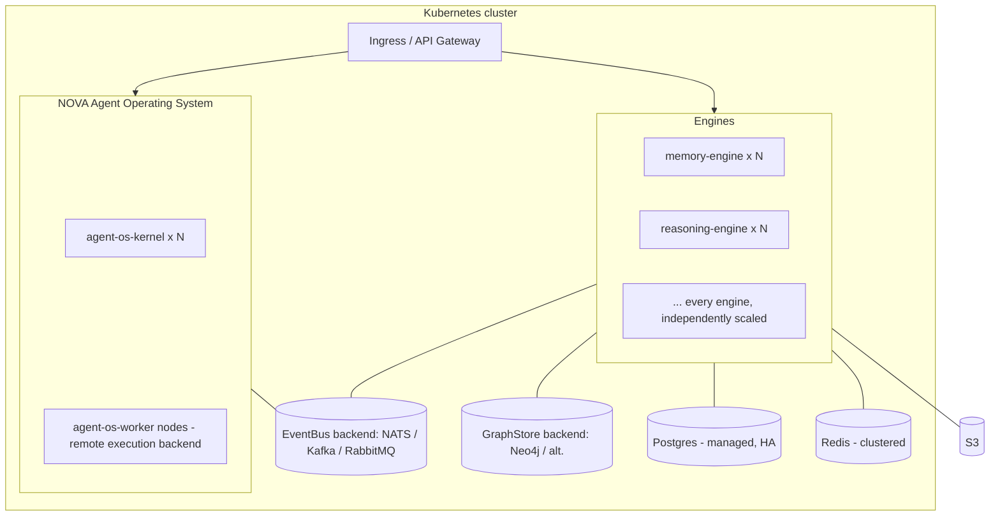

# 14 — Deployment Architecture

## 1. Three deployment targets, one codebase

| Target | Who it's for | Orchestration |
|---|---|---|
| **Local-first single machine** | The default install — one user, one laptop/desktop | Docker Compose (`infra/docker/docker-compose.local.yml`) or native `nova-host` process for lowest overhead |
| **Home/private server** | A user's always-on home server or NAS running NOVA continuously for multi-device access | Docker Compose, optionally Ansible-provisioned |
| **Enterprise / cloud** | Organizations, multi-user, high availability | Kubernetes via Helm charts, provisioned by Terraform |

All three run the exact same container images (`ghcr.io/nova/nova-<service>`) — the
only thing that changes is the orchestration manifest, per ADR-001.

## 2. Local-first topology

Single `docker compose up`, or a signed installer that bundles `nova-host` as a native
background service (Windows Service / launchd / systemd user unit) for users who don't
want Docker at all — this second path matters for the Bible's "zero budget" and
non-technical-user accessibility goals, and is tracked as a Phase 5+ packaging task in
the [Roadmap](../roadmap/ENGINEERING_ROADMAP.md).

## 3. Enterprise/cloud topology

`agent-os-worker` nodes (§NAOS subgraph) are the `remote` execution backend from
[12 §8](12-agent-architecture.md#8-execution-backends--how-distributed-from-day-one-actually-works)
— present only once a deployment turns that backend on (Roadmap Phase 8); a
single-cluster deployment can run entirely on `agent-os-kernel`'s in-cluster
`container` backend without any `agent-os-worker` nodes at all.

Each engine is a separate Helm release with its own `HorizontalPodAutoscaler`, scaled
independently based on its own load characteristics (Reasoning Engine scales on
GPU/inference queue depth; Memory Engine scales on read/write QPS) — see
[19](19-scalability-strategy.md) for scaling policy detail.

## 4. Environments

| Environment | Purpose | Data |
|---|---|---|
| `local` (dev machine) | Individual developer inner loop | Ephemeral, seeded fixtures |
| `ci` | Automated test runs | Ephemeral, torn down per run ([16](16-testing-strategy.md)) |
| `staging` | Pre-release validation, mirrors production topology | Anonymized/synthetic |
| `production` (cloud) | Enterprise customers | Real, encrypted, backed up |
| *(local-first has no "staging/production" distinction — the user's machine is both)* | | |

## 5. Release strategy

- **Container images:** semantic-versioned + git-SHA tagged, built once in CI, promoted
  (not rebuilt) across staging → production — guarantees what was tested is exactly
  what ships.
- **Rollout:** rolling deployment per engine in Kubernetes (`maxUnavailable: 0`), with
  each engine's own readiness probe gating traffic shift — an engine's independent
  replaceability (ADR-001) extends to independent, zero-downtime redeploy.
- **Desktop/local-first updates:** Tauri auto-updater for the client; `nova-host`
  container images pulled and restarted on a user-controlled schedule (never silently
  mid-session) — consistent with Part 20's "hot reload... restarting the entire system
  should become rare."
- **Feature flags:** a lightweight internal flag service (Postgres-backed, cached in
  Redis) gates new engines/capabilities during rollout, allowing a capability to ship
  dark and be enabled per-user/per-tenant — supports Part 15's "Capability Policies"
  and staged enterprise rollouts.

## 6. Disaster recovery

- **RPO:** ≤ 15 minutes for enterprise Postgres (continuous WAL shipping); ≤ 24h for
  local-first (nightly snapshot, user-configurable).
- **RTO target:** ≤ 1 hour for a full enterprise regional failover (documented runbook,
  tested quarterly); local-first recovery is "restore from last snapshot," a
  self-service flow surfaced in the System dashboard (Part 20 "World State Snapshots").
- **Multi-region (enterprise, later phase):** NATS JetStream cross-region mirroring +
  Postgres read replicas; full active-active is explicitly deferred to
  [19](19-scalability-strategy.md)'s later scale phases rather than designed in from
  day one, per the Bible's own instruction to avoid solving problems that don't exist
  yet while keeping the door open architecturally.

## 7. Infrastructure provisioning

- `infra/terraform/aws/` and `infra/terraform/gcp/` — modular stacks (network, K8s
  cluster, managed Postgres, object storage) so a customer can choose either cloud
  without a different application deployment process.
- `infra/ansible/` — home-server/bare-metal playbook: installs Docker, pulls the
  Compose stack, configures automatic updates and backups — the "home server" target
  named explicitly in Part 1.
