# 17 — CI/CD Pipeline

## 1. Pipeline overview (GitHub Actions)

```mermaid
flowchart LR
    PR[Pull Request] --> Lint[Lint + Import-Boundary Check]
    Lint --> Unit[Unit tests, affected packages]
    Unit --> Contract[Contract tests, whole monorepo]
    Contract --> Integration[Integration tests, affected packages]
    Integration --> Build[Build container images, affected services]
    Build --> Scan[Image + dependency vulnerability scan]
    Scan --> Preview[Ephemeral preview environment - optional per label]
    Preview --> Merge{Approved + green?}
    Merge -->|yes| MainCI[main branch CI: full suite + E2E]
    MainCI --> Publish[Publish images to GHCR, tag :sha and :edge]
    Publish --> DeployStaging[Auto-deploy to staging]
    DeployStaging --> Manual{Manual promotion}
    Manual -->|approved| DeployProd[Deploy to production, rolling per engine]
```



## 2. Workflow files

```
.github/workflows/
├── pr-checks.yml           # lint, unit, contract, integration (affected-only via Turborepo)
├── build-and-scan.yml       # container builds + Trivy/pip-audit/cargo-audit/npm-audit
├── main-ci.yml               # full suite + E2E on merge to main
├── release.yml                # semantic-release: version bump, changelog, image publish
├── deploy-staging.yml          # auto-trigger after release.yml
├── deploy-production.yml        # manual approval gate (GitHub Environments protection rule)
├── nightly.yml                   # full E2E + load test + chaos test, scheduled
└── bible-traceability.yml         # verifies every PR description references a Bible section (see 15 §4)
```

## 3. Affected-graph builds

Turborepo computes the dependency graph across `services/`, `agents/`, `apps/`,
`packages/`, `companion/` and only runs tasks for packages actually impacted by a given
diff (`turbo run test --filter=...[origin/main]`), with **remote caching** (self-hosted
cache server, or GitHub Actions cache as the zero-cost default) so an unrelated
one-line change to `documentation-agent` never re-runs `memory-engine`'s test suite.
This keeps PR CI fast even as the monorepo grows toward the Bible's "thousands of
developers" scale.

## 4. Build artifacts

- Every `services/*` and `agents/*` package produces one multi-stage Docker image
  (`Dockerfile` in its own directory, per [02 §3](02-repository-and-folder-structure.md)),
  tagged `ghcr.io/nova/nova-<name>:<git-sha>` and, on release, additionally
  `:<semver>` and `:latest`.
- `apps/web-client` builds a static bundle, published both as a container (served via
  nginx, for self-hosted/enterprise) and as static assets (for a CDN-hosted default).
- `apps/desktop-client` builds signed installers per platform (Windows `.msi`, macOS
  `.dmg` notarized, Linux `.AppImage`/`.deb`) via `tauri-action`.

## 5. Environments & promotion

Matches [14 §4](14-deployment-architecture.md#4-environments): `ci` (ephemeral, per
run) → `staging` (auto-deployed on every merge to `main`) → `production` (manual
promotion via a required GitHub Environment reviewer, per Part 1's "production ready at
all times" — nothing reaches production without an explicit human gate, even though
everything up to that gate is fully automated).

## 6. Quality gates (must pass to merge/deploy)

| Gate | Enforced at |
|---|---|
| Lint (ruff/mypy for Python, clippy for Rust, eslint/tsc for TS) | PR |
| Import-boundary check (ADR-004 enforcement) | PR |
| Unit + contract + integration (affected) | PR |
| Bible traceability note present | PR |
| Full E2E + load test | main / nightly |
| Zero critical/high CVEs (Trivy + audits) | Build |
| OpenAPI backward-compatibility diff clean (or explicitly major-versioned) | PR, for API changes |

## 7. Rollback

Every `deploy-production.yml` run records the previous image tag per engine; a
one-click `workflow_dispatch` "rollback" job redeploys the prior tag for a specific
engine (not the whole system — reinforcing independent engine deployability, ADR-001)
in under two minutes.

## 8. Secrets in CI

CI never has access to production secrets directly — it authenticates to the cloud
provider via short-lived OIDC federation (GitHub Actions OIDC → AWS/GCP role
assumption), and to GHCR via the built-in `GITHUB_TOKEN`; long-lived static credentials
are not stored in GitHub Secrets for anything production-reaching, consistent with
[13](13-auth-and-security.md)'s secrets posture.
