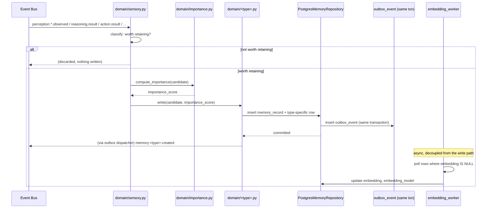
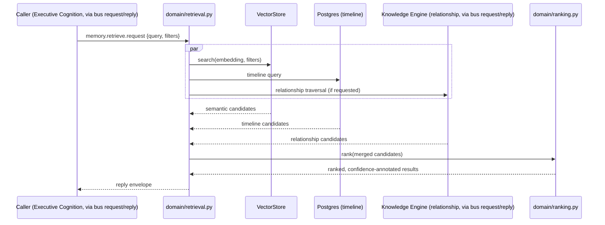
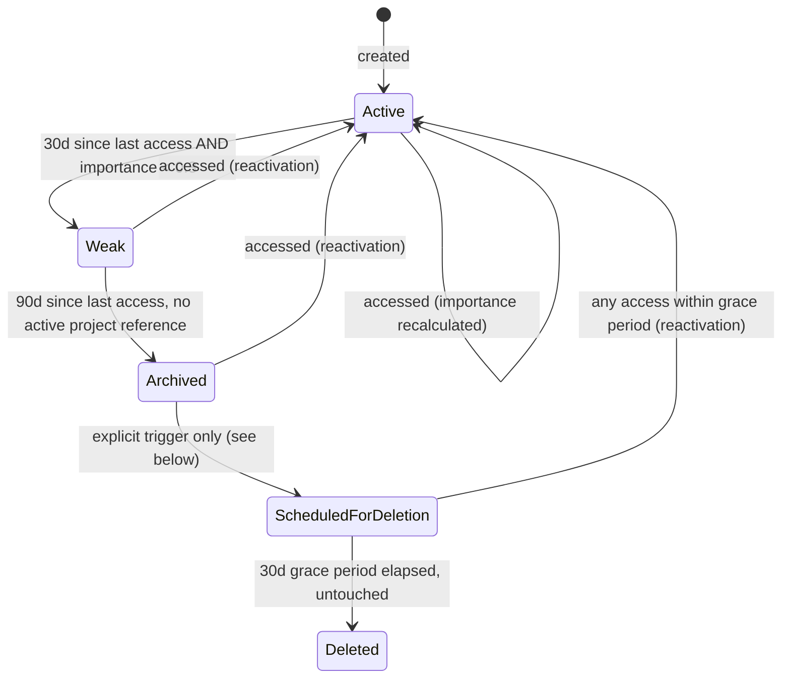

# Phase 1 Technical Design — 01: Memory Engine

Implements [Bible Part 3](../../bible/part-03-memory-engine-continuous-learning-system.md).
Builds on conventions in [00 — Shared Foundations](00-shared-foundations.md); read
that first. Realizes the sketch in
[SAD 08 — Memory Architecture](../../architecture/08-memory-architecture.md) at
implementation depth.

## 1. Internal architecture

```
services/memory-engine/src/nova_memory_engine/
├── api/
│   ├── memories.py        # /v1/memories* routes — thin, delegates to domain/retrieval.py
│   ├── decisions.py       # /v1/decisions* routes
│   └── health.py
├── domain/                # framework-free (docs/architecture/03 §1)
│   ├── ports.py           # Protocols this package depends on, implements nothing itself
│   ├── models.py          # MemoryRecord, MemoryType, LifecycleState (domain entities, not ORM)
│   ├── sensory.py         # capture-then-discard-unless-promoted
│   ├── working.py         # Redis-backed, task-scoped
│   ├── short_term.py
│   ├── long_term.py
│   ├── semantic.py
│   ├── procedural.py
│   ├── episodic.py
│   ├── project.py
│   ├── relationship.py    # thin client into Knowledge Engine's graph — see §5
│   ├── preference.py
│   ├── decision.py
│   ├── importance.py      # importance scoring algorithm — §6
│   ├── consolidation.py   # merge/dedup/summarize/promote — §6
│   ├── lifecycle.py       # forgetting state machine — §6
│   ├── ranking.py         # retrieval ranking — §7
│   └── retrieval.py       # the unified retrieval pipeline orchestrator — §7
├── repository/
│   ├── models.py                        # SQLAlchemy ORM
│   ├── postgres_memory_repository.py    # implements domain.ports.MemoryRepository
│   ├── redis_working_memory_repository.py
│   └── outbox_dispatcher.py
├── events/
│   ├── published.py
│   └── subscribed.py
└── workers/
    ├── consolidation_worker.py   # Arq scheduled job, drives consolidation.py + lifecycle.py
    ├── embedding_worker.py       # Arq job, drives async embedding generation — §10
    └── outbox_worker.py          # Arq job, drives repository/outbox_dispatcher.py
```

| Component | Responsibility | Must never |
|---|---|---|
| `api/*` | HTTP validation, delegate to `domain/retrieval.py` / per-type modules | Touch SQLAlchemy or Redis directly |
| `domain/ports.py` | Define `MemoryRepository`, `VectorIndex`, `EmbeddingProvider`, `EventPublisher` Protocols | Import FastAPI, SQLAlchemy, or a concrete backend |
| `domain/<type>.py` | Type-specific write/retrieve/decay rules (Part 3's nine categories) | Depend on another type module directly — cross-type composition happens in `retrieval.py` |
| `domain/importance.py` | Pure function: `(memory, access_stats) -> float` | Perform I/O |
| `domain/consolidation.py` | Duplicate detection, merge, summary generation, lifecycle advancement decisions | Perform I/O directly — returns decisions, `workers/consolidation_worker.py` executes them |
| `domain/lifecycle.py` | The five-stage state machine and its transition predicates | Decide *when* to run — that's the worker's schedule |
| `domain/retrieval.py` | Fan out to semantic/timeline/relationship search, merge, rank | Know which concrete store backs any of those — only `ports.py` types |
| `repository/*` | Implement `ports.py` against Postgres/Redis/`nova-vectorstore-sdk` | Contain business rules (importance, lifecycle, ranking) |
| `workers/*` | Scheduling and orchestration of domain logic against the repository | Contain the actual algorithms — those live in `domain/` and are unit-testable without a worker running |

## 2. Responsibilities of every component

Covered in the table above; expanded per memory type in the Bible mapping below —
every one of Part 3's nine categories has an explicit owner:

| Bible category | Owning module | Storage |
|---|---|---|
| Sensory Memory | `sensory.py` | Not persisted unless promoted (in-process buffer only) |
| Working Memory | `working.py` | Redis, task-scoped, no TTL beyond task lifetime |
| Short Term Memory | `short_term.py` | Postgres `short_term_record`, hours-to-days TTL |
| Long Term Memory | `long_term.py` | Postgres `memory_record`, `memory_type` discriminated |
| Semantic Memory | `semantic.py` | `memory_record` where `memory_type='semantic'` |
| Procedural Memory | `procedural.py` | `memory_record` where `memory_type='procedural'` |
| Episodic Memory | `episodic.py` | `memory_record` where `memory_type='episodic'` |
| Project Memory | `project.py` | `memory_record` filtered by `project_id` (cross-cutting, not a distinct type) |
| Relationship Memory | `relationship.py` | **Not stored here** — see §5 |
| Preference Memory | `preference.py` | `memory_record` where `memory_type='preference'` |
| Decision Memory | `decision.py` | `memory_record` + `decision_record` (first-class columns, Part 3 + Part 8 both need it rich) |

## 3. Data flow diagrams

**Write path** (an observation becomes a memory):



**Read path** (retrieval):



**Consolidation path**: see [00 §Failure recovery](00-shared-foundations.md) for the
outbox pattern this reuses; the scheduling/algorithm is in §6 below.

## 4. Database schema

```sql
CREATE SCHEMA memory;

CREATE TYPE memory.memory_type AS ENUM (
    'semantic', 'procedural', 'episodic', 'project', 'preference', 'decision'
);
CREATE TYPE memory.lifecycle_state AS ENUM (
    'active', 'weak', 'archived', 'scheduled_for_deletion', 'deleted'
);
CREATE TYPE memory.privacy_level AS ENUM (
    'public', 'internal', 'confidential', 'highly_sensitive'
);

CREATE TABLE memory.memory_record (
    id UUID PRIMARY KEY DEFAULT gen_random_uuid(),
    memory_type memory.memory_type NOT NULL,
    content TEXT NOT NULL,
    embedding VECTOR(768),                    -- nullable until embedding_worker fills it (ADR-010)
    embedding_model TEXT,
    importance_score REAL NOT NULL DEFAULT 0.5 CHECK (importance_score BETWEEN 0 AND 1),
    confidence REAL CHECK (confidence BETWEEN 0 AND 1),
    privacy_level memory.privacy_level NOT NULL DEFAULT 'internal',
    lifecycle_state memory.lifecycle_state NOT NULL DEFAULT 'active',
    source TEXT,                               -- conversation | perception | task | user | inferred
    source_ref UUID,                           -- correlation_id or originating entity id
    project_id UUID,
    user_id UUID NOT NULL,
    knowledge_node_id TEXT,                    -- pointer into Knowledge Graph, nullable — see §5
    type_data JSONB NOT NULL DEFAULT '{}',      -- type-specific fields, shape validated in domain/models.py
    access_count INT NOT NULL DEFAULT 0,
    last_accessed_at TIMESTAMPTZ,
    created_at TIMESTAMPTZ NOT NULL DEFAULT now(),
    updated_at TIMESTAMPTZ NOT NULL DEFAULT now(),
    version INT NOT NULL DEFAULT 1
);

CREATE INDEX memory_record_embedding_hnsw ON memory.memory_record
    USING hnsw (embedding vector_cosine_ops) WHERE embedding IS NOT NULL;
CREATE INDEX memory_record_type_idx ON memory.memory_record (memory_type);
CREATE INDEX memory_record_project_idx ON memory.memory_record (project_id) WHERE project_id IS NOT NULL;
CREATE INDEX memory_record_lifecycle_idx ON memory.memory_record (lifecycle_state);
CREATE INDEX memory_record_user_idx ON memory.memory_record (user_id);
CREATE INDEX memory_record_type_data_gin ON memory.memory_record USING gin (type_data);
CREATE INDEX memory_record_created_at_idx ON memory.memory_record (created_at DESC);

CREATE TABLE memory.short_term_record (
    id UUID PRIMARY KEY DEFAULT gen_random_uuid(),
    content TEXT NOT NULL,
    category TEXT NOT NULL,        -- recent_conversation | recent_file | recent_command | recent_search
    project_id UUID,
    user_id UUID NOT NULL,
    source_ref UUID,
    expires_at TIMESTAMPTZ NOT NULL,
    created_at TIMESTAMPTZ NOT NULL DEFAULT now()
);
CREATE INDEX short_term_expires_idx ON memory.short_term_record (expires_at);
CREATE INDEX short_term_user_idx ON memory.short_term_record (user_id, created_at DESC);
-- Expiry is enforced by workers/consolidation_worker.py, not a Postgres-native TTL.

CREATE TABLE memory.decision_record (
    id UUID PRIMARY KEY DEFAULT gen_random_uuid(),
    memory_record_id UUID NOT NULL REFERENCES memory.memory_record(id) ON DELETE CASCADE,
    objective TEXT NOT NULL,
    alternatives JSONB NOT NULL DEFAULT '[]',
    chosen_alternative TEXT NOT NULL,
    reasoning TEXT NOT NULL,
    tradeoffs JSONB NOT NULL DEFAULT '[]',
    risks JSONB NOT NULL DEFAULT '[]',
    outcome TEXT,
    outcome_recorded_at TIMESTAMPTZ,
    confidence_at_decision REAL,
    created_at TIMESTAMPTZ NOT NULL DEFAULT now()
);

CREATE TABLE memory.consolidation_run (
    id UUID PRIMARY KEY DEFAULT gen_random_uuid(),
    started_at TIMESTAMPTZ NOT NULL DEFAULT now(),
    finished_at TIMESTAMPTZ,
    records_scanned INT,
    records_merged INT,
    records_advanced INT,
    records_deleted INT,
    status TEXT NOT NULL DEFAULT 'running'   -- running|completed|failed
);

CREATE TABLE memory.audit_log (
    id UUID PRIMARY KEY DEFAULT gen_random_uuid(),
    memory_record_id UUID NOT NULL,
    action TEXT NOT NULL,          -- created|updated|deleted|reactivated
    actor TEXT NOT NULL,           -- user id or engine name
    changed_at TIMESTAMPTZ NOT NULL DEFAULT now(),
    detail JSONB
);

-- Transactional outbox — shape defined once in 00-shared-foundations.md.
CREATE TABLE memory.outbox_event (
    id UUID PRIMARY KEY DEFAULT gen_random_uuid(),
    subject TEXT NOT NULL,
    payload JSONB NOT NULL,
    correlation_id UUID NOT NULL,
    causation_id UUID,
    created_at TIMESTAMPTZ NOT NULL DEFAULT now(),
    dispatched_at TIMESTAMPTZ
);
CREATE INDEX outbox_undispatched_idx ON memory.outbox_event (created_at) WHERE dispatched_at IS NULL;
```

`type_data` shapes (validated by `domain/models.py` Pydantic discriminated unions, not
DB constraints — keeps the schema flexible while the application enforces structure):

| `memory_type` | `type_data` shape |
|---|---|
| `episodic` | `{participants: [...], timeline_start, timeline_end, outcome, lessons_learned}` |
| `procedural` | `{steps: [...], preconditions, tools_required}` |
| `preference` | `{key, value, evidence_count, first_observed_at}` |
| `semantic` | `{concept, related_concepts: [...]}` |
| `project` | (no extra shape — `project_id` + any base type already carries it) |

## 5. Graph model

**Memory Engine owns no graph of its own.** Part 3's "Relationship Memory" and Part
10's Knowledge Graph describe the same underlying need — connections between
entities — and maintaining two separate relationship graphs would let them drift out
of sync and would duplicate Knowledge Engine's entire reason for existing.

**Decision:** `memory_record.knowledge_node_id` is a pointer into the Knowledge Graph
(owned by Knowledge Engine, via `nova-graphstore-sdk`). `domain/relationship.py` is a
thin client: `link(memory_id, concept) -> knowledge_node_id`, implemented as a
request/reply call to Knowledge Engine (`knowledge.link.request`), never a local Neo4j
write. On promotion to long-term memory, the write path (§3) requests a graph node be
created/linked, and Knowledge Engine's graph gains edges like:

```cypher
(:MemoryRecord {id})-[:ABOUT]->(:Concept)
(:MemoryRecord {id})-[:PART_OF]->(:Project)
(:MemoryRecord {id})-[:INVOLVES]->(:Person)
```

(`:MemoryRecord` nodes are lightweight references — id + type only — the content
lives in Postgres; the graph exists for traversal, not duplication.)

## 6. Memory lifecycle



Per Part 3's explicit caution ("forgotten memories should never disappear
immediately... this prevents accidental information loss"), `Archived → ScheduledForDeletion`
is **never** a passive time-based transition in Phase 1. It requires one of:
duplicate detected and merged (the superseded record is scheduled, the merged record
stays active), explicit user delete request, or a Knowledge Engine contradiction
resolution that supersedes it. A pure time-based long-stop exists in the schema
(`consolidation.py`'s config) but defaults to **disabled** — enabling it is a policy
decision left to the Autonomy Engine once it exists (Phase 4), not something Phase 1
decides unilaterally on the user's behalf.

**Importance scoring** (`domain/importance.py`), recomputed on every access, not just
at write time:

```
importance = clamp(
    w_frequency  * log1p(access_count) / log1p(access_count_p95)
  + w_recency    * exp(-days_since_last_access / half_life_days)
  + w_project    * (1.0 if project_id in active_projects else 0.3)
  + w_feedback   * user_feedback_score        # -1..1, default 0
  + w_confidence * confidence
  , 0.0, 1.0
)
```

Weights (`w_*`) are named constants in `importance.py`, documented with their
defaults, and covered by the monotonicity property tests in §19 — not hardcoded
inline, so they can be tuned without touching call sites.

**Consolidation** (`workers/consolidation_worker.py`, scheduled every 6h by default,
configurable — Phase 4's Cognitive State Engine will eventually decide *when* idle
time is available; Phase 1 uses a fixed interval):

1. Record a `consolidation_run` row (status=running).
2. Fetch candidates: recently-created or recently-updated long-term memories.
3. Duplicate detection: cosine similarity > 0.92 against existing embeddings within
   the same `project_id`/`user_id` scope.
4. For each duplicate cluster: merge into the highest-confidence member, preserve all
   `source_attribution`-equivalent references, schedule the others for deletion.
5. Advance lifecycle states per the predicates above.
6. Update `consolidation_run` with counts and status=completed (or failed, with the
   run left in a state the recovery logic in §17 can detect).

## 7. Retrieval pipeline

1. Receive query: raw text and/or structured filters (`project_id`, `memory_type`,
   date range). Phase 1 does **not** attempt natural-language intent parsing — that
   is Reasoning Engine's job from Phase 2 onward. A raw-text query is embedded and
   run as semantic search directly.
2. If text present: `EmbeddingProvider.embed(query)`.
3. Parallel fan-out (`asyncio.gather`): semantic search (`VectorStore.search`),
   timeline search (Postgres range query), relationship search (request/reply to
   Knowledge Engine, only if `include_relationships=true` — it's a cross-engine call,
   not free).
4. Merge candidates by `id`, deduplicating overlaps from multiple search modes.
5. Rank (`domain/ranking.py`):
   `score = w1*similarity + w2*importance_score + w3*recency_decay + w4*confidence`.
6. Fire-and-forget: increment `access_count`, update `last_accessed_at` for returned
   ids (does not block the response; failure to record access never fails a read).
7. Return top-K, each annotated with its component scores in the response `meta`
   (this is what makes retrieval explainable — Part 8's Confidence System applied to
   Memory specifically).

## 8. Indexing strategy

- `embedding`: HNSW (`m=16, ef_construction=64` — standard, documented defaults),
  partial index (`WHERE embedding IS NOT NULL`) so not-yet-embedded rows never
  pollute the index. `ef_search` is a per-query parameter, raised for
  decision-memory lookups where precision matters more than the last few ms of
  latency.
- B-tree: `memory_type`, `project_id` (partial), `lifecycle_state`, `user_id`,
  `created_at DESC` (timeline search).
- GIN: `type_data` for type-specific filtered queries (e.g., "preferences with
  `evidence_count > 3`").
- Maintenance: routine `VACUUM`/`ANALYZE` (standard Postgres autovacuum tuning, no
  custom job needed at Phase 1 row counts); re-embedding job (§10) is the only
  index-affecting background maintenance beyond that.

## 9. Caching strategy

| Key pattern | Backing | TTL | Invalidated by |
|---|---|---|---|
| `mem:cache:record:<id>` | Redis | 10 min | `memory.long_term.updated` / `.lifecycle_transitioned` event (any instance) |
| `mem:cache:search:<query_hash>` | Redis | 60s | Time-only — retrieval result caching is inherently stale-tolerant only for low-stakes reads; callers feeding Autonomy/Action decisions pass `no_cache=true` |
| `wm:working:<user_id>:<session_id>` | Redis | Task-scoped, no fixed TTL (cleared on task completion) | N/A — this is Working Memory's primary store, not a cache (see [00](00-shared-foundations.md)) |

## 10. Embedding strategy

- Default provider: `OllamaEmbeddingProvider` calling `nomic-embed-text` (768 dims,
  ADR-009/010).
- **Asynchronous, off the write path**: a memory is written with `embedding = NULL`;
  `embedding_worker` polls `WHERE embedding IS NULL ORDER BY created_at LIMIT batch_size`,
  calls `embed_batch`, updates rows. Keeps write latency independent of embedding
  latency (Part 3 does not require synchronous embedding).
- **Re-embedding on model change**: a row where `embedding_model != current_model`
  (config) is picked up by the same worker, batched and rate-limited so a model
  upgrade doesn't saturate local Ollama capacity mid-migration.
- **Batch embedding for consolidation**: duplicate detection (§6) reuses already-computed
  embeddings; it never re-embeds during a consolidation run.

## 11. Search strategy

| Part 3 mode | Implementation |
|---|---|
| Semantic / Vector | pgvector cosine similarity via `nova-vectorstore-sdk` |
| Graph traversal | Delegated to Knowledge Engine (§5) |
| Timeline | Postgres range query on `created_at` / `type_data` timeline fields |
| Relationship | Delegated to Knowledge Engine |
| Intent-based | Phase 1: treated as semantic (raw text embedded). Full intent parsing: Reasoning Engine, Phase 2. |
| Similarity | Memory-to-memory cosine comparison (used internally by consolidation's dedup step) |
| Context search | World Model's Active Context (`project_id`, current task) supplied as filters by the caller |
| Natural language | Primary user-facing mode; same code path as semantic |

## 12. Versioning strategy

Per [00 §Versioning](00-shared-foundations.md#versioning-detailed-per-engine-principle-stated-once):
row `version` column with optimistic concurrency; Alembic migrations under
`alembic/versions/memory/`; `/v1/...` API versioning; `embedding_model` column as the
embedding provenance version; `memory.audit_log` as the human-facing change history
for anything a user or engine explicitly mutated (distinct from the automated
lifecycle transitions, which are visible via `updated_at` + `lifecycle_state` and
don't need a separate history table at Phase 1 scale — revisit if audit requirements
grow in Phase 7).

## 13. Event flow through the Event Bus

| Direction | Subject | Payload (new `nova-contracts` model) |
|---|---|---|
| Publishes | `memory.short_term.created` | `ShortTermMemoryCreated` |
| Publishes | `memory.long_term.created` | `LongTermMemoryCreated` |
| Publishes | `memory.long_term.updated` | `LongTermMemoryUpdated` |
| Publishes | `memory.consolidation.started` / `.completed` | `ConsolidationRunPayload` |
| Publishes | `memory.lifecycle.transitioned` | `LifecycleTransitionPayload` |
| Publishes | `memory.decision.recorded` | `DecisionRecordedPayload` |
| Publishes | `memory.embedding.completed` | `EmbeddingCompletedPayload` |
| Subscribes | `perception.*.observed` | candidate sensory input |
| Subscribes | `reasoning.result` | writes decision + episodic memory |
| Subscribes | `action.result` | episodic memory of what happened |
| Subscribes | `communication.intent.received` | short-term conversational memory |
| Subscribes | `agent_os.task.completed` | episodic + procedural learning |
| Subscribes | `knowledge.contradiction.detected` | flags related memories' confidence |
| Request/Reply served | `memory.retrieve.request` | the synchronous RPC path other engines use (SAD 10 row 4) |

Deliberately **not** published: an event on every read/access. Access tracking (§7
step 6) is internal bookkeeping; publishing it would flood the bus for no consumer
that exists yet, violating Part 11's "Event Filtering" discipline applied
proactively rather than as a later cleanup.

## 14. APIs exposed

```
POST   /v1/memories                       # mostly system/internal use
GET    /v1/memories/{id}
PATCH  /v1/memories/{id}                  # user correction (Part 3 "User Control")
DELETE /v1/memories/{id}                  # -> scheduled_for_deletion, never immediate hard delete
POST   /v1/memories/{id}/reactivate
GET    /v1/memories/search?mode=semantic|timeline|relationship&q=...&project_id=...&limit=...
GET    /v1/memories/timeline?project_id=...&from=...&to=...
GET    /v1/decisions/{id}
GET    /v1/decisions/search
GET    /internal/health | /internal/readiness | /internal/metrics   # standard, per SAD 11 §3
```

Internal RPC (bus request/reply): `memory.retrieve.request`.

## 15. Performance considerations

| Path | Target (p95) | Notes |
|---|---|---|
| Working/short-term write | < 50ms | Redis / simple Postgres insert |
| Long-term write (excl. embedding) | < 100ms | Embedding is async, off this path |
| Semantic retrieval @ 100K memories/user | < 200ms | HNSW; scales sub-linearly, revisit target as real data arrives |
| Consolidation run @ 10K candidate memories | < 5 min | Off-peak scheduled, not latency-sensitive |

## 16. Scalability strategy

Stateless service (all state in Postgres/Redis/pgvector) — horizontally replicable
behind the Event Bus queue-group and API Gateway immediately. Vector store swap path
(pgvector → Qdrant) already designed in
[SAD 19 §2](../../architecture/19-scalability-strategy.md#2-per-engine-scaling-levers);
this design's use of `nova-vectorstore-sdk` is what makes that swap a config change.
Sharding key for enterprise multi-tenant scale-out: `user_id`/`tenant_id` (SAD 19 §3).

## 17. Failure recovery

- **Write failure**: the `memory_record` (+ type-specific row + outbox row) insert is
  one transaction — partial writes are impossible.
- **Embedding failure**: does not roll back the memory write; `embedding_worker`
  retries with backoff; a memory with `embedding = NULL` is simply excluded from
  semantic search results until embedded (visible, not silently wrong).
- **Outbox dispatch failure**: undispatched rows are durable and retried by
  `outbox_worker`; a crashed dispatcher loses no events, only delays them.
- **Consolidation worker crash mid-run**: `consolidation_run.status = 'running'` with
  `started_at` older than the expected max duration is detected by the next
  scheduled run and marked `failed` (never silently abandoned); the merge/delete
  operations within a run are themselves individually transactional, so a crash
  mid-run leaves already-processed clusters correctly merged, not half-merged.
- **Read-path degradation**: if `VectorStore` is unreachable, retrieval falls back to
  timeline + relationship results only, with `meta.confidence` lowered and
  `meta.degraded = true` set — matching [SAD 03 §5](../../architecture/03-backend-architecture.md#5-error-handling--resilience)'s
  graceful-degradation pattern, applied concretely here.

## 18. Security considerations

- Row-level isolation by `user_id` now; Postgres RLS policy enforcement lands with
  full multi-tenancy in Phase 7, per [00](00-shared-foundations.md#identity-tenancy-and-time).
- `privacy_level` (§4) is stored and propagated on every record; enforcement at the
  point of cloud-routed reasoning is a Phase 2 concern (Model Orchestration Engine),
  but the data is correctly tagged from day one so nothing needs backfilling.
- `DELETE`/`PATCH` are audit-logged (`memory.audit_log`): actor, action, timestamp.
- At-rest encryption: disk-level (SAD 13 §6) for all data; no additional field-level
  encryption in Phase 1 (revisit if a `highly_sensitive` record volume emerges that
  warrants it — not needed to ship correctly now).

## 19. Testing strategy

- **Unit**: `importance.py` (property-based — monotonicity in recency/frequency/feedback),
  `lifecycle.py` (every valid transition + every invalid transition rejected),
  `ranking.py` (component score correctness).
- **Integration** (`nova-testkit` + testcontainers, real Postgres+pgvector+Redis):
  full write→retrieve round trip; consolidation worker against seeded duplicate
  fixtures (assert correct merge target chosen); outbox dispatcher (kill process
  mid-dispatch, restart, assert exactly-once delivery via `event_id` dedup on the
  consumer side).
- **Contract**: every subject in §13 validated against its `nova-contracts` schema.
- **Performance**: scripted benchmark — seed 100K synthetic memories per user,
  measure p50/p95/p99 for semantic retrieval, assert against §15's targets; fails CI
  if regressed beyond a documented threshold.
- **Failure scenarios** (each gets an explicit test, matching §17): Postgres
  unavailable during write; VectorStore unavailable during retrieval; consolidation
  worker killed mid-run; duplicate event delivery (idempotency); embedding provider
  timeout.
- **Chaos**: kill `memory-engine` mid-consolidation, restart, assert no corruption
  and correct `consolidation_run` recovery (ties to [SAD 16 §7](../../architecture/16-testing-strategy.md#7-non-functional-testing)).

## 20. Future extension points

- **Multi-modal memory** (images/audio): `EmbeddingProvider` already isolates the
  caller from the embedding model — a CLIP-style multi-modal adapter is a new
  implementation of the same Protocol, not a redesign.
- **Federated/multi-device sync**: Roadmap Phase 8, builds on
  [SAD 18](../../architecture/18-local-first-and-cloud-sync.md)'s sync architecture,
  which already uses the outbox's event log as its sync unit.
- **LLM-driven summarization in consolidation**: `consolidation.py`'s merge step
  already has the seam (`summarize(cluster) -> content`) — Phase 2's Model
  Orchestration Engine plugs in behind it.
- **Explainable retrieval UI**: component scores are already computed per §7 step 7;
  surfacing them richly in the Command Center's Memory Timeline panel (SAD 04) is a
  frontend task, not a backend redesign.
