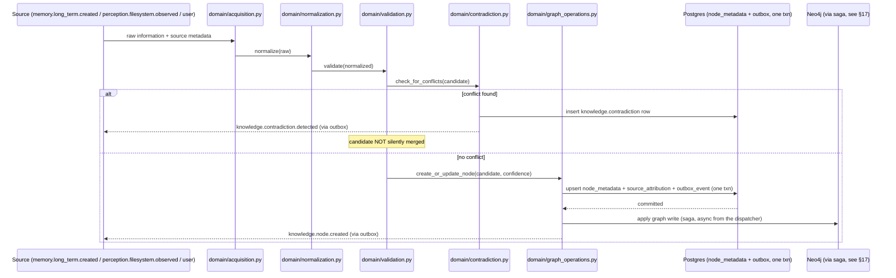
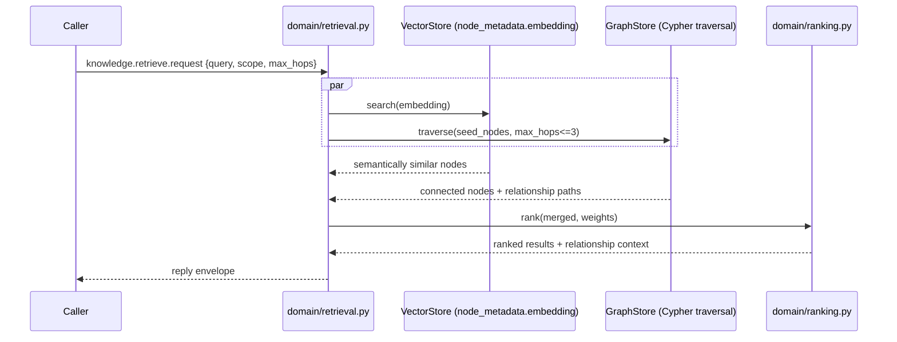
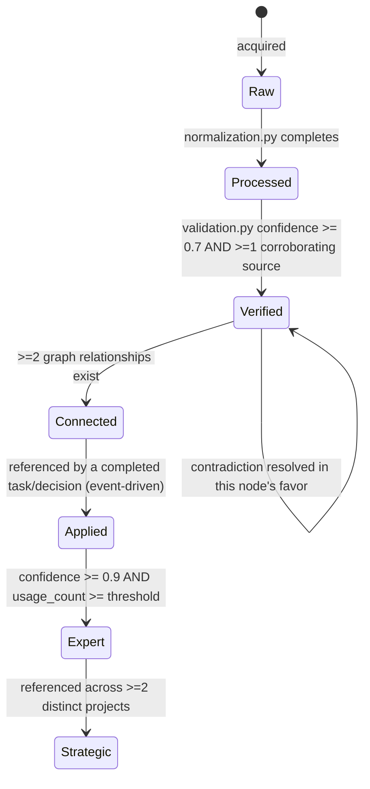

# Phase 1 Technical Design — 02: Knowledge Engine

Implements [Bible Part 10](../../bible/part-10-knowledge-engine.md). Builds on
[00 — Shared Foundations](00-shared-foundations.md).

## 1. Internal architecture

```
services/knowledge-engine/src/nova_knowledge_engine/
├── api/
│   ├── nodes.py            # /v1/knowledge/nodes* routes
│   ├── graph.py             # /v1/knowledge/graph (subgraph query)
│   ├── contradictions.py
│   └── health.py
├── domain/
│   ├── ports.py             # GraphStore, VectorIndex, EmbeddingProvider, EventPublisher Protocols
│   ├── models.py            # KnowledgeNode, KnowledgeEdge, ConfidenceScore, KnowledgeLayer
│   ├── acquisition.py       # ingest raw info -> normalize
│   ├── normalization.py     # formatting/dates/units/names/terminology normalization
│   ├── validation.py        # cross-referencing, logical consistency
│   ├── contradiction.py     # contradiction detection algorithm — §6
│   ├── graph_operations.py  # node/edge CRUD orchestration (delegates to GraphStore)
│   ├── discovery.py         # relationship discovery (new edge inference)
│   ├── summarization.py
│   ├── compression.py       # duplicate/redundancy removal
│   ├── retrieval.py         # unified knowledge retrieval pipeline — §7
│   ├── ranking.py
│   └── evolution.py         # knowledge maturity state machine — §6
├── repository/
│   ├── neo4j_knowledge_repository.py    # implements GraphStore usage, via nova-graphstore-sdk
│   ├── postgres_metadata_repository.py  # source attribution, confidence history, embeddings
│   └── outbox_dispatcher.py
├── events/
│   ├── published.py
│   └── subscribed.py
└── workers/
    ├── maintenance_worker.py     # relationship discovery, dedup, confidence updates
    ├── embedding_worker.py
    └── outbox_worker.py          # drives the two-phase Postgres-then-Neo4j saga — §17
```

| Component | Responsibility | Must never |
|---|---|---|
| `domain/acquisition.py` | Accept raw input from any source, hand off to normalization | Decide truth/confidence — that's `validation.py` |
| `domain/validation.py` | Cross-reference, check logical consistency, assign initial confidence | Silently overwrite conflicting existing knowledge — must route through `contradiction.py` |
| `domain/contradiction.py` | Detect and record conflicts; never auto-resolve beyond structural cases | Delete either side of a contradiction |
| `domain/graph_operations.py` | The only module that calls `GraphStore` for writes | Contain confidence/validation business rules |
| `domain/evolution.py` | Decide when a node's `layer` advances (§6) | Perform the write — returns a decision, `maintenance_worker` executes it |
| `domain/retrieval.py` | Fan out semantic + graph + fulltext + timeline, merge, rank | Know Neo4j/pgvector specifics — only `ports.py` types |

## 2. Responsibilities of every component

Directly maps to Part 10's own structure:

| Bible concept | Owning module |
|---|---|
| Knowledge Acquisition | `acquisition.py` |
| Knowledge Normalization | `normalization.py` |
| Knowledge Graph (nodes/edges) | `graph_operations.py`, backed by `nova-graphstore-sdk` |
| Semantic Understanding | `retrieval.py` (embedding-based concept matching) + `discovery.py` |
| Source Attribution | `postgres_metadata_repository.py` (`source_attribution` table) |
| Knowledge Confidence | `validation.py` computes it; stored on `node_metadata.confidence` |
| Knowledge Validation | `validation.py` |
| Contradiction Detection | `contradiction.py` |
| Temporal Knowledge | `node_version_history` table (§4) |
| Domain Knowledge / Personal Knowledge / Project Knowledge | `node_metadata.domain` + `:Project` graph scoping — not separate tables (see §4) |
| Knowledge Discovery | `discovery.py` |
| Knowledge Summarization / Compression | `summarization.py`, `compression.py` |
| Knowledge Retrieval / Ranking | `retrieval.py`, `ranking.py` |
| Knowledge Evolution | `evolution.py` |
| Knowledge Versioning | `node_version_history` table |

## 3. Data flow diagrams

**Acquisition → validated, graphed knowledge:**



**Retrieval** (semantic + graph fan-out) — structurally identical in shape to Memory
Engine's (see [01 §3](01-memory-engine.md#3-data-flow-diagrams)), with the graph
traversal being *primary* here rather than a delegated call:



## 4. Database schema

**Postgres** (metadata, confidence history, source attribution, embeddings — anything
that isn't graph-shaped or is high-write/low-graph-value):

```sql
CREATE SCHEMA knowledge;

CREATE TYPE knowledge.layer AS ENUM (
    'raw', 'processed', 'verified', 'connected', 'applied', 'expert', 'strategic'
);
CREATE TYPE knowledge.privacy_level AS ENUM (
    'public', 'internal', 'confidential', 'highly_sensitive'
);

CREATE TABLE knowledge.node_metadata (
    node_id TEXT PRIMARY KEY,          -- matches the Neo4j node's `id` property
    label TEXT NOT NULL,               -- Concept | Technology | Framework | ... (§5)
    name TEXT NOT NULL,
    domain TEXT,                       -- programming | ai | business | ... (Part 10 "Domain Knowledge")
    scope TEXT NOT NULL DEFAULT 'global', -- global | project | personal (Part 10 "Personal/Project Knowledge")
    project_id UUID,                   -- set when scope='project'
    user_id UUID,                      -- set when scope='personal'
    embedding VECTOR(768),
    embedding_model TEXT,
    confidence REAL NOT NULL DEFAULT 0.5 CHECK (confidence BETWEEN 0 AND 1),
    privacy_level knowledge.privacy_level NOT NULL DEFAULT 'internal',
    layer knowledge.layer NOT NULL DEFAULT 'raw',
    version INT NOT NULL DEFAULT 1,
    created_at TIMESTAMPTZ NOT NULL DEFAULT now(),
    updated_at TIMESTAMPTZ NOT NULL DEFAULT now()
);
CREATE INDEX node_metadata_embedding_hnsw ON knowledge.node_metadata
    USING hnsw (embedding vector_cosine_ops) WHERE embedding IS NOT NULL;
CREATE INDEX node_metadata_label_idx ON knowledge.node_metadata (label);
CREATE INDEX node_metadata_scope_idx ON knowledge.node_metadata (scope, project_id, user_id);
CREATE INDEX node_metadata_layer_idx ON knowledge.node_metadata (layer);

CREATE TABLE knowledge.source_attribution (
    id UUID PRIMARY KEY DEFAULT gen_random_uuid(),
    node_id TEXT NOT NULL REFERENCES knowledge.node_metadata(node_id) ON DELETE CASCADE,
    source_type TEXT NOT NULL,   -- user|document|website|book|paper|meeting|conversation|reasoning|hypothesis
    source_ref TEXT,
    excerpt TEXT,
    confidence_contribution REAL,
    recorded_at TIMESTAMPTZ NOT NULL DEFAULT now()
);
CREATE INDEX source_attribution_node_idx ON knowledge.source_attribution (node_id);

CREATE TABLE knowledge.node_version_history (
    id UUID PRIMARY KEY DEFAULT gen_random_uuid(),
    node_id TEXT NOT NULL,
    version INT NOT NULL,
    change_type TEXT NOT NULL,   -- created|updated|confidence_changed|layer_advanced|merged|deprecated
    previous_value JSONB,
    new_value JSONB,
    changed_by TEXT NOT NULL,    -- engine name or user id
    changed_at TIMESTAMPTZ NOT NULL DEFAULT now()
);
CREATE INDEX node_version_history_node_idx ON knowledge.node_version_history (node_id, version);

CREATE TABLE knowledge.contradiction (
    id UUID PRIMARY KEY DEFAULT gen_random_uuid(),
    node_a_id TEXT NOT NULL,
    node_b_id TEXT NOT NULL,
    description TEXT NOT NULL,
    status TEXT NOT NULL DEFAULT 'open',  -- open|investigating|resolved
    resolution TEXT,
    detected_at TIMESTAMPTZ NOT NULL DEFAULT now(),
    resolved_at TIMESTAMPTZ
);
CREATE INDEX contradiction_status_idx ON knowledge.contradiction (status);

-- Transactional outbox (00-shared-foundations.md); doubles as the Postgres-side
-- "intent" record for the Neo4j saga described in §17.
CREATE TABLE knowledge.outbox_event (
    id UUID PRIMARY KEY DEFAULT gen_random_uuid(),
    subject TEXT NOT NULL,
    payload JSONB NOT NULL,
    correlation_id UUID NOT NULL,
    causation_id UUID,
    graph_write JSONB,             -- the pending Neo4j operation, NULL if this event has no graph side-effect
    graph_applied_at TIMESTAMPTZ,  -- set once the Neo4j write succeeds
    created_at TIMESTAMPTZ NOT NULL DEFAULT now(),
    dispatched_at TIMESTAMPTZ
);
CREATE INDEX outbox_undispatched_idx ON knowledge.outbox_event (created_at) WHERE dispatched_at IS NULL;
CREATE INDEX outbox_graph_pending_idx ON knowledge.outbox_event (created_at)
    WHERE graph_write IS NOT NULL AND graph_applied_at IS NULL;
```

## 5. Graph model

**Neo4j**, via `nova-graphstore-sdk`, distinct label namespace from World Model
Engine's (both share one Neo4j instance per [SAD 07 §4](../../architecture/07-database-architecture.md#4-graph-storage--the-graphstore-interface-neo4j-default-per-adr-007)):

```cypher
// Node labels
(:Concept {id, name, domain, confidence})
(:Technology {id, name})
(:Framework {id, name})
(:ProgrammingLanguage {id, name})
(:Company {id, name})
(:Person {id, name})
(:Project {id, name})
(:Document {id, title, source_ref})
(:API {id, name})
(:Database {id, name})
(:Pattern {id, name})            -- design pattern
(:Decision {id})                 -- mirrors memory.decision_record, linked not duplicated
(:MemoryRecord {id})             -- lightweight reference, see 01 §5

// Relationship types
-[:USES]-> -[:DEPENDS_ON]-> -[:RELATED_TO]-> -[:IMPLEMENTS]-> -[:CONFLICTS_WITH]->
-[:CREATED_BY]-> -[:EXPLAINS]-> -[:REPLACES]-> -[:IMPROVES]-> -[:SUPPORTS]->
-[:PART_OF]-> -[:MENTIONED_IN]->
// every relationship carries: {confidence, created_at, source}
```

```cypher
CREATE CONSTRAINT knowledge_node_id_unique IF NOT EXISTS
    FOR (n:Concept|Technology|Framework|ProgrammingLanguage|Company|Person|Project|Document|API|Database|Pattern|Decision)
    REQUIRE n.id IS UNIQUE;
CREATE INDEX concept_name_idx IF NOT EXISTS FOR (c:Concept) ON (c.name);
CREATE FULLTEXT INDEX knowledge_fulltext IF NOT EXISTS
    FOR (n:Concept|Technology|Project|Document) ON EACH [n.name];
```

## 6. Memory lifecycle — here, *Knowledge* evolution

Knowledge doesn't get "forgotten" the way memory does (Part 10 has no equivalent
deletion model); it **matures**. `domain/evolution.py` state machine:



Each transition is a `node_version_history` row (`change_type='layer_advanced'`),
driven by `maintenance_worker.py` evaluating the predicates above against
`node_metadata` + graph relationship counts + usage signals from Memory Engine's
`memory.long_term.created` events (a node referenced by many memories is more
"applied" than one referenced by none).

## 7. Retrieval pipeline

1. Receive query: text, and/or a seed node id + traversal spec (`max_hops`,
   relationship-type filter).
2. If text: embed via `EmbeddingProvider` (same provider/model as Memory Engine,
   ADR-010).
3. Parallel fan-out: semantic search (`VectorStore` over `node_metadata.embedding`),
   graph traversal (`GraphStore.traverse`, bounded to ≤3 hops by default — unbounded
   traversal is never allowed from an API caller, only from internal maintenance
   jobs with their own limits), fulltext search (Neo4j fulltext index) for
   exact-name lookups the embedding might miss.
4. Merge by `node_id`, deduplicate.
5. Rank: `score = w1*similarity + w2*confidence + w3*recency + w4*layer_weight + w5*relationship_strength`
   (`layer_weight` rewards more-mature knowledge; `relationship_strength` rewards
   nodes reached via high-confidence edges).
6. Return ranked nodes **with their relationship paths** — Knowledge Engine's
   retrieval response is richer than Memory's specifically because "the surrounding
   context, the relationships, the history" (Part 10's "Ultimate Goal") is the point.

## 8. Indexing strategy

- Postgres: HNSW on `node_metadata.embedding` (same parameters as Memory Engine, §01
  §8, for consistency); B-tree on `label`, `scope`+`project_id`+`user_id`, `layer`.
- Neo4j: uniqueness constraint on `id` (implies an index), name index for exact
  lookups, fulltext index for name-based search that tolerates partial/fuzzy matches.
- Traversal depth is the real "index" concern for a graph: default `max_hops=2` for
  API-facing queries (empirically the useful range for "what's related to this"),
  `max_hops=3` opt-in, never higher without going through `maintenance_worker`'s own
  batch jobs (which run off the request path).

## 9. Caching strategy

| Key pattern | TTL | Invalidated by |
|---|---|---|
| `know:cache:node:<id>` | 10 min | `knowledge.node.updated` |
| `know:cache:traverse:<seed>:<hops>:<hash(filters)>` | 30s | Time-only (graph traversal results are more volatile-feeling than they are — new edges are added continuously by `discovery.py`, so a longer TTL would feel stale) |
| `know:cache:contradiction_count:<node_id>` | 5 min | `knowledge.contradiction.detected` / `.resolved` |

## 10. Embedding strategy

Identical mechanism to Memory Engine (§01 §10): async `embedding_worker`, same
`nomic-embed-text` model (ADR-010), same re-embedding-on-model-change job — the two
engines share the `nova-embeddings-sdk` package and its configuration, so this is
literally the same code path against a different table.

## 11. Search strategy

Covered in §7. The one Knowledge-specific addition beyond Memory's search modes:
**fulltext/exact-name search**, needed because a user or agent asking "what do we
know about PostgreSQL" wants the `:Technology {name: "PostgreSQL"}` node even if the
phrasing doesn't embed closest to it semantically — pure semantic search
under-serves exact-entity lookups, which is why the fulltext index exists alongside
the vector index rather than instead of it.

## 12. Versioning strategy

Per [00 §Versioning](00-shared-foundations.md#versioning-detailed-per-engine-principle-stated-once):
`node_metadata.version` for optimistic concurrency; `node_version_history` is the
**required** content history table here (Part 10: "nothing important should
disappear permanently" — stronger language than Memory's, hence a dedicated table
rather than relying on `updated_at`); Alembic under `alembic/versions/knowledge/`;
Cypher migrations for constraint/index changes, gated in CI per
[SAD 07 §7](../../architecture/07-database-architecture.md#7-backup--migration-strategy).

## 13. Event flow through the Event Bus

| Direction | Subject | Payload |
|---|---|---|
| Publishes | `knowledge.node.created` / `.updated` | `KnowledgeNodeChangedPayload` |
| Publishes | `knowledge.edge.created` | `KnowledgeEdgeCreatedPayload` |
| Publishes | `knowledge.contradiction.detected` / `.resolved` | `ContradictionPayload` |
| Publishes | `knowledge.layer.advanced` | `LayerAdvancedPayload` |
| Subscribes | `memory.long_term.created` | candidate for graph node creation/linking |
| Subscribes | `perception.filesystem.observed` | triggers documentation reindexing |
| Subscribes | `reasoning.result` | usage signal feeding `evolution.py`'s "applied" transition |
| Request/Reply served | `knowledge.retrieve.request`, `knowledge.traverse.request`, `knowledge.link.request` (called by Memory Engine, §01 §5) | |

## 14. APIs exposed

```
POST   /v1/knowledge/nodes
GET    /v1/knowledge/nodes/{id}
PATCH  /v1/knowledge/nodes/{id}
GET    /v1/knowledge/search?q=...&scope=...&max_hops=...
GET    /v1/knowledge/graph?scope=project:<id>          # subgraph query for visualization (SAD 04)
GET    /v1/knowledge/contradictions?status=open
POST   /v1/knowledge/contradictions/{id}/resolve
GET    /internal/health | /internal/readiness | /internal/metrics
```

Internal RPC: `knowledge.retrieve.request`, `knowledge.traverse.request`,
`knowledge.link.request`.

## 15. Performance considerations

| Path | Target (p95) | Notes |
|---|---|---|
| Node write (Postgres side, excl. graph apply) | < 100ms | Graph apply is async via the saga, §17 |
| 2-hop graph traversal @ 100K nodes | < 100ms | Neo4j native traversal performance at this scale is well within this budget |
| Semantic search @ 100K nodes | < 200ms | Matches Memory Engine's target, same index technology |
| Contradiction detection (per new node) | < 150ms | Runs synchronously in the write path (§3) — bounded similarity search, not a full scan |

## 16. Scalability strategy

Stateless service; Neo4j scale lever is causal clustering (read replicas) per
[SAD 19 §2](../../architecture/19-scalability-strategy.md#2-per-engine-scaling-levers);
`GraphStore` abstraction (ADR-007) is what makes a backend swap (Memgraph/ArangoDB/
Neptune) possible without touching this engine's domain code if traversal volume
ever demands it. Graph partitioning by `project_id`/`tenant_id` is the enterprise
multi-tenant lever (SAD 19 §3), same pattern as Memory's `user_id` sharding.

## 17. Failure recovery

The distinctive failure mode here: **a write spans two non-transactional
datastores** (Postgres metadata + Neo4j graph). This is solved as a saga, not
hand-waved:

1. `graph_operations.py` writes `node_metadata` + `source_attribution` +
   `outbox_event` (with `graph_write` populated) in **one Postgres transaction**.
   This commit is the durable record of intent — if the process crashes here,
   nothing is lost, because the Neo4j write hasn't logically "started" yet.
2. `outbox_worker` picks up rows where `graph_write IS NOT NULL AND graph_applied_at IS NULL`,
   applies the write via `GraphStore`, and on success sets `graph_applied_at`.
3. If the Neo4j write fails (timeout, connection error), the row remains pending and
   is retried with backoff on the next poll — never lost, never double-reported to
   the rest of NOVA (the `knowledge.node.created` event is only published, via the
   same dispatcher, *after* `graph_applied_at` is set — so consumers never see a node
   "created" before it's actually queryable in the graph).
4. A row stuck pending beyond a configurable threshold (e.g., 15 minutes) triggers a
   `knowledge.graph_write.degraded` internal alert (Prometheus metric + log, not a
   bus event — this is an operational signal, not a domain fact).

Other failure modes: contradiction detection failure (falls back to accepting the
new node at lower confidence + a flag for later re-validation, never silently drops
new information); embedding/read-path degradation identical in shape to Memory
Engine's (§01 §17).

## 18. Security considerations

Same `privacy_level` propagation and enforcement-point split as Memory Engine
(§01 §18). Additional: `scope` (`global`/`project`/`personal`) governs which
principal can even see a node at the query level — a `personal` node is only
returned to its owning `user_id`, matching Part 10's "Personal Knowledge should
remain isolated from general knowledge." `node_version_history.changed_by` gives the
audit trail Part 10 explicitly asks for ("future developers should always
understand why a decision was made" — applied to knowledge changes, not just
architecture decisions).

## 19. Testing strategy

Same pyramid as Memory Engine (§01 §19), with Knowledge-specific additions:

- **Unit**: `contradiction.py` (structural conflict detection against fixture pairs
  — property/edge conflicts, near-duplicate concepts), `evolution.py` (every layer
  transition predicate).
- **Integration**: the two-phase saga (§17) explicitly tested — kill the process
  between step 1 and step 2, restart, assert the pending graph write completes and
  the event is published exactly once, not zero or twice.
- **Performance**: seed 100K nodes / 500K relationships, benchmark 2-hop traversal
  and semantic search against §15's targets.
- **Failure scenarios**: Neo4j unreachable during a write (assert Postgres commit
  succeeds, graph write queues); Neo4j unreachable during a read (assert semantic +
  fulltext-only degraded response); contradiction on an `expert`/`strategic`-layer
  node (assert it's flagged, never auto-resolved by demoting the mature node
  silently).

## 20. Future extension points

- **LLM-driven contradiction resolution**: `contradiction.py`'s structural detector
  already produces a typed `Contradiction` record — Reasoning Engine (Phase 2) can
  consume `knowledge.contradiction.detected` and call back with a resolution,
  without Knowledge Engine's detection logic changing.
- **Knowledge marketplace / external knowledge base import**: `acquisition.py`'s
  source-agnostic intake is the seam; a new source type is a new caller, not a new
  code path.
- **Cross-engine embedding comparison** (Memory ↔ Knowledge): already possible today
  since both use the same model/dimension (ADR-010) — a genuine future capability
  ("does this memory already have a matching knowledge node") this design enables
  without extra work, not just a hope.
