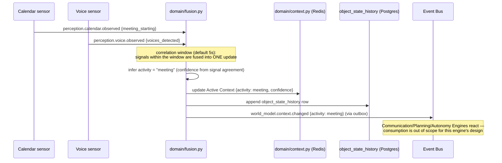
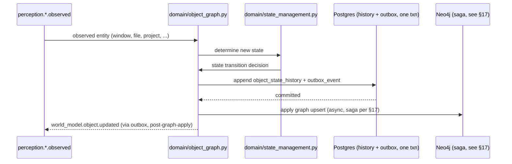
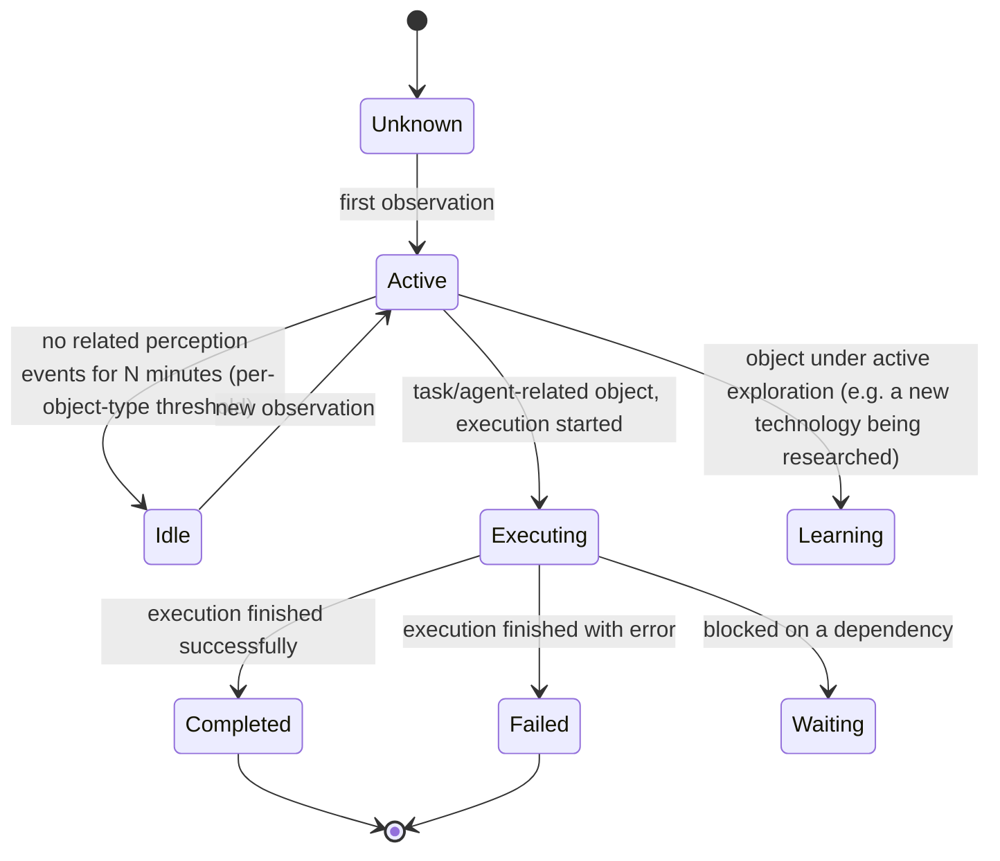

# Phase 1 Technical Design — 03: World Model Engine

Implements the merged [Bible Part 5 + Part 18](../../bible/part-05-world-model-engine.md)
per ADR-002. Builds on [00 — Shared Foundations](00-shared-foundations.md).

## 1. Internal architecture

```
services/world-model-engine/src/nova_world_model_engine/
├── api/
│   ├── context.py           # /v1/world/context
│   ├── objects.py           # /v1/world/objects*
│   ├── graph.py              # /v1/world/graph
│   ├── snapshots.py
│   └── health.py
├── domain/
│   ├── ports.py              # GraphStore, EventPublisher Protocols (no VectorStore — WM doesn't embed)
│   ├── models.py             # WorldObject, ObjectState, AttentionEntry, ActiveContext
│   ├── object_graph.py       # World Object CRUD orchestration (delegates to GraphStore)
│   ├── state_management.py   # object state transitions — §6
│   ├── attention.py          # Attention Model — §6
│   ├── context.py            # Active Context management — §4/§7
│   ├── temporal.py           # Temporal Model (history + predictions)
│   ├── fusion.py             # multi-modal perception fusion — §3
│   ├── conflict_resolution.py # §6
│   ├── simulation.py         # World Simulation — interface only, Phase 1 stub, see §20
│   ├── prediction.py         # Environment Prediction — §7
│   └── ranking.py
├── repository/
│   ├── neo4j_object_repository.py       # via nova-graphstore-sdk
│   ├── postgres_history_repository.py    # object_state_history, snapshot, prediction
│   ├── redis_context_repository.py       # Active Context + Attention — primary store, not cache
│   └── outbox_dispatcher.py
├── events/
│   ├── published.py
│   └── subscribed.py
└── workers/
    ├── snapshot_worker.py        # periodic + triggered World State Snapshots
    ├── prediction_worker.py      # Environment Prediction generation
    └── outbox_worker.py
```

| Component | Responsibility | Must never |
|---|---|---|
| `domain/context.py` | Owns Active Context (current objective/project/device/task) | Persist it primarily to Postgres — Redis is the store, per [00](00-shared-foundations.md#caching-principle-stated-once-keys-specified-per-engine) |
| `domain/fusion.py` | Merge concurrent perception signals into one coherent context update | Fire more than one `world_model.context.changed` per fused batch — fusion's entire point is to avoid N uncoordinated updates |
| `domain/attention.py` | Compute/decay attention scores | Persist a write-heavy decay job — decay is computed lazily at read time (§6) |
| `domain/conflict_resolution.py` | Resolve disagreeing observations about the same object | Silently prefer the most recent without checking confidence/policy first |
| `domain/simulation.py` | Expose the `simulate(action) -> PredictedOutcome` interface | Contain real simulation logic in Phase 1 — see §20 |

## 2. Responsibilities of every component

| Bible concept | Owning module |
|---|---|
| Digital Environment Graph | `object_graph.py`, backed by `nova-graphstore-sdk` |
| Object States | `state_management.py` |
| Real Time Synchronization | `fusion.py` + the Event Bus subscription surface (§13) |
| Context Timeline | `postgres_history_repository.object_state_history` |
| Current Context | `context.py`, Redis-backed |
| Active Attention | `attention.py` |
| Digital Presence | `context.py` (extended with a `platform` field — desktop/browser/cloud/voice, Phase 1 stores it, multi-platform *reasoning* is a later-phase concern) |
| System Health | **Not owned here** — see note below |
| Project Understanding | `object_graph.py` (`:Project` nodes) + `postgres_history_repository` for state history |
| Situational Awareness | `fusion.py` produces it; `context.py` stores the result |
| Environment Prediction | `prediction.py` / `prediction_worker.py` |
| Digital Twin Synchronization | Deferred — Digital Twin Engine doesn't exist until Phase 4; World Model publishes the events Digital Twin will eventually consume, no coupling needed now |
| Agent Awareness (scoped context) | `api/context.py`'s query parameters (`scope=agent:<category>`) |
| World State Snapshots | `snapshot_worker.py` |
| World Simulation | `simulation.py` — interface only, Phase 1 |

**Note on System Health**: Part 5/18 lists CPU/GPU/RAM/battery/temperature/network
monitoring under World Model. Phase 1 does **not** implement hardware telemetry
collection here — that requires the desktop Companion (`nova-companion`, Rust), which
is a Roadmap Phase 4/5 deliverable, and TimescaleDB for the time-series volume
(SAD 07 §1, "Phase 2+"). World Model Engine's schema reserves the object type
(`:SystemResource`) and the event subscription (`perception.system.observed`) so
this is a natural Phase 4 addition, not a redesign — but there is nothing to
implement here yet because there is no sensor publishing that data.

## 3. Data flow diagrams

**Multi-modal fusion** — the canonical example from
[SAD 10 row 9](../../architecture/10-inter-engine-communication.md#2-canonical-event-flow-table),
now shown at implementation depth:



**Object write path** (perception → graph object):



## 4. Database schema

**Redis** (primary store for Active Context and Attention — not cache, per
[00](00-shared-foundations.md)):

```
world:context:<user_id>            HASH   {objective, project_id, device, task, activity, confidence, updated_at}
world:attention:<user_id>          ZSET   member=entity_id, score=raw_attention_weight, timestamp stored alongside
world:presence:<user_id>:<device>  STRING platform, last_seen_at, TTL=5min (heartbeat-refreshed)
```

**Postgres** (temporal history, snapshots, predictions — high-volume/time-series-shaped
data that doesn't belong in the graph):

```sql
CREATE SCHEMA world_model;

CREATE TABLE world_model.object_state_history (
    id BIGSERIAL PRIMARY KEY,
    object_id TEXT NOT NULL,           -- matches Neo4j node id
    object_label TEXT NOT NULL,
    user_id UUID NOT NULL,
    previous_state TEXT,
    new_state TEXT NOT NULL,
    confidence REAL,
    changed_at TIMESTAMPTZ NOT NULL DEFAULT now(),
    correlation_id UUID
);
CREATE INDEX osh_object_idx ON world_model.object_state_history (object_id, changed_at DESC);
CREATE INDEX osh_user_idx ON world_model.object_state_history (user_id, changed_at DESC);

CREATE TABLE world_model.snapshot (
    id UUID PRIMARY KEY DEFAULT gen_random_uuid(),
    user_id UUID NOT NULL,
    taken_at TIMESTAMPTZ NOT NULL DEFAULT now(),
    snapshot_data JSONB NOT NULL,       -- serialized Active Context + object graph summary (not the full graph)
    trigger TEXT NOT NULL               -- scheduled | manual | pre_risky_action
);
CREATE INDEX snapshot_user_idx ON world_model.snapshot (user_id, taken_at DESC);

CREATE TABLE world_model.prediction (
    id UUID PRIMARY KEY DEFAULT gen_random_uuid(),
    user_id UUID NOT NULL,
    prediction TEXT NOT NULL,
    confidence REAL NOT NULL,
    predicted_for TIMESTAMPTZ,
    outcome TEXT,                       -- confirmed | refuted | unknown, filled in later
    created_at TIMESTAMPTZ NOT NULL DEFAULT now()
);

CREATE TABLE world_model.conflict_log (
    id UUID PRIMARY KEY DEFAULT gen_random_uuid(),
    object_id TEXT NOT NULL,
    observation_a JSONB NOT NULL,
    observation_b JSONB NOT NULL,
    resolution_strategy TEXT NOT NULL,   -- confidence | recency | policy | unresolved
    resolved_value JSONB,
    resolved_at TIMESTAMPTZ NOT NULL DEFAULT now()
);

-- Transactional outbox (00-shared-foundations.md), with the same graph-write saga
-- shape as Knowledge Engine (02 §4/§17).
CREATE TABLE world_model.outbox_event (
    id UUID PRIMARY KEY DEFAULT gen_random_uuid(),
    subject TEXT NOT NULL,
    payload JSONB NOT NULL,
    correlation_id UUID NOT NULL,
    causation_id UUID,
    graph_write JSONB,
    graph_applied_at TIMESTAMPTZ,
    created_at TIMESTAMPTZ NOT NULL DEFAULT now(),
    dispatched_at TIMESTAMPTZ
);
CREATE INDEX outbox_undispatched_idx ON world_model.outbox_event (created_at) WHERE dispatched_at IS NULL;
```

## 5. Graph model

Distinct label namespace from Knowledge Engine's, same Neo4j instance
([SAD 07 §4](../../architecture/07-database-architecture.md#4-graph-storage--the-graphstore-interface-neo4j-default-per-adr-007)):

```cypher
(:WorldProject {id, name, status})
(:File {id, path})
(:Window {id, title, application})
(:Application {id, name})
(:Agent {id, category})          -- reference only; agent-os/registry (Phase 3) owns the source of truth
(:Task {id, status})
(:Device {id, platform})
(:SystemResource {id, kind})     -- reserved for Phase 4, see §2 note

-[:CONTAINS]-> -[:BELONGS_TO]-> -[:EXECUTES]-> -[:EDITS]-> -[:FOCUSES_ON]->
// every relationship carries: {confidence, observed_at, source}
```

```cypher
CREATE CONSTRAINT world_object_id_unique IF NOT EXISTS
    FOR (n:WorldProject|File|Window|Application|Agent|Task|Device|SystemResource)
    REQUIRE n.id IS UNIQUE;
CREATE INDEX world_project_name_idx IF NOT EXISTS FOR (p:WorldProject) ON (p.name);
```

`:WorldProject` is deliberately named distinctly from Knowledge Engine's `:Project`
label — they represent the same real-world project from two angles (World Model:
"what's its live state," Knowledge: "what do we know about it") and are explicitly
**not** merged into one label, because merging would couple the two engines' write
paths together, violating ADR-001's replaceability requirement. They are linked by
shared `id` convention (a project has one UUID, referenced by both graphs) rather
than by being the same node — a cross-engine query joins them by id, never by graph
traversal across the label boundary.

## 6. "Memory lifecycle" — here, the Object State & Attention model

World Model has no forgetting lifecycle (it represents *current* reality, not
accumulated history — that's what Memory Engine is for). Its equivalent concerns:

**Object states** (`state_management.py`):



**Attention** (`attention.py`) — computed lazily at read time, not maintained by a
write-heavy decay job:

```
attention(entity, now) = raw_weight(entity) * exp(-(now - last_boosted_at) / half_life)
```

`raw_weight` is boosted (not set) on every relevant perception event touching that
entity; reading the Active Context always recomputes current attention from the
stored `(raw_weight, last_boosted_at)` pair rather than trusting a stale precomputed
score — this avoids a scheduled decay job entirely while still producing correct
"current" attention ordering.

## 7. Retrieval pipeline — here, the Context & Situational Awareness query

World Model's primary "retrieval" is not search, it's **context assembly**:

1. `GET /v1/world/context` (or `world_model.context.request` over the bus): read
   `world:context:<user_id>` from Redis directly — this is the hot path Executive
   Cognition calls on every Thinking Pipeline execution
   ([SAD 03 §3](../../architecture/03-backend-architecture.md#3-request-lifecycle-the-thinking-pipeline-concretely)),
   so it must be a single Redis `HGETALL`, not a fan-out.
2. `GET /v1/world/objects/{id}` or `/graph?scope=...`: graph traversal via
   `GraphStore`, bounded hops, same discipline as Knowledge Engine (§02 §7).
3. `GET /v1/world/objects/{id}/history`: `object_state_history` range query.
4. Scoped context for agents (Part 11 "Agent Awareness"): the same Active Context
   read, filtered to the fields relevant to the requesting category (a
   `coding-agent` gets project/file/IDE fields; a `communication-engine` request
   gets conversation/device fields) — filtering happens in `api/context.py`, not by
   maintaining N pre-filtered copies.

## 8. Indexing strategy

- Redis: no secondary indexing needed — Active Context is a direct-keyed hash,
  Attention is a sorted set (natively ordered by score).
- Postgres: B-tree on `(object_id, changed_at DESC)` and `(user_id, changed_at DESC)`
  for `object_state_history` — this table is the highest-write-volume table in
  Phase 1 (every perception-driven state change appends a row), so these two
  indexes are the ones that matter; no GIN/JSONB indexing needed since queries are
  always object- or user-scoped range queries, not content search.
- Neo4j: uniqueness constraint (implies index) on `id`; name index on `:WorldProject`
  for lookups by name (e.g., resuming "Project NOVA" by name).

## 9. Caching strategy

World Model's Redis usage **is** the caching strategy — Active Context and
Attention are primary-store-in-Redis by design (§4), not a cache layer in front of
something else. The one genuine cache: `world:cache:graph:<scope_hash>` for graph
subgraph query results (10s TTL — short, because the object graph changes
continuously and a stale subgraph view is actively misleading in a way a stale
memory search result is not).

## 10. Embedding strategy

World Model Engine **does not generate embeddings**. It has no `VectorStore`
dependency and no `EmbeddingProvider` dependency — its data is either current-state
(Redis, no search needed, direct key access) or graph-shaped (traversal, not
similarity search). This is a deliberate scope boundary, not an oversight: if a
future need arises for "find objects semantically similar to X," that need is better
served by linking the object to a Knowledge Graph node (which does have an
embedding) than by duplicating embedding infrastructure into a third engine.

## 11. Search strategy

Given §7/§10, "search" here means graph traversal and Redis lookups, not
similarity search. The one addition beyond what's already described: **fulltext
search on `:WorldProject.name` and `:File.path`** (Neo4j, exact/prefix matching) for
"resume Project X by name" style lookups — deliberately simple, not semantic,
because these are structured identifiers, not natural language.

## 12. Versioning strategy

Object state changes are inherently versioned by `object_state_history` (an
append-only log *is* the version history — no separate table needed, unlike
Knowledge Engine where node content itself changes and needs a diff-shaped history).
Graph node properties still carry a lightweight `version` counter for optimistic
concurrency on concurrent writers (e.g., two perception sources updating the same
object near-simultaneously). Snapshots (`world_model.snapshot`) are the
coarse-grained, point-in-time version of the *entire* context — Part 5's "World
State Snapshots," restorable wholesale rather than replayed field-by-field.

## 13. Event flow through the Event Bus

| Direction | Subject | Payload |
|---|---|---|
| Publishes | `world_model.object.created` / `.updated` / `.deleted` | `WorldObjectChangedPayload` |
| Publishes | `world_model.context.changed` | `ContextChangedPayload` |
| Publishes | `world_model.attention.shifted` | `AttentionShiftedPayload` |
| Publishes | `world_model.prediction.generated` | `PredictionPayload` |
| Subscribes | `perception.*.observed` | primary input — every perception subject |
| Subscribes | `action.result` | object state updates from completed actions |
| Subscribes | `agent_os.task.*` (Phase 3+, no-op subscription registered now) | task/agent object state |
| Subscribes | `nova.mode.changed` | shifts Attention Model weighting (Part 6: "if gaming begins, performance monitoring becomes dominant") |
| Request/Reply served | `world_model.context.request` (the hot path, §7) | |

## 14. APIs exposed

```
GET    /v1/world/context                    # Active Context, direct Redis read
GET    /v1/world/context?scope=agent:<category>   # filtered for Agent Awareness (Part 11)
GET    /v1/world/objects/{id}
GET    /v1/world/objects/{id}/history
GET    /v1/world/graph?scope=project:<id>&max_hops=2
POST   /v1/world/snapshot                    # manual trigger
GET    /v1/world/snapshots?user_id=...
GET    /v1/world/predictions
GET    /internal/health | /internal/readiness | /internal/metrics
```

Internal RPC: `world_model.context.request` (highest-QPS internal call in the whole
Phase 1 surface — every Reasoning pipeline execution calls it).

## 15. Performance considerations

| Path | Target (p95) | Notes |
|---|---|---|
| `world_model.context.request` | < 20ms | Single Redis HGETALL; this is the tightest budget in Phase 1 because it's on every Thinking Pipeline execution |
| Object state write (perception → history row) | < 50ms | Excludes async graph apply |
| Graph traversal (2-hop, scoped) | < 100ms | Same budget as Knowledge Engine |
| Fusion window processing | < 5s window, < 200ms processing per fused batch | The 5s correlation window (§3) is a design parameter, not a latency budget — processing *within* the window must stay fast |

## 16. Scalability strategy

Redis is the one component here needing early attention at scale: Active Context and
Attention are per-user hot state, sharding naturally by `user_id` (Redis Cluster hash
slots) — same lever as every other engine's `user_id`/`tenant_id` sharding (SAD 19
§3), but World Model hits it first because its Redis usage is on the highest-QPS
path. `object_state_history`'s append-only, always-scoped-query shape scales via
standard Postgres partitioning by `user_id` or time range if it ever becomes the
bottleneck (not needed at Phase 1 volumes — noted for Phase 8).

## 17. Failure recovery

Same Postgres-then-Neo4j saga as Knowledge Engine (§02 §17), applied to
`object_graph.py`'s writes — identical mechanism, not a variant, since the
underlying problem (two non-transactional datastores) is identical.

Additional World-Model-specific failure modes:

- **Redis unavailable** (Active Context's primary store, not a cache — this is the
  most consequential failure mode in this engine): `world_model.context.request`
  fails fast with a clear error rather than silently returning stale/empty context —
  Executive Cognition's Thinking Pipeline already has a documented fallback for this
  exact case ([SAD 10 §3](../../architecture/10-inter-engine-communication.md#3-synchronous-vs-asynchronous-calls):
  "proceed with partial context, confidence penalty"). World Model does not attempt
  its own silent fallback to a different store — Redis unavailability is a real
  degraded-mode signal that should propagate, not be hidden.
- **Fusion window data loss**: if the process crashes mid-window, partially fused
  signals are lost (never written to Redis, so nothing is *inconsistent*, only
  potentially delayed by up to one fusion window on restart) — acceptable per Part
  18's own framing of the World Model as "continuously synchronized," implying
  eventual, not transactional, consistency.
- **Conflicting observations with no resolution**: `conflict_resolution.py` always
  produces a value (§6's algorithm has no "give up" branch) but logs unresolved
  cases to `conflict_log` with `resolution_strategy='unresolved'` for later Reasoning
  Engine review (Phase 2+), never blocks the write.

## 18. Security considerations

Same `user_id` scoping discipline as the other two engines. World Model additionally
carries genuinely sensitive live-activity data (what the user is doing *right now*)
— `world:context:<user_id>` and `object_state_history` are treated as
`confidential` by default (not `internal`) in the privacy classification scheme from
[00](00-shared-foundations.md#confidence-and-privacy-everywhere), reflecting that
live activity is more sensitive than an isolated memory fact. Agent-scoped context
reads (§7 step 4) are filtered server-side, not client-side — an agent category
never receives the full Active Context and trusts itself to ignore irrelevant
fields; it receives only what it's scoped to.

## 19. Testing strategy

- **Unit**: `state_management.py` (every object state transition), `attention.py`
  (lazy decay formula correctness — property test: monotonically decreasing between
  boosts), `conflict_resolution.py` (every resolution branch: confidence-wins,
  recency-wins, policy-wins, unresolved-logged).
- **Integration**: the multi-modal fusion scenario from §3, replayed against
  `nova-testkit`'s event bus fixture with synthetic calendar+voice events, asserting
  exactly one `world_model.context.changed` per fusion window; the Postgres-then-Neo4j
  saga (same test shape as Knowledge Engine §02 §19).
- **Performance**: benchmark `world_model.context.request` specifically (§15's
  tightest budget) under concurrent load representative of multiple simultaneous
  Thinking Pipeline executions.
- **Failure scenarios**: Redis down during a context request (assert fast, clear
  failure — not a hang, not a silently wrong answer); Neo4j down during an object
  write (assert Postgres history still records it); two conflicting perception
  events arriving within the same fusion window (assert `conflict_log` entry, not a
  crash).

## 20. Future extension points

- **World Simulation** (`simulation.py`): Phase 1 ships the interface
  (`simulate(proposed_action) -> PredictedOutcome`) with a stub implementation that
  returns `PredictedOutcome(confidence=0.0, reason="simulation not yet implemented")`
  — callers (Action Engine, Phase 3+) can already code against the real contract;
  the actual simulation logic (Part 5's "what happens if this file is deleted")
  arrives once there's enough World Model + Reasoning Engine maturity to make it
  meaningful, without changing the interface.
- **System Health telemetry** (§2 note): reserved object type and event
  subscription, real implementation arrives with `nova-companion` (Phase 4/5) and
  TimescaleDB (Phase 2+ per SAD 07).
- **Digital Twin synchronization**: World Model already publishes every event
  Digital Twin (Phase 4) will need; no World Model change required when that engine
  is built, only a new subscriber.
- **Multi-device World Model merge**: the same event-log-as-sync-unit approach
  described in [SAD 18](../../architecture/18-local-first-and-cloud-sync.md) applies
  here without modification once Phase 8's `nova-sync-service` exists.
