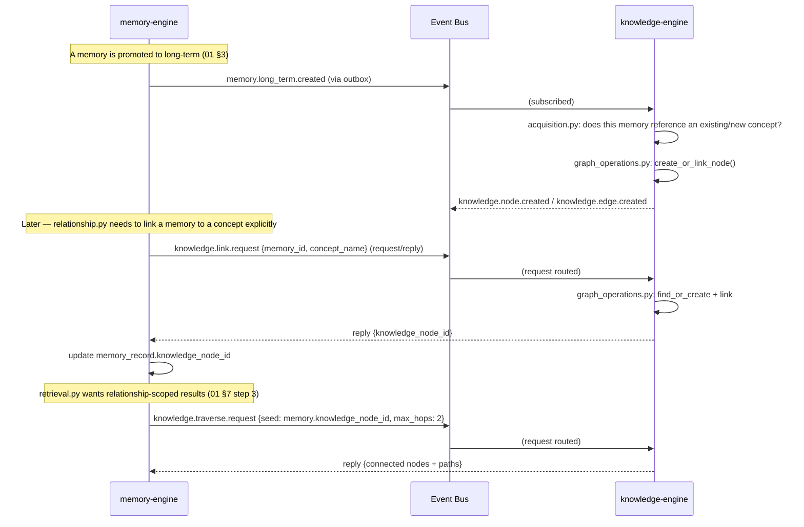
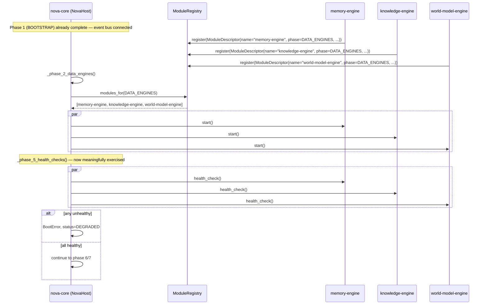

# Phase 1 Technical Design — 04: Cross-Engine Integration

Builds on [00](00-shared-foundations.md), [01](01-memory-engine.md),
[02](02-knowledge-engine.md), [03](03-world-model-engine.md). This document covers
what actually crosses an engine boundary **during Phase 1 itself** — not the full
17-engine system (that's [SAD 10](../../architecture/10-inter-engine-communication.md)),
and not speculative future integration, but the real, exercised, tested paths that
exist once these three engines are running.

## What Phase 1 does and does not integrate with

Perception Engine (Phase 4), Reasoning Engine (Phase 2), and Planning Engine (Phase
3) do not exist yet. This matters for design honesty: Phase 1's "event flow" sections
in documents 01–03 list subscriptions to `perception.*.observed`,
`reasoning.result`, etc. — those are **contracts these engines are ready to serve**,
not integrations exercised by a real upstream producer in Phase 1. Two consequences:

1. **The real, exercised Phase 1 integration is Memory ↔ Knowledge** (§1 below) —
   this is genuine engine-to-engine traffic, tested end-to-end.
2. **Everything else is validated via a synthetic event harness** (§2), so the
   consuming code path is still fully tested — just against realistic fixture data
   instead of a live sensor, exactly as the original Roadmap Phase 1 entry specified
   ("event ingestion from a synthetic event generator").

## 1. Memory ↔ Knowledge integration (real, Phase 1)

This is the one genuine cross-engine relationship Phase 1 builds and tests fully,
because Memory Engine deliberately owns no graph of its own
([01 §5](01-memory-engine.md#5-graph-model)) and delegates all relationship
storage/traversal to Knowledge Engine.



Both request/reply calls use the pattern already specified in
[SAD 09 §1](../../architecture/09-event-bus-architecture.md#1-the-eventbus-interface-the-contract-not-the-technology)
and [SAD 10 §3](../../architecture/10-inter-engine-communication.md#3-synchronous-vs-asynchronous-calls):
routed through the bus, schema-validated, with a documented timeout and fallback
(500ms, degrade to memory-only results with a confidence penalty — matching the
existing convention rather than inventing a new one for this pair).

**Contract tests** (§ testing, both engines) assert this loop specifically: create a
memory → assert a `knowledge.node.created` event follows within a bounded time →
assert `knowledge.traverse.request` from that memory's `knowledge_node_id` returns
the expected node.

## 2. Synthetic event harness (development & testing, until Phase 4)

A new `nova-testkit` fixture, `synthetic_perception_stream`, publishes
Bible-shaped-but-fabricated events matching what the real Perception Engine will
publish in Phase 4 — same subjects, same envelope, same payload schema (defined now
in `nova-contracts`, so Phase 4's real Perception Engine has nothing to renegotiate
with Memory/Knowledge/World Model when it ships):

```python
# packages/nova-testkit/src/nova_testkit/synthetic_perception.py (design, not yet implemented)
async def synthetic_perception_stream(bus: EventBus, scenario: str) -> None:
    """Replays a named fixture scenario (e.g. "meeting_begins", "project_resumed")
    as a sequence of perception.*.observed events with realistic timing, so
    World Model's fusion.py and Memory/Knowledge's subscribers can be integration-
    tested against the same scenarios documented in 03 §3 without a live sensor."""
```

This directly reuses the "golden-scenario replay" testing pattern already
established in [SAD 16 §5](../../architecture/16-testing-strategy.md#5-multi-agent--orchestration-testing)
and named for the exact fusion scenario in
[03 §3](03-world-model-engine.md#3-data-flow-diagrams) — Phase 4 doesn't invent new
test infrastructure, it points `nova-companion`'s real sensors at the same fixture
subjects this harness already validates against.

## 3. Boot integration with `nova-core`

Per Bible Part 20's boot sequence (already implemented structurally in Phase 0,
[services/nova-core/src/nova_core/domain/boot.py](../../../services/nova-core/src/nova_core/domain/boot.py)),
Memory, Knowledge, and World Model are three of `BootPhase.DATA_ENGINES`'s five
members (Personality and Digital Twin follow in later phases). Phase 0 tested this
phase against an **empty** `ModuleRegistry` — Phase 1 is the first time it runs with
real modules, and is where the registry's contract actually gets exercised:



**Embedded vs. standalone mode** ([SAD 03 §2](../../architecture/03-backend-architecture.md#2-nova-host--the-local-first-supervisor-process)):
in local-first `embedded` mode, `register()` is a direct in-process call at
`nova-host` startup (each engine's `main.py` gains a `register_with_host(registry)`
hook, called before `NovaHost.boot()`). In `standalone` mode, `register()` instead
means "the module's own container starts independently and reports readiness via
heartbeat," and `ModuleRegistry.modules_for()` becomes a query against recent
heartbeat state rather than an in-process list — this mode difference is exactly
what ADR-001 exists to make a configuration change, not a code fork, and Phase 1 is
the first concrete test of that claim beyond `nova-core` alone.

## 4. Shared Neo4j instance, kept logically separate

Knowledge Engine and World Model Engine both write to the same physical Neo4j
instance ([SAD 07 §4](../../architecture/07-database-architecture.md#4-graph-storage--the-graphstore-interface-neo4j-default-per-adr-007))
through the same `nova-graphstore-sdk`, but with disjoint label namespaces
(`:Concept`/`:Technology`/... vs. `:WorldProject`/`:File`/...) and disjoint
`GraphStore` client configurations (each engine's `GraphStore` instance is
constructed with its own allowed-label allowlist, enforced the same way
`BoundEventBus` enforces subject allow-lists — a `BoundGraphStore` wrapper,
mirroring [ADR-004's enforcement mechanism](../../architecture/09-event-bus-architecture.md#6-boundary-enforcement)
applied to the graph instead of the bus). Neither engine ever traverses into the
other's labels; cross-referencing (§3's `:WorldProject` ↔ `:Project` id convention)
happens by application-level id lookup, never by a Cypher query spanning both
namespaces.

## 5. What Phase 2 (Reasoning Engine) will call, already stable

Documented here so Phase 2 requires zero changes to Phase 1's engines — the contract
is fixed now:

| Phase 2 caller | Calls | Defined in |
|---|---|---|
| Reasoning Engine's "Load memories" pipeline stage | `memory.retrieve.request` | [01 §13](01-memory-engine.md#13-event-flow-through-the-event-bus) |
| Reasoning Engine's "Load World Model" stage | `world_model.context.request` | [03 §13](03-world-model-engine.md#13-event-flow-through-the-event-bus) |
| Reasoning Engine's "Retrieve knowledge" stage | `knowledge.retrieve.request` | [02 §13](02-knowledge-engine.md#13-event-flow-through-the-event-bus) |
| Reasoning Engine's "Store new knowledge" / Decision Memory write | `memory.decision.recorded` (published, consumed) | [01 §13](01-memory-engine.md#13-event-flow-through-the-event-bus) |

This table is the acceptance test for Phase 1's API design: if Phase 2 needs
anything not already in this table, that is a signal Phase 1's design missed
something — reviewers should check new Phase 2 requirements against this table
before assuming a new endpoint is needed.
