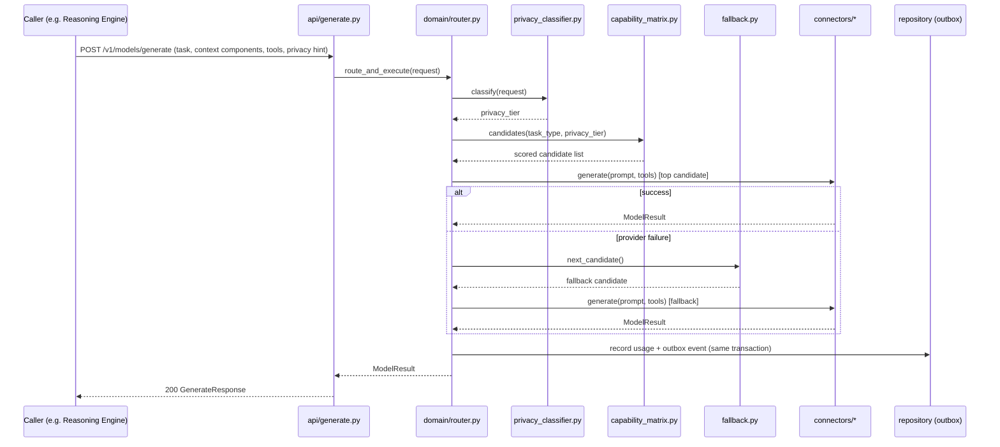

# Phase 2A Technical Design — AI Model Orchestration Engine

Implements [Bible Part 7](../../bible/part-07-ai-model-orchestration-engine.md).
Realizes the sketch in
[SAD 06 §1](../../architecture/06-ai-layer-architecture.md#1-model-gateway-ai-model-orchestration-engine)
and enforces [ADR-020](../../architecture/adr/ADR-020-sole-legal-llm-provider-channel.md)
(this engine is the only legal channel to any LLM/AI provider).

## 0. The boundary this entire design defends

Bible Part 7, verbatim: *"The AI Model Orchestration Engine must remain completely
independent from Memory, Planning, Knowledge, Personality, World Model, Executive
Cognition, Action, Capabilities. It serves only as the intelligence provider layer."*

Four of this engine's thirteen focus areas — **Prompt Pipeline, Context Builder,
Tool Calling, Function Registry** — sound, at first glance, like they need exactly
the engines this boundary forbids depending on (a prompt needs memories; a tool call
needs to know what the tool does). They don't, and the reason why is the single most
important design decision in this document, so it is stated once here and then
referenced everywhere it applies:

- **Prompt Pipeline & Context Builder are a *formatting* mechanism, never a
  *sourcing* mechanism.** This engine receives already-assembled, named context
  components (each a block of text with a source label, a token estimate, and a
  truncation policy) from whichever caller is making the request. It fits those
  components into the chosen model's context window and formats them per that
  model's API conventions (some providers want a `system`/`user`/`assistant` role
  array; some want one concatenated string; some support structured content blocks).
  It never decides *what* is relevant, never calls Memory Engine, Knowledge Engine,
  World Model Engine, or Personality Engine itself. Deciding relevance is a cognitive
  act — that's Reasoning Engine's job (Phase 2B). This engine's Context Builder would
  behave identically if fed components by Reasoning Engine, a test harness, or
  (hypothetically) a completely different cognitive architecture altogether — which
  is exactly the independence Part 7 requires, made concrete.
- **Tool Calling & Function Registry are a *schema-translation* mechanism, never a
  *capability* mechanism.** A caller registers a tool's name, description, and JSON
  Schema parameters once per request (or session); this engine translates that
  schema into whichever format the selected provider's tool-calling API expects,
  sends it, and parses the provider's tool-call response back into one normalized
  shape. It never executes a tool, never knows what a tool *does*, and never holds a
  registry of NOVA's actual capabilities — that registry, and the execution of
  whatever a tool call resolves to, belongs to the future Capability Engine and
  Action Engine (Phase 3). "Function Registry" here means "the set of tool schemas
  this *specific request* was told about," not "the set of things NOVA can do."

Every other focus area (Model Registry, Provider Abstraction, Model Router, Local vs.
Cloud execution, Streaming, Token Management, Cost Tracking, Fallback Strategies,
Observability) is self-evidently internal to this engine's own job and needed no
similar reframing.

## 1. Internal architecture

```
services/ai-model-orchestration-engine/src/nova_ai_model_orchestration_engine/
├── api/
│   ├── models.py             # /v1/models (registry CRUD, select, benchmark)
│   ├── generate.py           # /v1/models/generate, /v1/models/generate/stream
│   ├── embed.py              # /v1/models/embed
│   ├── usage.py              # /v1/usage
│   └── health.py
├── domain/
│   ├── ports.py               # ModelConnector Protocol, ModelRegistryRepository,
│   │                          # UsageRepository, EventPublisher Protocols
│   ├── models.py              # ModelDescriptor, CapabilityScores, GenerateRequest/
│   │                          # Result, RoutingDecision, UsageRecord, Budget, PrivacyTier
│   ├── capability_matrix.py   # per-model capability scores (Part 7)
│   ├── router.py              # the Orchestration Principle pipeline (§7)
│   ├── privacy_classifier.py  # Part 7 "Privacy Management"
│   ├── fallback.py            # Part 7 "Fallback Strategy"
│   ├── cost_tracker.py        # Part 7 "Cost Management"
│   ├── context_builder.py     # Prompt Pipeline -- formatting, not sourcing (§0)
│   ├── tool_schema.py         # Function Registry -- schema translation, not capability (§0)
│   └── health.py              # model health status computation from snapshots
├── connectors/
│   ├── fake_connector.py      # deterministic, for tests
│   ├── ollama_connector.py    # default, zero-budget (Part 7)
│   └── anthropic_connector.py # proves the abstraction holds against a real cloud API
├── repository/
│   ├── models.py               # SQLAlchemy ORM
│   ├── db.py
│   ├── postgres_registry_repository.py
│   ├── postgres_usage_repository.py
│   └── outbox_dispatcher.py
├── events/
│   ├── published.py
│   ├── subscribed.py
│   └── handlers.py
├── workers/
│   ├── outbox_worker.py
│   ├── health_monitor_worker.py  # Part 7 "Model Health" -- periodic connector checks
│   └── benchmark_worker.py       # Part 7 "Model Benchmarking" -- continuous evaluation
├── observability.py
├── config.py
└── main.py
```

`domain/` depends only on the Protocols in `ports.py`, exactly as every Phase 1
engine's `domain/` does — never on FastAPI, SQLAlchemy, Redis, or (critically, per
ADR-020) any provider SDK directly. **`connectors/` is the only directory in this
engine, and per ADR-020 the only directory in the entire codebase, permitted to
import a provider SDK** (`ollama` client, `anthropic` SDK, etc.). This is the same
`GraphStore`/`EventBus`-behind-an-interface pattern from ADR-006/007, applied one
layer further in: not just "one adapter module per backend," but "one directory,
enforced by import-linter, that is the sole legal home for provider coupling in the
whole monorepo."

There is no `nova-modelconnector-sdk` shared package, unlike `nova-graphstore-sdk` /
`nova-vectorstore-sdk` / `nova-embeddings-sdk`. Those became shared packages because
multiple engines needed the same swappable-backend Protocol (Memory *and* Knowledge
Engine both need `VectorStore`). Per ADR-020, no other engine will ever construct a
`ModelConnector` directly — there is exactly one legitimate consumer, so the
Protocol lives in this engine's own `domain/ports.py`, not promoted to a shared
package for a sharing need that doesn't exist. `nova-embeddings-sdk` (ADR-009)
remains a dependency of *this* engine specifically — its `OllamaEmbeddingProvider`
becomes the concrete implementation this engine's embedding capability wraps,
reusing Phase 1's work rather than duplicating an Ollama embedding client, while
Memory/Knowledge Engine's own direct use of that package becomes the tracked
migration debt ADR-020 names.

## 2. Responsibilities of every component

- **`domain/router.py`** — implements Part 7's nine-step "Orchestration Principle"
  (§7 below) as an explicit, testable function, not implicit logic scattered across
  the API layer.
- **`domain/capability_matrix.py`** — holds and scores each registered model against
  Part 7's twelve capability dimensions (general conversation, programming,
  reasoning, mathematics, translation, vision, speech, planning, creativity,
  research, tool usage, long context).
- **`domain/privacy_classifier.py`** — classifies each incoming request's privacy
  level (Part 7: public / internal / confidential / highly sensitive) and — per Part
  7's "Highly Sensitive... should never leave the local device unless the user
  explicitly allows it" — restricts routing to local-only connectors when the
  classification demands it. This is the *same* `PrivacyLevel` enum Memory Engine
  and World Model Engine already use (`nova_contracts.events.memory.PrivacyLevel`),
  reused rather than redefined, so a privacy tier means the same thing everywhere in
  NOVA.
- **`domain/fallback.py`** — Part 7's fallback chain: retry, select another model,
  reduce context if necessary, notify the user only if recovery fails.
- **`domain/cost_tracker.py`** — computes estimated cost per request from a model's
  registered per-token pricing, and evaluates budget thresholds (Part 7: "if no
  budget exists, prefer local execution").
- **`domain/context_builder.py`** — the Prompt Pipeline (§0): fits named,
  pre-assembled context components into a target model's context window, applying
  each component's own truncation/summarization policy, and formats the result per
  the target connector's expected request shape.
- **`domain/tool_schema.py`** — the Function Registry (§0): normalizes a per-request
  set of tool schemas into each connector's tool-calling wire format, and parses
  each connector's tool-call response back into one normalized `ToolCall` shape.
- **`connectors/*.py`** — one file per provider, each implementing the
  `ModelConnector` Protocol (`generate`, `stream`, `embed`, `tool_call` — Part 7's
  "AI Model Abstraction" list, narrowed to what Phase 2A actually ships; vision/
  speech connectors are a named future extension point, §20).
- **`repository/postgres_registry_repository.py`** — persists the Model Registry
  (Part 7's "central catalog of intelligence providers").
- **`repository/postgres_usage_repository.py`** — persists every request's cost/
  token/latency record (Part 7's "Cost Management") and the transactional outbox.
- **`workers/health_monitor_worker.py`** — Part 7 "Model Health": periodically probes
  every registered connector's availability/latency and writes a health snapshot,
  demoting unhealthy models' routing priority.
- **`workers/benchmark_worker.py`** — Part 7 "Model Benchmarking": periodically runs
  a small fixed evaluation set against registered models and updates their quality/
  latency scores, feeding back into `capability_matrix.py`.

## 3. Data flow diagrams

**Non-streaming generate request (the common path):**



**Streaming request:** identical routing/selection logic, but the response is an
HTTP chunked/SSE stream from `api/generate.py`'s `/generate/stream` endpoint directly
to the caller — never through the Event Bus, which is a single-request/single-reply
mechanism unsuited to token-by-token delivery (§13 explains why streaming is
HTTP-native, not event-native, in this design).

**Fallback exhaustion:** if every candidate in the fallback chain fails, the router
records the failure (never silently swallows it), publishes
`ai_model.request.failed`, and returns an error the caller must handle — Part 7's
"notify the user only if recovery fails" is implemented as "this engine notifies its
*caller*," since notifying an actual end user is Communication Engine's job (Phase
2D), outside this engine's boundary.

## 4. Database schema

Postgres schema `model_orchestration`, migrated via Alembic, same pattern as every
Phase 1 engine.

```sql
CREATE TABLE model_orchestration.model_registry (
    id UUID PRIMARY KEY DEFAULT gen_random_uuid(),
    name TEXT NOT NULL,
    version TEXT NOT NULL,
    provider TEXT NOT NULL,               -- 'ollama' | 'anthropic' | ...
    connector_type TEXT NOT NULL,         -- which connectors/*.py implementation
    is_local BOOLEAN NOT NULL,
    modalities JSONB NOT NULL,            -- ['text_generation', 'embedding', ...]
    capability_scores JSONB NOT NULL,     -- Part 7's twelve-dimension matrix
    context_window INTEGER NOT NULL,
    max_output_tokens INTEGER NOT NULL,
    avg_latency_ms DOUBLE PRECISION,
    avg_quality_score DOUBLE PRECISION,
    hardware_requirements JSONB,
    license TEXT,
    cost_per_input_token NUMERIC(12, 8),
    cost_per_output_token NUMERIC(12, 8),
    min_privacy_tier TEXT NOT NULL,       -- lowest PrivacyLevel this model may serve
    health_status TEXT NOT NULL DEFAULT 'unknown',
    created_at TIMESTAMPTZ NOT NULL DEFAULT now(),
    updated_at TIMESTAMPTZ NOT NULL DEFAULT now(),
    UNIQUE (name, version, provider)
);

CREATE TABLE model_orchestration.model_health_snapshot (
    id BIGSERIAL PRIMARY KEY,             -- append-only time series; BIGSERIAL per
                                           -- ADR-018's precedent for this exact shape
    model_id UUID NOT NULL REFERENCES model_orchestration.model_registry(id),
    checked_at TIMESTAMPTZ NOT NULL DEFAULT now(),
    available BOOLEAN NOT NULL,
    latency_ms DOUBLE PRECISION,
    error_rate DOUBLE PRECISION
);
CREATE INDEX health_snapshot_model_idx ON model_orchestration.model_health_snapshot (model_id, checked_at DESC);

CREATE TABLE model_orchestration.usage_record (
    id UUID PRIMARY KEY DEFAULT gen_random_uuid(),
    correlation_id UUID NOT NULL,
    model_id UUID NOT NULL REFERENCES model_orchestration.model_registry(id),
    requesting_engine TEXT NOT NULL,      -- which subsystem made the request
    input_tokens INTEGER NOT NULL,
    output_tokens INTEGER NOT NULL,
    estimated_cost NUMERIC(12, 6) NOT NULL,
    latency_ms DOUBLE PRECISION NOT NULL,
    outcome TEXT NOT NULL,                -- 'success' | 'fallback' | 'failed'
    created_at TIMESTAMPTZ NOT NULL DEFAULT now()
);
CREATE INDEX usage_correlation_idx ON model_orchestration.usage_record (correlation_id);
CREATE INDEX usage_model_time_idx ON model_orchestration.usage_record (model_id, created_at DESC);

CREATE TABLE model_orchestration.budget (
    id UUID PRIMARY KEY DEFAULT gen_random_uuid(),
    scope TEXT NOT NULL,                  -- 'global' | 'provider' | 'model'
    scope_ref TEXT,                       -- provider name or model_id, null if global
    period TEXT NOT NULL DEFAULT 'monthly',
    limit_amount NUMERIC(12, 2) NOT NULL,
    currency TEXT NOT NULL DEFAULT 'USD',
    alert_threshold_pct INTEGER NOT NULL DEFAULT 80
);

CREATE TABLE model_orchestration.outbox_event (
    id UUID PRIMARY KEY DEFAULT gen_random_uuid(),
    subject TEXT NOT NULL,
    payload JSONB NOT NULL,
    correlation_id UUID NOT NULL,
    causation_id UUID,
    created_at TIMESTAMPTZ NOT NULL DEFAULT now(),
    dispatched_at TIMESTAMPTZ
);
CREATE INDEX outbox_undispatched_idx ON model_orchestration.outbox_event (created_at) WHERE dispatched_at IS NULL;
```

No `graph_write`/`graph_applied_at` columns on `outbox_event` — this engine owns no
graph (nothing in Part 7 calls for one; models and providers have no relationship
structure worth graphing), so its outbox is the simpler Memory-Engine-shaped version
(ADR-014's saga pattern is not needed here at all), not the Knowledge/World-Model
two-phase version.

## 5. Provider/Connector model

*(This section replaces "Graph model" from the standard template — this engine has
no graph, per §4.)*

```python
class ModelConnector(Protocol):
    async def generate(self, request: GenerateRequest) -> GenerateResult: ...
    async def stream(self, request: GenerateRequest) -> AsyncIterator[GenerateChunk]: ...
    async def embed(self, texts: list[str]) -> list[Embedding]: ...
    async def health(self) -> ConnectorHealth: ...
```

Every connector declares which modalities it actually implements (a text-only
connector's `embed` raises `NotSupportedError`, checked by the router before
selection, never at call time). `OllamaConnector` wraps `nova-embeddings-sdk`'s
`OllamaEmbeddingProvider` for its `embed` implementation (§1) and a direct Ollama
HTTP client for `generate`/`stream`. `AnthropicConnector` implements `generate`/
`stream`/`tool_call` support against the Anthropic Messages API; Anthropic has no
public embedding endpoint, so its `embed` correctly raises `NotSupportedError` —
exercised by a real test, not assumed.

## 6. Model lifecycle

*(Replaces "Memory lifecycle" — models don't decay the way memories do; they move
through registration, health, and (eventually) deprecation.)*

```
registered --> healthy <--> degraded --> unhealthy --> deregistered
```

- **registered**: a connector config exists in `model_registry`; no health data yet.
- **healthy / degraded / unhealthy**: driven entirely by `health_monitor_worker.py`'s
  periodic probes (Part 7 "Model Health") — an unhealthy model is never selected by
  the router except as an explicit last resort in the fallback chain, and only if no
  healthy candidate exists at all.
- **deregistered**: `DELETE /v1/models/{id}` — a soft state (row remains for
  historical `usage_record` foreign-key integrity; future requests never select it).

Unlike Memory Engine's importance-decay lifecycle, there is no time-based automatic
demotion here — a model doesn't become less relevant just because it hasn't been
used recently (Part 7 has no such requirement, and inventing one would be exactly
the speculative behavior this project's standing instruction rules out).

## 7. Routing pipeline — the Orchestration Principle

*(Replaces "Retrieval pipeline" — this engine's central pipeline is model selection,
not information retrieval.)*

Part 7's nine-step lifecycle, implemented literally in `domain/router.py`:

```
Receive Request -> Analyze Context -> Estimate Complexity -> Determine Required Skills
    -> Evaluate Available Models -> Select Best Model -> Execute -> Validate Output
    -> Store Experience (-> Improve Future Routing)
```

- **Analyze Context / Estimate Complexity / Determine Required Skills**: a
  structural heuristic over the request's declared `task_type` and context size —
  explicitly not an LLM-driven complexity classifier in Phase 2A (that would be
  circular: classifying a request's complexity by calling a model defeats the
  purpose of routing *to* a model). Same honesty precedent as Knowledge Engine's
  `summarization.py` and World Model's `prediction.py`: a real, useful heuristic,
  not dressed up as more than it is.
- **Evaluate Available Models / Select Best Model**: `capability_matrix.py` scores
  every privacy-eligible, healthy candidate by
  `capability_score × historical_success / (latency, cost)`, per
  [SAD 06 §1](../../architecture/06-ai-layer-architecture.md#1-model-gateway-ai-model-orchestration-engine)'s
  formula, returning a ranked list (top pick + fallback chain).
- **Execute**: the selected connector's `generate`/`stream`/`embed` call.
- **Validate Output**: a minimal structural check (non-empty response, well-formed
  tool calls if requested) — not semantic quality validation, which is a Reasoning
  Engine concern (Phase 2B), outside this engine's boundary.
- **Store Experience / Improve Future Routing**: every outcome (which model, which
  task type, success/failure, latency) is written to `usage_record` and feeds
  `capability_matrix.py`'s `avg_quality_score`/`avg_latency_ms` on the next
  benchmark cycle — Part 7's "Model Learning" as an online-updated weighting, not a
  static config, matching SAD 06 §1's existing framing exactly.

## 8. Indexing strategy

`health_snapshot_model_idx (model_id, checked_at DESC)` and
`usage_model_time_idx (model_id, created_at DESC)` support the two genuinely hot
queries (latest health per model; recent usage per model) the same way World Model's
`osh_user_idx` was designed around its actual access pattern rather than added
speculatively. `usage_correlation_idx` supports tracing one request's full cost/
latency record by `correlation_id`, matching every other engine's traceability
requirement.

## 9. Caching strategy

The Model Registry and Capability Matrix are read on every single request (the
router's hot path) but change rarely (a new model registration, a benchmark cycle,
a health transition) — the textbook shape for an in-process cache. `domain/router.py`
holds the current registry snapshot in memory, refreshed on registry mutation events
(`ai_model.model.registered`/`.health_changed`, published to itself and consumed via
the same in-process event handler every other engine uses for cross-instance
consistency) rather than querying Postgres on every request — this is the one
genuinely justified cache in this engine, unlike every Phase 1 engine's explicit "no
read-through cache" limitation, because Part 7's own performance target ("model
selection should complete within milliseconds") makes a Postgres round-trip per
request the wrong choice from the start, not a premature optimization.

## 10. Embedding strategy

This engine *is* an embedding provider, not a consumer of one. `POST /v1/models/embed`
routes to whichever registered connector supports the `embedding` modality (Ollama
by default, via `nova-embeddings-sdk` reuse per §5) — the same routing/fallback
machinery as generation, just filtered to embedding-capable candidates. Per
ADR-020's Future Implications, Memory Engine and Knowledge Engine are expected to
migrate from constructing `OllamaEmbeddingProvider` directly to calling this
endpoint — tracked migration work, not part of Phase 2A's own scope (building the
engine, not rewiring two already-shipped ones).

## 11. Search strategy

*(Replaces the literal "search" template section — this engine's analogous concern is
candidate filtering, already covered in §7.)* No full-text or semantic search exists
in this engine; `GET /v1/models` supports simple filters (provider, modality,
privacy tier, health status) sufficient for the registry's expected size (dozens of
models, per Part 7's stated scale target — not the millions-of-records search
problem Memory/Knowledge Engine solve).

## 12. Versioning strategy

Model versions are a first-class registry field (`name` + `version` + `provider`
uniquely identifies a registration — the same model name from two providers, or two
versions from the same provider, are distinct rows), so upgrading a local model
(e.g. `llama3.1` → `llama3.2`) is a new registration, not a mutation of the old one —
old `usage_record` rows keep their original `model_id` foreign key, so historical
cost/performance data is never silently rewritten. API versioning follows the
existing `/v1/...` convention (SAD 11).

## 13. Event flow through the Event Bus

| Direction | Subject | Payload | Notes |
|---|---|---|---|
| Publishes | `ai_model.request.completed` | correlation_id, model_id, tokens, cost, latency, outcome | Every successful (including fallback-recovered) request |
| Publishes | `ai_model.request.failed` | correlation_id, attempted models, final error | Fallback chain exhausted |
| Publishes | `ai_model.model.registered` / `.deregistered` | model_id, name, provider | Registry mutation |
| Publishes | `ai_model.model.health_changed` | model_id, previous_status, new_status | Health monitor transition |
| Publishes | `ai_model.budget.exceeded` | scope, scope_ref, limit, current_spend | Part 7 "Budgets. Alerts." |
| Serves | `ai_model.generate.request` / reply | see §14 | Non-streaming synchronous generate, for callers that prefer Event Bus RPC over HTTP |
| Serves | `ai_model.embed.request` / reply | texts in, embeddings out | Embedding generation over the Event Bus |
| Subscribes | *(none in Phase 2A)* | — | This engine has no upstream producer to react to yet — Reasoning Engine (2B) will be its first real caller |

**Streaming is deliberately not an Event Bus contract.** NATS request/reply (the
Event Bus's RPC pattern, per ADR-006) is one-request-one-reply; token-by-token
delivery needs a genuinely streaming transport. `POST /v1/models/generate/stream`
(HTTP chunked/SSE) is the only streaming path in Phase 2A — internally it calls the
exact same `domain/router.py` pipeline as the served RPC, just with a different
response transport, so there is no duplicated routing logic between the two.

## 14. APIs exposed

- `POST /v1/models/generate` — non-streaming generation (task context components,
  tool schemas, privacy hint, optional explicit model preference).
- `POST /v1/models/generate/stream` — the same request shape, SSE response.
- `POST /v1/models/embed` — embedding generation.
- `GET /v1/models` — list registry (filterable per §11).
- `POST /v1/models` — register a model (admin/config-time use).
- `GET /v1/models/{id}` — detail, including current health and capability scores.
- `DELETE /v1/models/{id}` — deregister.
- `POST /v1/models/{id}/benchmark` — trigger an out-of-cycle benchmark run.
- `GET /v1/models/select` — dry-run routing decision (task_type, privacy hint in;
  the model that *would* be selected and why, out) — Part 7's "Select Model" API,
  exposed for debugging/observability without executing anything.
- `GET /v1/usage` — cost/token statistics (Part 7 "Retrieve Statistics"), filterable
  by time range, model, requesting engine.
- `GET /internal/health`, `GET /internal/readiness`, `GET /internal/metrics`.

## 15. Performance considerations

Part 7's explicit target — "Model selection should complete within milliseconds" —
is the acceptance bar for the routing decision itself (§7's Evaluate/Select steps
against the in-memory cache from §9), measured separately from end-to-end request
latency (which is dominated by the model's own inference time, outside this engine's
control). Phase 2A's own Gate Review will report a real measurement of this
specifically, not a combined number that hides whether routing itself is fast.

## 16. Scalability strategy

Part 7: "the orchestration layer should support dozens of simultaneously available
models." The in-memory registry cache (§9) and the filtered `GET /v1/models` (§11)
are both sized for this explicit scale target, not for hundreds of thousands of
models — a materially different (and unrequired) scaling problem this design does
not attempt to solve.

## 17. Failure recovery

The fallback chain (§3, §7) is this engine's primary failure-recovery mechanism —
covering a single connector's failure. Process-level recovery (this engine itself
crashing) follows the same transactional-outbox pattern as every Phase 1 engine
(§4): a usage record and its outbox event commit together; the outbox worker
dispatches independently, so a crash between the two never loses or duplicates a
`ai_model.request.completed` event.

## 18. Security considerations

- **Model Security (Part 7)**: before a connector is registered, its provider,
  license, and (for local models) source are recorded fields on `model_registry`,
  reviewed at registration time — Phase 2A does not implement automated integrity/
  signature verification (no such mechanism is specified for Ollama-distributed
  models), an honestly-scoped gap, not a claimed guarantee.
- **API key handling**: provider API keys (Anthropic, future cloud providers) are
  read from environment variables at connector construction time, never persisted
  in `model_registry` or logged — the same secrets-handling posture verified clean
  (no hardcoded secrets) across every Phase 1 engine in the Gate Review.
- **Privacy enforcement**: `privacy_classifier.py` is a hard gate, not a preference
  — a `highly_sensitive`-classified request is structurally prevented from reaching
  a cloud connector (the candidate list is filtered before scoring even begins),
  matching Part 7's "should never leave the local device unless the user explicitly
  allows it."
- **ADR-020 enforcement**: the new import-linter contract (§1) is itself a security
  control in the same sense ADR-006/007's existing contracts are — it prevents a
  credential-holding provider SDK from being reachable anywhere an untrusted or
  less-reviewed code path could misuse it.

## 19. Testing strategy

- **Unit**: `capability_matrix.py`, `router.py`, `privacy_classifier.py`,
  `fallback.py`, `cost_tracker.py`, `context_builder.py`, `tool_schema.py` — pure
  domain logic, no I/O, mirroring every Phase 1 engine's `tests/unit/`.
- **Integration**: real FastAPI app, `FakeConnector`-backed (deterministic,
  configurable to simulate failure for fallback-chain tests), `InMemory`-style
  registry/usage repositories — mirroring Phase 1's `tests/integration/` pattern.
- **Connector-swap contract test**: per
  [SAD 06 §6](../../architecture/06-ai-layer-architecture.md#6-independence-from-any-single-provider-verification),
  the full domain test suite runs against `FakeConnector` with zero import of
  `ollama` or `anthropic` client libraries anywhere outside `connectors/` —
  mechanically enforced by the same import-linter contract as ADR-020's runtime
  rule, so the *test suite itself* proves the independence boundary, not just the
  production code path.
- **Live model smoke test**: a separate, manually-triggered job against real Ollama
  (never on every PR — mirrors the existing Phase 2 roadmap entry's testing
  strategy), to catch real integration drift without making CI depend on a running
  model server.

## 20. Future extension points

- **Vision, speech recognition/synthesis, image/video generation connectors** (Part
  7's full "Supported Model Types" list) — the `ModelConnector` Protocol's modality
  declaration (§5) already accommodates a connector implementing only a subset;
  adding a new modality is a new Protocol method plus per-connector implementations,
  not a redesign.
- **Multi-model collaboration pipelines** (Part 7: Planning Model → Coding Model →
  Review Model → Reasoning Model → Executive Validation) — Phase 2A ships single-call
  routing only; chaining belongs to whichever future engine orchestrates a multi-step
  cognitive task (Reasoning/Planning, Phase 2B/3), calling this engine multiple times
  — not a capability this engine grows itself, which would blur the independence
  boundary (§0) right back into a coupling.
- **Learned complexity classification** replacing §7's structural heuristic, once
  real routing-outcome data exists to train against (same "evidence-driven
  optimization, not speculative implementation" standard as every Phase 1 deferral).
- **Federated/on-device NPU/neuromorphic connectors** (Part 7 "Future Evolution") —
  covered by the same Protocol-based extension point as any other connector.
