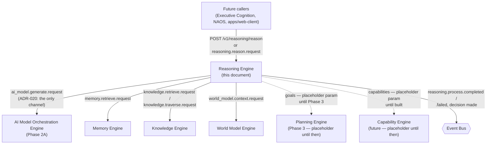
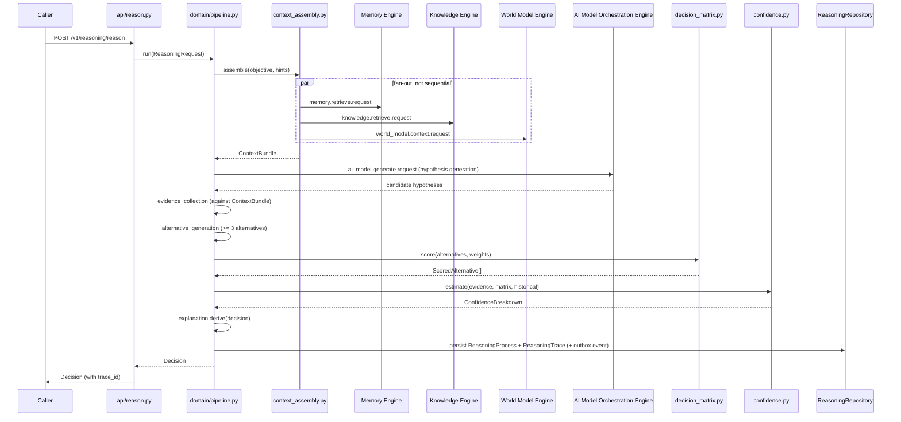
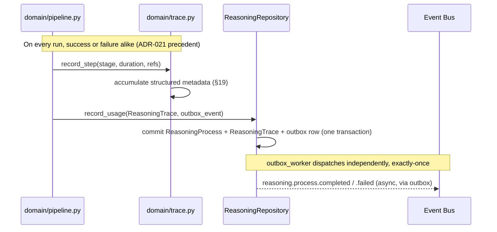
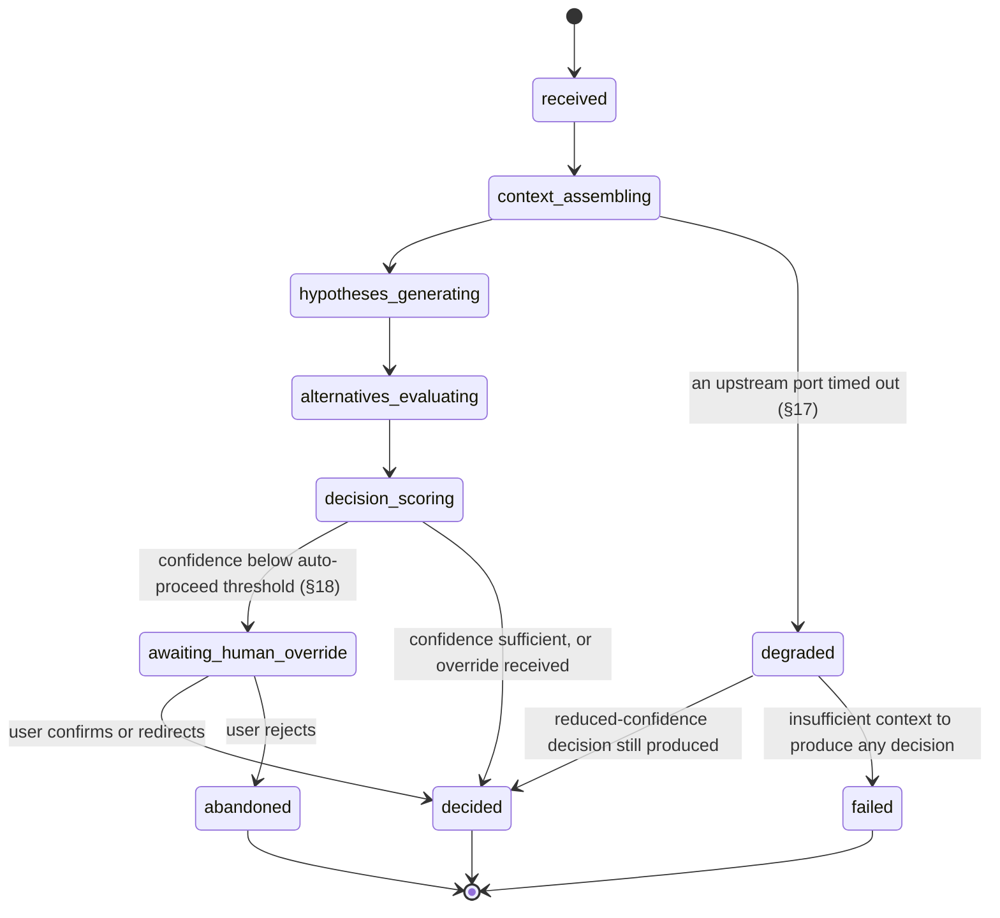

# Phase 2B Technical Design — Reasoning Engine

Implements [Bible Part 8](../../bible/part-08-reasoning-engine.md). Builds on Phase
1's shared foundations (`nova-contracts`, `nova-observability`, `nova-eventbus-sdk`)
and depends on Phase 2A's AI Model Orchestration Engine as its only channel to any
language model (ADR-020) — this engine imports no provider SDK, ever.

**Cross-reference to this document's 25 required dimensions.** The user's directive
opening this phase named twenty-five specific topics the design must cover, at
minimum, plus a reasoning-mode taxonomy and a structured reasoning-trace requirement.
Every one is covered; the table below maps each numbered item to the section that
covers it, so nothing in the directive can be mistaken for having been dropped.

| # | Directive item | Section |
|---|---|---|
| 1 | Overall architecture | §1 |
| 2 | Responsibilities of every component | §2 |
| 3 | Internal data flow | §3 |
| 4 | Cognitive pipeline | §4 |
| 5 | Decision lifecycle | §5 |
| 6 | Reasoning strategies | §6 |
| 7 | Planning interaction | §7.1 |
| 8 | World Model interaction | §7.2 |
| 9 | Memory interaction | §7.3 |
| 10 | Knowledge interaction | §7.4 |
| 11 | Personal Context interaction | §7.5 |
| 12 | Goal evaluation | §8 |
| 13 | Constraint evaluation | §9 |
| 14 | Confidence estimation | §10 |
| 15 | Multi-step reasoning | §11 |
| 16 | Hypothesis generation | §12 |
| 17 | Hypothesis verification | §13 |
| 18 | Alternative solution generation | §14 |
| 19 | Decision scoring | §15 |
| 20 | Decision explanation | §16 |
| 21 | Failure handling | §17 |
| 22 | Human override | §18 |
| 23 | Performance considerations | §21 |
| 24 | Scalability considerations | §22 |
| 25 | Future extension points | §25 |
| — | Reasoning-mode taxonomy (when used / inputs / outputs / engine interaction / cost / confidence / explainability, per mode) | §6 |
| — | Structured reasoning trace | §19 |

Sections not directly requested but required by this project's standing design-doc
template (data model, ports, event flow, APIs, security, testing) appear as §19–§20
and §23–§24, in their usual place relative to the rest.

## 0. The boundary this document defends

Bible Part 8 states this engine's purpose in one line worth repeating before anything
else: *"The Reasoning Engine transforms information into understanding."* Not
information into more information. Not a question into an answer via the shortest
path. Information — already gathered, already retrieved, already known — into a
decision that is correct, useful, explainable, and reliable.

[ADR-026](../../architecture/adr/ADR-026-reasoning-engine-cognitive-bridge-not-isolated.md),
filed at Phase 2A's close specifically to bind this design, states the boundary
precisely: **this engine must never exist in isolation, and it must never become
another storage layer.** Both halves matter equally, and both are easy to get wrong
in opposite directions:

- Built too isolated, it degrades into a thin wrapper around the AI Model
  Orchestration Engine — a prompt-in, answer-out shim with no grounding in what NOVA
  actually knows about its user. This fails Bible Part 1's entire premise and
  [ADR-025](../../architecture/adr/ADR-025-personal-edition-is-the-flagship.md)'s
  Priority 1 (Personal Intelligence) outright.
- Built too absorptive, it becomes "another Memory Engine" or "another Knowledge
  Engine" — exactly the failure ADR-017 already ruled out for World Model Engine in
  Phase 1, recurring one layer up the cognitive stack.

**What this engine explicitly does NOT do**, named per counterpart, mirroring the
AI Model Orchestration Engine's own §0 discipline:

- **Does not remember.** Long-Term Memory is Memory Engine's job. This engine reads
  memories through `MemoryPort` (§7.3); it never persists a memory, never decides
  what's worth remembering, and never runs consolidation or forgetting logic.
- **Does not validate facts.** Knowledge Engine owns corroboration, contradiction
  detection, and the maturity lifecycle. This engine reads validated knowledge
  through `KnowledgePort` (§7.4); it never writes a knowledge node or edge.
- **Does not track current state.** World Model Engine owns Active Context,
  Attention, and object state. This engine reads a snapshot through `WorldModelPort`
  (§7.2); it never updates World Model state itself.
- **Does not structure or sequence work.** Planning Engine (Phase 3) owns objective
  decomposition, Work Breakdown Structures, and task scheduling (Bible Part 9, in
  full — see §7.1). This engine reasons about *one* decision or hypothesis at a time;
  it does not decompose a vague user request into a project plan.
- **Does not maintain continuous background cognition.** The Cognitive State /
  Executive Cognition Engine (Bible Part 6, Phase 2C/6) owns the always-on "what is
  NOVA currently thinking about" loop. This engine executes discrete, invoked
  reasoning processes — it has no idle-time loop of its own, and does not decide what
  NOVA should think about next; it is asked to think about something specific and
  produces a decision.
- **Does not call an LLM/AI provider directly.** Per ADR-020, this engine's only
  channel to any model is the AI Model Orchestration Engine's served RPCs
  (`ai_model.generate.request`, `ai_model.embed.request`). No provider SDK is ever
  imported here.
- **Does not speak to the user.** Per ADR-005, only the Communication Engine renders
  user-facing output. This engine returns a structured `Decision` to its caller.

**The one narrow, explicit exception to "never owns data."** Bible Part 8's own
"REASONING MEMORY" section requires that reasoning sessions be stored — objective,
alternatives, evidence, decision, outcome, lessons learned — so that future reasoning
benefits from past conclusions. ADR-026's Decision §2 already anticipated this
tension and resolved it: *"Its own persistent state, if any, is limited to artifacts
of its own reasoning processes... never a duplicate of another engine's owned data."*
This engine therefore owns a `reasoning` Postgres schema (§20) — but every row in it
describes a reasoning process this engine itself ran, never a copy of a memory, a
knowledge node, or a World Model object. The distinction is: this engine may own the
record of *that it reasoned and what it concluded*; it may never own the record of
*what is true, what happened, or what currently exists* — those remain Memory's,
Knowledge's, and World Model's, respectively, always fetched fresh through a port,
never cached into this engine's own tables.

## 1. Overall architecture

```
services/reasoning-engine/
├── src/
│   └── nova_reasoning_engine/
│       ├── api/
│       │   ├── reason.py            # POST /v1/reasoning/reason(/stream)
│       │   ├── traces.py            # GET /v1/reasoning/traces, /{id}
│       │   ├── decisions.py         # GET /v1/reasoning/decisions/{id}, /{id}/explain
│       │   └── health.py
│       ├── domain/
│       │   ├── ports.py             # MemoryPort, KnowledgePort, WorldModelPort,
│       │   │                        # PersonalContextPort, GoalsPort, CapabilitiesPort,
│       │   │                        # ModelOrchestrationPort, ReasoningRepository,
│       │   │                        # EventPublisher — every Protocol this package needs
│       │   ├── models.py            # ReasoningRequest, ReasoningMode, ReasoningLevel,
│       │   │                        # ContextBundle, Hypothesis, Evidence, Alternative,
│       │   │                        # Decision, ConfidenceBreakdown, ReasoningTrace
│       │   ├── pipeline.py          # the fourteen-step cognitive pipeline (§4)
│       │   ├── context_assembly.py  # fan-out reads: memories/world-model/knowledge (§7)
│       │   ├── hypothesis_generation.py   # §12
│       │   ├── evidence_collection.py     # §13
│       │   ├── alternative_generation.py  # §14
│       │   ├── decision_matrix.py         # §15
│       │   ├── goal_evaluator.py          # §8
│       │   ├── constraint_evaluator.py    # §9
│       │   ├── confidence.py              # §10
│       │   ├── explanation.py             # §16
│       │   ├── failure_recovery.py        # §17
│       │   ├── trace.py                   # builds the structured ReasoningTrace (§19)
│       │   └── modes/               # one module per reasoning mode's strategy (§6)
│       │       ├── reactive.py
│       │       ├── analytical.py
│       │       ├── strategic.py
│       │       ├── long_term_planning.py
│       │       ├── goal_driven.py
│       │       ├── constraint_based.py
│       │       ├── multi_step.py
│       │       ├── reflective.py
│       │       ├── self_evaluation.py
│       │       └── collaborative.py
│       ├── clients/                 # the only directory besides `domain/ports.py`'s
│       │   │                        # Protocol definitions that knows about a specific
│       │   │                        # upstream engine's wire contract
│       │   ├── model_orchestration_client.py  # ai_model.generate/.embed RPC adapter
│       │   ├── memory_client.py               # memory.retrieve.request adapter
│       │   ├── knowledge_client.py            # knowledge.retrieve/.traverse adapters
│       │   ├── world_model_client.py          # world_model.context.request adapter
│       │   └── goals_client.py                # placeholder until Planning Engine exists (§7.1)
│       ├── repository/
│       │   ├── models.py            # SQLAlchemy ORM (§20)
│       │   ├── db.py
│       │   ├── postgres_reasoning_repository.py
│       │   └── outbox_dispatcher.py # no graph — same simpler shape as the AI
│       │                            # Model Orchestration Engine's own (§20)
│       ├── events/
│       │   ├── published.py
│       │   ├── subscribed.py
│       │   └── handlers.py
│       ├── workers/
│       │   └── outbox_worker.py
│       ├── observability.py
│       ├── config.py
│       └── main.py
└── tests/
    ├── unit/       # pure domain logic — pipeline stages, scoring, confidence,
    │                # explanation, every reasoning mode's own decision logic
    ├── integration/ # real FastAPI app against in-memory port fakes
    └── contract/    # this engine's own ports each get a compliance suite, the
                      # same discipline ADR-023 established for ModelConnector
```

**Why `clients/`, not `connectors/`.** The AI Model Orchestration Engine's
`connectors/` directory exists because ADR-020 designates it the sole legal home for
*provider SDK* imports. This engine imports no provider SDK at all — every one of its
six upstream dependencies (five other engines plus AI Model Orchestration itself) is
reached through the Event Bus (ADR-004), never a direct SDK. `clients/` is the
directory that knows the wire shape of each upstream RPC (which subject to call,
which payload class to send, how to unpack the reply) — architecturally the same role
`connectors/` plays for provider SDKs, renamed because the thing being adapted is
different in kind.

**Layering**, identical in shape to every engine built so far: `api/` and
`events/handlers.py` depend on `domain/`; `domain/` depends only on `domain/ports.py`
and other `domain/` modules; `clients/` and `repository/` implement `domain/ports.py`'s
Protocols; `workers/` depends on `domain/` and `repository/`. `domain/` never imports
FastAPI, SQLAlchemy, `nova_eventbus_sdk`, or any client library directly — enforced by
the same import-boundary discipline (grep-verified at every prior Gate Review, will be
again at this phase's own) every engine has held to since Phase 1.

**Where this engine sits in NOVA's topology:**



Every arrow out of Reasoning Engine is a request/reply RPC over the Event Bus
(ADR-004) or, for `ai_model.generate.request`, ADR-020's sole legal channel — never a
direct import, never a raw HTTP call into another engine's internals.

## 2. Responsibilities of every component

- **`domain/pipeline.py`** — orchestrates Bible Part 8's fourteen-step cognitive
  pipeline (§4) end to end: calls context assembly, hypothesis generation, evidence
  collection, alternative generation, decision scoring, confidence estimation, and
  explanation, in sequence, producing one `Decision` plus one `ReasoningTrace`. This
  is the engine's single entry point — every reasoning mode (§6) is a *strategy*
  `pipeline.py` selects and configures, not a separate pipeline.
- **`domain/context_assembly.py`** — the "Load memories / Load World Model /
  Retrieve knowledge" pipeline steps: fans out to `MemoryPort`, `WorldModelPort`,
  `KnowledgePort`, `PersonalContextPort`, and `GoalsPort` in parallel (never
  sequentially — no step here depends on another's result), assembling one
  `ContextBundle`. Mirrors the AI Model Orchestration Engine's Prompt Pipeline
  boundary in spirit but inverted: that engine *receives* an assembled context and
  never sources it; this module is the one place in NOVA whose entire job *is*
  sourcing context, because grounding reasoning in what NOVA already knows is this
  engine's Priority 1 responsibility (ADR-025).
- **`domain/hypothesis_generation.py`** — Part 8's "generate multiple explanations
  before concluding." Unlike almost every structural heuristic elsewhere in NOVA's
  domain layers, this module legitimately calls a model (via `ModelOrchestrationPort`)
  — see §12 for why this is not the circularity the AI Model Orchestration Engine's
  own domain layer avoids.
- **`domain/evidence_collection.py`** — gathers supporting or contradicting evidence
  for each hypothesis from the already-assembled `ContextBundle`, never re-querying
  an upstream engine per hypothesis (§13).
- **`domain/alternative_generation.py`** — Part 8's "produce at least three
  approaches" requirement: current/simpler/scalable, or a task-appropriate
  equivalent triad (§14).
- **`domain/decision_matrix.py`** — Part 8's weighted multi-criteria scoring
  (accuracy, complexity, maintainability, performance, security, scalability,
  effort, flexibility, cost, UX, compatibility, reliability) applied to every
  alternative (§15).
- **`domain/goal_evaluator.py`** — scores an alternative's alignment against Current
  Goals (§8).
- **`domain/constraint_evaluator.py`** — a hard-gate filter (never a soft score) for
  constraints that must never be violated (§9), the same "hard gate, no override"
  discipline as the AI Model Orchestration Engine's privacy-tier filter.
- **`domain/confidence.py`** — Part 8's confidence formula (§10), structural, not
  another model call.
- **`domain/explanation.py`** — derives `Decision.explanation` from the already-
  computed structured fields, never authoring a claim the data doesn't support (§16),
  the identical discipline ADR-021 established for `RoutingDecision.explanation`.
- **`domain/failure_recovery.py`** — Part 8's failure-recovery action set (§17).
- **`domain/trace.py`** — assembles the structured `ReasoningTrace` (§19) from
  everything the pipeline touched, on every run, success or failure alike — the same
  "telemetry on every request, not just successes" discipline ADR-021 established.
- **`domain/modes/*.py`** — one strategy module per reasoning mode (§6), each
  configuring which pipeline steps run, how deep, and with what cost budget; `pipeline.py`
  dispatches to the selected mode's configuration rather than branching internally.
- **`clients/*.py`** — one adapter per upstream RPC, each implementing exactly one
  `domain/ports.py` Protocol, translating this engine's domain types to and from the
  wire payload the upstream engine actually expects.
- **`repository/postgres_reasoning_repository.py`** — persists `ReasoningProcess`,
  `Hypothesis`, `Evidence`, `Alternative`, `Decision`, and `ReasoningTrace` rows
  (§20), with the same transactional-outbox convention every engine uses.

## 3. Internal data flow





## 4. Cognitive pipeline

Bible Part 8 states one pipeline every reasoning process follows, and this design
implements it literally, the same fidelity every prior engine's own Bible-stated
pipeline received:

```
Receive objective -> Understand intent -> Load memories -> Load World Model
    -> Retrieve knowledge -> Generate hypotheses -> Evaluate alternatives
    -> Estimate risks -> Predict outcomes -> Choose strategy -> Validate internally
    -> Execute -> Review results -> Learn
```

| Step | Domain module | Notes |
|---|---|---|
| Receive objective | `api/reason.py` → `pipeline.run()` | Entry point; `ReasoningRequest` is validated (Pydantic) at the boundary |
| Understand intent | `pipeline.py` (intent classification) | Structural: maps the request to a `ReasoningMode` (§6) and `ReasoningLevel` (Part 8's four cost tiers) — a heuristic over task-type and explicit caller hints, never a model call, the same non-circularity discipline the AI Model Orchestration Engine's `estimate_complexity` established |
| Load memories | `context_assembly.py` → `MemoryPort` | §7.3 |
| Load World Model | `context_assembly.py` → `WorldModelPort` | §7.2 |
| Retrieve knowledge | `context_assembly.py` → `KnowledgePort` | §7.4 |
| Generate hypotheses | `hypothesis_generation.py` | §12 — the pipeline's first step that legitimately calls a model |
| Evaluate alternatives | `alternative_generation.py` + `decision_matrix.py` | §14, §15 |
| Estimate risks | `constraint_evaluator.py` (soft-risk scoring) + Part 8's Failure Simulation (§17's mitigation-generation step) | Risk is scored per alternative, not just pass/fail |
| Predict outcomes | folded into `decision_matrix.py`'s scoring inputs | Bible Part 8 does not separately specify a prediction mechanism distinct from the decision matrix's own criteria; a dedicated causal/predictive model is a named future extension point (§25), not invented here |
| Choose strategy | `decision_matrix.py`'s highest composite score | §15 |
| Validate internally | `evidence_collection.py`'s hypothesis-verification pass (§13) applied to the *chosen* alternative one more time before finalizing | Part 8's "self questioning" — see §13 |
| Execute | **reinterpreted, not literal** — see below | |
| Review results | out of this pipeline's scope for a synchronous call — see §17, §25 | |
| Learn | `trace.py` persists the full record; actual learning (adjusting future confidence/weights from outcomes) is a named future extension point (§25) | |

**On "Execute."** Bible Part 8 lists "Execute" as a pipeline step, and Part 8's own
"THE THINKING PRINCIPLE" section resolves what that means for this specific engine:
*"The Multi Agent System provides execution. The Reasoning Engine transforms all of
them into decisions."* Execution — actually taking an action in the world — is
Action Engine's job (Bible Part 12) and NAOS's job (Bible Part 4/12, Phase 3), never
this engine's. This design resolves "Execute" the same way ADR-002 resolved Bible
Part 2's narrative redundancy: this pipeline's "Execute" step means *finalizing and
returning the `Decision`* — the artifact a caller then hands to whatever engine
actually executes it — not literal action-taking. This is stated here explicitly,
matching this project's standing discipline of resolving Bible ambiguity in the open
rather than silently.

**On "Review results" / "Learn."** A synchronous `POST /v1/reasoning/reason` call
cannot review an outcome that hasn't happened yet — the decision hasn't been executed
by whatever engine eventually acts on it. These two steps are real, but they happen
*after* this pipeline returns, driven by a future outcome-reporting mechanism (§17,
§25) rather than inline in the request/response cycle. This is the same honest
scoping precedent as World Model Engine's interface-only World Simulation stub in
Phase 1: the pipeline step is named and its eventual mechanism is designed for, but
not built ahead of a real caller that can report outcomes.

## 5. Decision lifecycle

Distinct from the Cognitive Pipeline (§4, the *processing steps* a request moves
through in one call) is the Decision Lifecycle — the *persisted state* a
`ReasoningProcess` entity moves through, visible via `GET /v1/reasoning/traces/{id}`
independent of whether the originating HTTP call is still open (relevant for
long-running Level 3/4 reasoning, §21):



Every state transition is timestamped on the `reasoning_process` row (§20) and
contributes a step entry to the `ReasoningTrace` (§19) — the lifecycle state machine
and the trace are two views of the same underlying record, not two separate concepts
to keep in sync by hand.

## 6. Reasoning strategies (reasoning modes)

Bible Part 8 names two overlapping but distinct dimensions: **Levels of Reasoning**
(1 through 4, a cost/depth dial — instant, analytical, strategic, deep) and
**Thinking Modes** (Analytical, Creative, Scientific, Engineering, Educational,
Strategic, Investigative, Optimization, Teaching — task-domain flavors). The user's
directive establishes a third, more structural taxonomy this design adopts as the
canonical set the domain layer actually implements: **Reasoning Modes**, each a
distinct *strategy* — a specific configuration of which pipeline steps run, how many
times, and against which inputs. This is the same kind of resolution ADR-002 already
made for Part 2's narrative redundancy, applied here explicitly rather than left
implicit:

- **Reasoning Level** (Part 8) becomes this engine's **cost/depth budget** —
  every mode below can run at any of the four levels; the level controls how many
  alternatives are generated, how many evidence sources are queried, and whether
  multi-step reasoning (§11) engages.
- **Thinking Mode** (Part 8) becomes an optional **domain-flavor hint** a caller may
  pass (e.g. `"creative"`, `"scientific"`) that biases hypothesis generation's model
  prompt (§12) without changing which Reasoning Mode strategy runs.
- **Reasoning Mode** (this section) is the actual dispatch key `pipeline.py` selects
  on, each implemented as its own `domain/modes/*.py` module.

| Mode | When used | Required inputs | Expected outputs | Engine interaction | Computational cost | Confidence estimation | Explainability |
|---|---|---|---|---|---|---|---|
| **Reactive** | Level 1 requests: simple factual questions, basic calculations, low-stakes lookups (Part 8's own Level 1 examples) | Objective text only; no context assembly needed for most requests | A direct answer, no alternatives generated, `alternatives_considered: []` | None required beyond, at most, one `KnowledgePort` or `WorldModelPort` lookup | Very low — sub-second target (§21) | High by default unless the lookup itself fails; no evidence-weighting formula needed for a single deterministic fact | Trivial: "answered directly from `<source>`," no decision matrix to explain |
| **Analytical** | Level 2: programming, research, writing, document analysis, simple debugging | Objective + relevant memory/knowledge/world-model context | A reasoned answer with at least one alternative considered when the task has a genuine choice point | Memory, Knowledge, World Model (parallel fan-out, §7); AI Model Orchestration for the analysis itself | Low-to-moderate | Full formula (§10), all seven factors weighted normally | Full decision explanation (§16) when alternatives existed; a direct-answer explanation otherwise |
| **Strategic** | Level 3: architecture, system design, business planning, long-term technical decisions | Full context bundle; explicit Current Goals (§8) required, not optional | A decision plus a ranked list of rejected alternatives with reasons (Part 8's Decision Matrix, §15, in full) | All six upstream ports engaged; multiple `ai_model.generate.request` calls (hypothesis generation, evidence weighing) | Moderate-to-high; several-seconds target (§21) | Full formula, with Goal Evaluation (§8) weighted more heavily than in Analytical mode | Full explanation required; strategic decisions are exactly the class Part 8 says must be explainable on demand |
| **Long-term planning** | Multi-day or multi-phase objectives that need reasoning about sequencing and future state, *without* performing the actual decomposition (that boundary belongs to Planning Engine, §7.1) | Objective + Current Goals + a caller-supplied time horizon | A reasoned recommendation for *how* to approach the horizon (which strategy, which risks to plan around) — never a Work Breakdown Structure itself | World Model (current trajectory), Goals, AI Model Orchestration for outcome prediction framing | High; this is Level 4 territory, correctness prioritized over speed (Part 8 explicit) | Lower default confidence — long horizons carry more predicted uncertainty (§10) by construction | Full explanation, with uncertainty called out explicitly (§10's `predicted_uncertainty` factor surfaced in the explanation text) |
| **Goal-driven** | Any request where Current Goals materially change which alternative wins — the mode that makes Goal Evaluation (§8) the dominant scoring factor rather than one input among several | Objective + Current Goals (required, not optional — this mode has no meaningful behavior without them) | A decision whose explanation foregrounds goal alignment specifically | Goals (§7.1) is the primary port; others as needed for the underlying analysis | Same as the underlying Analytical/Strategic mode it wraps | Confidence includes a distinct `goal_alignment_confidence` sub-score (§10) | Explanation must state which goal(s) drove the outcome |
| **Constraint-based** | Any request with hard limits that must never be violated (budget, privacy tier, time, resource availability) — the mode that makes Constraint Evaluation (§9) a hard gate before scoring even begins | Objective + an explicit constraint set (caller-supplied, or derived from Personal Context, §7.5) | A decision only from the constraint-satisfying subset of alternatives, or an explicit "no feasible alternative" result — never a constraint-violating decision, no override | Constraint sources vary (AI Model Orchestration's budget concept for cost constraints, World Model for resource/time constraints) | Same as underlying mode, plus the up-front filtering cost | Confidence is capped, not just weighted, when the constraint-satisfying pool is small (§9) | Explanation must name every constraint that ruled out a rejected alternative |
| **Multi-step** | Level 3/4 requests whose first pipeline pass produces a decision that itself depends on an unresolved sub-question | Objective, plus recursion depth budget | A decision built from a chain of dependent sub-decisions, each individually traced (§11, §19) | Same ports as the underlying mode, invoked once per step | Highest — cost scales with chain length, bounded by a max-depth safeguard (§11) | Aggregate confidence is the *minimum* across the chain, never an average (a weak link should not be hidden by strong ones elsewhere) | Full chain is explainable step by step, not just the final decision |
| **Reflective** | Invoked on a *past* `ReasoningProcess` (via its trace ID), not a fresh objective — re-evaluates a prior decision against new evidence or a reported outcome | A `reasoning_process_id` reference + new evidence/outcome | An updated confidence score and, if warranted, a superseding `Decision` referencing the original | `ReasoningRepository` (read the original trace) + whichever ports the new evidence requires | Low-to-moderate; bounded by the original decision's own complexity | Confidence is explicitly comparative: "revised from X to Y because..." | Explanation must reference the original decision and state what changed |
| **Self-evaluation** | Runs Part 8's "Self Questioning" as a first-class step rather than an implicit consideration — used when a caller explicitly requests a critique of a prior or draft decision, or when confidence from another mode lands in the "verify" band (§10) | A `Decision` (draft or already-recorded) | A structured critique: gaps found, assumptions surfaced, confidence adjustment | Whatever ports the critique needs to check gaps against (commonly Memory/Knowledge, "did I retrieve everything relevant") | Low — a bounded, focused pass, not a full re-run of the original pipeline | Produces a `self_evaluation_confidence` distinct from the original decision's confidence | Every gap and assumption found is individually listed in the trace and explanation |
| **Collaborative** | Reserved for multi-agent scenarios (Bible Part 4, NAOS, Phase 3+) where more than one reasoning process must agree before a decision is finalized — **not implemented in Phase 2B**; this mode is designed for and named now, so its eventual arrival is a configuration change, not a redesign (§25) | Multiple `ReasoningProcess` inputs from different agents/contexts | A merged decision with per-participant agreement/disagreement recorded | NAOS (future), plus whatever ports each participating process already used | Highest of any mode — genuinely proportional to participant count | Confidence must reflect inter-agent agreement as its own factor, not just each participant's own confidence | Explanation must state where agents agreed, where they diverged, and how divergence was resolved |

**Level ↔ Mode interaction, worked example.** A Level 2 "simple debugging" request
defaults to Analytical mode. If the same objective is later flagged with an explicit
budget constraint, Constraint-based mode wraps the same underlying Analytical
analysis with a hard pre-filter. If the debugging investigation reveals the bug
depends on an unresolved architectural question, the pipeline escalates to Multi-step
mode at Level 3 for that one sub-question, then returns to finish the original
Level 2 analysis — mode and level are independent dials, not one fixed pairing.

## 7. Interaction with other engines

Every port below is a `Protocol` in `domain/ports.py`, satisfied by exactly one
adapter in `clients/`, following the identical Dependency-Inversion shape every prior
engine's `domain/ports.py` already established.

### 7.1 Planning interaction

**The boundary.** Planning Engine (Bible Part 9, Phase 3) owns objective
decomposition (Objective → Mission → Project → Milestone → Epic → Feature → Task →
Subtask → Action → Execution Step → Verification → Completion) and Work Breakdown
Structures. Reasoning Engine never performs this decomposition — it reasons about
*one* decision at a time, however that decision was scoped. The relationship is
bidirectional and non-overlapping:

- **Planning → Reasoning**: when Planning Engine needs a judgment call at a
  decomposition node ("which of these two approaches to this Task is better"), it
  calls Reasoning Engine's `reasoning.reason.request` RPC (§23) with that one
  decision as the objective — Planning never expects Reasoning to decompose anything
  further.
- **Reasoning → Planning**: Reasoning Engine's `GoalsPort` (used by Goal-driven mode,
  §8) reads "Current Goals" from Planning Engine once it exists.

**Phase 2B reality.** Planning Engine does not exist yet. `GoalsPort` is defined now
(so Goal Evaluation, §8, is real and testable) but `clients/goals_client.py` is an
honest placeholder: goals are accepted as an explicit, caller-supplied parameter on
`ReasoningRequest` rather than fetched from a real Planning Engine RPC. This mirrors
ADR-026's own Future Implications exactly: *"When Planning Engine... exists, Reasoning
Engine's Current Goals... input moves from a placeholder... to a real RPC-backed
port, without changing Reasoning Engine's own boundary."*

```python
class GoalsPort(Protocol):
    async def current_goals(self, *, user_id: UUID, scope: str | None = None) -> list[Goal]: ...
```

### 7.2 World Model interaction

Reads a snapshot of current reality — user's active project, device, task, situational
context — through the exact RPC every other engine already calls:

```python
class WorldModelPort(Protocol):
    async def get_context(self, *, user_id: UUID, scope: str | None = None) -> WorldModelSnapshot | None: ...
```

Implemented by `clients/world_model_client.py`, calling `world_model.context.request`
(the same subject/payload World Model Engine has served since Phase 1). A `None`
result (World Model degraded, per its own `degraded: bool` reply field) is not an
error — the pipeline proceeds with reduced confidence (§10) rather than failing, the
same graceful-degradation precedent World Model's own callers already established in
Phase 1.

### 7.3 Memory interaction

Reads Long-Term Memory relevant to the objective — this is the "Load memories" pipeline
step (§4), and Priority 2 of ADR-025's development order, reflected directly in this
engine's design:

```python
class MemoryPort(Protocol):
    async def retrieve(
        self, *, user_id: UUID, query: str, limit: int = 10
    ) -> list[MemoryReference]: ...
```

Implemented by `clients/memory_client.py`, calling `memory.retrieve.request`.
`MemoryReference` carries the memory's own ID (never its full content duplicated
into this engine's trace beyond a summary) — the reasoning trace (§19) records *which*
memories were retrieved, not a copy of them, keeping this engine's "never owns data"
boundary intact even in its own telemetry.

### 7.4 Knowledge interaction

Reads validated facts and relationships relevant to the objective — the "Retrieve
knowledge" pipeline step:

```python
class KnowledgePort(Protocol):
    async def retrieve(self, *, query: str, limit: int = 10) -> list[KnowledgeReference]: ...
    async def traverse(self, *, seed_node_id: str, depth: int = 2) -> list[KnowledgeReference]: ...
```

Implemented by `clients/knowledge_client.py`, calling `knowledge.retrieve.request` and
`knowledge.traverse.request`. Used both during context assembly (§4) and during
evidence collection (§13), when a specific hypothesis needs corroboration from the
knowledge graph rather than a broad initial retrieval.

### 7.5 Personal Context interaction

**Honest scope note.** Bible Part 16 (Digital Twin Engine) is the eventual owner of a
dedicated, continuously-learned model of the user's habits, preferences, and
decision-making patterns — a future phase, not yet built. "Personal Context" as this
document uses it, in Phase 2B, is sourced from **World Model's Active Context**
(§7.2) — the closest thing that currently exists to "what NOVA currently understands
about the user's situation" — not a separate, dedicated concept yet:

```python
class PersonalContextPort(Protocol):
    async def get_personal_context(self, *, user_id: UUID) -> PersonalContext | None: ...
```

`clients/personal_context_client.py`'s Phase 2B implementation is a thin wrapper
around `WorldModelPort.get_context`, projecting `WorldModelSnapshot`'s existing
fields (objective, project, task, device) into a `PersonalContext` shape. This is
named as its own port now — rather than folding it entirely into `WorldModelPort` —
specifically so that when Digital Twin Engine exists, only this one adapter changes
(§25), the same "future extension point, not a redesign" precedent ADR-020
established for future model providers.

## 8. Goal evaluation

`domain/goal_evaluator.py` scores each alternative (§14) against the `Goal[]` list
`GoalsPort` returns (§7.1). A `Goal` carries a `priority: float` (caller/Planning-
assigned) and a `description` used as an embedding-similarity or keyword-overlap
target against the alternative's own description — a structural, non-model scoring
step (consistent with every other *scoring* mechanism in this design being
structural; only *generation* steps call a model, see §12's discipline). Goal
alignment produces one input to the Decision Matrix (§15): a `goal_alignment_score`
per alternative, weighted by each goal's own `priority`, so a high-priority goal can
outweigh several lower-priority ones without requiring the caller to hand-tune matrix
weights per request.

When no goals are supplied (the common case until Planning Engine exists, §7.1),
`goal_alignment_score` is omitted from the matrix rather than defaulted to a neutral
value that would silently pretend goal-alignment was considered when it wasn't — the
same "absence is visible, not silently defaulted" discipline every prior engine's
honest-gap sections have followed.

## 9. Constraint evaluation

`domain/constraint_evaluator.py` is a **hard gate applied before scoring**, never a
soft factor blended into the Decision Matrix — the same "no override, no blending"
discipline the AI Model Orchestration Engine's privacy-tier filter established in
Phase 2A, deliberately reused here rather than reinvented:

```python
class Constraint(BaseModel):
    kind: Literal["budget", "privacy", "time", "resource", "policy"]
    description: str
    hard: bool = True   # a soft constraint instead contributes a scoring penalty, never a filter
```

Every `Alternative` (§14) is checked against every hard `Constraint` before it is
allowed into the Decision Matrix (§15) at all. An alternative that fails any hard
constraint is recorded in the trace (§19) as `rejected_constraint_violation`, with the
specific constraint named — never silently dropped, so a caller can see *why* an
option didn't win, not just that it didn't. If every alternative fails, the pipeline
produces no decision and instead returns a `FailureRecovery` result (§17) naming
"no feasible alternative" as the cause — never a decision that quietly violates a
hard constraint because nothing else was available.

Constraint sources in Phase 2B: caller-supplied (explicit `Constraint[]` on
`ReasoningRequest`), plus the AI Model Orchestration Engine's existing budget concept
(§9's `"budget"` kind maps to that engine's `Budget`/`spend_this_period`, itself
still not wired into routing per that engine's own Known Limitations — this
constraint type is defined now, wired for real once that dependency is closed).

## 10. Confidence estimation

Bible Part 8 names seven factors explicitly; this design implements all seven as a
structural weighted formula, the same non-circular discipline the AI Model
Orchestration Engine's `estimate_complexity` established — **confidence is never
estimated by asking a model how confident it is**, because a model's self-reported
confidence is exactly the kind of unverified, potentially-hallucinated signal Part
8's own "UNCERTAINTY MANAGEMENT" section warns against ("the system should never
invent facts to complete reasoning").

```python
class ConfidenceBreakdown(BaseModel):
    evidence_quality: float       # weighted avg of Evidence.weight (§13)
    evidence_quantity: float      # min(1.0, len(evidence) / expected_evidence_count)
    historical_success: float | None   # from ReasoningRepository, this objective-class's past outcomes (§25 until outcome-reporting exists)
    model_agreement: float | None      # when multiple hypotheses converge on the same alternative (§12)
    memory_consistency: float          # fraction of retrieved memories that don't conflict
    knowledge_quality: float           # derived from Knowledge Engine's own maturity-stage field (Phase 1, ADR-015) on retrieved nodes
    reasoning_completeness: float      # fraction of applicable pipeline steps actually completed (1.0 unless degraded, §17)
    predicted_uncertainty: float       # inverse of decision-matrix score spread between the top two alternatives — a close call is definitionally less certain than a landslide
    composite: float                   # weighted sum, the number Decision.confidence_score reports
```

`historical_success` and `model_agreement` are `None`, not `0.0`, when no signal
exists yet (a brand-new objective class, or a single-hypothesis run) — the same
"absence is visible, never silently defaulted" discipline as §8's goal alignment,
applied to the weighted-sum formula: `None` factors are excluded from the weighted
average entirely, not treated as a zero score that would unfairly penalize novel
reasoning.

**Confidence gates execution**, per Part 8's own stated bands: high confidence
proceeds automatically; medium confidence triggers Self-evaluation mode (§6) as an
automatic verification pass before finalizing; low confidence triggers Human Override
(§18) rather than proceeding. The exact thresholds are a `Settings` value
(`confidence_verify_threshold`, `confidence_override_threshold`), not hardcoded, so
they can be tuned per deployment without a design change.

## 11. Multi-step reasoning

Some objectives cannot be resolved in a single pipeline pass — Part 8's Level 3/4
examples (architecture decisions, multi-day projects) routinely depend on an
unresolved sub-question the pipeline discovers mid-analysis, not before it starts.
Multi-step mode (§6) handles this as **recursion with a hard depth cap**, never an
unbounded loop:

```python
class MultiStepConfig(BaseModel):
    max_depth: int = 3        # Settings-configurable; a depth-4 recursion is a design smell, not a normal case
    parent_process_id: UUID | None = None
```

Each recursive step is its own `ReasoningProcess` row (§20), linked to its parent via
`parent_process_id`, with its own trace (§19) — a multi-step reasoning session is
therefore a small DAG of `ReasoningProcess` rows, not one row with an internal loop
hidden inside it, so any individual step remains independently inspectable via
`GET /v1/reasoning/traces/{id}` exactly like a single-step process would be. The
parent's own `Decision` is only finalized once every child step has resolved; if a
child step itself fails (§17), the parent inherits `degraded` status rather than
silently substituting a guess for the unresolved sub-question.

Aggregate confidence for a multi-step chain is the **minimum** confidence across every
step in the chain, never an average — Part 8's "never invent facts to complete
reasoning" principle, applied to composite confidence: a chain is only as trustworthy
as its weakest link, and averaging would let one high-confidence step mask a
low-confidence one elsewhere in the same decision.

## 12. Hypothesis generation

Bible Part 8: *"Before concluding, NOVA generates multiple explanations... each
hypothesis is investigated independently."*

**Why this step legitimately calls a model, unlike almost every other domain-layer
decision in NOVA.** The AI Model Orchestration Engine's design established a strict
rule: never use a model to make a *meta-decision* about routing, because that would
be circular (classifying a request's complexity by calling a model defeats the point
of routing *to* a model). Hypothesis generation is different in kind, not merely
exempted from that rule: generating candidate explanations or approaches *is the
actual cognitive task* Bible Part 8 assigns this engine — it is not a meta-decision
about how to reason, it is the reasoning itself. Calling a model here is therefore the
correct application of ADR-020 ("every AI model interaction passes through the
orchestration layer"), not a violation of the non-circularity principle that governs
a different, structural class of decision elsewhere in this same design (§8, §9, §10,
§15, §16 are all deliberately non-model structural scoring, by contrast).

```python
class HypothesisGenerationRequest(BaseModel):
    objective: str
    context: ContextBundle           # already assembled, §7 — this module never re-fetches
    minimum_hypotheses: int = 3      # Part 8 gives no fixed number; 3 mirrors §14's
                                      # "at least three approaches" requirement for consistency
    thinking_mode_hint: str | None = None   # Part 8's Creative/Scientific/Engineering/... flavor (§6)
```

Calls `ModelOrchestrationPort.generate` (a thin Protocol wrapping
`ai_model.generate.request`, ADR-020) with the assembled `ContextBundle` formatted as
`ContextComponent`s exactly the way the AI Model Orchestration Engine's own Prompt
Pipeline expects — this engine is a caller of that boundary, never a violator of it
(§0). Each returned hypothesis becomes its own `Hypothesis` row (§20), independently
carried into Evidence Collection (§13).

## 13. Hypothesis verification

Bible Part 8: *"Every hypothesis requires evidence... no important decision should
rely on unsupported assumptions."*

`domain/evidence_collection.py` checks each `Hypothesis` (§12) against the already-
assembled `ContextBundle` (§7) — memories, knowledge, world-model facts, and any
user-supplied input — never issuing a fresh upstream RPC per hypothesis (that would
turn a bounded, parallel context-assembly fan-out into an unbounded per-hypothesis
one, a real scalability risk §22 exists partly to name and avoid). Each piece of
supporting or contradicting evidence becomes an `Evidence` row (§20) linked to its
`Hypothesis`, carrying a structural `weight: float` derived from its source's own
reliability signal (Knowledge Engine's maturity stage for knowledge evidence, Memory
Engine's `confidence` field for memory evidence, World Model's own confidence field
for world-model evidence — never a fabricated weight this engine invents).

A hypothesis with no supporting evidence at all is not silently dropped — it is
marked `status="unsupported"` and excluded from Alternative Generation (§14), with
the reason recorded in the trace (§19), the same "absence is visible" discipline
applied one level deeper than §8/§9's.

## 14. Alternative solution generation

Bible Part 8: *"For every important problem, produce at least three approaches...
current solution, simpler solution, scalable solution... never become attached to
the first idea."*

`domain/alternative_generation.py` converts every `Hypothesis` with `status !=
"unsupported"` (§13) into a concrete `Alternative` — a candidate decision, not just an
explanation. When fewer than three supported hypotheses survive evidence collection,
this module requests additional hypotheses from §12 (up to a bounded retry count, not
an unbounded loop) before proceeding with fewer than three, which is recorded in the
trace as a named, visible condition (`alternatives_below_minimum: true`), never
silently accepted as if the minimum had been met.

```python
class Alternative(BaseModel):
    id: UUID
    hypothesis_id: UUID
    description: str
    supporting_evidence_ids: list[UUID]
    constraint_status: Literal["eligible", "rejected_constraint_violation"]  # §9
    matrix_scores: DecisionMatrixScores | None = None   # populated by §15
```

## 15. Decision scoring

Bible Part 8's Decision Matrix, implemented as a fixed, weighted, multi-criteria
formula — structural, like every other *scoring* mechanism in this design (§8, §9,
§10, §16), never a model call:

```python
class DecisionMatrixScores(BaseModel):
    accuracy: float
    complexity: float          # lower is better; stored as an inverted score
    maintainability: float
    performance: float
    security: float
    scalability: float
    development_effort: float  # lower is better; inverted
    future_flexibility: float
    cost: float                 # lower is better; inverted
    user_experience: float
    compatibility: float
    reliability: float
    goal_alignment: float | None   # §8, when goals were supplied
    composite: float                # the weighted sum
```

Default weights are a `Settings` value, tunable per deployment (a Level 3 strategic
decision may weight `future_flexibility` and `maintainability` higher by default than
a Level 2 debugging task would) — never hardcoded into the scoring function itself,
the same configuration-over-hardcoding discipline `router.py`'s scoring weights
established in the AI Model Orchestration Engine. Ties break on `alternative.id`
ascending — the identical stable-tiebreak discipline ADR-021 established for model
routing, reused here because the underlying requirement (reproducible, explainable
selection among equally-scored candidates) is the same requirement one layer up the
cognitive stack.

## 16. Decision explanation

`domain/explanation.py` derives `Decision.explanation` from the already-computed
`DecisionMatrixScores`, `ConfidenceBreakdown`, and the full `Alternative[]` list —
**never authored independently**, the identical discipline ADR-021 established for
`RoutingDecision.explanation` in the AI Model Orchestration Engine, reused verbatim
because it is the same underlying requirement: an explanation that can never claim
something the structured data doesn't support.

Bible Part 8's explicit requirement — *"Why this solution was chosen. Why
alternatives were rejected. What evidence was strongest. What uncertainty
remains"* — maps directly onto four required explanation sections, each populated
mechanically from data already computed earlier in the pipeline, never re-derived by
a separate model call:

```python
class DecisionExplanation(BaseModel):
    chosen_reason: str        # from the winning Alternative's DecisionMatrixScores
    rejected_reasons: dict[UUID, str]   # one per rejected Alternative — constraint violation (§9), lower matrix score, or unsupported hypothesis (§13)
    strongest_evidence: list[UUID]      # top-weighted Evidence rows (§13) behind the winning Alternative
    remaining_uncertainty: str          # derived from ConfidenceBreakdown's lowest-scoring factor (§10)
```

Available on demand via `GET /v1/reasoning/decisions/{id}/explain` (§23) — Part 8's
"the explanation should be available on demand" requirement, satisfied as a real
endpoint, not a claim.

## 17. Failure handling

Bible Part 8's explicit action set — restart reasoning, reduce complexity, request
clarification, delegate to another agent, retrieve additional knowledge, escalate to
deeper reasoning — implemented as `domain/failure_recovery.py`'s response to any
pipeline-stage failure (an upstream port timeout, a hypothesis-generation call that
returns nothing usable, a fully constraint-rejected alternative pool):

```python
class FailureRecovery(BaseModel):
    stage: str                     # which pipeline step failed
    action: Literal[
        "restart", "reduce_complexity", "request_clarification",
        "delegate", "retrieve_more_knowledge", "escalate_deeper",
    ]
    reason: str
    retry_count: int
```

Mirrors the AI Model Orchestration Engine's `FallbackExhaustedError`/fallback-chain
shape structurally (a bounded retry walk, every attempt recorded, never silent), but
the *action set* is reasoning-specific per Part 8, not a model-substitution fallback —
"delegate to another agent" is a named future extension point (§25, depends on NAOS,
Phase 3), honestly scoped as unavailable rather than stubbed with fake behavior in
Phase 2B. **Every failure still produces a `ReasoningTrace`** (§19) — Part 8: "failure
should improve future reasoning rather than terminate execution" — a failed
`ReasoningProcess` is not a process with no record, the same "telemetry on every
request, success or failure" discipline ADR-021 established.

## 18. Human override

Bible Part 8's confidence bands (§10) directly gate this mechanism: **low confidence
requests human input rather than proceeding**, and per
[ADR-025](../../architecture/adr/ADR-025-personal-edition-is-the-flagship.md), the
user is always the final authority regardless of confidence level — override is
available on any decision, not only low-confidence ones.

```python
class HumanOverrideRequest(BaseModel):
    reasoning_process_id: UUID
    action: Literal["confirm", "redirect", "reject"]
    redirect_alternative_id: UUID | None = None   # required when action == "redirect"
    note: str | None = None
```

`POST /v1/reasoning/decisions/{id}/override` (§23) applies the action against the
lifecycle state machine (§5): `confirm` moves `awaiting_human_override → decided`
unchanged; `redirect` re-scores with the user-selected alternative forced to the top
(recorded in the trace as `human_redirected: true`, never presented as if the matrix
had chosen it); `reject` moves to `abandoned`, ending the process without a `Decision`.
Every override is itself an event
(`reasoning.human_override.applied`, §23) and a trace entry (§19) — this engine
treats a human correction exactly the way it treats any other input worth learning
from (Part 8's "CONTINUOUS REASONING": *"Should confidence be adjusted?"*), a direct
future input to `historical_success` (§10, §25) once outcome-reporting exists.

## 19. The reasoning trace

**This is not chain-of-thought exposure.** Bible Part 8's own "REASONING
VISUALIZATION" and "EXPLAINABILITY" sections, plus the user's explicit directive, both
point at the same requirement: structured metadata *about* the reasoning process, not
a transcript *of* it. `domain/trace.py` builds exactly one `ReasoningTrace` per
`ReasoningProcess` (or per step, for multi-step chains, §11), assembled
incrementally as the pipeline runs — the same "telemetry is a first-class output, not
an afterthought" discipline ADR-021 established, applied to a fundamentally different
kind of telemetry (explaining a decision, not a model routing choice) with the
identical rigor.

```python
class ReasoningTrace(BaseModel):
    id: UUID
    reasoning_process_id: UUID
    correlation_id: UUID
    reasoning_mode: ReasoningMode              # §6
    reasoning_level: int                        # Part 8's Levels 1-4
    retrieved_memory_ids: list[UUID]             # §7.3 — IDs only, never content
    knowledge_ids: list[str]                     # §7.4 — IDs only, never content
    world_model_entities: list[str]              # §7.2 — entity/object IDs referenced
    goals_considered: list[UUID]                 # §8
    constraints_considered: list[Constraint]      # §9 — full constraint objects, since
                                                   # they're small and structurally part of the record
    selected_capabilities: list[str]              # §25 — placeholder field until Capability Engine exists
    confidence_score: float                       # §10's composite
    confidence_breakdown: ConfidenceBreakdown      # §10, in full
    execution_duration_ms: float
    model_used: str                                # the model ID AI Model Orchestration Engine selected (§12)
    alternatives_evaluated: list[UUID]             # §14/§15
    alternatives_rejected: dict[UUID, str]         # §16's rejected_reasons, mirrored here for the trace's own completeness
    final_decision_explanation: str                # §16's chosen_reason
    steps: list["ReasoningTrace"] = Field(default_factory=list)   # §11 — populated only for multi-step processes
    outcome: Literal["decided", "degraded", "failed", "abandoned"]   # §5's terminal states
    created_at: datetime
    schema_version: int = 1   # ADR-024 — every public interface versioned from day one
```

This is the exact field list the user's directive named, plus `id`/
`reasoning_process_id`/`correlation_id`/`created_at`/`schema_version` — the same
minimal, structurally-necessary additions every other engine's telemetry record
carries beyond its own domain-specific fields (compare `UsageRecord`, Phase 2A).
`GET /v1/reasoning/traces/{id}` (§23) returns this object directly — the debugging,
explainability, and performance-optimization surface the user's directive named is
this endpoint, not a separate tool.

## 20. Data model — `reasoning` Postgres schema

Per §0's one narrow exception to "never owns data": this schema stores records of
this engine's own reasoning processes, never a duplicate of another engine's owned
data.

```sql
CREATE TABLE reasoning.reasoning_process (
    id UUID PRIMARY KEY DEFAULT gen_random_uuid(),
    correlation_id UUID NOT NULL,
    requesting_engine TEXT NOT NULL,
    user_id UUID NOT NULL,
    parent_process_id UUID REFERENCES reasoning.reasoning_process(id),  -- §11
    objective_text TEXT NOT NULL,
    reasoning_mode TEXT NOT NULL,        -- §6
    reasoning_level INTEGER NOT NULL,    -- Part 8's Levels 1-4
    status TEXT NOT NULL DEFAULT 'received',  -- §5's lifecycle states
    schema_version INTEGER NOT NULL DEFAULT 1,
    created_at TIMESTAMPTZ NOT NULL DEFAULT now(),
    completed_at TIMESTAMPTZ
);

CREATE TABLE reasoning.hypothesis (
    id UUID PRIMARY KEY DEFAULT gen_random_uuid(),
    reasoning_process_id UUID NOT NULL REFERENCES reasoning.reasoning_process(id),
    description TEXT NOT NULL,
    status TEXT NOT NULL DEFAULT 'investigating',  -- investigating | supported | unsupported (§13)
    created_at TIMESTAMPTZ NOT NULL DEFAULT now()
);

CREATE TABLE reasoning.evidence (
    id UUID PRIMARY KEY DEFAULT gen_random_uuid(),
    hypothesis_id UUID NOT NULL REFERENCES reasoning.hypothesis(id),
    source TEXT NOT NULL,          -- memory | knowledge | world_model | user_input (§13)
    source_ref TEXT NOT NULL,      -- the upstream engine's own ID — never duplicated content
    weight DOUBLE PRECISION NOT NULL,
    created_at TIMESTAMPTZ NOT NULL DEFAULT now()
);

CREATE TABLE reasoning.alternative (
    id UUID PRIMARY KEY DEFAULT gen_random_uuid(),
    reasoning_process_id UUID NOT NULL REFERENCES reasoning.reasoning_process(id),
    hypothesis_id UUID NOT NULL REFERENCES reasoning.hypothesis(id),
    description TEXT NOT NULL,
    constraint_status TEXT NOT NULL,     -- §9
    matrix_scores JSONB,                  -- §15's DecisionMatrixScores
    created_at TIMESTAMPTZ NOT NULL DEFAULT now()
);

CREATE TABLE reasoning.decision (
    id UUID PRIMARY KEY DEFAULT gen_random_uuid(),
    reasoning_process_id UUID NOT NULL REFERENCES reasoning.reasoning_process(id),
    selected_alternative_id UUID REFERENCES reasoning.alternative(id),  -- null if abandoned/failed
    explanation JSONB NOT NULL,           -- §16's DecisionExplanation
    confidence_score DOUBLE PRECISION NOT NULL,
    human_override JSONB,                  -- §18, when applied
    schema_version INTEGER NOT NULL DEFAULT 1,
    created_at TIMESTAMPTZ NOT NULL DEFAULT now()
);

CREATE TABLE reasoning.reasoning_trace (
    id UUID PRIMARY KEY DEFAULT gen_random_uuid(),
    reasoning_process_id UUID NOT NULL REFERENCES reasoning.reasoning_process(id),
    trace_payload JSONB NOT NULL,          -- §19's ReasoningTrace, in full
    schema_version INTEGER NOT NULL DEFAULT 1,
    created_at TIMESTAMPTZ NOT NULL DEFAULT now()
);
CREATE INDEX reasoning_trace_process_idx ON reasoning.reasoning_trace (reasoning_process_id);

CREATE TABLE reasoning.outbox_event (
    id UUID PRIMARY KEY DEFAULT gen_random_uuid(),
    subject TEXT NOT NULL,
    payload JSONB NOT NULL,
    correlation_id UUID NOT NULL,
    causation_id UUID,
    created_at TIMESTAMPTZ NOT NULL DEFAULT now(),
    dispatched_at TIMESTAMPTZ
);
CREATE INDEX outbox_undispatched_idx ON reasoning.outbox_event (created_at) WHERE dispatched_at IS NULL;
```

No `graph_write`/`graph_applied_at` columns — this engine owns no graph, the identical
outbox shape the AI Model Orchestration Engine's own schema already established for
the same reason. `reasoning_process_process_idx` (parent_process_id) and
`reasoning_process_correlation_idx` (correlation_id) round out the index set,
mirroring every prior engine's traceability convention.

## 21. Performance considerations

Bible Part 8's explicit targets map directly onto Reasoning Level (§6):

| Level | Target | Mode examples |
|---|---|---|
| 1 (Instant) | Under one second | Reactive |
| 2 (Analytical) | Several seconds | Analytical, most Goal-driven/Constraint-based requests |
| 3 (Strategic) | Correctness prioritized over speed; visible progress required | Strategic, Long-term planning |
| 4 (Deep) | Correctness prioritized over speed; visible progress required | Multi-step chains, Collaborative (future) |

**"Visible progress for longer reasoning sessions"** (Part 8, explicit) is satisfied
by `POST /v1/reasoning/reason/stream` (§23), an SSE endpoint emitting one event per
pipeline stage transition (`context_assembling`, `hypotheses_generating`, ...,
matching §5's lifecycle states) — the same streaming mechanism precedent the AI Model
Orchestration Engine's `POST /v1/models/generate/stream` already established, reused
here for pipeline-stage progress rather than token-by-token generation.

Context assembly's parallel fan-out (§7, three-to-five concurrent RPCs rather than
sequential) is this design's primary latency lever for Level 2/3 requests, the same
"don't serialize what doesn't depend on itself" discipline Part 2's own "Internal Task
Graph" section states generally, applied here specifically to the one pipeline stage
where it's unambiguously safe (no context-assembly source depends on another's
result).

## 22. Scalability considerations

- **Concurrent reasoning processes** are independent by construction — no shared
  mutable state between them (§0's statelessness-adjacent discipline, though this
  engine, unlike AI Model Orchestration, does own persistent state for its own
  processes, §20). Horizontal scaling is therefore a matter of running more API
  process replicas, not a coordination problem.
- **Collaborative mode's fan-out** (§6) is the one mode whose cost scales with
  participant count rather than staying roughly constant — explicitly deferred to
  Phase 3+ (§25) precisely because its real scale target depends on NAOS's own agent-
  concurrency numbers (Part 4's "10,000 micro-agents," ADR-008), which don't exist to
  design against yet. Designing Collaborative mode's real fan-out limits before NAOS
  exists would be exactly the speculative-generality this project's standing
  instructions rule out.
- **Multi-step recursion's depth cap** (§11) is this design's primary safeguard
  against unbounded resource consumption from a single request — a `max_depth`
  `Settings` value, not an unbounded loop, the same bounded-retry discipline as every
  fallback mechanism elsewhere in NOVA.
- **The `reasoning` schema's own growth** is unbounded by design (Part 8: "reasoning
  should never disappear") — unlike Memory Engine's lifecycle-managed tiers, no
  forgetting mechanism is specified or implied for reasoning traces. This is named
  explicitly as a future capacity-planning concern (§25), not silently assumed
  unbounded storage is free.

## 23. Security considerations

- **No authentication on any endpoint**, consistent with every Phase 1/2A engine —
  `nova-auth` remains deferred to Phase 7 (SAD 13), restated here rather than
  silently assumed resolved by this phase.
- **`user_id` is caller-supplied, not independently verified** at this engine's own
  boundary (the same trust-the-caller model every Phase 1/2A engine's internal API
  already uses) — every upstream port call (§7) passes it through unchanged, so a
  compromised caller could request reasoning "as" another user. Acceptable at
  Phase 2B's scope (no auth exists anywhere yet to make this a new gap), named
  explicitly rather than left implicit.
- **The reasoning trace never includes full memory/knowledge content**, only IDs
  (§19) — this is a security property as much as a boundary one: a trace leak exposes
  *what NOVA considered*, never the underlying sensitive content itself, which
  remains gated by whatever access control Memory/Knowledge Engine eventually
  implement.
- **Privacy classification flows through, never re-decided.** A reasoning process
  whose context includes `HIGHLY_SENSITIVE` memories (Memory Engine's own
  `PrivacyLevel`, Phase 1) must ensure any `ai_model.generate.request` call this
  engine makes (§12) carries the correct `privacy_hint` — this engine does not
  re-classify privacy itself (that remains the AI Model Orchestration Engine's job,
  ADR-020's privacy-tier gate), it is responsible only for propagating the highest
  privacy tier among its assembled context components, never silently defaulting to
  a lower one.

## 24. Testing strategy

- **`tests/unit/`** — every domain module in isolation: pipeline-stage dispatch,
  confidence formula (§10) against known factor combinations, decision-matrix scoring
  (§15) reproducibility (same inputs, same output — the identical determinism
  standard ADR-021 established for routing, applied here to decision scoring),
  explanation derivation (§16) never claiming an unsupported reason, constraint
  hard-gating (§9) never leaking a violating alternative through, multi-step depth
  capping (§11).
- **`tests/contract/`** — one compliance suite per port Protocol (`MemoryPort`,
  `KnowledgePort`, `WorldModelPort`, `GoalsPort`, `PersonalContextPort`,
  `ModelOrchestrationPort`), the same discipline ADR-023 established for
  `ModelConnector`, applied to this engine's own six upstream dependencies — a fake
  implementation and a mock-transport-backed real-client implementation of each port
  must both pass the identical test functions.
- **`tests/integration/`** — the real FastAPI app, `create_app()`-injected with
  in-memory fakes for every port and repository, exercising the full pipeline (§4)
  end to end per reasoning mode (§6), the lifecycle state machine (§5), human
  override (§18), and failure recovery (§17) — the same fakes-substitution pattern
  every Phase 1/2A engine's own integration suite already uses.
- **No live-model dependency anywhere in the test suite** — `ModelOrchestrationPort`
  fakes return deterministic, configurable hypothesis sets, the same
  `FakeConnector`-shaped determinism precedent Phase 2A established for its own
  provider connectors.

## 25. Future extension points

- **Planning Engine's real integration** (§7.1): `clients/goals_client.py` becomes a
  real `Planning.goals.request` RPC adapter the moment Phase 3 ships Planning Engine
  — no change to `GoalsPort`'s own shape or to `goal_evaluator.py`.
- **Personal Context's dedicated concept** (§7.5): `clients/personal_context_client.py`
  is replaced with a real Digital Twin Engine adapter (Bible Part 16) once that phase
  ships — `PersonalContextPort`'s shape absorbs richer fields (habits, decision-making
  patterns, working hours) without changing any caller.
- **Capability Engine integration** (§19's `selected_capabilities` placeholder field):
  becomes a real `CapabilitiesPort` once Bible Part 15 ships, informing Constraint
  Evaluation (§9) with "is this alternative even actionable given what NOVA can
  currently do" as a new hard-gate dimension.
- **Collaborative reasoning's real fan-out** (§6, §22): depends on NAOS existing
  (Phase 3+) to define real participant-discovery and agreement-resolution mechanics
  — the mode is named and its trace/explanation shape designed for now, specifically
  so its eventual implementation is additive, not a redesign.
- **Outcome-reporting and real `historical_success`** (§10, §17, §18): a decision's
  actual real-world outcome currently has no mechanism to be reported back to this
  engine (§4's "Review results"/"Learn" honest gap) — a future
  `reasoning.outcome.reported` subscribed subject is the natural mechanism, feeding
  both `ConfidenceBreakdown.historical_success` and Reflective mode's own re-evaluation
  input, once a real caller exists that can report what actually happened.
- **A dedicated causal/predictive model for "Predict outcomes"** (§4): currently
  folded into the Decision Matrix's existing criteria rather than a standalone
  mechanism — Bible Part 8 names causal reasoning as a distinct principle but doesn't
  specify a concrete predictive mechanism beyond the matrix's own scoring, so none is
  invented here ahead of a real need.
- **Reasoning trace retention/archival policy** (§22): unbounded growth is accepted
  for Phase 2B per Part 8's "reasoning should never disappear," but a future
  capacity-planning pass (mirroring Memory Engine's own lifecycle-tier precedent) is
  a named, not-yet-designed future concern.
