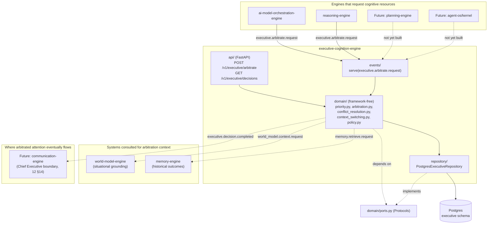
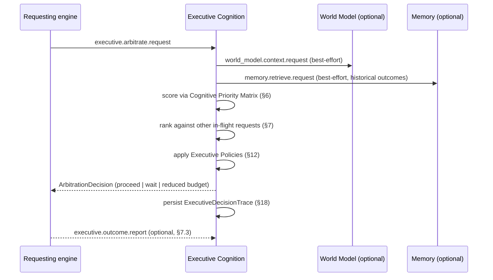

# Phase 2C Technical Design — Executive Cognition Engine

Implements [Bible Part 19](../../bible/part-19-executive-cognition-engine.md), the
highest-level cognitive system in NOVA's architecture, cross-referencing Part 6
(Cognitive State Engine — a *separate* future service this document draws an explicit
boundary against, §0.4), Part 2 (AI Core & Cognitive Architecture, ADR-002's four
concrete services), and [`06 §5`](../../architecture/06-ai-layer-architecture.md#5-executive-cognition-engine--coordination-layer)'s
existing coordination-layer summary, which this document supersedes with full detail
the same way Phase 2B's design doc superseded `06 §2`'s Reasoning Engine summary.

**Cross-reference to this document's required dimensions.** The user's directive
opening this phase named twenty-one specific topics the design must cover, at
minimum, plus explicit interaction requirements with twelve named systems (four
already built, four Phase 2C inputs, four future engines), an explicit boundary
requirement, and a structured execution-metadata requirement. Every one is covered;
the table below maps each to the section that covers it.

| # | Directive item | Section |
|---|---|---|
| 1 | Overall architecture | §1 |
| 2 | Core responsibilities | §2 |
| 3 | Internal execution flow | §3 |
| 4 | Cognitive coordination model | §4 |
| 5 | Decision arbitration | §7 |
| 6 | Priority management | §6 |
| 7 | Goal management | §8 |
| 8 | Task orchestration | §9 |
| 9 | Conflict detection and resolution | §10 |
| 10 | Context switching | §11 |
| 11 | Executive policies | §12 |
| 12 | Human override model | §13 |
| 13 | Failure handling | §14 |
| 14 | Recovery mechanisms | §15 |
| 15 | Explainability | §16 |
| 16 | Observability | §17 |
| 17 | Performance considerations | §20 |
| 18 | Scalability considerations | §21 |
| 19 | Security considerations | §22 |
| 20 | Testing strategy | §23 |
| 21 | Extension points | §24 |
| — | Interaction: AI Model Orchestration Engine | §5.1 |
| — | Interaction: Reasoning Engine | §5.2 |
| — | Interaction: Memory Engine | §5.3 |
| — | Interaction: Knowledge Engine | §5.4 |
| — | Interaction: World Model Engine | §5.5 |
| — | Interaction: Personal Context | §5.6 |
| — | Interaction: Current Goals | §5.7 |
| — | Interaction: Available Capabilities | §5.8 |
| — | Interaction: Future Planning Engine | §5.9 |
| — | Interaction: Future Action Engine | §5.10 |
| — | Interaction: Future Cognitive State Engine | §5.11 |
| — | Interaction: Future Conversation Manager | §5.12 |
| — | Explicit architectural boundaries ("must not become another X") | §0 |
| — | Structured execution metadata (the Executive Decision Trace) | §18 |

Sections not directly requested but required by this project's standing design-doc
template (data model, ports, event flow) appear as §19, in its usual place relative
to the rest.

**Amendment, approved before implementation began.** On approving this document,
the user established two further permanent principles, each now filed as its own
ADR and incorporated below rather than left as unincorporated prose:
[ADR-028](../../architecture/adr/ADR-028-executive-cognition-defers-to-specialized-engine-authority.md)
(this engine is policy-driven, not intelligence-driven — it must always assume
specialized engines know their own domain better than it does, sharpening §0 and
§10) and
[ADR-029](../../architecture/adr/ADR-029-executive-cognition-optimizes-long-term-user-objectives.md)
(arbitration optimizes for the user's long-term objectives, not only the current
request, extending §6, §7, and §8). Both are binding on every section below exactly
as ADR-027 already is.

## 0. The boundary this document defends

Bible Part 19 states this engine's purpose in one line worth repeating before
anything else: *"Its responsibility is coordinating intelligence."* Not producing
it. The user's own words, given ahead of this design work, state the same boundary
twice, from two directions: *"Its purpose is not to think. Its purpose is to
coordinate thinking. Its purpose is not to store knowledge. Its purpose is to
coordinate knowledge. Its purpose is not to execute actions. Its purpose is to
coordinate actions."*

[ADR-027](../../architecture/adr/ADR-027-executive-cognition-coordinates-never-owns-intelligence.md),
filed at Phase 2B's close specifically to bind this design, states the boundary
precisely: **this engine decides which cognitive subsystem should act, when, in what
order, and under what constraints — it never performs the cognitive work of any
subsystem it coordinates, and it owns no system of record for any of them.** Both
halves matter equally, and both are easy to get wrong in opposite directions:

- Built too thin, it degrades into a bare priority queue with no real domain model —
  technically satisfying the Phase 2C acceptance criterion (arbitrate two contending
  requests correctly) while giving Phase 6 nothing to extend, forcing a redesign
  later. This fails the 10x Test the same way an under-designed World Model or
  Reasoning Engine would have.
- Built too absorptive, it re-derives conclusions other engines already produced, or
  accumulates a private copy of state another engine owns — becoming "another
  Reasoning Engine," "another Memory Engine," "another Knowledge Engine," or "another
  Planning Engine" one layer up the cognitive stack, exactly the four failure modes
  the user named explicitly.

**What this engine explicitly does NOT do**, named per counterpart, mirroring the
Reasoning Engine design doc's §0 discipline exactly:

- **Does not reason.** Generating hypotheses, weighing evidence, and producing a
  decision's *content* is Reasoning Engine's job (Bible Part 8, ADR-026). This engine
  may decide *whether and when* a reasoning process gets to run and with what
  resource budget; it never evaluates the reasoning itself, and it never produces a
  competing conclusion of its own. If Executive Cognition finds itself re-deriving
  "which alternative is better," that is a boundary violation, not a feature.
- **Does not remember.** Long-Term Memory is Memory Engine's job (Bible Part 3). This
  engine never stores an experience, never runs consolidation, and never queries
  Memory for anything beyond what a specific arbitration decision needs cited as
  evidence (§5.3) — it does not maintain its own memory of past interactions.
- **Does not validate facts.** Knowledge Engine owns corroboration, contradiction
  detection, and the maturity lifecycle (Bible Part 10). This engine never writes a
  knowledge node or edge, and never decides whether a fact is true.
- **Does not track current state.** World Model Engine owns Active Context, Attention,
  and object state (Bible Part 5/18). This engine reads a snapshot when an
  arbitration decision needs situational grounding (§5.5); it never updates World
  Model state itself.
- **Does not decompose objectives or manage a Work Breakdown Structure.** Planning
  Engine (Phase 3, Bible Part 9) owns objective decomposition — Mission → Long Term
  Goals → Projects → Milestones → Tasks → Subtasks → Immediate Actions. This engine
  reads whatever goals currently exist (§5.7, §8) and decides which one's associated
  work receives cognitive attention right now; it never decides what the goals
  *are* or how a goal decomposes into tasks.
- **Does not execute, dispatch, or supervise agents.** Action Engine and the NOVA
  Agent Operating System (Phase 3, Bible Part 12) own task execution, agent
  scheduling, and supervision. This engine's Cognitive Priority Matrix is one *input*
  the future Kernel Scheduler consults (`12 §7`, already specified); this engine
  never spawns, supervises, or directly instructs an agent instance.
- **Does not maintain a continuous internal-awareness feed.** Cognitive State Engine
  (Bible Part 6, Phase 4 — a *separate* future service, not this one) owns the
  always-on "what is NOVA currently aware of/thinking about" descriptive record. This
  engine consumes that feed once it exists (§5.11); it does not build or duplicate
  one itself. §0.4 below states this distinction in full, since the two Bible parts'
  prose overlaps enough that a casual reader could conflate them.
- **Does not call an LLM/AI provider directly.** Per ADR-020, this engine has no
  channel to any model at all — unlike Reasoning Engine, arbitration is a structural
  scoring formula (§6), never a generation task, so this engine has no occasion to
  call the AI Model Orchestration Engine for content generation, only to observe its
  resource requests (§5.1).
- **Does not speak to the user directly.** Per ADR-005, only Communication Engine
  renders user-facing output. This engine decides *whether* something reaches
  Communication Engine at all (per `12 §14`'s already-established Chief Executive
  boundary, §5.12) — it never renders a message itself.

### 0.1 The one narrow, explicit exception to "never owns data"

Mirroring ADR-026's identical exception for Reasoning Engine: Bible Part 19's own
"COGNITIVE TIMELINE" section requires that executive decisions be recorded —
priority changes, strategy changes, delegation decisions, policy overrides, recovery
events — so that decisions remain explainable and future arbitration can learn from
past outcomes. This engine therefore owns an `executive` Postgres schema (§19) — but
every row in it describes a decision this engine itself made about *coordination*,
never a copy of another engine's owned conclusion, fact, memory, or state. The
distinction is identical in shape to Reasoning Engine's own: this engine may own the
record of *that it arbitrated and what it decided*; it may never own the record of
*what is true, what happened, what was concluded, or what currently exists* —
those remain Memory's, Knowledge's, Reasoning's, and World Model's respectively,
always observed fresh through a port, never cached into this engine's own tables.

### 0.2 Why this engine calls no model and stores almost nothing

Every scoring mechanism in this engine — the Cognitive Priority Matrix (§6),
arbitration (§7), conflict resolution (§10), context-switch cost evaluation (§11)
— is a fixed, structural formula over already-supplied inputs, never a model call.
This is not a simplification made for Phase 2C's minimal scope; it is the correct
permanent shape of this engine, for the same reason Confidence Estimation and the
Decision Matrix are structural in Reasoning Engine (§10, §15 of that design): asking
a model "which of these two requests is more important" would be circular
(the model has no more insight into NOVA's own priorities than the structural signals
already available) and unexplainable in the way Part 19's own "EXPLAINABILITY"
section requires. An executive layer whose arbitration logic itself depended on an
opaque model call could never satisfy "why was this prioritized?" on demand.

### 0.3 Why Phase 2C's real scope is two engines, and why that is not a placeholder

Per the roadmap and ADR-027 Decision §3, Phase 2C ships a minimal but *real* slice:
arbitrating between the AI Model Orchestration Engine and the Reasoning Engine — the
only two AI-layer engines that exist today. This is not "build a toy and rewrite it
later." Every mechanism specified in this document (the Cognitive Priority Matrix,
the arbitration algorithm, conflict resolution, policies, the Executive Decision
Trace) is built at full, general strength against an arbitrary number of contending
engines; Phase 2C simply has only two real engines to exercise it against, and Phase
6 adds more contenders to the same mechanism rather than building a new one. Every
section below that describes an interaction with a not-yet-built system (§5.7-§5.12)
follows the identical honest-placeholder discipline ADR-026 established for
Reasoning Engine's `GoalsPort`: named, ported, and either caller-supplied or
self-contained until the real system exists to back it.

### 0.4 Executive Cognition Engine vs. Cognitive State Engine — resolving the overlap by definition

Bible Part 6 (Cognitive State Engine, Phase 4) and Bible Part 19 (Executive Cognition
Engine, this document) describe closely related, textually overlapping concerns —
both discuss attention, priority, and active goals, and this project's own earlier
prose (the Reasoning Engine design doc's own boundary section) has referred to them
with the informal shorthand "Cognitive State Engine / Executive Cognition." ADR-027
resolves this by definition rather than by merging the two into one service, per the
canonical service table (`00-overview-and-decisions.md`) and the roadmap's own
distinct phase assignments:

| | Cognitive State Engine (Part 6, Phase 4 — not this document) | Executive Cognition Engine (Part 19, this document) |
|---|---|---|
| Central question | "What is NOVA currently aware of, thinking about, and attending to?" | "Given everything currently competing for attention, what should happen next, in what order, under what constraints?" |
| Nature | Descriptive — a continuously-updated record of internal state | Decisional — an active arbitration over competing demands |
| Analogous to | World Model Engine, but for NOVA's *internal* world instead of the external one | A scheduler/arbiter that *consumes* state, never a record of state itself |
| Owns | Active Thoughts, Focus System, Attention Layers, the Reflection Engine (Redis-primary, per Part 6) | Executive Decision Trace, arbitration outcomes, policy configuration (§19) |
| Exists today? | No — Phase 4 deliverable | Being designed now — Phase 2C |

Until Cognitive State Engine exists, this engine has no rich external "current
attention" feed to consume, and necessarily observes only the requests made directly
to it by the engines it coordinates (§5.1, §5.2) — the same honest,
caller-supplied-until-the-real-port-exists pattern ADR-026 established for
`GoalsPort`. Once Cognitive State Engine ships (§5.11), this engine consumes its
state as a read-only input signal to arbitration; it never duplicates Cognitive
State Engine's own Active-Thoughts/Attention-Layers store.

### 0.5 Policy-driven, not intelligence-driven — and optimized for the user's long-term success

Two further permanent principles, established by the user on approving this
document, filed as
[ADR-028](../../architecture/adr/ADR-028-executive-cognition-defers-to-specialized-engine-authority.md)
and
[ADR-029](../../architecture/adr/ADR-029-executive-cognition-optimizes-long-term-user-objectives.md)
respectively, bind every mechanism specified below exactly as ADR-027 already does:

- **Epistemic deference (ADR-028).** This engine must always assume specialized
  engines know their own domain better than it does. It should not attempt to
  outperform Reasoning Engine, should not reinterpret Knowledge Engine's facts, and
  should not invent conclusions of its own. Conflict resolution (§10) may only weigh
  signals a specialized engine has already published — never Executive Cognition's
  own independent judgment of which side is substantively correct — and defers
  (`ESCALATED`, §7, §13) rather than guessing when those signals are inconclusive.
  This is a hard, non-overridable structural invariant, deliberately distinct from
  the four soft, user-configurable Executive Policies (§12): it governs *what this
  engine is*, not a preference about how it operates.
- **Long-term optimization (ADR-029).** Arbitration should prefer, among multiple
  otherwise-valid options, the one that best serves the user's long-term goals,
  established preferences, and current priorities — not only whichever request looks
  best in isolation. This is the first place
  [ADR-025](../../architecture/adr/ADR-025-personal-edition-is-the-flagship.md)'s
  Priority 1 (Personal Intelligence) becomes a concrete scoring mechanism inside an
  engine's own arbitration logic (§6, §7, §8) rather than a standing intention. The
  Personal Edition always optimizes for its primary user's long-term success; a
  future enterprise edition may make the weighting configurable, but never at the
  Personal Edition's expense (ADR-025's own binding constraint, restated here for
  this specific mechanism).

## 1. Overall architecture



`domain/` never imports FastAPI, SQLAlchemy, `nova_eventbus_sdk`, or (per ADR-020) any
LLM/AI provider SDK — everything it needs is a `Protocol` in `domain/ports.py`,
satisfied by exactly one adapter in `clients/` or `repository/`, the identical
Dependency-Inversion shape every engine built so far already uses.

**The one structural difference from every prior engine's architecture**: this
engine is *served*, not *calling*, as its primary mode. Reasoning Engine's own
architecture is caller-heavy (six upstream ports it actively queries per reasoning
process); this engine is callee-heavy (other engines call *into* it to request
arbitration) with only two narrow, optional outbound calls of its own (World Model
for situational grounding, Memory for historical-outcome lookups, both read-only and
both degrade to an empty/`None` result on timeout per every prior engine's own
graceful-degradation precedent). This asymmetry is the direct, structural
consequence of ADR-027 Decision §1: an engine whose job is deciding *who else* gets
to act has, definitionally, little of its own work to delegate outward.

## 2. Core responsibilities

Per Bible Part 19's "PRIMARY RESPONSIBILITIES" list, reconciled against this
document's Phase 2C/Phase 6 split (ADR-027 §3):

| Responsibility | Phase 2C (this document, buildable now) | Phase 6 (named, deferred — §24) |
|---|---|---|
| Attention allocation | Real: scores and ranks contending requests from the two AI-layer engines (§6, §7) | Extended to every engine, using a real Cognitive State Engine feed (§5.11) |
| Priority | Real: full seven-factor Cognitive Priority Matrix (§6) | Unchanged mechanism; more request sources |
| Goal hierarchy | Read-only: consumes caller-supplied goals exactly as Reasoning Engine's `GoalsPort` does (§5.7, §8) | Reads a real Planning Engine goal hierarchy (§5.9) |
| Decision conflicts | Real: structural conflict-resolution procedure (§10) | Same procedure; more request sources, richer evidence |
| Resource allocation | Advisory: ranks and recommends, does not yet gate a real capacity pool (§7, §20) | Enforced: gates NAOS Kernel Scheduler dispatch and AI Model Orchestration Engine capacity directly (Cognitive Load Management, §24) |
| Long term strategy | Out of scope this phase — no Planning Engine exists to hold a strategy against | Real, once Planning Engine exists |
| Interruptions | Out of scope this phase — no Communication Engine exists to interrupt | Real, gates what reaches the user (§5.12, `12 §14`) |
| Agent coordination | Out of scope this phase — no NAOS exists | Real, once Action Engine/NAOS exist (§5.10) |
| Learning priorities | Partial: historical-outcome lookups inform arbitration (§7, §5.3) | Full meta-reasoning loop (§24) |
| Execution supervision | Out of scope this phase — nothing to supervise yet | Real, once agents exist to supervise |

No other subsystem performs the responsibilities in the left column while this
engine exists — per Bible Part 19's own words, restated as an architectural
invariant this document enforces structurally (§0), not just narratively.

## 3. Internal execution flow — the Executive Cycle

Bible Part 19 names one continuous cycle: *Observe Current State → Evaluate
Objectives → Determine Priorities → Allocate Cognitive Resources → Coordinate
Specialized Systems → Monitor Progress → Adapt Strategy → Evaluate Results → Learn →
Repeat.* Unlike Reasoning Engine's Cognitive Pipeline (Bible Part 8, §4 of that
design — a *linear*, request-triggered sequence that runs once per reasoning
process and terminates), Part 19's cycle is explicitly described as continuous and
never-stopping. Phase 2C implements this honestly as a **per-request arbitration
pipeline**, not yet a genuinely continuous background loop — the always-on
"repeat forever" shape depends on Cognitive Load Management and a real multi-engine
request stream (Phase 6, §24) to have any real, non-trivial work to do between
requests. Reconciled below: each column is one step of Part 19's own named cycle,
mapped to what actually executes in Phase 2C.

| Part 19 step | Phase 2C implementation | Section |
|---|---|---|
| Observe Current State | Receive an `ExecutiveRequest` via `executive.arbitrate.request`; optionally fetch World Model context and Memory historical outcomes | §5.5, §5.3 |
| Evaluate Objectives | Resolve the request's associated goal, if any (caller-supplied, §5.7) | §8 |
| Determine Priorities | Score the request via the Cognitive Priority Matrix | §6 |
| Allocate Cognitive Resources | Rank against any other currently-contending requests; produce an advisory allocation | §7 |
| Coordinate Specialized Systems | Return the arbitration decision to the requesting engine — this engine never itself invokes the winner | §4 |
| Monitor Progress | Out of scope this phase (no progress-reporting channel exists from Reasoning Engine or AI Model Orchestration Engine back to this engine yet) | §24 |
| Adapt Strategy | Out of scope this phase (no strategy concept exists without Planning Engine) | §24 |
| Evaluate Results | Partial: an optional outcome-report RPC (§7.3) lets a caller report back what happened, feeding future historical-outcome lookups | §7 |
| Learn | Partial: historical outcomes inform future arbitration scoring (§7); no model retraining or weight-adjustment happens | §7, §24 |
| Repeat | Each new `executive.arbitrate.request` re-enters this same pipeline; there is no idle-time loop yet (§0.4 — that is Cognitive State Engine's future job, once it exists to feed one) | §0.4 |



## 4. Cognitive coordination model

Part 19's own closing image is the load-bearing one: *"The Executive Cognition
Engine is the conductor of the orchestra. Every subsystem is an expert. No subsystem
sees the complete picture. Only the Executive Engine maintains global awareness."*
Concretely, this engine's coordination model has three properties, each a direct
consequence of ADR-027:

1. **Advisory, not commanding, at every layer this phase can reach.** This engine
   never invokes another engine's endpoint to make it do something. It returns a
   decision to whichever engine asked; that engine remains responsible for acting on
   it. (Phase 6's Cognitive Load Management, §24, is where "advisory" starts becoming
   "enforced" for resource-constrained cases — still never a direct invocation of the
   coordinated engine's own domain logic, only a gate on *whether* it proceeds.)
2. **Symmetric across contenders.** Every `ExecutiveRequest` — regardless of which
   engine sent it — is scored through the identical Cognitive Priority Matrix
   formula (§6) and the identical arbitration algorithm (§7). This engine has no
   engine-specific favoritism logic; an AI Model Orchestration Engine request and a
   Reasoning Engine request compete on the same seven factors, never on which engine
   they came from.
3. **No subsystem overrides another directly** (Part 19's own words, under "CONFLICT
   RESOLUTION"). When two engines' outputs genuinely conflict on the merits (not
   merely on resource contention), this engine's role is procedural — apply
   evidence, confidence, policy, and historical outcomes (§10) — never substituting
   its own judgment for either engine's domain conclusion.

**What "coordination" concretely returns.** Every arbitration produces one of four
outcomes, never a silent default:

```python
class ArbitrationOutcome(str, Enum):
    PROCEED = "proceed"                # highest-priority contender; go ahead now
    PROCEED_REDUCED = "proceed_reduced"  # go ahead, but at a reduced resource budget
    WAIT = "wait"                      # a higher-priority contender is in flight; retry after `retry_after_ms`
    ESCALATED = "escalated"            # policy or conflict resolution requires human input (§13)
```

`WAIT` never means "silently dropped" — Part 19's "failures become opportunities for
improvement" discipline applies equally to contention: a waiting request is recorded
in the Executive Decision Trace (§18) and the requester is told exactly why (§16).

## 5. Interaction with other engines

Every port below is a `Protocol` in `domain/ports.py`, satisfied by exactly one
adapter in `clients/`, following the identical Dependency-Inversion shape every
engine built so far already establishes. Four are real, buildable RPC clients today;
four are read-only inputs this engine consumes without owning; four are named,
ported, but honestly unbacked until their own engine exists (ADR-027 §3).

### 5.1 AI Model Orchestration Engine

**The boundary.** This engine never calls the AI Model Orchestration Engine's
`ai_model.generate.request`/`.embed.request` RPCs — it has no content to generate
(§0.2). The relationship is the reverse of every other engine's relationship to AI
Model Orchestration Engine: **AI Model Orchestration Engine (or, on its behalf, a
future admission-control wrapper) calls *into* this engine**, submitting an
`ExecutiveRequest` describing an incoming generation request's priority
characteristics before committing GPU/inference capacity to it.

```python
class ExecutiveRequest(BaseModel):
    requesting_engine: str            # "ai-model-orchestration-engine" | "reasoning-engine" | ...
    request_kind: str                 # e.g. "model_generate", "reasoning_process"
    correlation_id: UUID
    urgency: float                    # 0.0-1.0, caller-supplied
    importance: float                 # 0.0-1.0, caller-supplied
    complexity: float                 # 0.0-1.0, caller-supplied (estimated cost of the work)
    risk: float                       # 0.0-1.0, caller-supplied
    learning_value: float             # 0.0-1.0, caller-supplied
    resource_cost: float              # 0.0-1.0, caller-supplied (relative, not an absolute unit)
    user_impact: float                # 0.0-1.0, caller-supplied
    deadline: datetime | None = None
    goal_id: UUID | None = None       # §8
```

Phase 2C's real, testable scenario (the roadmap's own acceptance criterion): two
simulated `ExecutiveRequest`s, one from each engine, submitted concurrently,
resolved by the Cognitive Priority Matrix rather than arrival order.

### 5.2 Reasoning Engine

**The boundary.** This engine never calls Reasoning Engine's `reasoning.reason.request`
RPC — it produces no reasoning content of its own (§0). Reasoning Engine calls
*into* this engine the same way AI Model Orchestration Engine does (§5.1), submitting
an `ExecutiveRequest` before starting an expensive, high-`Level` reasoning process
(Strategic/Multi-step, per that engine's own §6) that would otherwise compete for the
same cognitive-resource budget as a concurrent AI Model Orchestration Engine request.
Reasoning Engine's own `reasoning_level`/`reasoning_mode` map directly onto this
request's `complexity`/`resource_cost` fields — a Level 4 Multi-step request declares
higher `complexity` and `resource_cost` than a Level 1 Reactive one, giving this
engine real signal to arbitrate on without needing to understand reasoning-mode
semantics itself.

### 5.3 Memory Engine

**The boundary.** This engine never writes a memory (§0). It reads Long-Term Memory
for exactly one narrow purpose: **historical-outcome lookups** to inform arbitration
(§7) — "the last three times a request like this one won priority, what happened?"
— through the same `MemoryPort.retrieve` RPC shape Reasoning Engine already
established:

```python
class MemoryPort(Protocol):
    async def retrieve(self, *, query: str, limit: int = 5,
                        correlation_id: UUID | None = None) -> list[MemoryReference]: ...
```

A timeout or empty result degrades this input to "no historical signal available,"
never blocking or failing the arbitration itself — the same graceful-degradation
precedent every read-only cross-engine call in this project follows.

### 5.4 Knowledge Engine

**The boundary.** This engine never writes a knowledge node or validates a fact
(§0). Phase 2C has **no real use for Knowledge Engine** — arbitration operates on
caller-supplied priority factors and Memory's historical outcomes, neither of which
needs a validated-fact lookup. `KnowledgePort` is *not* defined this phase (unlike
Reasoning Engine, which needed all six of its upstream ports from day one per
ADR-026). This is a deliberate, honest scope difference, not an oversight: Bible
Part 19 names no responsibility that requires consulting validated facts, and
inventing a use for this port would be exactly the speculative-integration risk this
project's standing instructions rule out. If a real Phase 6 use emerges (e.g.,
conflict resolution citing a validated fact as evidence, §10), it is added then,
against a real requirement.

### 5.5 World Model Engine

**The boundary.** This engine never updates World Model state (§0). It reads a
snapshot, through the same `WorldModelPort.get_context` RPC shape every engine
already uses, for situational grounding during arbitration — e.g., "is the user
actively watching this task, or is it background work" (Part 19's own "ATTENTION
CONTROL" examples: "Critical deployment," "Meeting in progress," "User speaking"
directly map onto World Model's Active Context). A `None` result (World Model
degraded or unreachable) is not an error — arbitration proceeds without situational
grounding, the same `degraded: bool` precedent every caller of World Model already
follows.

### 5.6 Personal Context

**The boundary.** Personal Context has no dedicated engine yet, the same situation
Reasoning Engine faced (that engine's `PersonalContextPort` projects
`WorldModelPort`'s own snapshot rather than a separate call, §7.5 of that design).
This engine reuses the identical `PersonalContext` domain type and the identical
projection pattern — not a new mechanism, a direct reuse of an already-proven one.
Used narrowly: user-impact scoring (§6) benefits from knowing whether the user is
actively engaged with the relevant project/task right now.

### 5.7 Current Goals

**The boundary.** Per ADR-026 §7.1's already-established pattern (Planning Engine
does not exist yet), goals are accepted as an explicit, caller-supplied field on
`ExecutiveRequest` (`goal_id`, §5.1) rather than fetched from a real Planning Engine
RPC. This engine does not itself decompose, validate, or store goals — it reads
whatever a caller declares and uses it only to group/prioritize contending requests
that share a goal (§8). The identical `GoalsPort` shape Reasoning Engine already
defined is reused here, with one additive, backward-compatible extension to the
shared `nova_contracts.Goal` type per ADR-029 (§8): a `goal_tier:
Literal["ad_hoc", "established"] = "ad_hoc"` field, defaulted so Reasoning Engine's
own existing use of `Goal` needs no change and continues to ignore it:

```python
class GoalsPort(Protocol):
    async def current_goals(self, *, user_id: UUID, scope: str | None = None) -> list[Goal]: ...
```

### 5.8 Available Capabilities

**The boundary.** Capability Engine (Bible Part 15, Phase 3) does not exist yet.
Unlike Reasoning Engine, which names "Available Capabilities" as a real, if
currently-empty, input to whether a reasoning conclusion is actionable, this engine
has **no Phase 2C use for capability awareness at all** — arbitrating between two
AI-layer engines' resource requests does not require knowing what NOVA can *do*.
This port is named here as a documented future extension point (§24) rather than
defined now, the identical honest-scoping choice already made for `KnowledgePort`
(§5.4): naming a port with nothing real to back it and nothing real to use it for
would be speculative, not forward-compatible design.

### 5.9 Future Planning Engine

**The boundary, stated ahead of that engine's own existence** (Phase 3): once
Planning Engine ships, this engine's `GoalsPort` (§5.7) moves from a caller-supplied
placeholder to a real RPC-backed port, without changing this engine's own boundary
— the same "future extension point, not a redesign" precedent ADR-020 established
for model providers and ADR-026 established for Reasoning Engine's own `GoalsPort`.
Additionally, per ADR-027 §4, this engine will consume Planning Engine's goal
*hierarchy* (Mission → ... → Immediate Actions) as a read-only input to priority
scoring (a request tied to a Mission-level goal outranks one tied to an ad hoc,
un-scoped task, all else equal) — it will never decompose or modify that hierarchy
itself.

### 5.10 Future Action Engine

**The boundary, stated ahead of that engine's own existence** (Phase 3, alongside
NAOS): once Action Engine and `agent-os/kernel` ship, this engine's Cognitive
Priority Matrix becomes one direct input to the Kernel Scheduler's own dispatch
decision, exactly as `12 §7` already specifies ("Score candidates... + Executive
Cognition's Cognitive Priority Matrix, per Part 19") — this engine will score agent
*dispatch requests* through the identical `ExecutiveRequest`/scoring mechanism
already defined for AI-layer requests (§5.1, §5.2), never through a new,
agent-specific mechanism. This engine will never itself spawn, message, or supervise
an agent instance (§0) — that remains `agent-os/kernel`'s job, consuming this
engine's score as one input among several (Registry historical performance, current
load, resource availability, per `12 §7`).

### 5.11 Future Cognitive State Engine

**The boundary, stated ahead of that engine's own existence** (Phase 4): §0.4 above
draws the full distinction. Once Cognitive State Engine ships, this engine gains a
real `CognitiveStatePort` (Active Thoughts, Focus System, Attention Layers) as a
read-only input to arbitration — a request tied to something already in NOVA's
Active Attention layer plausibly outranks one that would otherwise sit in Dormant
Attention, all else equal. This engine will never write to Cognitive State Engine's
own store, and Cognitive State Engine will never gain arbitration authority — the
descriptive/decisional split in §0.4 holds in both directions.

### 5.12 Future Conversation Manager

**The boundary, stated ahead of that engine's own existence** (Communication Engine,
Phase 2D): `12 §14`'s Chief Executive boundary is already established, ahead of this
document, and this document inherits it rather than re-deciding it: *"an agent's
only output is its `AgentResult`... routed... to Executive Cognition Engine, which
alone decides what (if anything) reaches the user via Communication Engine."* Once a
Conversation Manager (or Communication Engine generally) exists, this engine gains
the authority Part 19's own "INTERRUPTION MANAGEMENT" section describes —
categorizing candidate interruptions (Emergency/Critical/Important/Routine/
Background) and deciding which reach active user attention. This engine will never
render a message itself (§0); it only gates *whether* Communication Engine is asked
to.

## 6. Priority management — the Cognitive Priority Matrix

Bible Part 6's own "COGNITIVE PRIORITY MATRIX" section is the authoritative source
(reconciled here against `06 §5`'s five-factor shorthand, which this document treats
as an earlier summary this design supersedes with the full seven-factor formula,
the same relationship this document's §1 already states for `06 §5`'s prose
generally), **extended by one further factor per ADR-029 (§0.5)**: every
`ExecutiveRequest` (§5.1) is scored on **eight factors**, each `0.0`-`1.0`. Seven are
caller-supplied and never invented by this engine (this engine has no independent
way to know how urgent a request "really" is beyond what the requester declares —
inventing a second-guessing heuristic here would violate ADR-028's epistemic-
deference boundary, §0.5); the eighth, `long_term_alignment`, is this engine's own
computation over data it already has (§6.1 below), not a caller-supplied opinion:

```python
class CognitivePriorityScore(BaseModel):
    urgency: float
    importance: float
    complexity: float
    risk: float
    learning_value: float
    resource_cost: float
    user_impact: float
    long_term_alignment: float   # ADR-029 -- computed by this engine, not caller-supplied
    composite: float
```

**The composite formula**, a fixed, `Settings`-tunable weighted sum — structural,
never a model call (§0.2), the identical "weights are a Settings value, never
hardcoded into the scoring function itself" discipline the Decision Matrix (Reasoning
Engine §15) already established:

```
composite = (w_urgency * urgency)
          + (w_importance * importance)
          + (w_risk * risk)
          + (w_learning_value * learning_value)
          + (w_user_impact * user_impact)
          + (w_long_term_alignment * long_term_alignment)  # ADR-029
          + (w_complexity * (1 - complexity))     # higher complexity, all else equal,
                                                    # is a *cost* to pay, not a reason to go first
          + (w_resource_cost * (1 - resource_cost)) # cheaper requests are preferred when
                                                    # every other factor ties
```

**§6.1 — `long_term_alignment`, per ADR-029.** Reflects how strongly a request's
associated goal (`goal_id`, §5.7, §8), if any, ties to a durable, ongoing objective
rather than an isolated one-off — sourced from §8's own goal-tier signal, not a new
upstream dependency. A request with no `goal_id` scores `0.0` (no signal to align
with, never guessed at); a request grouped under a goal already carrying other
in-flight, established requests scores higher than a first-time, ungrouped one. This
factor's weight is deliberately kept modest by default (`Settings`-tunable, like
every other weight here) — per ADR-029 Decision §2, its primary designed effect in
Phase 2C is breaking ties among otherwise-comparable requests (§7), not overriding a
genuinely more urgent or important request that happens to lack long-term framing.

**Why `complexity` and `resource_cost` are inverted.** Bible Part 6 lists both as
factors "the matrix determines execution order" from, without specifying direction.
This design makes an explicit, reasoned choice: a request that is *more* urgent,
important, risky-to-delay, high-learning-value, or high-user-impact should
plausibly go first — but a request that is *more* complex or *more* resource-hungry
should not, all else equal, since Part 19's own "COGNITIVE LOAD MANAGEMENT" section
exists specifically to prevent "too many simultaneous tasks reduce quality." Inverting
these two factors means a cheap, quick, high-value request can win over an expensive,
slow one of similar importance — the same "maximize value per unit of scarce
resource" intuition Part 6's "RESOURCE COST" factor exists to capture. This choice is
recorded explicitly here, not left for an implementer to guess at, per this
project's standing "reasoning must be recorded, not just the conclusion" discipline.

**Recalculation triggers.** Part 19's own "PRIORITY ENGINE" section: priorities are
"continuously recalculated," influenced by deadlines, risk, user activity, system
health, external events, learning objectives, and policies. Phase 2C's honest scope:
a `CognitivePriorityScore` is computed **once per `ExecutiveRequest`**, at
arbitration time — not continuously re-evaluated in the background, since there is
no background loop yet (§3, §0.4) and no long-lived request queue deep enough to
need re-scoring mid-wait. A `WAIT`-outcome request (§4) is re-scored the next time it
(or a new contender) triggers arbitration, which in practice recalculates it
promptly whenever contention actually changes — continuous, idle-time recalculation
against a real request queue is a named Phase 6 extension (Cognitive Load Management,
§24), not a Phase 2C gap silently accepted.

## 7. Decision arbitration

Given one or more simultaneously-contending `ExecutiveRequest`s, arbitration produces
an `ArbitrationOutcome` (§4) for each. The algorithm, in order:

1. **Score every contender** via the Cognitive Priority Matrix (§6).
2. **Apply Executive Policies** (§12) — a policy can force an outcome regardless of
   composite score (e.g., "user goals override optimization" can promote a
   lower-scored request tied to an explicit, active user objective ahead of a
   higher-scored background one). Policies are evaluated before ranking, never
   after, so a policy-driven outcome is never silently overridden by score.
3. **Rank by composite score**, descending, among whatever survives policy
   application.
4. **Resolve ties**, in order: `deadline` (nearer deadline wins); then
   `long_term_alignment` (§6.1, ADR-029 — the request better aligned with a durable,
   ongoing objective wins among otherwise-comparable options, per the user's own
   "when multiple valid options exist, arbitration should prefer the option that
   best aligns with the user's long-term goals" instruction); then `correlation_id`
   (deterministic, arbitrary but stable — the identical tiebreak-by-id precedent the
   Decision Matrix already established in Reasoning Engine, §15 of that design).
   `long_term_alignment` is a tie-break, never a primary ranking factor with enough
   weight to promote a request over a genuinely more urgent or important one (§6.1) —
   ADR-029 Decision §2 states this scope precisely.
5. **Assign outcomes**: the top-ranked contender receives `PROCEED`. Contenders
   whose combined `resource_cost` would exceed this engine's per-arbitration budget
   assumption (a fixed, `Settings`-tunable ceiling, §20 — Phase 2C has no real
   capacity signal to consult, §5.1) receive `WAIT` with a `retry_after_ms` computed
   from their rank; a contender scored high enough to proceed but whose
   `resource_cost` alone would exceed the remaining budget receives
   `PROCEED_REDUCED` with a suggested reduced-budget hint instead of an outright wait.
6. **Escalate, never silently resolve, a genuine conflict** (§10) — when two
   contenders' *underlying goals* actively conflict (not merely compete for the same
   resource), arbitration returns `ESCALATED` for both rather than picking a winner
   via the priority score alone.

**§7.3 — the optional outcome-report RPC.** A caller may report back what actually
happened after acting on an arbitration decision:

```python
class ExecutiveOutcomeReport(BaseModel):
    correlation_id: UUID              # ties back to the original ExecutiveRequest
    outcome: Literal["succeeded", "failed", "abandoned"]
    actual_duration_ms: float | None = None
    note: str | None = None
```

This is genuinely optional — no caller is required to report an outcome, and
arbitration correctness never depends on one arriving — but when it does, it becomes
part of the historical-outcome signal §5.3/§6 can consult for future arbitration of
similar requests. This is the one place "Learning never stops" (Part 19) has real,
honest traction in Phase 2C: a narrow, opt-in signal, not a claimed full learning
loop.

## 8. Goal management

Consistent with §5.7/§5.9 and ADR-027 §4: this engine does not decompose, create,
validate, or store goals. Its goal-management responsibility, honestly scoped for
Phase 2C, is exactly two things, both over data it already holds, never a new
upstream dependency:

1. **Grouping and prioritizing contending requests that share a `goal_id`.** When
   two `ExecutiveRequest`s reference the same `goal_id`, this engine treats their
   priority as correlated (a request serving a goal that already has an in-flight,
   high-priority sibling request inherits a small priority boost, `Settings`-tunable,
   reflecting "this goal is already receiving cognitive attention, momentum favors
   continuing it over starting a new, unrelated one") — never as independent draws
   from the Cognitive Priority Matrix in isolation.
2. **Sourcing `long_term_alignment` (§6.1, ADR-029).** A goal seen across multiple
   requests over time, or explicitly flagged by its caller as durable/ongoing (a
   `goal_tier: Literal["ad_hoc", "established"]` field on `Goal`, the minimal,
   honest slice of Bible Part 19's own Mission → ... → Immediate Actions hierarchy
   this engine can support without a real Planning Engine), scores higher
   `long_term_alignment` than an untagged, first-appearance `goal_id` — the same
   correlation data feeding both this engine's existing priority-boost mechanism and
   its new tie-break criterion, one signal serving two purposes rather than two
   overlapping ones.

Phase 6's real Goal Hierarchy (Mission → ... → Immediate Actions, once Planning
Engine exists) extends this same mechanism to multi-level goal correlation and a
richer `long_term_alignment` signal; Phase 2C's flat, single-level `goal_id`
grouping plus a coarse `goal_tier` flag is the honest, buildable slice of both today.

## 9. Task orchestration

Per §0 and ADR-027 Decision §1, this engine does not orchestrate tasks in NAOS's
sense (Bible Part 12) — it has no Kernel Scheduler, no agent dispatch, and no
concept of a Task Graph node. "Task orchestration" in this engine's own Phase 2C
scope means exactly the arbitration pipeline already specified (§3, §7): deciding,
among competing *requests for cognitive resources* (never among agent-level *task*
executions, which don't exist until Phase 3), which proceeds and when. This is a
deliberate, narrow reading of the directive's own term, stated explicitly rather
than left ambiguous: this engine coordinates *cognitive* work (reasoning processes,
model-generation calls) in Phase 2C, and will extend to coordinating *agent* task
dispatch only once `agent-os/kernel` exists to be the actual dispatcher (§5.10,
§24) — this engine will never become that dispatcher itself.

## 10. Conflict detection and resolution

Bible Part 19's own example: *"Planning recommends one solution. Knowledge suggests
another. Autonomy proposes execution. Policies prohibit execution."* Two distinct
situations are both called "conflict" in Part 19's text, and this design
deliberately separates them, since they need different resolutions:

- **Resource contention** (two requests want the same scarce cognitive budget, but
  their *goals* don't actually disagree) is §7's arbitration algorithm — resolved by
  priority score, not by this section.
- **Genuine disagreement** (two engines' *conclusions* actively conflict — e.g., a
  future Planning Engine and Reasoning Engine recommending incompatible approaches to
  the same objective) is resolved by this section's procedure, never by priority
  score alone, per ADR-027's explicit prohibition on this engine re-reasoning about
  which conclusion is correct (§0, ADR-027 Tradeoffs).

**The conflict-resolution procedure**, applied in order, mirroring Part 19's own
listed inputs ("Evidence. Confidence. Policies. User objectives. Historical
outcomes.") — **every step below compares a magnitude a specialized engine has
already published; none of them ever has this engine read, interpret, or judge the
substantive content of either side's conclusion, per ADR-028 (§0.5)**:

1. **Evidence**: compares *counts/weights already published*, never their content —
   if one side's conclusion cites a materially larger or higher-weighted set of
   supporting evidence (available for Reasoning Engine's own decisions via its
   already-published `DecisionExplanation.strongest_evidence`, §16 of that design),
   that side is provisionally preferred. This engine never reads what the evidence
   *says*, only how much of it the source engine itself already counted as strong.
2. **Confidence**: compares *scores already computed*, never re-derives one — if
   evidence is comparable, the higher-`confidence_score` side (directly available
   from Reasoning Engine's own `Decision.confidence_score`, itself already a
   structural formula per that engine's own §10) is provisionally preferred.
3. **Policy**: an applicable Executive Policy (§12) can override either signal — e.g.,
   "safety overrides speed" would prefer the lower-risk conclusion regardless of
   evidence/confidence. Policies are named, structural, user-configurable rules
   (§12) — applying one is not this engine forming a judgment, it is this engine
   executing a rule the user already set.
4. **User objectives**: if the request's declared goal (§8) explicitly favors one
   side (e.g., an explicit user preference recorded against the goal), that wins over
   the structural signals above — again, a fact this engine reads, never infers.
5. **Historical outcomes**: as a last, weakest tiebreaker, Memory's historical-outcome
   signal (§5.3) — which side's *kind* of conclusion has succeeded more often for
   similar past requests, per §7.3's outcome reports. A frequency count, not an
   assessment of which past outcome was "right."
6. **If still unresolved after all five**, the conflict is `ESCALATED` (§7) —
   forwarded to Human Override (§13) rather than this engine guessing. **No
   subsystem overrides another directly** (Part 19's own words), sharpened by
   ADR-028 into a hard floor with no exception: this procedure never lets this
   engine's own judgment substitute for either conflicting side's domain conclusion,
   at this step or any step above; it only ever compares *already-published*
   magnitudes between their existing conclusions, or defers to the user. A tie
   after all five signals is not evidence either side is wrong — it is the point at
   which this engine's own competence to arbitrate ends.

Phase 2C's honest scope: steps 1-2 and 5 depend on data only Reasoning Engine
currently publishes richly enough to use (§10 above); with only two AI-layer engines
contending in Phase 2C, a genuine conflict scenario (as opposed to resource
contention) is rare by construction — this procedure is specified at full strength
now so Phase 6's richer multi-engine conflicts (Planning vs. Autonomy, per the
roadmap's own Phase 6 deliverable list) extend it rather than invent a new one.

## 11. Context switching

Bible Part 19's "TASK SWITCHING" section: *"Switching attention has a cost... Switch
only when justified."* Applied here to arbitration itself: when a `PROCEED` decision
for a new, higher-priority contender would require an *already-in-flight* lower-
priority request to be interrupted (not merely delayed — Phase 2C's `WAIT` outcome
already handles simple queuing, §7), this engine evaluates a **context-switch cost**
before recommending the interruption:

```python
class ContextSwitchEvaluation(BaseModel):
    current_progress: float       # 0.0-1.0, caller-reported estimate of the in-flight request's completion
    recovery_cost: float          # 0.0-1.0, estimated cost to resume the interrupted request later
    interruption_impact: float    # 0.0-1.0, estimated cost of interrupting right now
    potential_benefit: float      # 0.0-1.0, benefit of switching to the new contender immediately
    switch_recommended: bool      # potential_benefit > (recovery_cost + interruption_impact), Settings-tunable margin
```

**Phase 2C's honest scope**: this evaluation is defined and unit-testable in full,
but has no real caller yet — neither AI Model Orchestration Engine nor Reasoning
Engine currently exposes a "how far along is this in-flight request" signal this
engine could consume for `current_progress`. It is specified now (not deferred
entirely) because the roadmap explicitly names Task Switching as a required Phase 2C
dimension, and because Reasoning Engine's own streaming endpoint (`POST
/v1/reasoning/reason/stream`, that design's §21) already emits per-stage progress
events that are the natural future source of `current_progress` once wired — a real,
near, named integration point, not a speculative one.

## 12. Executive policies

Bible Part 19's own list — *"User goals override optimization. Safety overrides
speed. Privacy overrides convenience. Critical alerts override focus mode."* —
implemented as fixed, named, structural rules, never learned or inferred:

```python
class ExecutivePolicy(BaseModel):
    name: str
    description: str
    absolute: bool = True   # Part 19: "Policies remain absolute unless changed by the user"
    applies_to: Literal["arbitration", "conflict_resolution", "both"]
```

Phase 2C ships four policies, matching Part 19's own examples exactly, as
`Settings`-configured (not database-stored, mirroring Reasoning Engine's own
`confidence_verify_threshold`/`confidence_override_threshold` convention — a small,
fixed policy set doesn't yet need the CRUD surface a database table would imply):

1. `user_goals_override_optimization` — a request tied to an explicit, active user
   goal (§8) is never `WAIT`-ed behind a background/no-goal request, regardless of
   composite score.
2. `safety_overrides_speed` — a request with `risk >= Settings.high_risk_threshold`
   is never `PROCEED_REDUCED`; it receives its full requested budget or `WAIT`s,
   never a degraded allocation that could compound the risk.
3. `privacy_overrides_convenience` — inherited unchanged from every prior engine's
   own privacy handling (Reasoning Engine's `PrivacyLevel`, ADR-020's routing
   constraint) — this engine never lowers a request's declared privacy tier to make
   arbitration more convenient.
4. `critical_alerts_override_focus_mode` — out of scope this phase (no "focus mode"
   concept exists without Communication Engine/user-presence signals, §5.12); named
   here as a documented Phase 2D+ extension, not silently dropped from the list.

**Every policy application is recorded on the Executive Decision Trace** (§18) —
Part 19's own "Explainability" requirement applied concretely: "why was this
prioritized" must be answerable even when the answer is "a policy overrode the raw
score," not just when the score alone decided it.

**Epistemic deference (ADR-028, §0.5) is deliberately not a fifth entry on this
list.** These four policies are legitimately user-configurable — Part 19's own
"absolute unless changed by the user" framing, and `absolute: bool` above exists
precisely because a policy *could*, in principle, be non-absolute. "Assume
specialized engines know their own domain better than this engine does" is never
exposed as a policy a configuration could disable, because it is not a preference
about how this engine operates — it is what this engine is (ADR-028 Decision §4).

## 13. Human override model

Per [ADR-025](../../architecture/adr/ADR-025-personal-edition-is-the-flagship.md),
inherited unchanged: the user is always the final authority, regardless of this
engine's own confidence in an arbitration decision. Mirroring Reasoning Engine's
`POST /v1/reasoning/decisions/{id}/override` shape exactly (§18 of that design):

```python
class HumanOverrideRequest(BaseModel):
    executive_decision_id: UUID
    action: Literal["confirm", "redirect", "reject"]
    redirect_outcome: ArbitrationOutcome | None = None   # required when action == "redirect"
    note: str | None = None
```

`POST /v1/executive/decisions/{id}/override`: `confirm` leaves the recorded decision
unchanged; `redirect` records the user's chosen outcome in place of this engine's own
(never presented as if the Priority Matrix itself had chosen it — the identical
"never claim the matrix decided what a human corrected" discipline Reasoning Engine's
own override handling already established); `reject` marks the decision abandoned.
Every override is itself an Executive Decision Trace entry (§18) — this engine
treats a human correction exactly the way it treats any other arbitration outcome:
recorded, explainable, and a future input to historical-outcome scoring (§7.3).

**The `ESCALATED` outcome (§7) is this model's primary entry point** — a genuine
conflict this engine's own procedure (§10) cannot resolve becomes a pending human
override request by construction, not a separate mechanism bolted on afterward.

## 14. Failure handling

Mirroring Reasoning Engine's `domain/failure_recovery.py` action set exactly (§17 of
that design) — the same six-action vocabulary, reused rather than reinvented,
applied to arbitration-stage failures instead of reasoning-stage ones:

| Failure | Recovery action |
|---|---|
| World Model / Memory port timeout during arbitration (§5.3, §5.5) | `restart` — proceed with arbitration using whatever context did arrive; degrade, never abort (the identical per-port isolation precedent Reasoning Engine's own `context_assembly.py` fix established, Phase 2B) |
| A contender's `ExecutiveRequest` is malformed (missing required priority factors) | `request_clarification` — reject with a 400, never guess a default value for a missing factor (fabricating a priority factor the caller didn't supply would violate §6's "never invented by this engine" rule) |
| Conflict resolution (§10) cannot resolve after all five signals | `escalate_deeper` — becomes `ESCALATED` (§7), routed to Human Override (§13) |
| This engine's own Postgres write fails mid-arbitration | `restart` — the arbitration decision is still returned to the caller (computed in memory, §7); only the *trace persistence* failed, and is retried by the outbox/repository layer, never silently dropped (§18) |

**Every failure still produces an `ExecutiveDecisionTrace`** (§18), the identical
"failure should improve future reasoning rather than terminate execution" discipline
(Bible Part 8, already applied to Reasoning Engine's own failures) — a failed
arbitration is not a decision with no record.

## 15. Recovery mechanisms

Distinguished from failure handling (§14, "what happens when *this arbitration*
fails") — recovery is "what happens when *this engine itself* restarts or a
coordinated engine becomes unavailable":

- **This engine's own process restart** loses no state beyond in-flight requests
  that were mid-arbitration at the moment of restart (a `WAIT`-ing request simply
  re-submits, per §3's per-request-not-continuous-loop design — there is no
  long-lived in-memory queue this engine needs to reconstruct on boot, since Phase
  2C's arbitration is stateless between requests beyond what's persisted to
  Postgres). This is a direct, honest consequence of Phase 2C's advisory-only scope
  (§4) — a real admission-control gate (Phase 6, §24) would need genuine
  crash-recovery semantics for in-flight resource reservations; Phase 2C has none to
  recover, because it grants none to reserve.
- **A coordinated engine (AI Model Orchestration Engine, Reasoning Engine) becoming
  unavailable** is not this engine's failure to recover from — that engine's own
  reliability mechanisms (its own health checks, its own outbox) apply. This engine
  simply stops receiving `ExecutiveRequest`s from whichever engine is down; no
  special-case recovery logic exists for "a caller stopped calling."
- **Full-system recovery levels** (task/module/engine/session/full-system, per Bible
  Part 20) are `nova-core`'s responsibility, named explicitly in the roadmap as a
  Phase 6 deliverable alongside this engine's own extension — this engine does not
  implement its own recovery-level taxonomy; it participates in `nova-core`'s once
  that hardening work lands.

## 16. Explainability

Bible Part 19's own four questions, each mapped to a concrete, queryable field on the
Executive Decision Trace (§18) — never a narrative the engine generates after the
fact, the same "explanation derived from already-computed structured fields, never
authored independently" discipline ADR-021 established and Reasoning Engine's own
`explanation.py` already follows:

| Part 19 question | Answered by |
|---|---|
| "Why was this prioritized?" | `ExecutiveDecisionTrace.priority_scores[winner]` — the full seven-factor breakdown, not just the composite |
| "Why was another task delayed?" | `ExecutiveDecisionTrace.rejected_reasons[loser]` — cites the specific factor(s) the loser scored lower on, or the specific policy (§12) that applied |
| "Why was a recommendation rejected?" | For `ESCALATED` outcomes (§7, §10): which of the five conflict-resolution signals were inconclusive |
| "Why was an interruption ignored?" | Phase 2D+ (§5.12) — no interruption concept exists without Communication Engine; named here as the eventual answer-field once it does |

`GET /v1/executive/decisions/{id}/explain` returns this directly, mirroring
Reasoning Engine's identical `GET /v1/reasoning/decisions/{id}/explain` shape.

## 17. Observability

Aggregate operational metrics, created once per process after
`configure_observability()` runs — the same distinction from the per-request
explainable record (`ExecutiveDecisionTrace`, §18) that every prior engine's own
`observability.py` already draws:

| Metric | Kind | Labels |
|---|---|---|
| `executive_cognition_engine_arbitration_duration_seconds` | Histogram | — |
| `executive_cognition_engine_arbitrations_total` | Counter | `outcome` (`proceed`/`proceed_reduced`/`wait`/`escalated`) |
| `executive_cognition_engine_priority_score` | Histogram | — (composite score distribution, useful for spotting a mis-tuned weight) |
| `executive_cognition_engine_policy_applications_total` | Counter | `policy_name` |
| `executive_cognition_engine_conflicts_escalated_total` | Counter | — |
| `executive_cognition_engine_human_overrides_total` | Counter | `action` |
| `executive_cognition_engine_contending_requests_total` | Counter | `requesting_engine` |
| `executive_cognition_engine_outbox_dispatched_total` | Counter | `subject` |

Structured logs go through `nova_observability.get_logger`, the same convention
every engine follows. **Explainability (§16) and Observability are deliberately
separate concerns here, as everywhere else in NOVA**: these metrics answer "is the
system healthy" for a dashboard; the Executive Decision Trace answers "why did this
specific decision happen" for a person.

## 18. The Executive Decision Trace

**This is not a log of reasoning content — it is structured metadata *about* an
arbitration decision**, the direct analog of Reasoning Engine's `ReasoningTrace`
(§19 of that design), built to the user's explicit requirement: *"structured
execution metadata... to support debugging, observability, explainability,
performance analysis and future optimization without exposing internal reasoning
content."* Concretely: this trace never contains the *content* of what Reasoning
Engine reasoned about or what the AI Model Orchestration Engine generated — only
metadata about the *arbitration decision* that governed when/whether that work
proceeded.

```python
class ExecutiveDecisionTrace(BaseModel):
    id: UUID
    correlation_id: UUID                          # ties to the originating ExecutiveRequest(s)
    decision_type: Literal[
        "resource_arbitration", "conflict_resolution", "human_override",
    ]
    contending_requests: list[ContenderSummary]    # requesting_engine, request_kind, correlation_id per contender
    priority_scores: dict[UUID, CognitivePriorityScore]  # keyed by contender correlation_id
    policies_applied: list[str]                    # ExecutivePolicy.name entries that affected the outcome
    conflict_resolution_signals: ConflictSignals | None = None  # §10, only for decision_type == "conflict_resolution"
    winner_correlation_id: UUID | None = None
    rejected_reasons: dict[UUID, str] = Field(default_factory=dict)  # per-loser, why (mirrors Reasoning Engine's own field name and shape, §16 of that design)
    outcome: ArbitrationOutcome
    human_override: HumanOverrideRequest | None = None
    execution_duration_ms: float
    created_at: datetime
    schema_version: int = 1
```

Built incrementally as arbitration runs, persisted on every outcome — `proceed`,
`wait`, `escalated`, or a failure (§14) alike — the same "telemetry on every
request, success or failure" discipline ADR-021 established, applied here to
coordination decisions instead of model-routing ones.

## 19. Data model — `executive` Postgres schema

Per §0.1's narrow exception: this schema records only this engine's own arbitration
decisions, never a copy of another engine's owned data.

| Table | Purpose |
|---|---|
| `executive_request` | Every `ExecutiveRequest` received, with its priority factors, for audit and historical-outcome lookups (§5.3, §7.3) |
| `executive_decision` | One row per `ExecutiveDecisionTrace` (§18), the durable record of every arbitration |
| `executive_outcome_report` | Optional `ExecutiveOutcomeReport`s (§7.3), linked to `executive_request` by `correlation_id` |
| `human_override` | Every override applied (§13), mirroring Reasoning Engine's `decision.human_override` JSONB column shape but as its own table here, since an executive decision's override is a first-class queryable event, not a rare edge case |
| `outbox_event` | The standard transactional outbox, structurally the simpler no-graph-saga shape (5 columns) every non-graph-owning engine already uses (Reasoning Engine, AI Model Orchestration Engine) — this engine owns no graph either |

All primary keys are `UUID`, matching every table's own domain object generating its
`id` via `Field(default_factory=uuid4)` before it ever reaches the ORM — the same
pattern verified correct for six of Reasoning Engine's seven tables at its own Gate
Review, with the identical one exception this design states up front rather than
discovering later: `outbox_event.id` needs its own `default=uuid.uuid4` at the ORM
level, since the domain-level `OutboxEvent` value object (reused verbatim from
Reasoning Engine's `domain/ports.py`) deliberately carries no `id` field of its own.

## 20. Performance considerations

Bible Part 19: *"Executive coordination should occur continuously with minimal
latency. Priority recalculation should complete in real time."* Concretely: an
arbitration decision (§7) is a fixed-cost structural computation (seven-factor
weighted sum, §6, plus at most two best-effort, timeout-bounded upstream calls,
§5.3/§5.5) — the same "no I/O, no unbounded loop" shape that made Reasoning
Engine's own confidence/decision-matrix formulas plausibly-fast-by-inspection at
that phase's own Gate Review. This has **not been measured against real
infrastructure** in this environment (no Docker daemon has been available at any
point in this project's history) — stated honestly now, per the pattern of naming
unmeasured targets rather than assuming them met, exactly as every prior engine's own
performance section has done.

**The per-arbitration resource-budget ceiling** (§7 step 5) is a `Settings` value
(`executive_engine_resource_budget_ceiling`), not hardcoded — tunable per deployment
without a design change, the same convention every threshold in this project follows.

## 21. Scalability considerations

Part 19: *"The Executive Engine should scale to thousands of simultaneous cognitive
objects without becoming a bottleneck."* Phase 2C's honest scope: with exactly two
real contending engines, this target is untested at any meaningful scale — the
architecture does not preclude it (arbitration is a pure, stateless-per-request
function of its inputs, trivially horizontally scalable behind a load balancer, the
same shape every stateless-cognitive-gateway engine in this project already has,
ADR-022's precedent applied here), but "thousands of simultaneous cognitive objects"
is a Phase 6 concern once NAOS and Cognitive Load Management give this engine a real
high-volume request stream to actually scale against. Named here as an explicit,
unmeasured target, not silently deferred without comment.

## 22. Security considerations

Inherited unchanged from every prior engine: no authentication/authorization on any
endpoint (`nova-auth`, SAD 13, deferred to Phase 7 — the same gap every engine
carries and every Gate Review has re-confirmed rather than silently assumed closed);
Pydantic validates every request body and event payload by construction; no
hardcoded secrets (this engine has none to hold — it calls no external provider and
holds no API key); the Dockerfile will run as a non-root user with a multi-stage
build, the same convention every engine's own Dockerfile follows. **One new
consideration specific to this engine's own role**: because Executive Policies (§12)
can override raw priority scoring, and because a future `critical_alerts_override_
focus_mode` policy (§12, deferred) will eventually gate what interrupts the user,
this engine's policy configuration is exactly the kind of surface that should never
be silently mutable by anything other than the user — `Settings`-sourced
configuration (never a runtime-mutable API for a non-human caller to adjust its own
policies) is the deliberate, permanent choice here, not a Phase 2C simplification to
revisit later.

## 23. Testing strategy

Mirroring every prior engine's three-tier structure exactly (`tests/unit/`,
`tests/contract/`, `tests/integration/`):

- **`tests/unit/`**: the Cognitive Priority Matrix formula (§6) against known factor
  combinations (reproducibility, the `complexity`/`resource_cost` inversion behaving
  as specified); the arbitration algorithm (§7) against contrived contention
  scenarios, explicitly including the roadmap's own acceptance criterion (two
  concurrent, competing requests resolved by the Matrix, never FIFO); Executive
  Policy application (§12), including the "policy overrides raw score" case; conflict
  resolution's five-signal procedure (§10), including the "unresolved after all five
  → `ESCALATED`" terminal case; context-switch cost evaluation (§11) in isolation.
- **`tests/contract/`**: ADR-023's compliance-suite discipline, applied to this
  engine's ports (`MemoryPort`, `WorldModelPort`, `PersonalContextPort`, `GoalsPort`)
  — reused directly from Reasoning Engine's own fakes/real-client pairs where the
  port shape is identical (§5.3, §5.5-§5.7 all reuse Reasoning Engine's existing
  Protocol shapes verbatim), not re-implemented from scratch.
- **`tests/integration/`**: the full FastAPI app, in-memory fakes for every port,
  exercising `POST /v1/executive/arbitrate` end to end, including the two-contender
  scenario from the roadmap's own acceptance criterion as a named, explicit
  integration test (not only covered incidentally by unit tests) — this is the one
  test in the suite that most directly proves Phase 2C's stated deliverable.
- **A real-Postgres verification pass**, following the precedent Phase 2B's own
  Gate Review established as newly possible in this sandbox: booting
  `PostgresExecutiveRepository` against a live database before implementation is
  considered complete, not deferred to "someday when Docker is available."

## 24. Future extension points

Every item below is a **named, designed-for** Phase 6 (or later) extension of the
same service Phase 2C stands up — never a rewrite, per ADR-027 Decision §3 and the
roadmap's own explicit "additive to 2C's existing service" framing:

- **Cognitive Load Management** — turning §7's advisory-only ranking into a real,
  enforced admission-control gate against actual GPU/inference/agent-concurrency
  capacity, once AI Model Orchestration Engine and `agent-os/kernel` expose a real
  capacity signal (§5.1, §5.10) for this engine to consult instead of assuming an
  abstract, `Settings`-configured ceiling (§7, §20).
- **Delegation Engine** — dispatching to Research/Coding/QA/Security/Architecture/
  Documentation Agents (Bible Part 19's own list), once NAOS and those agents exist
  (§5.10) — extends §9's task-orchestration boundary from "cognitive resource
  requests" to "agent dispatch requests," through the identical `ExecutiveRequest`/
  arbitration mechanism, never a new one.
- **Meta Reasoning** — Part 19's own "Is enough evidence available? Should more
  research be performed? Is the current strategy effective?" — genuinely deferred
  until a real strategy concept exists (Planning Engine, §5.9); §7.3's outcome-report
  RPC is the narrow seed this will eventually build on. **Bound by ADR-028**: any
  future Meta Reasoning capability must still only compare signals specialized
  engines have already published — the moment it would require Executive Cognition
  to evaluate domain content on the merits, it is no longer a legitimate extension
  of this engine and must be built as its own specialized engine instead (ADR-028
  Future Implications).
- **Enterprise-edition configurability of long-term-alignment weighting** (§6.1,
  ADR-029 Decision §3) — a future commercial/enterprise edition may expose
  `w_long_term_alignment` as a tunable deployment surface; the Personal Edition's own
  default (always optimizing for its primary user's long-term success) never
  regresses to accommodate that future edition, per ADR-025's binding constraint.
- **Cognitive State Engine integration** (§5.11, §0.4) — a real, continuously-updated
  attention/focus feed as an arbitration input, replacing today's
  caller-supplied-only signal.
- **Generalized conflict resolution** (§10) — extending the five-signal procedure
  from "AI Model Orchestration Engine vs. Reasoning Engine" (the only two real
  contenders in Phase 2C) to any two engines' outputs disagreeing, per the roadmap's
  own explicit Phase 6 deliverable.
- **Full Goal Hierarchy** (§8, §5.9) — multi-level goal correlation once Planning
  Engine's real hierarchy exists, replacing today's flat `goal_id` grouping.
- **The Executive Dashboard** (Bible Part 19's own widget list: Current Objective,
  Attention Allocation, Goal Hierarchy, Active Strategies, Working Memory, Delegated
  Agents, Reasoning Load, Decision Timeline, System Coordination Map, Executive
  Health Score) — a UI concern, out of scope for this backend design doc entirely,
  named here only so a future frontend design doc knows this engine's APIs (§16,
  §17-served metrics, `GET /v1/executive/decisions`) are the data source it will
  read from, not build its own aggregation logic against.
- **Interruption Management** (§5.12, §12's deferred fourth policy) — real
  Emergency/Critical/Important/Routine/Background categorization once Communication
  Engine exists to receive the decision.
- **`nova-core` Recovery Engine integration** (§15) — this engine participating in
  full task/module/engine/session/full-system recovery levels, a `nova-core`
  Phase 6 deliverable this engine's own §15 explicitly defers to rather than
  building a parallel mechanism.
