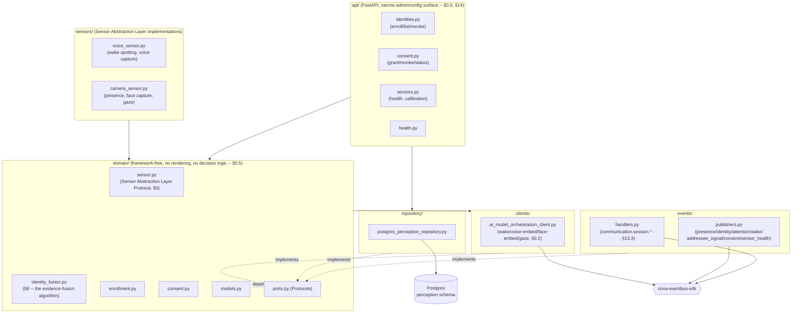
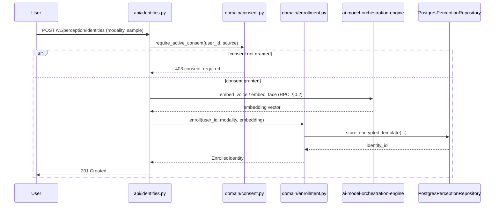
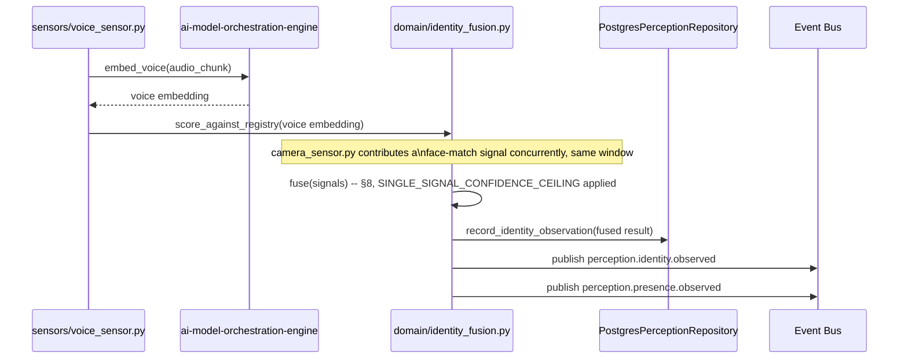
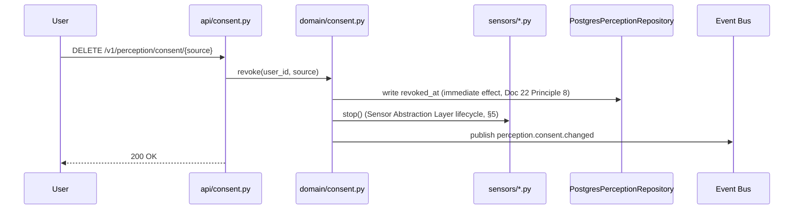
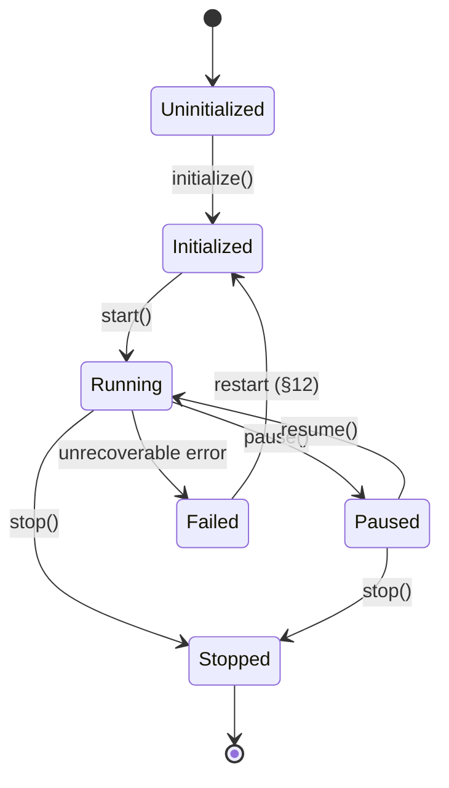

# Phase 2D-B Technical Design — 03: Perception Engine (Identity & Presence)

Implements the minimal slice of [Bible Part 11](../../bible/part-11-perception-engine.md)
(Perception Engine — voice and camera-based presence/identity modalities only), per
the [Phase 2D Master Architectural Blueprint](00-master-blueprint.md) §4.2 (Phase
2D-B), governed throughout by
[Doc 22 — NOVA Human Interaction Principles](../../architecture/22-nova-human-interaction-principles.md)
and [Doc 23 — NOVA Personality Specification](../../architecture/23-nova-personality-specification.md)
(§21 maps every major decision below against both). Cross-references
[ADR-004](../../architecture/00-overview-and-decisions.md#adr-004--event-bus-is-the-only-legal-cross-engine-channel)
(Event Bus only), [ADR-005](../../architecture/00-overview-and-decisions.md#adr-005--nova-never-speaks-except-through-the-communication-engine)
(this engine never speaks — it has no rendering capability of any kind, enforced
by omission), [ADR-012](../../architecture/adr/ADR-012-redis-as-primary-store-not-cache.md)
(World Model's Active Context, which this document proposes extending), [ADR-017](../../architecture/adr/ADR-017-world-model-boundary-separation.md)
(World Model owns the "current state of reality" projection this engine feeds),
[ADR-020](../../architecture/adr/ADR-020-sole-legal-llm-provider-channel.md)
(sole legal AI-provider channel — §0.2 below is this document's most consequential
finding against it, structurally identical in kind to
[01-communication-engine.md §0.3](01-communication-engine.md)'s speech-modality
finding), [ADR-023](../../architecture/adr/ADR-023-uniform-connector-compliance-suite.md)
(uniform connector compliance, extended to the new modalities §0.2 requires),
[ADR-024](../../architecture/adr/ADR-024-interface-versioning-from-day-one.md)
(every payload versioned from first commit), and
[ADR-032](../../architecture/adr/ADR-032-identity-confidence-is-also-an-authorization-signal.md)
(identity confidence is also an authorization signal for future privileged
capabilities, filed alongside this document's approval — §0.9).

Status: **Approved.** Implementation is authorized to begin, following the same
lifecycle every prior subsystem has been held to: Implementation → Continuous
testing → Architecture Review → Gate Review → Engineering Metrics → Approval,
built one layer at a time, each layer verified before the next begins. Per the
user's explicit standing instruction at Phase 2D-B's authorization: **identity
must never depend on a single signal.** This is the single foundational principle
every design decision below is checked against — see §0.4 for its full statement
and §8 for its concrete, mechanically-enforced implementation. Two further
standing principles were added at approval, alongside two required cross-engine
extensions (§0.2, §0.6): identity confidence is also an authorization signal for
future privileged capabilities (§0.9, ADR-032), and identity is continuously
reassessed throughout an interaction, never decided once (§0.10).

## 0. The boundary this document defends

### 0.1 Scope: minimal now — voice + camera presence/identity — full lifecycle contract from day one

Per Master Blueprint §4.2 and §9.1, this document builds `perception-engine` with
exactly two sensing modalities (audio, camera-based presence/identity) — not Bible
Part 11's full sensor breadth (desktop, browser, filesystem, IoT, wearables, and
everything else in that document's "Perception Sources" list, all Phase 4's
`nova-companion` extension, per the roadmap's own updated Phase 4 entry). What is
**not** minimal is the interface: this document implements Bible Part 11's **full**
Sensor Abstraction Layer lifecycle contract (§5) from the first line of code — the
same "minimal sensing breadth, full interface contract" discipline already applied
twice in this project (`executive-cognition-engine` 2C→6; this engine's own 2D-B→4
extension path). A future `nova-companion` sensor registering behind this layer in
Phase 4 must be a matter of implementing an already-correct `Sensor` Protocol, never
a redesign — Master Blueprint Risk §11.3 names this explicitly as a required Gate
Review verification item for this sub-phase, not a nice-to-have.

### 0.2 ADR-020 compliance and the biometric/wake-signal modality gap this phase must close

This is the most consequential architectural finding in this document, surfaced
here rather than left for implementation to discover — structurally identical in
kind to [01-communication-engine.md §0.3](01-communication-engine.md)'s discovery
that speech had no `ai-model-orchestration-engine` modality before 2D-A could be
built.

ADR-020 states, without exception: *"no subsystem may ever depend directly on an
LLM/AI provider... every interaction with any AI model — text generation,
embeddings, vision, speech, anything — passes exclusively through
`ai-model-orchestration-engine`."* Speaker recognition, face recognition, wake-phrase
spotting, and gaze/attention estimation are every one of them AI model inference —
a trained acoustic keyword-spotting model, a voice-embedding model, a face-embedding
model, a gaze-estimation model — not signal processing. **`ai-model-orchestration-engine`'s
current `Modality` type has no biometric or wake-signal modality at all**, even
after 2D-A's speech extension (`Modality` is currently `Literal["text_generation",
"streaming", "embedding", "tool_calling", "speech_to_text", "text_to_speech"]`), and
its existing `embed()` method (`async def embed(self, texts: list[str]) ->
list[list[float]]`) is text-only by signature — it cannot carry an audio waveform or
an image frame. A `perception-engine` that loaded a voiceprint or face-embedding
model directly to satisfy this phase's own scope would be a first-day ADR-020
violation, exactly the failure mode 2D-A's §0.3 already found and fixed once.

**One clarification this finding does *not* extend to:** basic audio-energy/motion
presence triggering (RMS energy threshold, frame-difference motion detection) is
signal processing, not model inference — the same distinction
[01-communication-engine.md §3.4](01-communication-engine.md) already draws for
Transport VAD, which correctly stays local without going through
`ai-model-orchestration-engine`. This document draws the identical line: **any
capability that extracts semantic or biometric meaning via a trained model routes
through `ai-model-orchestration-engine`; raw signal-processing triggers that produce
no identity or semantic content do not.**

**Decision:** this phase includes a small, additive extension to
`ai-model-orchestration-engine`, delivered before `perception-engine`'s sensing
pipeline is implemented against it — the same sequencing 2D-A's speech extension
followed:

- `Modality` gains four new literals: `"wake_phrase_detection"`,
  `"voice_embedding"`, `"face_embedding"`, `"gaze_estimation"`.
- `ModelConnector` gains four new methods, following the existing protocol's own
  `transcribe`/`synthesize` split (raise `NotSupportedError` for connectors that
  don't implement a modality — never a provider-SDK exception — verified by the
  ADR-023 uniform connector compliance suite, extended to cover these four new
  methods exactly as it already covers `transcribe`/`synthesize`/`embed`):
  ```python
  async def detect_wake_phrase(self, request: WakePhraseRequest) -> WakePhraseResult: ...
  async def embed_voice(self, request: VoiceEmbedRequest) -> VoiceEmbedResult: ...
  async def embed_face(self, request: FaceEmbedRequest) -> FaceEmbedResult: ...
  async def estimate_gaze(self, request: GazeEstimateRequest) -> GazeEstimateResult: ...
  ```
- Four new connectors, each a local, zero-budget default (mirroring
  `WhisperConnector`/`PiperConnector`'s role for speech), registered exactly like
  every existing connector through `ConnectorFactory`, scored by the same Model
  Router — no special-cased bypass: a local wake-phrase spotter (openWakeWord-class,
  fully offline), a local speaker-embedding connector (ECAPA-TDNN-class), a local
  face-embedding connector (ArcFace-class), and a local gaze-estimation connector
  (lightweight CV-model-class). All four are named by model *class* rather than a
  single hard vendor commitment, matching the latitude `WhisperConnector`/
  `PiperConnector` were given at their own introduction — the concrete package
  choice is an implementation detail settled during the implementation layer, not a
  TDD-level decision, provided the connector satisfies the compliance suite.
- `CapabilityScores` gains four matching dimensions: `wake_phrase_detection_accuracy`,
  `voice_embedding_quality`, `face_embedding_quality`, `gaze_estimation_accuracy` —
  scored identically to every existing dimension (Part 7's Model Capability Matrix,
  extended, not replaced), one dimension per new modality, the same 1:1 granularity
  2D-A's own `speech_recognition_accuracy`/`speech_synthesis_quality` pair
  established.

This is registered as a required Phase 2D-B deliverable against
`ai-model-orchestration-engine`, additive only — every existing modality, connector,
and caller (`reasoning-engine`, `communication-engine`) is unaffected.
`perception-engine` calls all four new capabilities through the same served
Event-Bus RPC pattern `communication-engine` already uses for `transcribe`/
`synthesize` (ADR-020's established precedent, not a new communication pattern).
Voiceprint/faceprint embeddings themselves are computed by
`ai-model-orchestration-engine`'s connectors and returned to `perception-engine`,
which stores and matches them (§6, §15) — the model call is stateless per-request,
the template storage and matching logic is this engine's own, mirroring exactly how
`communication-engine` calls `transcribe`/`synthesize` without itself storing any
model state.

### 0.3 The two fusion problems this phase family contains, and which one this document owns

Named explicitly because Bible Part 11's "Perception must remain independent... its
responsibility is observation, understanding belongs to the higher cognitive
systems" sits directly next to a genuine fusion algorithm this document specifies
(§8) — the two must not be conflated:

1. **Identity fusion — "who is this, and with what confidence" — is this
   document's job**, computed inside `perception-engine` itself. This is
   perception-level sensor fusion, the same category of operation Bible Part 11's
   own "Multi Modal Perception" section already assigns to Perception Engine
   ("different sensors should cooperate... NOVA understands far more than any
   single sensor could provide") and Master Blueprint §4.2 explicitly lists
   "identity confidence" among this sub-phase's core responsibilities. Combining a
   voiceprint match score and a faceprint match score into one identity-confidence
   verdict answers a sensing question — *which enrolled identity do these
   biometric signals correspond to* — with no notion of what to do about that
   answer. It is not "understanding" in Bible Part 11's forbidden sense any more
   than a camera's own auto-focus algorithm fusing multiple depth cues is
   "understanding" the scene.
2. **Addressee fusion — "is this person addressing NOVA right now" — is
   `communication-engine`'s 2D-C job, not this document's**, per Master Blueprint
   §5 (quoted in full in §10 below). This *is* the "should I respond" judgment
   Bible Part 11 forbids Perception from making. This document's job with respect
   to addressee detection is limited to publishing raw, per-signal candidate
   evidence (§10) — never fusing those signals into a verdict, never scoring
   "should NOVA respond."

The distinction: identity fusion asks *which* person; addressee fusion asks whether
*that* person (once identity fusion has an opinion, itself one more input) is
currently speaking to NOVA. The first is a fact about the world, owned by
Perception exactly as Bible Part 11 assigns it; the second is a judgment about how
to act on that fact, explicitly reserved for Conversation Intelligence. §8 builds
the first. §10 explains why this document does not build the second, and never
will.

### 0.4 Evidence fusion is the foundational identity principle — no single signal is ever sufficient

Per the user's explicit standing instruction, stated at this sub-phase's
authorization and binding on every future identity decision built on top of this
document: **identity should never depend on a single signal.** Voice. Face.
Presence. Attention. Context. Conversation history. Future behavioral signals. No
individual signal is ever, on its own, sufficient grounds for an identity
conclusion. This is not merely descriptive prose in this document — §8 makes it a
mechanically enforced constant (`SINGLE_SIGNAL_CONFIDENCE_CEILING`): a single
signal's match score can never, by construction, produce a "High confidence"
identity verdict, regardless of how strong that one signal's own score is. This is
the direct architectural realization of Doc 22 Principle 7 ("identity is
probabilistic, never assumed") and Doc 23 §5.2's Confidence Expression model,
applied specifically to identity rather than to reasoning conclusions. Every future
identity-relevant capability this engine or its Phase 4 extension gains — new
sensors, new behavioral signals, deeper conversation-history correlation — is
required to plug into this same fusion function (§8), never to bypass it with its
own independent "good enough" verdict.

### 0.5 What this engine never does — Bible Part 11's independence boundary, restated as hard constraints

Mirroring the discipline every prior TDD's §0 has applied to its own engine's
boundary: this document introduces zero decision logic of any kind. Concretely,
`perception-engine`:

- Never decides whether NOVA should respond to anything (§0.3, §10).
- Never calls Reasoning, AI Model Orchestration (except the narrow, stateless
  biometric/wake calls §0.2 specifies), Executive Cognition, Memory, or Knowledge
  Engine.
- Never renders any user-facing output, directly or via `communication.intent` —
  it has no dependency on `communication-engine`'s intent gate at all, unlike every
  content-producing engine ADR-005 governs. This is a stronger form of ADR-005
  compliance than any prior engine's: not "renders only through the gate," but
  "has no rendering capability whatsoever" (§22).
- Never stores or reasons about *why* a person is present or what they are doing —
  that is World Model's Active Context (§0.6) and, eventually, Reasoning's job, not
  this engine's.

### 0.6 Relationship to World Model Engine: this engine publishes, World Model owns the projection — plus a required additive extension

Per Master Blueprint §7's data ownership matrix, `perception-engine` "never
touches" the question of who is currently present as a *world fact* — it
publishes observations; World Model Engine (already built, Phase 1) owns that
projection (ADR-017). Master Blueprint §4.2 states World Model's existing Active
Context pattern "caches the current 'who's present' snapshot," meaning 2D-B "does
not need to serve its own low-latency query path for this."

**A finding surfaced honestly rather than assumed true by citation alone:**
inspecting World Model Engine's actual, already-shipped code
(`services/world-model-engine/src/nova_world_model_engine/domain/models.py`)
against this claim found a real gap. `ActiveContext` today has fields for
`objective`, `project_id`, `device`, `task`, `activity`, `platform`, and
`confidence` — **no field represents "which identity is currently present."**
World Model's existing `perception.*.observed` wildcard subscription
(`events/subscribed.py`) is already wired to two different, not-yet-reconciled
consumption paths:

1. `make_perception_observed_handler` (`events/handlers.py`, already wired in
   `main.py`) treats the payload as an *object* observation — creates or
   transitions a `WorldObject` keyed by `object_id`/`label`, the shape Bible Part
   11's desktop/software-object sensing needs (a window, a file, a project), not a
   person.
2. `domain/fusion.py`'s `PerceptionSignal`/`fuse_window`/`fuse_and_update` — ready,
   tested domain logic for updating `ActiveContext` from correlated perception
   signals — exists but is **not yet wired to any live subscription**; its own
   module docstring names this explicitly as "a Phase 2+ concern once Perception
   Engine exists."

Neither path has anywhere to put "identity X is present, confidence Y" today.
**Required additive extension, proposed here for approval alongside this document
rather than discovered mid-implementation** — the same category of decision as
§0.2's `ai-model-orchestration-engine` extension, and the same sequencing ADR-017
itself recommends (file the boundary before the dependent engine's implementation
proceeds against it):

- `ActiveContext` gains one new optional field: `present_identities:
  list[PresentIdentitySignal] = Field(default_factory=list)`, where
  `PresentIdentitySignal` carries `identity_id: UUID | None` (`None` for a
  confidently-detected-but-unenrolled presence), `confidence: float`, and
  `modality_summary: str` (e.g. `"voice+face"`) — additive per ADR-024, no
  existing consumer of `ActiveContext` is affected by an unpopulated new field.
- `domain/fusion.py`'s existing `fuse_and_update` path is wired to
  `perception.presence.observed` and `perception.identity.observed` (§13) as their
  real first producer — turning already-built, already-tested domain logic into a
  live pipeline for the first time, not adding new World Model logic. This is a
  small, mechanical wiring change to World Model Engine (a new call in
  `main.py`'s subscription setup, matching the pattern `make_perception_observed_handler`
  already demonstrates for the object-graph path), filed and reviewed alongside
  this document, not silently assumed to already work.
- The existing `make_perception_observed_handler` object-graph path is
  **unaffected and unused by this document** — `perception-engine` (2D-B) never
  publishes an object-shaped `perception.*.observed` payload; that path remains
  reserved for Phase 4's desktop-sensor extension (windows, files, projects),
  exactly as originally scoped.

This extension is small (one optional field, one subscription wiring change) and
strictly additive, but it is real, cross-engine, and required before §13's event
contracts can function end-to-end — named here explicitly per this project's
standing rule against silently discovering cross-engine gaps mid-implementation.

### 0.7 Relationship to `communication-engine`: a real producer this phase, a real consumer starting in 2D-C

Unlike `personality-engine`'s real, synchronous, load-bearing relationship to
`communication-engine` from 2D-A's first day, this document's relationship to
`communication-engine` is asymmetric: `perception-engine` publishes real,
production events (§13) starting this phase, but `communication-engine` does not
yet consume them — per
[01-communication-engine.md §0.4](01-communication-engine.md), that engine's own
2D-A scope explicitly deferred addressee-signal consumption to 2D-C. This is the
inverse of the usual "forward-declared port, no producer yet" pattern this project
has used twice before (`digital-twin-engine`/`perception-engine` ports inside
`01-communication-engine.md` §0.6): here, the *producer* ships in this sub-phase
and the *consumer* ships next, rather than the reverse. `perception-engine` does
consume `communication-engine`'s session-lifecycle events (§13.3) — a genuine,
one-directional dependency the opposite way, needed for the "is a session already
active with this speaker" addressee-candidate signal (Master Blueprint §5.1).

### 0.8 Relationship to `personality-engine` and `digital-twin-engine`: none, this phase

Neither relationship exists. `personality-engine` has no identity-relevant
dependency on this engine (its own identity is Doc 23's fixed character, unrelated
to *user* identity). `digital-twin-engine` does not exist yet (Phase 2D-D) and
nothing in this document defines a port toward it — a future "identity-informed
personalization" capability, if one is ever needed, is a Phase 2D-D or later
design decision, not assumed here.

### 0.9 Identity confidence is also an authorization signal — not built here, but the signal this engine produces must be fit for that purpose

Per [ADR-032](../../architecture/adr/ADR-032-identity-confidence-is-also-an-authorization-signal.md),
filed alongside this document's approval: identity confidence does not only answer
"who is this" — it is also a required input to "what is this system allowed to
do." Future privileged capabilities (automation, smart-home control, financial
operations, security-sensitive actions, or any privileged workflow, none of which
exist yet — Action Engine is Phase 3, Autonomy Engine is Phase 4) must gate on a
*configurable* identity-confidence threshold, never a binary identity check.

**This document does not build any authorization or gating logic** — that would
violate §0.3/§0.5's independence boundary exactly as building addressee-fusion
logic here would. What this document *is* responsible for, and is checked against
in the Gate Review: every identity signal this engine ever produces or exposes —
`IdentityObservation` (§4.1), `perception.identity.observed` (§13.2), and every
future API surface — carries the full confidence float and tier together, never
collapses to a bare boolean anywhere on its way out of this engine. A future
capability-owning engine that wants to gate a privileged action on identity reads
this engine's confidence signal directly; nothing here narrows, rounds, or
discards precision on the way. §8 designed the confidence output this precisely
before ADR-032 existed — this section records that ADR-032 now makes that
precision a binding requirement, not a coincidence of the original design.

### 0.10 Identity is continuously reassessed, not a single event

Per the user's explicit standing instruction, given alongside ADR-032's approval:
**recognition is not a single event. It is an ongoing process.** As new evidence
arrives during an active interaction, identity confidence must be able to
increase, decrease, or remain stable — continuously, not only at a single
enrollment-matching moment — without disrupting the conversation unnecessarily
each time it updates. §8 restates this as the fusion algorithm's operating mode
(a continuously-updated running state, not a one-shot classification) and adds the
temporal-smoothing mechanism that keeps confidence updates from becoming visible
jitter. This document's own scope reassesses identity from the two modalities it
has (voice, face) plus session continuity; future evidence sources the user named
explicitly — behavioral biometrics, device proximity, environmental context,
movement patterns, gaze dynamics, and additional modalities not yet identified —
are structurally supported extension points (§23), not built this phase, per this
document's standing "minimal now, honest about what's deferred" discipline (§0.1).

## 1. Overall architecture



`domain/` never imports FastAPI, SQLAlchemy, `nova_eventbus_sdk`, a camera/audio
capture library, or (per ADR-020) any LLM/AI provider SDK directly — `sensors/` is
the one layer permitted to touch actual capture hardware/OS APIs, exactly as
`channels/` is `communication-engine`'s equivalent hardware/transport-facing layer.
`identity_fusion.py` (§8) is pure, deterministic computation over already-scored
per-modality signals — it never itself calls a model, mirroring
`personality-engine`'s own rule-based-by-construction validator (§0.3 of that
document).

## 2. Responsibilities of every component

### 2.1 Core responsibilities

- **Sensor Abstraction Layer** (§5): a uniform lifecycle contract every sensor
  implements, with exactly two concrete implementations this phase (voice, camera).
- **Identity Registry** (§4.1, §15): enrollment, encrypted template storage,
  revocation of voiceprint/faceprint templates.
- **Consent management** (§4.3, §11): per-source (microphone, camera) consent
  state, revocable with immediate effect.
- **Presence detection** (§7.2): is anyone present, with what confidence.
- **Speaker recognition** (§6.2) and **face recognition** (§7.1): matching a live
  biometric sample against enrolled templates.
- **Multi-factor identity confidence** (§8): fusing per-modality match signals
  into one continuously-updated identity verdict, per §0.4's foundational
  principle and §0.10's continuous-reassessment principle.
- **Attention and gaze awareness** (§7.3).
- **Wake-phrase detection** (§9.1) as one activation signal among several.
- **Addressee-candidate signal publishing** (§10) — raw signals only, never a
  verdict.
- **Sensor health monitoring and failure recovery** (§12).

### 2.2 Explicit non-responsibilities

- **Does not decide whether NOVA should respond to anything** — that is
  `communication-engine`'s 2D-C job (§0.3, §10).
- **Does not render any user-facing output** — no `communication.intent`
  dependency exists in this engine at all (§0.5).
- **Does not sense anything beyond audio and camera-based presence/identity this
  phase** — desktop, browser, filesystem, IoT, wearables, and every other Bible
  Part 11 source is Phase 4's `nova-companion` (§0.1).
- **Does not own "who is present" as a queryable world fact** — World Model Engine
  does, via Active Context (§0.6); this engine only ever publishes toward it.
- **Does not perform addressee fusion** — publishes raw candidate signals only
  (§0.3, §10).
- **Does not learn or adapt long-term preferences** — that is `digital-twin-engine`
  (Phase 2D-D), which this document has no relationship to (§0.8).
- **Does not call any AI/biometric model directly** — every model call is routed
  through `ai-model-orchestration-engine` per §0.2.
- **Does not gate or authorize any privileged capability** — produces
  confidence-scored, tiered identity signals a future capability-owning engine
  consumes as an authorization input; the gating/threshold logic itself belongs
  to that future engine, never here (§0.9, ADR-032).

## 3. Internal execution flow & complete data flow

### 3.1 Enrollment flow



### 3.2 Live sensing → identity fusion → publish flow



### 3.3 Consent revocation flow



## 4. Domain model

### 4.1 Identity model

- `EnrolledIdentity` — `identity_id`, `user_id`, `modality` (`voice` | `face`),
  `template_ciphertext` (encrypted embedding, never plaintext at rest, §11),
  `enrolled_at`, `revoked_at | None`.
- `IdentityObservation` — one fused identity verdict for a single correlation
  window: `observation_id`, `identity_id | None` (`None` =
  confidently-present-but-unmatched), `fused_confidence`, `confidence_tier`
  (`high` | `medium` | `low` | `unknown` — Doc 23 §5.2's four tiers, reused per
  Doc 22 Principle 7), `per_modality_signals` (JSON, audit trail — §11's "trust
  through inspectability"), `observed_at`, `correlation_id`. Append-only —
  immutable once written, the permanent audit trail §0.10's continuous
  reassessment is built on top of, never itself mutated in place.
- `IdentityConfidenceState` — the **current, continuously-updated** running
  state per active presence session (§0.10, §8): `presence_session_id`,
  `identity_id | None`, `smoothed_confidence`, `smoothed_tier`,
  `observation_count`, `last_updated_at`. This is in-process, live state, not a
  Postgres row — mirroring `communication-engine`'s own `session_registry.py`
  precedent ("the one piece of genuinely live, in-memory state... which is why
  it lives outside the framework-free layer"). It is derived entirely from the
  `IdentityObservation` stream (never the reverse) and is safe to lose on
  restart — a fresh fusion sequence simply rebuilds it from the next few
  correlation windows, the same "no safe default needed because nothing
  irreversible depends on it surviving a crash" reasoning
  `communication-engine`'s Transport VAD state already relies on.

### 4.2 Presence model

- `PresenceObservation` — `user_id | None`, `present: bool`, `confidence`,
  `source` (`voice` | `camera`), `observed_at`.
- `AttentionObservation` — `identity_id | None`, `attention_state` (`engaged` |
  `disengaged` | `unknown`), `gaze_direction` (`toward_device` | `away` | `unknown`),
  `confidence`, `observed_at`.

### 4.3 Consent model

- `ConsentGrant` — `consent_id`, `user_id`, `source` (`microphone` | `camera`),
  `granted_at`, `revoked_at | None`, `scope` (free-text disclosure of what the
  consent covers, Doc 22 Principle 8's "explicit per-source consent").

## 5. The Sensor Abstraction Layer — state machine & lifecycle contract

Per Bible Part 11's "Sensor Abstraction Layer" and Master Blueprint §9.1, every
sensor this engine registers — the two shipped this phase and every one Phase 4
adds — implements the same `Sensor` Protocol (`domain/sensor.py`):

```python
class Sensor(Protocol):
    async def initialize(self) -> None: ...
    async def start(self) -> None: ...
    async def pause(self) -> None: ...
    async def resume(self) -> None: ...
    async def stop(self) -> None: ...
    async def health_check(self) -> SensorHealth: ...
    def configuration(self) -> SensorConfig: ...
    async def calibrate(self) -> CalibrationResult: ...
    def permission_status(self) -> PermissionStatus: ...
    def report_error(self, error: SensorErrorReport) -> None: ...
    def capabilities(self) -> frozenset[str]: ...
```

Every method in Bible Part 11's "Required capabilities" list (Initialize, Start,
Pause, Resume, Stop, Health Check, Configuration, Calibration, Permission Status,
Error Reporting, Capability Discovery) is present — none deferred, none stubbed out
as a placeholder — satisfying Master Blueprint Risk §11.3's explicit requirement.



`consent.py`'s `revoke()` (§3.3) calls `stop()` directly — consent revocation is
modeled as a lifecycle transition, not a separate out-of-band kill switch, so the
same tested lifecycle machinery guarantees immediate effect (Doc 22 Principle 8).

## 6. Voice sensing — wake phrase & speaker recognition

### 6.1 Wake phrase detection

`voice_sensor.py` streams short audio windows to `ai_model_orchestration_client.
detect_wake_phrase` (§0.2). A positive match publishes `perception.wake.detected`
(§13.2) with its own confidence — **one candidate signal among several** (Doc 22
Principle 5), never treated by this engine as a verdict. Bible Part 11's wake-word
detection responsibility is satisfied narrowly: detection and publication only, no
downstream decision.

### 6.2 Speaker recognition

`voice_sensor.py` extracts a voice embedding via `embed_voice` (§0.2) and scores it
against every enrolled `EnrolledIdentity` with `modality="voice"` (§15) using cosine
similarity, producing a per-identity match score. This score is one input to §8's
fusion — speaker recognition alone never produces a delivered identity verdict, per
§0.4.

## 7. Camera sensing — face recognition, presence, attention & gaze

### 7.1 Face recognition

`camera_sensor.py` extracts a face embedding via `embed_face` (§0.2) per detected
face and scores it against enrolled `modality="face"` templates, identically to
§6.2's voice path. Multiple simultaneous faces are each scored independently
(Bible Part 11's "speaker separation" analog for vision) — this engine does not
assume a single-occupant room.

### 7.2 Presence detection

A lightweight local motion/frame-difference trigger (Transport-VAD-equivalent,
§0.2's signal-processing exception) determines "is anyone here" cheaply, before
any model call — face recognition only runs when presence is already positive,
the same cost-avoidance discipline Bible Part 11's "Event Filtering" section
describes ("avoid unnecessary processing").

### 7.3 Attention & gaze awareness

`estimate_gaze` (§0.2) returns a coarse gaze direction and confidence per detected
face. Combined with presence, this produces `AttentionObservation` (§4.2),
published as `perception.attention.observed` (§13.2) — a candidate signal for
addressee detection (§10), never a verdict.

## 8. Multi-factor identity confidence — continuous evidence fusion

The mechanical implementation of §0.4's foundational principle (no single signal
is ever sufficient) and §0.10's foundational principle (recognition is an ongoing
process, not a single event). `domain/identity_fusion.py` combines every
available per-modality signal for a correlation window (mirroring World Model's
own `fuse_window` correlation-window pattern in `domain/fusion.py` — an
intentional architectural consistency, not a coincidence, since both solve
"combine several imperfect signals into one confidence-scored verdict without
letting agreement fabricate false certainty"), then feeds that window's verdict
into a continuously-updated running state (step 6) rather than treating it as a
final answer:

1. **Group signals by candidate identity.** Each modality (voice match, face
   match, session-continuity — "the same identity as the immediately preceding
   confirmed observation within the correlation window") proposes a candidate
   identity and a confidence.
2. **Winning identity = the one with the strongest agreement-weighted score.**
   `base = max(signal.confidence for signal in agreeing)`;
   `fused = min(base + AGREEMENT_BONUS * (len(agreeing) - 1), MAX_CONFIDENCE)` —
   the same formula as World Model's `fuse_window`, reused deliberately.
3. **`SINGLE_SIGNAL_CONFIDENCE_CEILING = 0.75` — the mechanical enforcement of
   §0.4.** When only one modality contributed a signal this window, `fused` is
   capped at this ceiling regardless of that signal's own raw confidence. Since
   the "High" confidence tier begins at `0.85` (below), **a single signal can
   never, by construction, produce a High-confidence identity verdict** — this is
   not a policy an implementer could accidentally weaken by tuning a threshold,
   it is a structural property of the fusion function, tested directly (§20).
4. **Disagreement is suppressed, never averaged.** If two modalities propose
   different candidate identities with comparable weight, `fused_confidence` is
   forced into the `low`/`unknown` band and the disagreement is recorded verbatim
   in `per_modality_signals` (§4.1) — mirroring World Model's `ConflictLogEntry`
   precedent: an unresolved disagreement is a visible signal for later review, not
   a silently-picked winner.
5. **Confidence tiers** (Doc 23 §5.2, reused per Doc 22 Principle 7): `high ≥
   0.85`, `medium ≥ 0.6`, `low ≥ 0.35`, else `unknown`. Every downstream consumer
   (World Model's Active Context, §0.6; `communication-engine`'s future 2D-C
   addressee fusion; any future authorization consumer, §0.9) receives the tier
   alongside the raw float, never the float alone — matching Doc 23's own
   confidence-expression discipline of never hiding uncertainty inside a
   confident-sounding single number.
6. **Continuous reassessment via exponential smoothing — the mechanical
   enforcement of §0.10.** Each window's `fused_confidence` (steps 1-5) is not
   delivered as a standalone verdict; it updates `IdentityConfidenceState.
   smoothed_confidence` (§4.1) for the active presence session:
   `smoothed = ALPHA * fused + (1 - ALPHA) * previous_smoothed` (a standard
   exponential moving average, `ALPHA` tuned low enough that one anomalous
   window — a mistimed frame, a noisy audio window — cannot swing the visible
   state, but high enough that a real, sustained change in evidence is reflected
   within a handful of windows, not dozens). This is what lets confidence
   *increase, decrease, or hold steady* as new evidence arrives, per the user's
   own framing, without the jitter that would come from surfacing each raw
   window's verdict directly. **A sustained decrease is treated with the same
   seriousness as a sustained increase** — several consecutive low-agreement
   windows lower `smoothed_confidence` through the same formula, never held
   artificially high by "benefit of the doubt"; identity confidence degrades
   honestly when the evidence degrades, the same trust-through-consistency
   discipline Doc 22 Principle 9 already demands of preference adaptation
   ("never overwrite immediately... require consistent evidence"), applied here
   to confidence *decay* rather than only to confidence gain. `smoothed_tier` is
   recomputed from `smoothed_confidence` using the same boundaries as step 5 —
   a tier change is itself a meaningful event (published as a fresh
   `perception.identity.observed` only when the *tier* changes, not on every
   window, so downstream consumers see stable state rather than continuous
   noise, per ADR-031's subjective-experience-quality standard applied to a
   machine consumer instead of a human one).

Context and long-term conversation-history signals, and the user's other
explicitly named future evidence sources — behavioral biometrics, device
proximity, environmental context, movement patterns, gaze dynamics, and
additional modalities not yet identified — are **structurally supported but not
populated this phase**: `per_modality_signals` is an open, extensible mapping,
not a fixed tuple, so a future signal plugs into step 1's "group by candidate
identity" without a fusion-function redesign, and step 6's smoothing operates
identically regardless of how many or which signal types feed step 1-5 (§23).
This is the honest, minimal-now scope: this phase concretely fuses voice, face,
and session-continuity — exactly the signals this phase's sensors and
dependencies can honestly produce — while the fusion *architecture*, including
its continuous-reassessment mechanism, is built for every signal §0.4 and §0.10
name, present or future.

## 9. Activation logic — wake phrase, manual activation, push-to-talk, future always-listening

### 9.1 Wake phrase handling (this engine's contribution)

Per §6.1: detection and publication only. This engine never itself starts, ends, or
gates a conversation turn — publishing `perception.wake.detected` is the entirety
of this engine's activation responsibility.

### 9.2 Manual activation (not this engine's — boundary note)

A user-initiated "start listening" action (e.g. a button in `apps/web-client`) is
already `communication-engine`'s concern, not this engine's — no design in this
document introduces a competing mechanism. Named explicitly so a future
implementer does not duplicate it here.

### 9.3 Push-to-talk support (not this engine's — boundary note)

Per [01-communication-engine.md §0.4](01-communication-engine.md), push-to-talk is
"a client-side, explicit start/stop signal in the voice channel... not acoustic
wake-word detection" — already `communication-engine`'s channel-adapter mechanism,
unrelated to this engine's sensing responsibility. This document does not extend,
duplicate, or depend on it.

### 9.4 Future always-listening architecture (extension point, not built this phase)

Per Doc 22 Principle 5 ("as sensing capability matures, NOVA's addressee judgment
should rely on wake words less, not more — the wake word is a bootstrapping
mechanism... not the permanent interface") and Principle 12 (invisible technology):
this phase's wake-phrase spotter is an explicit, honest bootstrapping mechanism,
not a permanent architecture. The trajectory this document's interfaces are built
to support without redesign: continuous, always-on presence/attention sensing
(already this phase's actual behavior — presence/attention run continuously, not
only after a wake event) feeding an addressee-confidence estimate rich enough that
a spoken wake phrase becomes one input among many rather than a hard gate. Nothing
in §5's Sensor Abstraction Layer, §8's fusion function, or §13's event contracts
assumes a wake-word-gated architecture — the wake phrase is simply one more
candidate signal in an already-continuous sensing stream (§23).

## 10. Addressee-signal boundary — talking TO NOVA vs. talking ABOUT NOVA

Per Master Blueprint §5, quoted here because this document's own compliance with
it is load-bearing: *"Phase 2D-B (Perception) observes and publishes signals, never
decides... 2D-B never fuses them into a single 'should respond' verdict, because
that fusion is understanding, which Bible Part 11 explicitly forbids Perception
from doing... Phase 2D-C (Conversation Intelligence) fuses the signals and
decides."*

Concretely, this engine publishes `perception.addressee_signal.candidate` (§13.2)
at each candidate activation moment, carrying every raw signal Master Blueprint
§5.1 names as available from this phase's sensing scope: wake-word match (bool +
confidence, §9.1), speaker identity + confidence (§8's fused result), gaze
direction (§7.3), and whether a conversation session is already active with this
speaker (§13.3's consumed `communication.session.*` events). **This event
carries no verdict field of any kind** — no `should_respond`, no `is_addressed`
boolean, nothing a consumer could mistake for a decision. `communication-engine`'s
2D-C is the sole, exclusive consumer and sole, exclusive fuser of this event,
exactly as it is the sole legal renderer of output under ADR-005. This document's
own compliance is verified in the Gate Review by inspecting `identity_fusion.py`
and every publisher in `events/publishers.py` for the literal absence of any
response-worthiness computation — an inspectable, mechanical check, not a
documentation claim taken on faith.

## 11. Privacy boundaries & security considerations

Per Doc 22 Principle 8 ("privacy is foundational, not a feature toggle") and Bible
Part 11's "Perception Security"/"Perception Privacy" sections:

- **Local processing by default.** Every model call in §0.2 targets a local
  connector by default (the zero-budget defaults named there); a cloud biometric
  provider, if ever added, requires the same explicit swappability
  `ai-model-orchestration-engine`'s Model Router already provides elsewhere — never
  a silent default.
- **Explicit per-source consent before activation, revocable with immediate
  effect** (§3.3, §4.3, §5) — no sensor starts capturing before `ConsentGrant`
  exists for its source, and `stop()` is called synchronously within the same
  revocation transaction, not eventually-consistent.
- **Raw biometric templates are never a casual byproduct.** `EnrolledIdentity.
  template_ciphertext` exists only because returning-user recognition is a
  disclosed, explicit capability (§0.1) — encrypted at rest (application-level
  encryption before the Postgres write, key managed outside this engine's own
  schema per standard secrets-management practice, never a plaintext embedding
  column), and deletable independent of deleting anything else via `DELETE
  /v1/perception/identities/{id}` (§14), which is a hard delete of the template
  row, not a soft-delete flag — revocation must be real, not cosmetic.
- **Raw audio and raw camera frames are never persisted** — mirroring
  [01-communication-engine.md §3.3](01-communication-engine.md)'s "raw audio is
  never persisted" precedent, extended here to camera frames: only the derived
  embedding (for matching, §6.2/§7.1) and the fused observation record (§4.1) are
  ever written to Postgres; the raw sample is discarded immediately after the
  `ai_model_orchestration_client` call that derives it from.
- **Every identity judgment is probabilistic and inspectable, never a silent
  binary** (Doc 22 Principle 7) — §4.1's `per_modality_signals` audit field exists
  specifically so a disputed identity judgment can be inspected after the fact,
  the same trust-through-inspectability discipline `personality-engine`'s
  `validation_audit` table already established (§9 of that document).

## 12. Failure handling & recovery mechanisms

| Failure | Behavior |
|---|---|
| A sensor's `health_check()` reports degraded/failed | §5's state machine transitions `Running → Failed`; the Sensor Abstraction Layer restarts it automatically (`Failed → Initialized → Running`, Bible Part 11 "Failure Recovery": "restart sensor, reconnect automatically"); repeated failures publish `perception.sensor.health_changed` (§13.2) for observability, never a silent retry loop with no visibility. |
| `ai_model_orchestration_client` call (wake/voice-embed/face-embed/gaze) times out or errors | The affected signal is simply absent from that correlation window (§8) — fusion proceeds with whatever signals did arrive; a fully-signal-less window produces no `IdentityObservation` at all rather than a fabricated low-confidence one. |
| One sensor fails entirely (e.g. camera unavailable) | The other sensor's signals continue independently — Bible Part 11: "failure of one sensor must never compromise the entire Perception Engine." Identity fusion degrades to single-modality input, which §8's ceiling already handles correctly (confidence capped, never silently promoted). |
| Postgres write (enrollment, consent, observation audit) fails | Enrollment/consent-change requests fail explicitly (never proceed unpersisted, matching every prior engine's write-before-effect discipline); a transient observation-audit write failure does not block the in-flight fusion/publish path (the audit trail is for inspectability, §11, not a gate on real-time signal delivery) but is logged as a data-loss event for alerting. |
| Consent revoked mid-capture | §5's `stop()` is synchronous within the revocation transaction (§11) — no capture continues even momentarily past a revocation. |

## 13. Event Bus integration

### 13.1 No served RPC, by design

Per Master Blueprint §8: this engine serves no synchronous Event-Bus RPC this
phase — no consumer has a real-time query need `perception-engine` alone can
satisfy; World Model's Active Context already serves the one case that would need
it (§0.6). If a future consumer genuinely needs a synchronous, low-latency
identity query this engine itself must serve, that is a scope decision for a later
phase, not assumed here.

### 13.2 Published events

- `perception.presence.observed` — matches World Model's existing
  `perception.*.observed` wildcard subscription (§0.6); feeds `ActiveContext` via
  the now-wired `fuse_and_update` path.
- `perception.identity.observed` — matches the same wildcard; carries §8's
  smoothed `IdentityConfidenceState` (identity_id, smoothed confidence, tier);
  feeds `ActiveContext.present_identities` (§0.6). Published on every correlation
  window that changes `smoothed_tier`, not on every window — §8's own
  noise-reduction rationale, so World Model's Active Context (and any future
  authorization consumer, §0.9) observes stable state transitions, not
  continuous per-window churn.
- `perception.attention.observed` — matches the same wildcard; carries §4.2's
  `AttentionObservation`.
- `perception.wake.detected` — **deliberately does not match** the `.observed`
  wildcard (subject ends in `detected`, not `observed`) — a discrete trigger
  event, not a "current state of reality" fact, so it is never routed into World
  Model's object/context pipelines; consumed directly by `communication-engine`
  once 2D-C exists (§0.7).
- `perception.addressee_signal.candidate` — **deliberately does not match** the
  wildcard, for the same reason as above, reinforced by §10's requirement that
  this event never be mistaken for a world-state fact; consumed directly by
  `communication-engine`'s 2D-C.
- `perception.consent.changed` — audit/compliance visibility (§11); no consumer
  this phase, published for the same "observability over silence" discipline
  every prior engine's audit-relevant events follow.
- `perception.sensor.health_changed` — Bible Part 11 "Sensor Health"; consumed by
  the observability stack (§19), no engine consumer this phase.

Every payload carries `schema_version: int = 1` from first commit (ADR-024),
registered via `nova_contracts.registry.register_payload`, subject-named
`perception.<domain>.<action>` — identical convention to every prior engine's
contracts module.

### 13.3 Consumed events

- `communication.session.created`, `communication.session.completed` — tracked
  to answer "is a session currently active with this speaker" (Master Blueprint
  §5.1), one of §10's addressee candidate signals. This is the one genuine
  dependency direction from this engine toward `communication-engine`, the
  inverse of §0.7's producer/consumer asymmetry. `communication.session.
  state_changed` (§13.2 of the communication-engine design doc) is deliberately
  **not** subscribed: its payload carries `session_id` only, no `user_id`
  (`CommunicationSessionStateChangedPayload`), so it cannot be attributed to a
  speaker by this tracker; and its `Paused` state is not "ended" for this
  tracker's purpose, so it carries no actionable transition this engine would
  act on even if `user_id` were present. Discovered and corrected during
  implementation (§20's own "verify before trusting documentation" discipline)
  rather than carried forward as a mismatch between this document and the code.

New `ai-model-orchestration-engine` contracts (§0.2, additive to the existing set):
`ai_model.detect_wake_phrase.request`/`.reply`, `ai_model.embed_voice.request`/
`.reply`, `ai_model.embed_face.request`/`.reply`, `ai_model.estimate_gaze.request`/
`.reply` — all non-streaming, request/reply RPC, mirroring `transcribe`/
`synthesize`'s existing pattern exactly.

## 14. APIs exposed

Bible Part 11's "Perception APIs" list, narrowed per Master Blueprint §8 to the
admin/config surface this sub-phase actually needs — **no content API**: this
engine produces no user-facing content, and "current presence/identity" is queried
through World Model's existing `GET /v1/world/context` (§0.6), not duplicated here.

All routes are served under the `/v1/perception` prefix, per the project-wide
`/v1/<domain>/...` REST convention (the same normalization the Phase 2D-A Gate
Review already applied to `personality-engine`/`communication-engine`, treated
here as the default from this engine's first commit rather than a later
correction):

| Endpoint | Method | Notes |
|---|---|---|
| `/v1/perception/identities` | POST | Enroll Identity (§3.1) — requires active consent for the sample's source. |
| `/v1/perception/identities` | GET | List enrolled identities (metadata only — `identity_id`, `modality`, `enrolled_at` — never a template). |
| `/v1/perception/identities/{id}` | DELETE | Revoke Identity — hard delete of the encrypted template (§11). |
| `/v1/perception/consent` | GET | Consent Status, per source. |
| `/v1/perception/consent` | POST | Grant Consent for a source. |
| `/v1/perception/consent/{source}` | DELETE | Revoke Consent — immediate effect (§3.3, §5, §11). |
| `/v1/perception/sensors` | GET | Sensor Health Status (§5, §12, Bible "Sensor Health"). |
| `/v1/perception/sensors/{id}/calibrate` | POST | Calibration (§5's lifecycle contract). |
| `/v1/perception/diagnostics` | GET | Diagnostics dump (recent sensor errors, correlation-window stats) for support/debugging. |
| `/internal/health`, `/internal/readiness`, `/internal/metrics` | GET | Unprefixed by design — ops/probe surface, not a versioned domain API. |

"Register Sensor"/"Remove Sensor" (Bible's own API list) are **not exposed as
public HTTP endpoints this phase** — sensor registration is a startup-time
configuration concern (`main.py` wiring the two shipped sensors), not a runtime
API surface; Phase 4's `nova-companion` extension (§23) may promote this to a real
endpoint if dynamic sensor registration becomes a genuine requirement, not assumed
necessary today.

## 15. Database schema — `perception` Postgres schema

```sql
CREATE TABLE perception.enrolled_identity (
    identity_id           UUID PRIMARY KEY,
    user_id                UUID NOT NULL,
    modality               TEXT NOT NULL,       -- 'voice' | 'face'
    template_ciphertext    BYTEA NOT NULL,       -- application-level encrypted embedding, §11
    enrolled_at             TIMESTAMPTZ NOT NULL DEFAULT now(),
    revoked_at              TIMESTAMPTZ
);

CREATE TABLE perception.consent_grant (
    consent_id       UUID PRIMARY KEY,
    user_id           UUID NOT NULL,
    source            TEXT NOT NULL,      -- 'microphone' | 'camera'
    scope             TEXT NOT NULL,
    granted_at         TIMESTAMPTZ NOT NULL DEFAULT now(),
    revoked_at         TIMESTAMPTZ
);

CREATE TABLE perception.identity_observation (
    observation_id       UUID PRIMARY KEY,
    identity_id            UUID REFERENCES perception.enrolled_identity,  -- NULL = unmatched
    fused_confidence        REAL NOT NULL,
    confidence_tier          TEXT NOT NULL,      -- 'high' | 'medium' | 'low' | 'unknown', §8
    per_modality_signals     JSONB NOT NULL,      -- audit trail, §11
    correlation_id            UUID,
    observed_at                TIMESTAMPTZ NOT NULL DEFAULT now()
);

CREATE TABLE perception.sensor_registration (
    sensor_id         TEXT PRIMARY KEY,
    sensor_type        TEXT NOT NULL,      -- 'voice' | 'camera'
    status              TEXT NOT NULL,      -- §5's state machine, current state
    capabilities         JSONB NOT NULL,
    last_health_check_at  TIMESTAMPTZ,
    error_count            INT NOT NULL DEFAULT 0
);
```

No graph store, no vector store — voiceprint/faceprint matching is a small,
in-process cosine-similarity computation over encrypted-then-decrypted-in-memory
embeddings (§6.2, §7.1) against a registry small enough (single-user default,
ADR-025) that a vector index would be capability without a corresponding
requirement, the same reasoning ADR-017 already applied to World Model's own
no-embeddings decision.

## 16. Repository layer

`PostgresPerceptionRepository` implements `domain/ports.py`'s
`PerceptionRepository` Protocol: `enroll_identity`, `list_identities`,
`revoke_identity`, `grant_consent`, `revoke_consent`, `consent_status`,
`record_identity_observation`, `record_sensor_health`. Mirrors every prior
engine's repository-layer convention exactly (SQLAlchemy Core, no ORM, connection
pooling via the shared `repository/db.py` pattern) — no new persistence pattern
introduced. Template encryption/decryption happens in `domain/enrollment.py`
before/after the repository call, never inside the repository itself, keeping
`domain/` the one place the encryption invariant is enforced and testable without
a real database (§20).

## 17. Performance goals

Per Bible Part 11 ("voice latency should remain minimal... system monitoring
should require minimal CPU usage") and Master Blueprint §13.2 ("low latency is
part of NOVA's personality," ADR-031's general form):

- Presence/motion triggering (§7.2, local signal processing): sub-10ms, never
  gated on a model call.
- Wake-phrase detection round trip (local connector, §0.2): target p95 < 300ms
  from audio window to `perception.wake.detected` publish — this engine's own
  contribution to Master Blueprint Risk §11.1's overall response-latency budget,
  measured and reported the same way `communication-engine`'s own latency budget
  is (§13 of that document).
- Identity fusion (§8) itself: sub-millisecond, pure in-process computation over
  already-scored signals — never the bottleneck in the identity pipeline; the
  model calls that produce the per-modality scores dominate the budget, not the
  fusion arithmetic.
- Continuous reassessment cadence (§0.10, §8): a new correlation window every
  2-3 seconds while a presence session is active — frequent enough that a real
  change in who's present is reflected within single-digit seconds (§0.10's
  "ongoing process" requirement), infrequent enough that it never approaches
  the wake-phrase/VAD path's real-time budget above. This is a starting
  parameter, not a fixed constant — §20's calibration tests are the mechanism
  for tuning it against real responsiveness-vs-noise data, the same posture
  §8's confidence-tier boundaries already take.
- Sensor health checks: continuous, non-blocking, never competing with live
  sensing for CPU (Bible: "minimal CPU usage").

## 18. Scalability considerations

Single-user default (ADR-025) means the Identity Registry and consent tables stay
small by construction — no sharding, no read-replica need this phase. The Sensor
Abstraction Layer's uniform contract (§5) is what actually matters for scale here:
Phase 4 adding many more sensors scales by registering more `Sensor`
implementations behind the same interface, not by redesigning this engine's core
loop — the same "interface scales, data model doesn't need to yet" pattern
`communication-engine`'s channel abstraction already established.

## 19. Observability

Structured JSON logs (`nova-observability`) at every state transition in §5's
sensor lifecycle, every consent grant/revocation, and every fused identity
observation (with `correlation_id`, never with the raw embedding or template
logged — §11). Prometheus metrics: per-sensor health/error rate, wake-phrase
detection latency (§17), identity-fusion confidence distribution (a healthy system
should show most observations clustering at `high`/`medium`, not `low`/`unknown` —
a useful drift signal), consent grant/revocation counts. Traces (OTLP) for the
full enrollment and live-sensing-to-publish flows (§3.1, §3.2), matching every
prior engine's tracing discipline.

## 20. Testing strategy

Per [16 — Testing Strategy](../../architecture/16-testing-strategy.md) and this
project's standing "layer by layer, tested before the next layer begins" rule:

- **Unit tests**: `identity_fusion.py` against synthetic signal sets — critically,
  a direct test that a single strong signal (e.g. `confidence=0.99`) never
  produces a `high` tier verdict (§8's ceiling, mechanically verified, not just
  asserted in prose); disagreement-suppression tests; tier-boundary tests;
  continuous-reassessment tests (§0.10, §8 step 6) — a single anomalous window
  must not swing `smoothed_confidence` across a tier boundary, a sustained run
  of consistent windows must; a sustained run of *weak* windows must lower
  `smoothed_confidence` through the same formula, verified directly rather than
  only asserted (§0.10's "decrease... without disrupting the conversation
  unnecessarily" is a testable property, not only a design description).
- **Authorization-signal precision tests** (§0.9, ADR-032): every code path an
  `IdentityObservation`/`IdentityConfidenceState` can leave this engine through
  (event payload, any future API surface) is asserted to carry the full
  confidence float alongside its tier, never the tier alone — a regression test
  guarding the property a future privileged-capability engine will depend on.
- **Sensor Abstraction Layer compliance suite**: every `Sensor` implementation
  (voice, camera, and any future Phase 4 sensor) runs against one shared
  lifecycle-contract test suite — mirroring ADR-023's uniform connector
  compliance discipline, applied here to sensors instead of model connectors.
- **Integration tests**: real Postgres via `nova-testkit` — enrollment →
  encrypted storage → revocation → hard-delete verification; consent
  grant/revoke → sensor `stop()` call verification.
- **Failure scenario tests** (per §12): sensor health-check failure → automatic
  restart; one sensor down → fusion degrades correctly (ceiling applied, no
  fabricated confidence); `ai_model_orchestration_client` timeout → window
  proceeds with partial signals.
- **Event contract tests**: every published subject's payload validated against
  its registered schema; the wildcard-match/non-match distinction (§13.2) tested
  directly — `perception.wake.detected` and `perception.addressee_signal.candidate`
  must **not** match `perception.*.observed`, verified with an actual NATS
  subject-matching assertion, not just asserted by naming convention.
- **Addressee-candidate accuracy tests** (per the roadmap's Phase 2D-B/C testing
  strategy): scripted scenarios measuring this engine's own signal quality
  (wake-phrase false-accept/false-reject rate, identity-fusion confidence
  calibration) — distinct from the addressee *decision* accuracy, which is
  2D-C's own test suite once it exists; this engine is tested on signal honesty,
  never on a verdict it does not produce.
- **Privacy/consent tests**: no sensor `start()` call succeeds without an active
  `ConsentGrant`; revocation mid-capture stops capture within the same
  transaction (§11).

## 21. Doc 22 / Doc 23 compliance

| Decision | Principle |
|---|---|
| Wake phrase is one signal among several, never the sole activation gate (§9.1, §9.4) | Doc 22 Principle 5 |
| Addressee fusion deliberately not built here; only raw candidate signals published (§10) | Doc 22 Principle 6 |
| Every identity/presence/attention judgment carries an explicit confidence and tier, never a silent binary (§4, §8) | Doc 22 Principle 7 |
| Consent-first, local-by-default, revocable-with-immediate-effect sensing (§11) | Doc 22 Principle 8 |
| Identity fusion never promotes single-signal confidence to certainty; behavior is stable and rule-based, not model-guessed (§8) | Doc 22 Principle 9 |
| `per_modality_signals` audit trail makes every identity judgment inspectable after the fact (§11) | Doc 22 Principle 7, Doc 23 §5.2 Confidence Expression |
| No visible mechanism (wake phrase) is treated as permanent — explicit trajectory away from it (§9.4) | Doc 22 Principle 12 |
| Continuous, ambient (not single-device-locked) presence/attention sensing designed from day one (§7.2, §7.3) | Doc 22 Principle 13 |
| Four confidence tiers (high/medium/low/unknown) directly reused from Doc 23's Confidence Expression model, applied to identity | Doc 23 §5.2 |
| Continuous reassessment (§0.10, §8 step 6) treats a sustained confidence *decrease* with the same seriousness as an increase — never held artificially high by "benefit of the doubt" | Doc 22 Principle 9 |
| Identity confidence exposed with full precision (float + tier) everywhere it leaves this engine, so a future authorization consumer never inherits rounded-down uncertainty (§0.9) | Doc 22 Principle 7; ADR-032 |

## 22. ADR / Bible compliance

- **ADR-004**: every cross-engine interaction (World Model publish, AI Model
  Orchestration RPC, `communication.session.*` subscription) is Event Bus only —
  no direct import, no direct HTTP call between engine internals.
- **ADR-005**: this engine has no rendering capability at all — stronger than
  "renders only through the gate," since it has no dependency on the
  `communication.intent` gate whatsoever (§0.5).
- **ADR-012**: World Model's Active Context remains the primary store for "who's
  present," not duplicated here — this engine only ever publishes toward it.
- **ADR-017**: this engine never becomes a second Memory or Knowledge Engine —
  `identity_observation` is an append-only audit log of transient sensing
  events, not a validated-fact graph or an accumulated-history narrative; World
  Model, not this engine, owns the "current state" projection.
- **ADR-020**: every biometric/wake model call routes through
  `ai-model-orchestration-engine` (§0.2) — no direct model dependency anywhere in
  this engine.
- **ADR-023**: the new connectors (§0.2) and the new Sensor Abstraction Layer
  implementations (§5, §20) both get uniform compliance suites, extending the
  existing discipline to two new surfaces.
- **ADR-024**: every event payload versioned from first commit (§13.2).
- **ADR-031**: local-connector defaults (§0.2) and the presence-gates-face-recognition
  cost discipline (§7.2) are both latency/responsiveness choices made for
  subjective-experience reasons among otherwise-equivalent options, named here
  explicitly per that ADR's own transparency requirement.
- **ADR-032**: this engine never gates or authorizes anything itself (§0.9,
  §2.2); every identity signal it exposes carries full confidence precision so a
  future privileged-capability engine can build configurable-threshold gating on
  top of it without this engine needing to change.
- **Bible Part 11**: every named responsibility this phase claims (Sensor
  Abstraction Layer, Identity Registry, presence, speaker/face recognition,
  attention/gaze, wake logic, multi-modal fusion, failure recovery, security,
  privacy) is implemented; every responsibility Part 11 describes for later
  sensor breadth (desktop, browser, filesystem, IoT, and the rest) is explicitly
  Phase 4's, not silently claimed here (§0.1, §2.2).

## 23. Future extension points

- **Phase 4 (`nova-companion`) sensor breadth**: registers new `Sensor`
  implementations (filesystem, clipboard, window focus, process/system health)
  behind §5's already-correct lifecycle contract — no redesign, per Master
  Blueprint §9.1.
- **Always-listening architecture** (§9.4): the continuous presence/attention
  sensing this phase already runs is the foundation; widening it to a richer,
  wake-word-optional addressee-confidence stream is additive to §8's fusion
  function and §10's candidate-signal event, not a rewrite.
- **Additional identity-fusion signals** (§0.10, §8): `per_modality_signals`'s
  open mapping accepts a new signal type without a fusion-function redesign —
  the user's own named future evidence sources are the concrete candidates:
  **behavioral biometrics** (typing/interaction cadence, once a text-input
  signal source exists), **device proximity** (Bluetooth/UWB presence of a
  known device, Phase 4 `nova-companion`-adjacent), **environmental context**
  (correlating with World Model's own Active Context fields, §0.6), **movement
  patterns** (gait or motion signature, a camera-derived signal this phase's
  `camera_sensor.py` does not yet extract), and **additional modalities** not
  yet identified. Each plugs into step 1's "group by candidate identity" and
  step 6's smoothing (§8) identically to voice/face/session-continuity today —
  the fusion architecture does not distinguish "this phase's signals" from
  "a future signal" structurally, only in which connectors are actually wired.
- **Authorization-threshold consumers** (§0.9, ADR-032): Action Engine (Phase
  3/NAOS) and Autonomy Engine (Phase 4) are the anticipated first consumers of
  this engine's confidence signal for privileged-capability gating; no port is
  defined toward them here, mirroring §0.8's treatment of `digital-twin-engine`
  — designed once those engines' own TDDs define what they need, not
  speculated on in advance.
- **Dynamic sensor registration API** (§14): "Register Sensor"/"Remove Sensor" as
  real runtime endpoints, if Phase 4's sensor breadth ever needs registration
  without a redeploy.
- **`digital-twin-engine` integration** (Phase 2D-D and beyond): a future,
  currently-undefined port, only designed once that engine's own TDD defines
  what it would actually consume from identity/presence data (§0.8 — deliberately
  not speculated on here).

## 24. Known limitations & technical debt

- **Single-user identity registry this phase** — the schema (§15) does not
  preclude multi-user enrollment, but nothing in this document's own scope
  exercises more than the one ADR-025-default user; a genuinely multi-user
  deployment is unvalidated.
- **No liveness detection** — §6.2/§7.1's biometric matching does not defend
  against a recorded-voice or photo spoofing attempt this phase; named here as an
  explicit, un-shipped security capability rather than an implied one, consistent
  with Doc 23 §6's "never claim a capability NOVA does not have."
- **Gaze estimation confidence, until a real model is benchmarked, is an
  estimate this document cannot yet calibrate precisely** — the `0.85`/`0.6`/
  `0.35` tier boundaries (§8) are a considered starting point, not a
  scientifically validated calibration; §20's calibration tests are the
  mechanism for revising them with real data, not a one-time guess treated as
  final.
- **The `ActiveContext` extension (§0.6) is a real, if small, cross-engine
  schema change to an already-shipped Phase 1 engine** — carried forward as an
  explicit dependency this document's own Gate Review must verify actually
  landed, not assumed complete by citation.

## 25. Architectural risks & tradeoffs

1. **The `ai-model-orchestration-engine` biometric extension (§0.2) is now a
   hard prerequisite**, exactly as 2D-A's speech extension was — if it slips,
   this entire engine's sensing pipeline has nothing to call. *Mitigation:*
   sequenced explicitly first in §26's implementation order, mirroring 2D-A's own
   sequencing.
2. **The World Model `ActiveContext` extension (§0.6) is a cross-engine change
   this document depends on but does not itself implement** — a coordination risk
   if the two pieces of work drift out of sync. *Mitigation:* named as an
   explicit, separately-verified Gate Review item (§24), not assumed to "just
   work" because this document describes it.
3. **`SINGLE_SIGNAL_CONFIDENCE_CEILING` (§8) trades recognition speed for
   caution** — a legitimate single-modality-only environment (e.g. camera
   unavailable) can never reach "High" confidence even when the one available
   signal is very strong. *Accepted deliberately*, per the user's own explicit
   mandate (§0.4) — this is the point of the principle, not an unintended
   side-effect to tune away.
4. **Confidence-tier boundaries (§8, §24) are not yet empirically calibrated** —
   a real risk that early production behavior undershoots or overshoots the
   intended tier distribution. *Mitigation:* §19's confidence-distribution metric
   and §20's calibration tests exist specifically to surface this with evidence,
   not leave it as a one-time guess.
5. **No liveness detection (§24) is a real security gap for a first production
   release of biometric identity**, even though it's explicitly out of this
   phase's scope. *Mitigation:* named prominently rather than silently deferred;
   a candidate Phase 4 (or earlier, if the Gate Review judges it urgent)
   hardening item.
6. **Exponential smoothing (§8 step 6) trades reaction speed for stability** — a
   genuine, sudden identity change (a different person actually sits down)
   takes several correlation windows to fully surface in `smoothed_confidence`,
   by the same mechanism that (deliberately) prevents one noisy window from
   causing visible jitter. *Accepted deliberately*, per the user's own framing
   ("without disrupting the conversation unnecessarily") — `ALPHA` (§8) is the
   single tunable parameter this tradeoff lives in, calibrated with real data
   (§20), not fixed by guess.
7. **ADR-032 raises the stakes on this engine's own confidence-calibration
   accuracy (§24)** — once a future engine gates a privileged capability on
   this signal, an uncalibrated tier boundary is no longer only a recognition
   inconvenience, it becomes a security parameter. *Mitigation:* named
   explicitly so that calibration work (§20) is prioritized accordingly before
   any future engine is approved to consume this signal for authorization,
   not treated as a lower-urgency follow-up once ADR-032 has real consumers.

## 26. Explicit implementation order

Per §8 of [15 — Development Workflow](../../architecture/15-development-workflow.md),
built layer by layer, each layer tested before the next begins:

1. **`ai-model-orchestration-engine` biometric/wake extension** (§0.2) — new
   `Modality` literals, `ModelConnector` methods, four local connectors,
   `CapabilityScores` dimensions, ADR-023 compliance suite extension. Built and
   verified first, exactly as 2D-A's speech extension preceded
   `communication-engine`'s own audio pipeline.
2. **World Model `ActiveContext` extension** (§0.6) — the new
   `present_identities` field and the `fuse_and_update` subscription wiring,
   verified against real Postgres/Redis before this engine's own publish path is
   built against it.
3. **`domain/models.py`, `domain/ports.py`** — the data model and Protocols
   (§4, §16), no I/O.
4. **`domain/sensor.py`** — the Sensor Abstraction Layer Protocol and state
   machine (§5), unit-tested against a fake sensor before any real sensor exists.
5. **`domain/identity_fusion.py`** — the evidence-fusion algorithm (§8),
   unit-tested exhaustively against synthetic signals, including the
   single-signal-ceiling and disagreement-suppression properties, before any real
   sensor or model call is wired in.
6. **`repository/`** — `PostgresPerceptionRepository`, the `perception` schema
   migration (§15), verified against real Postgres (§20; carried forward per the
   Phase 2D-A Gate Review's standing real-Postgres tracked item).
7. **`clients/ai_model_orchestration_client.py`** — the four new RPC calls
   (§0.2, §13.3).
8. **`domain/enrollment.py`, `domain/consent.py`** — enrollment and consent
   logic, tested against the repository layer (step 6) and the client layer
   (step 7).
9. **`sensors/voice_sensor.py`** — wake detection (§6.1) and speaker recognition
   (§6.2), tested against the Sensor Abstraction Layer contract suite (step 4).
10. **`sensors/camera_sensor.py`** — presence (§7.2), face recognition (§7.1),
    attention/gaze (§7.3), same contract suite.
11. **`events/publishers.py`, `events/handlers.py`** — the full event contract
    (§13), including the deliberate wildcard-match/non-match verification (§20).
12. **`api/`** — the narrow admin/config HTTP surface (§14).
13. **Observability** (§19) — logging, metrics, tracing wired throughout, not
    bolted on at the end.
14. **Full integration + failure-scenario test pass** (§20), including the
    real-Postgres verification this document inherits as a standing obligation.
15. **Architecture Review, Gate Review, Engineering Metrics, user approval** —
    the same lifecycle every prior subsystem has followed
    ([15 §8](../../architecture/15-development-workflow.md#8-the-permanent-subsystem-lifecycle)),
    before Phase 2D-C begins.
