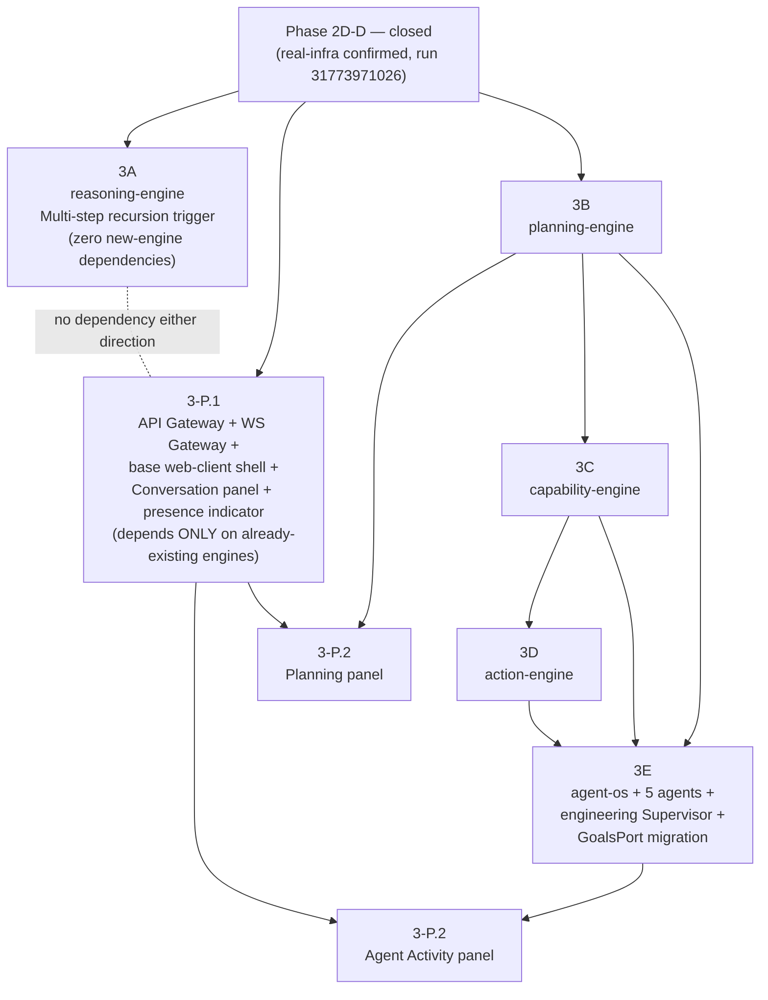

# Phase 3 — Master Scope Document

**Status: design preparation. No production code is authorized by this
document.** This is the top-level scope reference for the Phase 3 TDD
package (documents 03-08 in this directory). It defines the final boundary
between Phase 2D-D, the Gateway & Web-Client Prerequisite slice, and Phase
3 proper, per the user's explicit decisions on 2026-08-13, superseding
nothing in `00-research-and-scope.md` or `01-tdd-preparation-and-fork-resolutions.md`
but making their conclusions actionable.

---

## 1. The three-part boundary

### 1.1 Phase 2D-D — closed

Status: **formally closed.** Confirmed via real GitHub Actions run
`31773971026` (`real-infra-checks.yml`, `schedule` trigger,
2026-08-14T05:44:39Z, against commit `e4ea5c0`) — all 5 real-infra jobs
succeeded, including `communication-engine`'s
`test_get_last_outbound_turn_returns_the_most_recent_one` (the Step 10
timestamp-tie fix, `812faf0`) and `digital-twin-engine`'s
`test_proactive_delivery_record_persists_and_lists_recent_by_window`
(Step 9's addition, confirmed for the first time). Full job output
recorded in `docs/roadmap/architecture-reviews/phase-2d-d-gate-review.md`
§6.3, which now reads "Complete" (§9 of that document).

**The dependency boundary this section names is now satisfied.** Phase 3
implementation is authorized to begin once the user reviews and approves
this TDD package — this document package itself remains design-only.

### 1.2 `3-P` — Gateway & Web-Client Prerequisite (new, explicit, bounded)

Per the user's explicit decision: this is **not Phase 2E**. It is a
named, bounded slice inside Phase 3's own scope, addressing a gap the
roadmap did not anticipate (`api-gateway`, `ws-gateway`, and the base
`apps/web-client` shell were nominally a **Phase 2D** deliverable,
`ENGINEERING_ROADMAP.md:450-452`, that was never built — see
`01-tdd-preparation-and-fork-resolutions.md` §11 for the full discovery).

**Why a slice, not a phase renumbering:** the roadmap's own phase
numbering stays untouched (per user decision 2). `3-P` is scoped and
sequenced like a TDD (own scope, dependencies, acceptance criteria,
verification — see `03-gateway-web-prerequisite.md`), it is simply
prefixed `3-P` rather than `3A`-`3E` to signal it is infrastructure
*for* Phase 3's user-facing surface, not one of the five roadmap-named
Phase 3 engines/components.

**The load-bearing scoping decision, stated precisely (resolves the
user's instruction to map dependency explicitly rather than force it into
the engine chain):** `3-P` splits into two genuinely independent
increments:

- **`3-P.1` (base shell + gateways + already-existing-engine panels)**
  depends **only** on Phase 2D-D being closed. It requires **no** Phase 3
  engine (`3A`-`3E`) to exist. Concretely: `api-gateway`, `ws-gateway`,
  the base `apps/web-client` shell (routing, panel-loading
  infrastructure, `realtime/` WebSocket client, TanStack Query cache
  wiring, `entities/`, `shared/`), the **Conversation panel** (Phase 2D's
  own never-built "first real UI," `ENGINEERING_ROADMAP.md:451`), and a
  presence/identity indicator — all of which read/write against
  `communication-engine`, `personality-engine`, and `perception-engine`,
  every one of which already exists and is already Gate-Reviewed.
- **`3-P.2` (Planning + Agent Activity panels)** is the literal Phase 3
  roadmap line item (`ENGINEERING_ROADMAP.md:518`: *"`apps/web-client`:
  Planning + Agent Activity panels added"*) — genuinely additive to
  `3-P.1`'s already-working shell, and genuinely dependent on `3B`
  (`planning-engine`, for the Planning panel's data) and `3E` (`agent-os`,
  for the Agent Activity panel's data).

**The engines (`3A`-`3E`) have zero dependency on `3-P` in either
direction.** Every engine in this project to date has been built, unit/
integration/real-infra-tested, and Gate-Reviewed with **zero** frontend
existing (confirmed: every prior Gate Review's metrics table carries a
"0 React files" line through Phase 2D-B). Phase 3's engines follow the
identical, already-established pattern — verified via API/event contracts
and `docs/architecture/16-testing-strategy.md` §5's structural-verification
philosophy, never via a UI. `3-P` is a **consumer** of `3B`/`3E`'s output
once they exist, not a prerequisite blocking their own implementation or
verification.

### 1.3 Phase 3 proper — `3A` through `3E`

Unchanged from the user's specified structure:

- **`3A`** — reasoning-engine Multi-step recursion trigger. Zero
  dependencies; comes first.
- **`3B`** — `planning-engine`.
- **`3C`** — `capability-engine`. Depends on `3B` only insofar as the
  roadmap's own sequencing places it second (no direct technical
  dependency — `capability-engine`'s registry/sandboxing work is
  self-contained); kept in roadmap order per the user's approved
  sequencing.
- **`3D`** — `action-engine`. Depends on `3C` (executes against
  capabilities that must already be registered).
- **`3E`** — `agent-os/{kernel,sdk,registry,supervisors}` + the five
  agent packages + `engineering` Supervisor + `GoalsPort` real-RPC
  migration (both `reasoning-engine` and `executive-cognition-engine`).
  Depends on `3B` + `3C` + `3D` all existing (agents need Task Graphs,
  capabilities, and action execution to do real work).

---

## 2. Full dependency graph

Key properties of this graph, stated explicitly since the user asked for
the mapping to be explicit rather than forced:

- `3A` is an isolated leaf — depends on nothing new, blocks nothing.
- `3-P.1` depends only on Phase 2D-D, runs fully in parallel with `3A`
  through `3E`.
- `3-P.2` is the only node depending on both an engine TDD (`3B`/`3E`)
  and the prerequisite slice (`3-P.1`) — it is downstream of both, never
  upstream of either.
- The engine chain `3B → 3C → 3D → 3E` is unchanged from the
  previously-approved sequencing.

---

## 3. Implementation order

1. **`3A`** (reasoning-engine recursion trigger) — zero dependencies,
   lowest risk, closes long-standing Phase 2B debt. Can start the moment
   Phase 2D-D closes.
2. **`3-P.1`** (gateways + base shell + Conversation panel) — can start
   in parallel with `3A`, also gated only on Phase 2D-D closure. Running
   these two in parallel is explicitly safe: they share no code, no
   contracts, no persistence, no team-sequencing dependency.
3. **`3B`** (`planning-engine`).
4. **`3C`** (`capability-engine`).
5. **`3D`** (`action-engine`).
6. **`3E`** (`agent-os` + agents + supervisor + `GoalsPort` migration).
7. **`3-P.2`** (Planning panel, once `3B` ships; Agent Activity panel,
   once `3E` ships) — these two panel additions do not need to land
   together; the Planning panel can ship as soon as `3B` is done, without
   waiting for `3C`-`3E`.

This differs from the strict roadmap step order in exactly the
already-approved ways (§10 of `01-tdd-preparation-and-fork-resolutions.md`):
`3A` moved first; `3-P` is new and runs in parallel rather than being
silently absorbed into any engine TDD.

---

## 4. What changed since the last approved scope

Nothing changes the substance of `3A`-`3E` themselves. What's new in this
document, all stemming directly from the user's decisions this turn:

1. `3-P` is now formally named, scoped, and split into `3-P.1`/`3-P.2`
   (not decided at the fork-resolution stage — that stage only flagged
   the gap existed).
2. The dependency mapping in §2 makes explicit and permanent that `3A`-
   `3E` never depend on `3-P` — this was implied but not stated as
   firmly in the prior document.
3. `3-P.1` is scoped to include the **Conversation panel** and presence
   indicator (Phase 2D's own undelivered "first real UI"), not just the
   gateways — because a base shell with zero working panels is not a
   meaningfully testable/demoable increment, and the Conversation panel
   is the one panel with zero Phase 3 dependency, making it the correct
   first panel to validate the shell against.

---

## 5. Documents in this package

| Doc | Covers |
|---|---|
| `02-master-scope.md` | This document. |
| `03-gateway-web-prerequisite.md` | `3-P.1`/`3-P.2` full design. |
| `04-tdd-3a-reasoning-recursion.md` | `3A`. |
| `05-tdd-3b-planning-engine.md` | `3B`. |
| `06-tdd-3c-capability-engine.md` | `3C`. |
| `07-tdd-3d-action-engine.md` | `3D`. |
| `08-tdd-3e-agent-os.md` | `3E`. |

Each TDD follows the evidence discipline established throughout Phase
2D: existing capability vs. planned capability distinguished explicitly;
fully-verified vs. contract-verified vs. real-infra-verified vs.
genuinely-unverified behavior distinguished explicitly; no contract,
metric, event semantic, persistence model, or security behavior invented
without documentation or explicit approval; all open forks surfaced, none
silently resolved.

**No production code is written or modified by this document package.
Implementation of `3A` (or any other slice) does not begin until the user
gives explicit approval after reviewing this package.**
