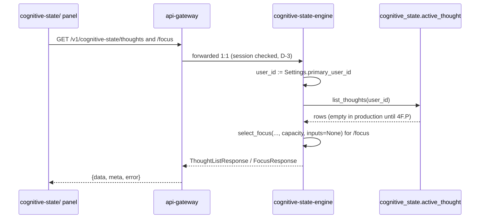

# TDD 4F.7 — The `cognitive-state/` panel
## A read-only `/v1/cognitive-state` surface, sensor status through an existing subject, and deployment

**Status: PREPARED 2026-09-26. The inputs are ratified; two of this document's own decisions are not.**

- **RATIFIED inputs.** RS-1 … RS-11 (TDD 4F §24, ratified 2026-09-26) bind this
  document. Nothing here reopens them.
- **Blocking before implementation.** Two TDD-level decisions must be ratified
  first: **A-4F7-1** (where normalized sensor state is held) and **A-4F7-2**
  (which `status` values `perception-engine` publishes). Both are persistence or
  externally visible semantics. §20 gives each one its options and a
  recommendation.
- **Not blocking.** A-4F7-3 … A-4F7-6 have recommended defaults.
- **No implementation exists.** No branch is created by this document, and no
  production file, migration, test or workflow has been modified to prepare
  it.

| | |
|---|---|
| **Date** | 2026-09-26 |
| **Prepared against** | `phase-4` = **`4e19ed19876f2c76dd6f6591b1aa9cc778dd2e89`** (the merge of PR #37). `main` = `7e273e62e942ecd5528ca807e65933d6bb675669`. Every repository fact below was read at this tree |
| **Protocol** | [`PROJECT_PHASE_COMPLETION_PROTOCOL.md`](../../PROJECT_PHASE_COMPLETION_PROTOCOL.md), sha256 `21185dd1b2a43e87eac0a52aa5e53c8e8bbb01223014dc2a48408bbb0478de6a`, 1131 lines, read from `origin/main`, byte-identical on `phase-4` |
| **Subordinate to** | [TDD 4F](06-tdd-4f-companion-and-cognitive-state.md) — especially §4.1, §11.3, §11.5, §12, §13, §18 as amended, and **§24** (the ratified RS decisions). Also [TDD 4F.6](10-tdd-4f6-initiative-trigger.md) §2 and §19. Where this document and TDD 4F disagree, **TDD 4F governs**, and the disagreement belongs in §20, not in an implementation |
| **Bible** | [Part 6](../../bible/part-06-nova-cognitive-state-engine.md): Active Thoughts (l.101–137), Focus System (l.139–163), Attention Layers (l.165–189), Thinking Visualization (l.449–473) |

---

## 1. Purpose and scope

TDD 4F §18's 4F.7 row, verbatim:

> **4F.7** | `cognitive-state/` panel + `/v1/cognitive-state` prefix | *Proves:*
> AC-7 clause 2 visibly

Read with TDD 4F §24, **4F.7 is a strictly read-only display slice** (RS-1b).
It **proves one row of TDD 4F §4.1**: *"visibly … in the panel — the panel
renders sensor state from the engine's REST read surface"* (RS-3b).

### 1.1 What 4F.7 builds

| # | Item | Ratified by |
|---|---|---|
| 1 | A **`GET`-only** read surface in `cognitive-state-engine` under `/v1/cognitive-state`, with identity resolved server-side from `primary_user_id` | RS-4a |
| 2 | **Active Thoughts** with every Part 6 field, and their **Attention Layer** | RS-4a |
| 3 | **Focus** entries — `score` and `signals_used` — derived by the existing `select_focus` | RS-4a |
| 4 | **Normalized sensor state** | RS-3a, RS-4a |
| 5 | **`ProposedAction` display**, as a proposal only | RS-4c |
| 6 | The **`/v1/cognitive-state`** `api-gateway` prefix, forwarded 1:1 | RS-5, D-6 |
| 7 | The **`cognitive-state/` web panel** | TDD 4F §18 |
| 8 | **Deployment**: a compose service and a `run-migrations.sh` entry | RS-4d |
| 9 | **`perception-engine` publishing** the existing `perception.sensor.health_changed` on its existing sensor lifecycle transitions | RS-3a |
| 10 | **`cognitive-state-engine` subscribing** to that existing subject — its subscribe allow-list goes from empty to exactly that one subject | RS-3a |

---

## 2. Non-goals

Each is excluded by a ratified decision, and §16's negative tests hold several
of them.

| Excluded | Ratified by |
|---|---|
| Thought creation; `ProposedAction` authoring; promotion; any call to `promote_thought` | RS-1b, RS-2 |
| CAS on the promotion transition; Layer 2 logical deduplication | RS-7, RS-1c (they belong to **4F.P**) |
| Trigger retry; an outbox for the trigger; TTL; stale-trigger semantics; failed-trigger persistence | RS-7; TDD 4F.6 §19 rows 9, 10, 14 |
| Any Thought-to-Decision linkage; reading `autonomy-engine` data | RS-4b |
| Any autonomy route; any `TrustMetric` subject, RPC or route | RS-4b; TDD 4F §11.4; TDD 4F.6 §19 rows 17, 18 |
| Any new Event Bus subject; any `PUBLIC_TOPICS` change | RS-3a; TDD 4F §16.1 control 2 |
| A `/v1/perception` prefix, or any prefix other than `/v1/cognitive-state` | RS-5; D-4F-4 |
| Any `nova-companion` change; `chmod` detection; claiming that OS revocation is demonstrated | RS-3b |
| Autonomy Levels 3–5 | TDD 4F §2.1 |
| The 4F.8 E2E; the AC-8 implementation; the Gate Review | TDD 4F §18; L-1 |
| A `Triggered` enum, field or persisted outcome | RS-6a |
| A write route of any kind under `/v1/cognitive-state` | RS-1b |

---

## 3. Dependencies — each verified at `4e19ed1`

| Dependency | State |
|---|---|
| `ActiveThought`, `AttentionLayer`, `ProposedAction`, `FocusedThought`, `FocusInputs` | **Exist** in `cognitive-state-engine/src/nova_cognitive_state_engine/domain/models.py`: `AttentionLayer` l.65, `FOCUSABLE_LAYERS` l.100, `ProposedAction` l.131, `ActiveThought` l.163, `FocusInputs` l.253, `FocusedThought` l.287 |
| `select_focus` | **Exists** in `domain/focus.py` l.61–96 and has **no production caller**. Ranking is `priority × signal multiplier`, and with no signals supplied the multiplier is 1.0 and `signals_used == ()` (l.40–58) |
| `list_thoughts(user_id=…)` | **Exists** in `repository/postgres_cognitive_state_repository.py` l.127–147. It orders newest-updated first, with `thought_id` as the tiebreaker, and has **no production caller** |
| `Settings.primary_user_id`, `focus_capacity` | **Exist**: `config.py` l.24 and l.35 (capacity 7) |
| Repository wiring in `main.py` | **Absent.** `main.py` l.44–49 binds only the trigger port. The 4F.6 record §3.1 D-6 explains why: wiring would import `nova_service_kit`, which this engine did not declare |
| `cognitive-state-engine` HTTP surface | **`/internal/*` only** (`api/health.py`, plus `/internal/metrics`) |
| `SUBSCRIBABLE_SUBJECTS` | **Empty** (`events/subscribed.py` l.18). `PUBLISHABLE_SUBJECTS` = `{autonomy.decision.requested}` |
| `perception.sensor.health_changed` | **Registered**: `PerceptionSensorHealthChangedPayload{sensor_id, sensor_type, status: str, schema_version}` in `nova_contracts/events/perception.py` l.237–246. It is **publishable** by `perception-engine` (`events/published.py` l.52), in **`PUBLIC_TOPICS`** (`ws-gateway/domain/protocol.py` l.79, added in 4B), and **subscribed by `ws-gateway`** (`events/subscribed.py` l.48). Its builder `publishers.sensor_health_changed` (l.190–200) has **no production caller** |
| Sensor lifecycle | `SensorState` = `uninitialized, initialized, running, paused, stopped, failed` (`perception-engine/domain/sensor.py` l.29). There are eight transitions (l.31–40) |
| Production lifecycle call sites in `perception-engine` | **Startup**: `initialize` then `start` for voice, camera and filesystem (`main.py` l.112–117). **Consent revocation**: `stop`, microphone and camera only, since `Source` is `Literal["microphone","camera"]` (`api/consent.py` l.78–80; `domain/models.py` l.37). **Observation-window failure**: `report_error`, which fails voice and camera (`observation_orchestration.py` l.156–164; `camera_sensor.py` l.112–114; `voice_sensor.py` l.116–118) but **not** filesystem (`filesystem_sensor.py` l.154–162). **Shutdown**: `stop` (`main.py` l.171–173). **No production caller of `pause` or `resume`** |
| Outbox dispatch | Arq cron **every 10 s** (`perception-engine/workers/__init__.py` l.87). `EventEnvelope.event_id` is the outbox row id (`nova_service_kit/outbox.py` l.99). `occurred_at` defaults to **construction time**, which is dispatch time (`nova_contracts/envelope.py` l.24) |
| Event Bus subscription | Core NATS `nc.subscribe` with no JetStream consumer (`nova_eventbus_sdk/backends/nats.py` l.100). Every non-queue subscriber receives every message; a subscriber that is not connected receives nothing |
| `api-gateway` | Eight prefixes (`domain/routing.py` l.102–200). *"Every prefix here is a **panel's** data source"* (l.96). The exact set is pinned by `tests/integration/test_gateway.py` l.494–530 |
| Deployment | `cognitive-state-engine` has **no compose service** and **no `run-migrations.sh` entry** (`infra/docker`: 0 matches for "cognitive"). It **is** in `build-and-scan.yml` (l.109) and `real-infra-checks.yml` (l.107) |
| E2E stack | `pr-checks.yml` l.247–259 starts neither `cognitive-state-engine` nor `perception-engine` |
| Web client | Ten nav paths (`src/app/AppShell.tsx` l.30–44), pinned by `tests/unit/routing.test.ts` l.43–54. REST panels do not poll (`src/entities/digitalTwin.ts` l.18–22; `src/app/queryClient.ts`). The Events panel records **every** public-topic frame (`src/realtime/reconcile.ts` l.117–125) |

---

## 4. Authoritative source mapping

| Requirement | Source |
|---|---|
| Strictly read-only; no promotion, thought creation or authorship | TDD 4F §24.2 **RS-1b** |
| Promotion is `cognitive-state-engine`'s, in **4F.P** | **RS-1a**, **RS-1c**; TDD 4F §18 as amended |
| No existing producer; no thought ingestion in 4F.7 | **RS-2a**, **RS-2b** |
| The sensor path through the existing subject, and its accepted consequence | **RS-3a** |
| Revocation detection OPEN; 4F.7 proves only §4.1's last row | **RS-3b** |
| The read surface's content, identity and emptiness | **RS-4a** |
| No decision linkage | **RS-4b** |
| `proposed_action` as a proposal only | **RS-4c** |
| Deployment wiring | **RS-4d**; 4F.1 completion record §8 |
| One prefix, 1:1 | **RS-5**; D-6 (master scope §8) |
| No per-thought triggered state | **RS-6a**; **RS-6b** |
| No change to promotion semantics | **RS-7** |
| Stand-ins are test infrastructure only | **RS-8** |
| The SAD 15 §4 item 1 exception | **RS-9** |
| Normalized state only, never raw sensor events | TDD 4F §12 |
| No realtime cognitive-state subject | D-4F-6 (TDD 4F §11.3) |
| *"represent real internal activity. Never generate fake animations"* | Part 6 l.471–473 |
| No fabricated sensor data, fake clock or injected bus message | TDD 4F §2.2 property 5; §16.1 control 12 |

---

## 5. Deliverables and every file they touch

The component list is RS-9's exception, and nothing outside it is an engine's
`src/`.

| # | Deliverable | Files | RS-9 surface |
|---|---|---|---|
| D1 | Sensor-state persistence (**if A-4F7-1 (a)**) | `alembic/versions/0003_sensor_state.py`, `repository/models.py`, `repository/postgres_cognitive_state_repository.py`, `domain/ports.py` | `services/cognitive-state-engine/` |
| D2 | Sensor-health normalization (pure) and the event handler | `domain/sensor_state.py` (new), `events/handlers.py` (new), `events/subscribed.py` | same |
| D3 | The read API | `api/cognitive_state.py` (new) | same |
| D4 | Lifespan wiring: repository, routers, the one `subscribe()` | `main.py`; `pyproject.toml` and `Dockerfile` (A-4F7-4) | same |
| D5 | Publication on existing lifecycle transitions | `sensor_lifecycle.py` (new, package root), `main.py`, `api/consent.py`, `observation_orchestration.py` | `services/perception-engine/` |
| D6 | The prefix | `domain/routing.py`, `config.py`, `main.py` | `services/api-gateway/` |
| D7 | Deployment | `docker-compose.local.yml` (a new service, plus `api-gateway`'s env and `depends_on`), `run-migrations.sh` | `infra/docker/` |
| D8 | The panel | `src/entities/cognitiveState.ts`, `src/panels/cognitiveState/CognitiveStatePanel.tsx`, `src/app/router.tsx`, `src/app/AppShell.tsx` | `apps/web-client/` |
| D9 | Tests for all of the above | each surface's `tests/`, and `apps/web-client/tests/{unit,e2e}/` | per surface |
| D10 | Documentation (§17) | READMEs; `docs/architecture/07`, `09`, `10`, `11`, `14`; `infra/docker/README.md` | documentation |

**Files 4F.7 also needs that are not an engine's `src/`.** SAD 15 §4 item 1
therefore does not govern them, and RS-9 neither covers them nor needs to. They
are listed here so that none is discovered at review:

| File | Why |
|---|---|
| `.github/workflows/pr-checks.yml` | The e2e job's `docker compose up` list (l.247–259) must gain **`cognitive-state-engine`**, or the panel's Playwright spec cannot reach its upstream. See A-4F7-5 for whether it must also gain `perception-engine` and its worker |
| `uv.lock` (repository root) | Changes **only if A-4F7-4 (a)** adds `nova-service-kit` to `cognitive-state-engine`'s dependencies |

**Unchanged: 0 files**, each asserted at closure:

- `nova-contracts`: no contract change, so TypeScript codegen shows zero drift;
- `nova-eventbus-sdk`;
- `ws-gateway`;
- `action-engine`;
- `autonomy-engine`;
- `world-model-engine`, `memory-engine`, `digital-twin-engine`;
- `companion/`;
- `agent-os/`;
- `tools/`.

---

## 6. Architectural boundaries and ownership

| Boundary | 4F.7's position |
|---|---|
| **Active Thoughts, Focus, Attention Layers** | Owned by `cognitive-state-engine` (TDD 4F §10). 4F.7 **reads** them; it writes none |
| **Sensor lifecycle and permission status** | Owned by `perception-engine` (TDD 4F §10). 4F.7 makes perception **report** transitions it already performs. It adds no transition, and it adds **no** `failed` path for the filesystem sensor (RS-3b) |
| **Normalized sensor state** | A derived, read-only **copy** held by `cognitive-state-engine` for its read surface (A-4F7-1). It is not a second source of truth: `perception-engine` remains the owner, and the copy is labelled *last reported*, never *current* |
| **Decision state** | `autonomy-engine`'s, and **not read** (RS-4b) |
| **ADR-004** | Engine-to-engine only over the Event Bus. `cognitive-state-engine` never calls `perception-engine`'s `GET /v1/perception/sensors` |
| **ADR-025** | One trusted user. The Active Thoughts endpoints resolve `primary_user_id` server-side. Sensor state is instance-wide, because the payload carries no `user_id` |
| **TDD 4F §6.2 prohibitions** | Unchanged. The engine still publishes only `autonomy.decision.requested`, and 4F.7 adds no publication |

---

## 7. The API contract

**Three routes, all `GET`, none with a path parameter, query parameter or
body.** `api-gateway` wraps every response in doc 11 §4's `{data, meta, error}`
envelope. The engine returns the bodies below.

| Method | Path | Body returned |
|---|---|---|
| `GET` | `/v1/cognitive-state/thoughts` | `ThoughtListResponse` |
| `GET` | `/v1/cognitive-state/focus` | `FocusResponse` |
| `GET` | `/v1/cognitive-state/sensors` | `SensorStateListResponse` |

**Every response model forbids unknown fields** (`extra="forbid"`), following
the precedent of 4D and 4E (`digital-twin-engine/api/digital_twin.py`'s
`_Strict`).

### 7.1 `GET /v1/cognitive-state/thoughts`

This returns every Active Thought whose `user_id` is `Settings.primary_user_id`,
in `list_thoughts`' order. **An empty store returns
`{"thoughts": []}`, with no placeholder** (RS-4a).

```
ThoughtListResponse:
    thoughts: list[ThoughtResponse]

ThoughtResponse:                              # from ActiveThought, models.py l.163–200
    thought_id: UUID
    description: str
    priority: int                              # Part 6: Priority
    confidence: float                          # Part 6: Confidence
    dependencies: list[UUID]                   # Part 6: Dependencies
    estimated_completion: datetime | null      # Part 6: Estimated completion — null is "not estimated"
    related_memories: list[UUID]               # Part 6: Related memories
    related_projects: list[UUID]               # Part 6: Related projects
    current_progress: float                    # Part 6: Current progress
    attention_layer: "immediate" | "active" | "passive" | "dormant" | "archived"
    created_at: datetime
    updated_at: datetime
    proposed_action: ProposedActionResponse | null      # RS-4c

ProposedActionResponse:                       # from ProposedAction, models.py l.131–160
    category: str          # a PermissionCategory value
    risk: str              # a RiskLevel value
    action_type: str       # "terminal" | "filesystem"
    execution_target: str
    verification_method: str
    title: str
    detail: str
```

**Deliberately absent from both models:**

- `user_id`. Identity is the server's, and echoing it adds nothing a client may
  act on.
- **Any status, outcome, decision, `subject_id`, triggered, executed or
  timestamp-of-trigger field.** The persisted `proposed_action` has none, and
  RS-4b and RS-6a forbid adding one.

### 7.2 `GET /v1/cognitive-state/focus`

This returns `select_focus(list_thoughts(primary_user_id),
capacity=Settings.focus_capacity, inputs=None)`, the existing function,
unchanged.

```
FocusResponse:
    capacity: int                       # Settings.focus_capacity
    entries: list[FocusEntryResponse]   # at most `capacity`, select_focus's order

FocusEntryResponse:                     # from FocusedThought, models.py l.287–299
    thought: ThoughtResponse
    score: float
    signals_used: list[str]             # FocusSignal values
```

**Signal computation stays OPEN.** No production code computes a `FocusInputs`
signal. So in 4F.7:

- **`signals_used` is always `[]`**, and the score equals the thought's priority
  (`combine_signals`' multiplier of 1.0).
- **The response says this rather than hiding it.** The panel labels an empty
  `signals_used` (§12).
- **4F.7 supplies no signal.** Doing so would decide the OPEN
  "Focus signal computation" item.

### 7.3 `GET /v1/cognitive-state/sensors`

This returns the last **normalized** report per sensor, ordered by
`sensor_id`. **If no report has been received, the result is
`{"sensors": []}`.** No sensor row is ever synthesized.

```
SensorStateListResponse:
    sensors: list[SensorStateResponse]

SensorStateResponse:
    sensor_id: str          # the payload's own identifier, e.g. "companion-filesystem"
    sensor_type: str        # the payload's own type, e.g. "filesystem"
    state: "initialized" | "running" | "paused" | "stopped" | "failed" | "unrecognized"
    reported_at: datetime   # EventEnvelope.occurred_at — see below
```

**What is and is not exposed.**

- `sensor_id` and `sensor_type` pass through. Both are the payload's own fields,
  and both are already browser-visible on the public topic (RS-3a).
- `status` is **normalized** into the closed `state` enum (§8.3). The raw string
  is never returned.
- **Not exposed, because none is in the payload:** `perception-engine`'s
  capabilities, health `detail` or `error_rate`, error reports, permission
  detail, file paths and companion configuration.

**`reported_at` is when `perception-engine`'s outbox dispatched the report, not
when the transition happened.** The envelope's `occurred_at` is set at
dispatch (§3), up to about 10 s later. It is named for what it is.

### 7.4 What every route enforces

| Property | How |
|---|---|
| `GET` only | Only `@router.get` is declared under `/v1/cognitive-state`. `POST`, `PUT`, `PATCH` and `DELETE` return **405** from the engine, and `api-gateway` forwards that status |
| Server-side identity | No route declares a `user_id` parameter. A `?user_id=` supplied by a caller is ignored, and the result is still `primary_user_id`'s |
| No write | No route calls `upsert_thought`, `move_layer` or `promote_thought`, and no route has a request body |
| An error is never an empty success | A store or validation failure is an error response. It is never `[]`, because an empty list is a claim that nothing exists |
| Unreachable internals | `/internal/*` is never forwarded, because `RouteTable` refuses non-`/v1/` prefixes (`routing.py` l.38) |

---

## 8. Sensor state — publication, subscription, normalization, persistence

### 8.1 Publication (`perception-engine`, RS-3a)

**One helper performs a lifecycle call and reports it when the state actually
changed.** Illustrative:

```
sensor_lifecycle.transition(sensor, action, *, repository, correlation_id)
    before = sensor.state()
    await <sensor.initialize | start | stop>()          # or report_error → fail
    after = sensor.state()
    if after != before:
        await repository.enqueue_outbox(
            publishers.sensor_health_changed(            # existing builder, l.190
                sensor_id=sensor.sensor_id,
                sensor_type=sensor.configuration().sensor_type,
                status=<A-4F7-2>,                        # the vocabulary is §20's decision
                correlation_id=correlation_id,
            )
        )
```

| Rule | Why |
|---|---|
| **The `Sensor` Protocol is unchanged** | TDD 4F §7.2: *"The `Sensor` Protocol is **unchanged**"*. The report is made **at the call site**, not inside the sensor classes |
| **Existing transitions only** | The four call-site groups in §3: startup, consent revocation, observation-window failure and shutdown. No transition is added. `pause`/`resume` have no production caller and gain none |
| **No report for a no-op** | `next_state` returns `None` for an undefined pair, and the sensor keeps its state (`filesystem_sensor.py` l.70–81). Reporting it would fabricate a change |
| **Through the existing outbox** | Durable queueing, per the transactional outbox (TDD 4F §1.1(a)). Dispatch happens on the existing 10 s cron. **No direct publish and no push dispatch** (D-4F-1) |
| **`correlation_id`** | Consent revocation uses the revoked grant's `consent_id`, as `consent_changed` already does (`api/consent.py` l.82–86). The failure path uses the observation's `correlation_id`. Startup and shutdown have no request, so a fresh `uuid4()` is used |
| **Filesystem sensor** | It reports `initialized` and `running` at startup, and `stopped` at shutdown. **It never reports `failed`**, because no such path exists (RS-3b). 4F.7 adds none |

### 8.2 Subscription (`cognitive-state-engine`, RS-3a)

- `SUBSCRIBABLE_SUBJECTS` becomes **exactly** `{"perception.sensor.health_changed"}`.
  `PUBLISHABLE_SUBJECTS` is unchanged.
- `main.py`'s lifespan makes **one** `bus.subscribe(...)`, with no queue group,
  matching every other engine's subscriptions. It happens after the repository
  exists and **before** `app.state.ready = True`.
- **The handler, in order:**
  1. Validate the payload as `PerceptionSensorHealthChangedPayload`. On
     `ValidationError`, **log and drop**, and leave the state unchanged.
  2. Normalize the status (§8.3).
  3. Apply the conditional write (§8.4).
- **It never replies, publishes or raises out of the handler.** A failure is
  logged with the envelope's `event_id` and `correlation_id`.

### 8.3 Normalization (pure, `domain/sensor_state.py`)

| Payload `status` | Normalized `state` |
|---|---|
| each reachable lifecycle value: `initialized`, `running`, `paused`, `stopped`, `failed` | the same value (**if A-4F7-2 (a)**) |
| anything else, including `uninitialized`, `healthy`, `unhealthy` and `""` | **`unrecognized`** |

`unrecognized` is an honest *"perception reported something this engine does
not recognise"*. It is **never mapped to `running` or `failed`**, since a guess
in either direction is a fabricated sensor state (TDD 4F §2.2 property 5).
`uninitialized` is never published, because no transition *enters* it.

### 8.4 Persistence (**A-4F7-1**; the recommended option is shown)

**The table, additive in the `cognitive_state` schema** (TDD 4F §13:
*"additive tables only; zero existing tables altered"*):

```
cognitive_state.sensor_state          -- migration 0003
    sensor_id      TEXT PRIMARY KEY
    sensor_type    TEXT NOT NULL
    state          TEXT NOT NULL      -- a normalized value only
    reported_at    TIMESTAMPTZ NOT NULL
    last_event_id  UUID NOT NULL
```

**One conditional upsert.** It is a single statement, not a read followed by a
write, following `autonomy-engine`'s `decide_suggestion` conditional-`UPDATE`
pattern:

```
INSERT … ON CONFLICT (sensor_id) DO UPDATE SET …
  WHERE sensor_state.last_event_id <> EXCLUDED.last_event_id
    AND sensor_state.reported_at   <= EXCLUDED.reported_at
```

- **Redelivery.** The outbox may re-publish a row after a crash, carrying the
  same `event_id` (`nova_service_kit/outbox.py` l.89–93). A redelivered report
  therefore changes nothing.
- **Order.** A report older than the stored one never overwrites it.
- **No `user_id` column**, because sensors are instance-wide (§6).
- **No default rows and no seed.** An empty table is *"no report received"*.

---

## 9. Data flow

```mermaid
sequenceDiagram
    participant PE as perception-engine
    participant OB as perception outbox + worker (10 s cron)
    participant NATS as Event Bus (core NATS)
    participant WS as ws-gateway
    participant CS as cognitive-state-engine
    participant DB as cognitive_state schema
    participant GW as api-gateway
    participant UI as cognitive-state/ panel

    PE->>PE: existing lifecycle call (e.g. start)
    PE->>OB: enqueue perception.sensor.health_changed (state changed only)
    OB->>NATS: publish envelope (event_id = row id)
    NATS-->>WS: delivered (already subscribed; PUBLIC_TOPICS; RS-3a consequence)
    NATS-->>CS: delivered, if subscribed at that moment
    CS->>CS: validate payload → normalize status
    CS->>DB: conditional upsert sensor_state
    UI->>GW: GET /v1/cognitive-state/sensors (on mount / explicit Refresh)
    GW->>CS: forwarded 1:1
    CS->>DB: SELECT
    CS-->>GW: SensorStateListResponse
    GW-->>UI: {data, meta, error}
```



**The failure path.**

- A store failure produces an error status at `CS`. `GW` forwards it as an
  envelope error, and the panel's `DegradationNotice` renders it. **No path
  turns an error into an empty list.**
- `api-gateway` answers **502** for an upstream that is not running
  (`docker-compose.local.yml`'s comment on `service_started`).

---

## 10. Event Bus

| Invariant | Required at closure |
|---|---|
| Registered subjects | **120**, unchanged. **No new subject** |
| `PUBLIC_TOPICS` | **Byte-identical at 18** (`digital-twin-engine`'s control 2 and `ws-gateway`'s tests already pin it) |
| `perception.sensor.health_changed` | Unchanged contract. **Gains its first production publisher** (`perception-engine`) and **its first engine consumer** (`cognitive-state-engine`), in addition to `ws-gateway` |
| `cognitive-state-engine` allow-lists | Publish `{autonomy.decision.requested}`, unchanged. Subscribe **exactly** `{perception.sensor.health_changed}` |
| Realtime cognitive-state subject | **None** (D-4F-6) |

**The accepted consequence (RS-3a).** Once `perception-engine` publishes the
subject, **every browser subscribed through `ws-gateway` receives it**, and the
Events panel records each frame. This follows from `reconcile.ts` l.117–125,
because the web client subscribes to all of `PUBLIC_TOPICS` (`client.ts`
l.70, l.112). Each frame carries only `{sensor_id, sensor_type, status,
schema_version}`.

**A historical design record this broadens.** Phase 2D-B's design described the
subject as published on *"repeated failures … for observability"*, with *"no
engine consumer this phase"* (`docs/design/phase-2d/03-perception-engine.md`
l.827, l.870–871). RS-3a broadens the publication condition to lifecycle
transitions. The 2D-B text is dated and not edited (TDD 4F §24.4, consequence
2).

---

## 11. Persistence and migration

| | |
|---|---|
| **Migration** | `0003_sensor_state.py`: `CREATE TABLE cognitive_state.sensor_state` (§8.4) **only if A-4F7-1 (a)**. It is additive: no existing column, constraint or table changes. `downgrade` drops the table |
| **Existing table** | `cognitive_state.active_thought` is **read only**. No column is added. `proposed_action` is read as persisted (RS-4c: *"no new persistence"*) |
| **ORM** | One new class, `SensorStateORM`, only under A-4F7-1 (a) |
| **Version table** | `alembic_version_cognitive_state`, unchanged (`alembic/env.py`) |
| **Migrator** | `run-migrations.sh` gains `"services/cognitive-state-engine:COGNITIVE_STATE_ENGINE_"`. The prefix is read from `config.py`'s `env_prefix`, which `tools/tests/test_compose_migrations.py` checks |

---

## 12. The `cognitive-state/` panel

**Where it lives.**

- `src/panels/cognitiveState/CognitiveStatePanel.tsx`, lazily loaded at
  `/cognitive-state`.
- A nav entry, `{ path: "/cognitive-state", label: "Cognitive State" }`,
  appended to `AppShell.tsx`'s `PANELS`.
- `src/entities/cognitiveState.ts` holds **strict** zod schemas for §7's three
  bodies. An unknown field fails the parse, as in `digitalTwin.ts`.

| Rule | Detail |
|---|---|
| **Real data only** | Every value rendered comes from §7's three `GET`s through `gatewayFetch`. Nothing is defaulted, averaged or invented |
| **Honest empty states** | *No Active Thoughts* means `thoughts` is `[]`. *Nothing is in focus* means `entries` is `[]`. *No sensor report has been received* means `sensors` is `[]`. **Each renders as that statement and nothing else**: no placeholder cards and no sample rows |
| **Layers** | Thoughts are grouped by `attention_layer` in Part 6's order: Immediate, Active, Passive, Dormant, Archived. An empty layer is shown as empty |
| **Part 6 fields** | Every field in §7.1 is rendered. `estimated_completion: null` renders as *"not estimated"*, never a date or a zero |
| **Focus** | Shows score and capacity. An empty `signals_used` renders as *"ranked by priority alone — no focus signals were supplied"* |
| **Proposal** | `proposed_action` renders in a block titled **"Proposal"**. It is **never** labelled, styled or iconified as triggered, decided, approved, executing, executed or dispatched (RS-4c) |
| **Sensors** | Shows `state` and *"last reported <reported_at>"*. `unrecognized` renders as *"unrecognized state reported"*. **No sensor state is ever inferred** — not from silence, and not from age |
| **Freshness** | **A-4F7-3 (a)**: data is fetched on mount, plus an explicit **Refresh** control that re-issues the three `GET`s. **No polling, no `refetchInterval` and no realtime subscription**, per the Autonomy and Digital Twin precedent (`entities/digitalTwin.ts` l.18–22) |
| **No generated animation** | No CSS animation or transition and no animated indicator. Loading is static text. Part 6: *"Never generate fake animations"* (l.473) |
| **Degradation** | Errors render through the existing `AsyncPanelBody` / `DegradationNotice`. An error is never shown as an empty panel |

---

## 13. Security, identity and privacy

| Concern | Position |
|---|---|
| Identity | Server-side `primary_user_id` only. The API has no `user_id` parameter, so a caller-supplied one is ignored |
| Write surface | **None.** `GET` only, no bodies, and 405 for every other method |
| Authentication | `api-gateway`'s existing session check (D-3). No new auth path |
| Browser reach | One prefix (RS-5). `/internal/*` is unroutable. No socket and no new public topic |
| Raw sensor data | None reaches the browser through 4F.7. The accepted RS-3a consequence exposes **lifecycle status only** on an already-public topic (§10) |
| Proposal content | `execution_target` and `verification_method` are visible to the single authenticated user. They are the content of a proposal NOVA holds about itself, so showing them is what RS-4c asks for |
| Decision data | Not read, not joined and not returned (RS-4b) |

---

## 14. Failure handling and recovery

| Condition | Behaviour |
|---|---|
| The store is unavailable on a read | An error status; the panel shows a degradation notice. **Never `[]`** |
| A persisted thought fails domain validation on read | `_to_domain` raises (`repository/…` l.37–64), and the request errors. **It is not skipped silently.** A corrupt row is a finding, not something to hide |
| An invalid `perception.sensor.health_changed` payload | Logged at warning and dropped. The stored state is unchanged |
| An unrecognized `status` | Stored as `unrecognized` (§8.3) |
| A redelivered report (same `event_id`) | No change (§8.4) |
| A report older than the stored one | No change (§8.4) |
| The Event Bus is unreachable at startup | The existing behaviour: `bus.connect()` fails the lifespan, and readiness stays false |
| `cognitive-state-engine` is not subscribed when a report is dispatched | **Not delivered to it.** See §15's first row |
| `perception-engine` is down | No reports. The last stored state stays, labelled with its `reported_at` |
| `api-gateway` upstream is down | 502 from the gateway |

---

## 15. Known limitations — stated, not hidden

| # | Limitation | Consequence | Owner |
|---|---|---|---|
| K-1 | **At-most-once delivery to a disconnected subscriber.** `subscribe()` is core NATS (§3). A report dispatched while `cognitive-state-engine` is down or not yet subscribed is **not** received. That includes `perception-engine`'s startup reports if they are dispatched first | The panel may show *"no sensor report has been received"*, or an older `reported_at`, while `perception-engine`'s sensors are running. **It never shows a state that was not reported.** Periodic republication or a durable stream would each be a new semantic; **neither is decided here** | OPEN; not 4F.7's |
| K-2 | **The filesystem sensor never reports `failed`** | AC-7's revocation rows (TDD 4F §4.1) are not demonstrable | **RS-3b**, OPEN |
| K-3 | **`reported_at` is dispatch time, not transition time** | Up to about 10 s later than the transition | Stated in the name; no change |
| K-4 | **No Active Thought exists in production** | The Active Thoughts and Focus sections show honest empty states in production | **4F.P** |
| K-5 | **`signals_used` is always empty** | Focus is ranked by priority alone | OPEN (Focus signal computation) |
| K-6 | **No pagination on `/thoughts`** | Every thought is returned in one response. Acceptable at today's size (zero rows in production); revisit with 4F.P | 4F.P / later |
| K-7 | **No new metrics instruments** | 4F.7 reuses the logging convention and the mounted `/internal/metrics`. `observability.py` packaging stays OPEN, so SAD 15 §9.1 item 10 is only partly met | OPEN (4F.6 carry-forward) |
| K-8 | **No performance target** | No ratified document sets one. Each route is one indexed query (`ix_active_thought_user_updated`) plus an in-memory sort bounded by the thought count. **No benchmark** is added (SAD 15 §9.1 item 7) | Gate Review (disclosed) |

---

## 16. Acceptance criteria and negative tests — defined before implementation

| # | Claim | Proof required |
|---|---|---|
| **P-1** | The three routes exist, are **`GET`-only**, and are the only `/v1/cognitive-state` operations | An OpenAPI-document control, following the precedent of 4E's control 7. Every other method returns 405, asserted on each route |
| **P-2** | **Identity is server-side** | Real Postgres holds rows for `primary_user_id` **and** for a second UUID. The API returns only the first set, including when `?user_id=<second>` is supplied. OpenAPI declares no `user_id` parameter |
| **P-3** | **An empty store returns empty** | Real Postgres with no rows. All three bodies are empty lists, and `capacity` is present |
| **P-4** | **Active Thoughts serialize with every Part 6 field** | Real Postgres. A thought written through the **repository** (test data) is returned field for field, including a `null` `estimated_completion` and all three relation lists |
| **P-5** | **Attention layers serialize as the five Part 6 values** | Parametrized over `AttentionLayer` |
| **P-6** | **Focus serializes `select_focus`'s real result** | Real Postgres rows. The result equals `select_focus(...)` over the same rows: capacity respected, non-focusable layers excluded, order deterministic |
| **P-7** | **An empty `signals_used` is returned as `[]`** and labelled in the panel | An API test, plus a panel test |
| **P-8** | **`ProposedAction` serializes when present and is `null` when absent** | Real Postgres, one of each. SQL `NULL` round-trips as `null` |
| **P-9** | **Proposal-only semantics** | No response model has a field named `status`, `outcome`, `decision`, `subject_id`, `triggered`, `executed` or `executing`. The panel's proposal block contains none of *triggered, decided, approved, executing, executed, dispatched* |
| **P-10** | **Sensor-health normalization** | Unit tests, parametrized: each reachable lifecycle value maps to itself (A-4F7-2 (a)), and every other string maps to `unrecognized`. The raw string is never in a response |
| **P-11** | **The existing subject is subscribed, and nothing else** | `SUBSCRIBABLE_SUBJECTS == {"perception.sensor.health_changed"}`, retargeting `test_boundaries.py` l.82 with its original wording preserved. The real-NATS consumer test (P-15) proves the subscription is live |
| **P-12** | **`perception-engine` publishes on existing transitions, and only on real changes** | Unit tests over the four call-site groups, each asserting exactly one outbox event with the new state. A no-op transition asserts **zero** |
| **P-13** | **`PUBLIC_TOPICS` byte identity; no new subject** | The existing controls stay green. The registry count stays **120** at runtime |
| **P-14** | **No autonomy route and no write route** | The OpenAPI control has no path under `/v1/cognitive-state` other than P-1's three, and none mentions `autonomy` or `decision`. A structural control asserts that `api/` and `main.py` never import or call `promote_thought`, `upsert_thought` or `move_layer` (RS-1b, F-6 stays honest) |
| **P-15** | **The real Event Bus path, consumer half** | `real_infra`, with real NATS and real Postgres: <br>• **Producer:** a `BoundEventBus` **bound exactly as `perception-engine` binds its own**, with engine name and allow-list. It is not imported from that engine (control 7), following the precedent of TDD 4F.6's consumer test. It publishes a registered payload. <br>• **Consumer:** the **production** `create_app` lifespan subscription. <br>• **Read-back:** by **independent SQL**, and then through `GET /sensors`. <br>• **Also asserted:** redelivery of the same `event_id` changes nothing, and an older `occurred_at` never overwrites a newer one |
| **P-16** | **The real Event Bus path, producer half** | `real_infra` in `perception-engine`, with real Postgres and real NATS. A real lifecycle call writes one outbox row, read by independent SQL. The real `dispatch_ready_events` publishes it, and a real NATS subscriber receives it with `event_id == row id`, the right subject and the normalized-able status |
| **P-17** | **Gateway forwarding** | The route table fronts `/v1/cognitive-state` to `cognitive-state-engine`. The exact prefix-set test (`test_gateway.py` l.494–530) is retargeted to **nine**, with the prior set preserved in a note. An integration test forwards `GET` 1:1 with path and query intact, forwards a `POST` whose upstream 405 comes back unchanged, and never forwards `/internal/*` |
| **P-18** | **Panel rendering** | Component tests over contract-validated fixtures cover: <br>• each empty state; <br>• layer grouping; <br>• every Part 6 field; <br>• the `signals_used` label; <br>• the proposal block's wording; <br>• each sensor state including `unrecognized`; <br>• the error path rendering a notice rather than an empty panel; <br>• Refresh re-issuing `GET`s only |
| **P-19** | **Web boundary** | `security-boundary.test.ts` gains a section for this panel: it reads only through `gatewayFetch`; it calls only the three `GET` routes; there is **no mutating request, no `refetchInterval`, no `setInterval` and no realtime subscription**. `routing.test.ts` expects **eleven** panels |
| **P-20** | **Deployment wiring** | `tools/tests/test_compose_migrations.py` and `tools/tests/test_e2e_stack_completeness.py` pass unchanged against the new compose service, `ENGINES` entry and e2e list. `docker compose … config --quiet` is valid |
| **P-21** | **The real API path in a browser** | Playwright against the real stack: the panel loads through the gateway; its content equals the three `GET` bodies fetched through the gateway in the same test; each empty state renders exactly (A-4F7-5 (a)) |

**Negative controls.** Protocol §9.2 requires that each property's tests fail
when the property is removed. Every mutation below must fail at least one named
test:

| # | Mutation | Must fail |
|---|---|---|
| M1 | Add a `POST` route under `/v1/cognitive-state` | P-1, P-14 |
| M2 | Accept a `user_id` query parameter | P-2 |
| M3 | Return the raw `status` string instead of the normalized one | P-10 |
| M4 | Remove the `event_id` guard | P-15 (redelivery) |
| M5 | Remove the `reported_at` guard | P-15 (order) |
| M6 | Report a no-op transition | P-12 |
| M7 | Skip the report on `stop` | P-12 |
| M8 | Synthesize a default sensor or thought row when the store is empty | P-3, P-18 |
| M9 | Label the proposal "Triggered" | P-9, P-18 |
| M10 | Add a `refetchInterval` | P-19 |
| M11 | Call `promote_thought` from `api/` | P-14 |
| M12 | Add a `perception.*` entry to `PUBLIC_TOPICS` | P-13 |
| M13 | Map `unrecognized` to `running` | P-10 |

**Flakiness.** Protocol §9.2 applies. P-15 and P-16 involve real subscription
timing, so each is run **≥ 10 times** and the result is reported.

---

## 17. Documentation obligations of the implementation

| Document | Change | Additive? |
|---|---|---|
| `cognitive-state-engine/src/nova_cognitive_state_engine/promotion_orchestration.py` module docstring (l.29–35) | A dated clarification that the promotion driver is **4F.P**'s, not 4F.7's (**RS-11**) | **Yes.** The original sentence is preserved in a note, per protocol §0.3.4 |
| `cognitive-state-engine/src/nova_cognitive_state_engine/main.py` lifespan comment (l.44–49) | The same clarification; the repository is now wired for the read surface | **Yes** |
| `cognitive-state-engine/src/nova_cognitive_state_engine/events/subscribed.py` docstring | Its *"Subjects arrive … in 4F.6"* was not what happened. Record that 4F.7 adds the one subject | **Yes** |
| `services/cognitive-state-engine/README.md` | *Owned APIs* (the three `GET`s), *Owned events* (the Subscribe row), *Persistence* (the table count under A-4F7-1), and a 4F.7 status update | **Yes** |
| `services/perception-engine/README.md` | `perception.sensor.health_changed` is now published, and when | Yes |
| `services/api-gateway/README.md`, `apps/web-client/README.md`, `infra/docker/README.md` | The prefix, the panel and the service | Yes |
| `docs/architecture/09-event-bus-architecture.md`, `10-inter-engine-communication.md` | The subject's publisher and new consumer; the flow in §9 | Dated notes |
| `docs/architecture/11-api-architecture.md` | The three endpoints | Dated note |
| `docs/architecture/07-database-architecture.md` | `cognitive_state.sensor_state` (under A-4F7-1 (a)) | Dated note |
| `docs/architecture/14-deployment-architecture.md` | The new compose service | Dated note |
| The 4F.7 Slice Completion Record | Must state the **RS-9 exception** and the §5 non-`src/` files | — |

**Not changed by 4F.7:**

- `docs/architecture/04-frontend-architecture.md:81`'s realtime-hydration row
  stays OPEN. The panel does **not** hydrate from realtime, so the row stays
  inaccurate, and it is ledgered rather than corrected here.
- TDD 4F §16.1 control 11's wording is a residual owned by L-9 (TDD 4F §24.13).

---

## 18. Test strategy — tiers and evidence

| Tier | What | Real dependencies |
|---|---|---|
| **Unit** (`cognitive-state-engine`) | Normalization (P-10); response-model mapping from domain objects (P-4, P-5, P-8, P-9); focus serialization over `select_focus` (P-6, P-7) | None. Pure functions, domain objects built by their real constructors |
| **Unit** (`perception-engine`) | The lifecycle helper at each call-site group (P-12) | The real sensor classes; a behavioural in-memory outbox repository that records rows. **No test only asserts that a mock was called**: each asserts the recorded row's subject and payload |
| **Contract** | P-1, P-11, P-13, P-14; the retargeted boundary controls | The served OpenAPI document; the runtime registry |
| **`real_infra`** (`cognitive-state-engine`) | P-2, P-3, P-4, P-6, P-8 (the real persistence and API paths); P-15 (the real Event Bus path) | Real Postgres with Alembic `0001`–`0003` applied; real NATS; the production `create_app` |
| **`real_infra`** (`perception-engine`) | P-16 | Real Postgres, real NATS, the real dispatcher |
| **Integration** (`api-gateway`) | P-17 | The gateway's real app with its existing `FakeUpstream` recording double (`tests/integration/test_gateway.py` l.30–64). Each test asserts the forwarded method, URL and query, and the status passed back: what was forwarded, not merely that a call happened. The engine end of the path is covered by P-21 |
| **Web unit** | P-18, P-19 | Rendered components; fixtures parsed by the **same strict schemas** the panel uses, so a fixture that drifts from §7 fails |
| **Browser E2E** | P-21 | The real compose stack in the `pr-checks` e2e job (A-4F7-5) |
| **Tooling** | P-20. Under A-4F7-4 (a), also `tools/tests/test_dockerfile_workspace_deps.py`, which fails if `nova-service-kit` is declared without the matching `COPY` lines. Phase 4D hit exactly that failure (the test's own docstring) | `tools/tests`, unchanged |

**What makes the tiers non-vacuous:**

- **The two halves of the sensor path meet at the registered contract.** No
  single test runs both engines' production code, because control 7 forbids
  one engine's tests importing another. This is 4F.6's precedent.
- **Every "real" claim is real.** Rows are written by the real repository and
  read by independent SQL. Envelopes travel over a real NATS connection.
- **No fake clock, fabricated sensor reading, injected message from outside a
  bound producer, or mocked transport** is used anywhere (TDD 4F §16.1 control
  12).
- **Test data is test infrastructure (RS-8).** A thought written by a
  `real_infra` test is fixture data. It proves serialization of a real row. It
  is **not** evidence that NOVA creates thoughts.

**Evidence labels.** Docker is unavailable in the preparation environment, so
every `real_infra` and browser result is **CI's**. Each must be labelled as
such, per protocol §10.

---

## 19. Evidence — what 4F.7 proves, and what it does not

### 19.1 What 4F.7 proves, once implemented and verified

- `/v1/cognitive-state` is reachable **only** through `api-gateway`. It is
  `GET`-only and resolves identity server-side.
- Persisted Active Thoughts serialize with every Part 6 field, their Attention
  Layer, and `proposed_action` **as a proposal**. **Empty production data stays
  empty.**
- Focus is the existing `select_focus` over real rows, and its empty
  `signals_used` is disclosed rather than hidden.
- **A real sensor lifecycle transition** in `perception-engine` travels as a
  real `perception.sensor.health_changed` through the real outbox and real NATS.
  `cognitive-state-engine` consumes it and stores it normalized, the read
  surface serves it, and **the panel renders what was reported**. That is TDD
  4F §4.1's last row, *"visibly … in the panel"*.
- `cognitive-state-engine` runs as a deployed service under compose, with its
  schema migrated.
- **`PUBLIC_TOPICS` is unchanged, no subject is added, and the registry stays
  at 120.**

### 19.2 What 4F.7 does not prove

- **That revoking OS-level permission stops the perception stream**, or that
  the filesystem sensor ever reaches `failed` (RS-3b, **OPEN**).
- **That NOVA creates, promotes or proposes anything on its own initiative.**
- **That Level 2 *Triggered* is evidenced end to end in production** (RS-6b).
- AC-7's latency, AC-7 as a whole, or AC-8.
- **The closure of CF-9, CF-10 or CF-11.** All three stay **OPEN**.
- That every sensor report is received (K-1).

### 19.3 What depends on the future promotion slice, 4F.P

- Non-empty Active Thoughts, Focus and proposals in **production**.
- A production caller of `promote_thought`, which is 4F.6 finding F-6.
- The promotion policy, the thought-ingestion mapping, the `ProposedAction`
  authorship rule, CAS on the promotion transition, and Layer 2 logical
  deduplication (RS-1c).

### 19.4 What depends on 4F.8, or on a decision owed before it

- AC-7 measured end to end in a browser (TDD 4F §16.2, §20.1).
- AC-8 at both levels. **If a stand-in is used**, the evidence must state that
  the CF-11 dependency remains unmet (RS-8).
- CF-11 claim 3 (TDD 4F.6 §15.1).
- **The owner of revocation detection**, which must be ratified **before** the
  4F.8 TDD (RS-3b).

---

## 20. Decisions this TDD needs ratified

**Two block implementation.** A-4F7-1 is a persistence semantic, and A-4F7-2 is
an externally visible semantic on a public topic. Both meet TDD 4F.6 §17's
definition of blocking: *"inventing a security, identity, persistence or
externally visible semantic"*. The other four have recommended defaults and do
not block.

### A-4F7-1 — Where is normalized sensor state held? **BLOCKING**

| Option | Consequence |
|---|---|
| **(a) An additive table, `cognitive_state.sensor_state`** (migration `0003`, §8.4) | Survives `cognitive-state-engine` restarts. Idempotent and order-safe by one conditional statement. Consistent with TDD 4F §13 (*"additive tables only"*). 4F.1 deliberately created no table *"for the trigger (4F.6) or the panel (4F.7)"*, leaving each slice to add its own (`alembic/versions/0001_initial_schema.py` l.19–22). Cost: a migration and an ORM class |
| (b) In-process memory only | No migration. **Every restart forgets every sensor**, and because reports are sent only on transitions, the panel then shows *"no report received"* until the next transition, which for a running sensor may be the next `perception-engine` restart. Part 6 l.445–447: *"No reasoning should be lost unnecessarily"* |

**Recommendation: (a).**

### A-4F7-2 — Which `status` values does `perception-engine` publish? **BLOCKING**

The contract's `status` is plain `str` with no fixed vocabulary
(`events/perception.py` l.238–241). The subject is **public**, so the values are
externally visible.

| Option | Consequence |
|---|---|
| **(a) The post-transition `SensorState` value**: `initialized`, `running`, `paused`, `stopped`, `failed` | This reports exactly the lifecycle fact RS-3a names. It keeps TDD 4F §4.1's distinction between `running → failed` and `→ stopped`, which AC-7 depends on. Normalization is the identity over those five, with `unrecognized` for anything else |
| (b) `healthy` / `unhealthy` | This matches `perception.sensor_registration.status`, written by the camera and voice `health_check`s, and the one example in `test_publishers.py` l.103–111. **It collapses `stopped` and `failed`, and `initialized` and `paused`, into two values**, so the panel could no longer show which one happened |

**Recommendation: (a).** The 2D-B test's `"healthy"` is an example value in a
builder test. It is not a published convention, since the builder has never had
a caller.

### A-4F7-3 — How does the panel stay fresh?

| Option | Consequence |
|---|---|
| **(a) Fetch on mount, plus an explicit Refresh that re-issues the `GET`s** | Matches the Autonomy and Digital Twin panels. No polling, per TDD 4A §5.2 property 1 and `queryClient.ts`. No realtime dependency |
| (b) Invalidate the sensor query when a `perception.sensor.health_changed` frame arrives | Livelier, but the browser receives the frame **at the same time** as `cognitive-state-engine`, so a refetch can race the upsert and show the old state. It also adds a realtime dependency that D-4F-6 and TDD 4F §12 (*"from the engine's REST read surface"*) did not contemplate |
| (c) Polling | Contradicts TDD 4A §5.2 property 1 |

**Recommendation: (a).**

### A-4F7-4 — How is the repository wired into `main.py`?

| Option | Consequence |
|---|---|
| **(a) Declare `nova-service-kit` and use `create_engine` / `create_session_factory`** | Every other persistent engine does this (e.g. `autonomy-engine/main.py` l.41). Touches `pyproject.toml`, `Dockerfile` (two `COPY` lines) and the root `uv.lock` (§5) |
| (b) Use SQLAlchemy's `create_async_engine` directly | No new dependency, but a one-engine divergence from ADR-034's shared boilerplate |

**Recommendation: (a).** This is the gap the 4F.6 record's D-6 named and left
for this slice.

### A-4F7-5 — What does the browser E2E run against?

| Option | Consequence |
|---|---|
| **(a) The e2e job adds `cognitive-state-engine` only, with no seed.** The spec asserts panel/API parity and the honest empty states | Deterministic. Proves the gateway, deployment, migrations and panel in a real browser. Non-empty rendering is proven by P-4/P-6/P-8 (real Postgres → JSON) and P-18 (contract-validated fixtures) |
| (b) (a), plus a disclosed thought-seeding driver under `tools/`, as 4E's `e2e_seed_digital_twin_project.py` did | Shows a real row in a browser. **`tools/` is outside RS-9's ratified exception**, so this needs RS-9 extended first. The driver would be test infrastructure only (RS-8) |
| (c) (a), plus `perception-engine` and `perception-engine-worker` in the e2e job | Real sensor reports in the browser. **Subject to K-1's startup race**, so an assertion on a specific state would be nondeterministic. `tools/tests/test_e2e_stack_completeness.py` would then require the worker, which is satisfiable |

**Recommendation: (a).** AC-7's browser demonstration is 4F.8's.

### A-4F7-6 — Control 11's schema check is vacuous today

`tests/contract/test_boundaries.py` l.131–139 asserts that `f'"{schema}'` does
not appear in `_code_only(path)`. **`ast.unparse` renders every string literal
with single quotes**, so a double-quoted pattern can never match:

- `ast.unparse(ast.parse('x = "autonomy.decision.requested"'))` yields
  `x = 'autonomy.decision.requested'`, and the check passes regardless.
- The check passes today even though `events/published.py` contains
  `"autonomy.decision.requested"`.
- 4F.7 will add `"perception.sensor.health_changed"`, and the check would pass
  that too.

| Option | Consequence |
|---|---|
| **(a) Make it effective, and scope it to schema references** | Inspect `ast.Constant` strings. Permit **exactly** the two ratified subject strings. Negative-control it (a `"perception.sensor_registration"` literal must fail). Retarget, don't retire, with the original preserved in a note |
| (b) Leave it as is and disclose it | The control keeps asserting nothing about string literals |

**Recommendation: (a).** It is a test-only change inside RS-9's
`cognitive-state-engine` surface. **This is a pre-existing defect from 4F.1**,
reported here rather than silently fixed (protocol §13.1).

---

## 21. CI requirements for closure

| Evidence | Required |
|---|---|
| Real GitHub Actions at the **exact implementation SHA** | Protocol §11.1 |
| `Build & Scan` | Every matrix image built and Trivy-scanned. `cognitive-state-engine`'s image changes under A-4F7-4 (a); `perception-engine`'s and `api-gateway`'s rebuild |
| `Real-Infrastructure Checks` | Every row green. `cognitive-state-engine` carries P-15 and `perception-engine` carries P-16. Both rows already exist |
| `PR Checks` | `checks` green: lint, mypy, import-linter, zero codegen drift, the full suite, `tools/tests`. **The Playwright job green with P-21 in it** |
| Skipped or cancelled | **Zero** at the final SHA, or each one explained |
| A PR | Opened **only** when the user asks (protocol §11.1) |

---

## 22. SLOC budget

**Base.** The 4F-scope figure is **46,743** (4F.6 completion record §7.4, at
`f7b9c26`). The `phase-4` head `4e19ed1` differs from `f7b9c26` outside `docs/`
only in `services/autonomy-engine/README.md` and one test docstring, and
neither is counted. **Headroom to 50,000 is 3,257.**

| Component | Estimate (not measured) |
|---|---|
| `cognitive-state-engine`: API, handler, normalization, repository methods, migration, wiring | 350 – 550 |
| `perception-engine`: the lifecycle helper and four call sites | 60 – 120 |
| `api-gateway`: one route, one setting | 10 – 25 |
| `apps/web-client`: entity, panel, route, nav | 350 – 500 |
| **Total** | **770 – 1,195** |

**What remains after 4F.7 for 4F.P and 4F.8 is about 2,060 – 2,490.** 4F.8 is
mostly tests, which are outside every scope. **If 4F crosses 50,000, TDD 4F §17's
hard gate applies unchanged.**

---

## 23. Risks

| Risk | Mitigation |
|---|---|
| A reviewer reads the Active Thoughts section as broken, because production shows none | Honest empty-state copy; §19.3 and the completion record say why |
| Sensor reports lost to K-1 read as a sensor problem | `reported_at` is shown; *"no report received"* is distinct from any state; K-1 is disclosed |
| The accepted RS-3a consequence surprises an Events-panel user | Recorded in TDD 4F §24.4 and in §10; the frames carry lifecycle status only |
| Scope creep into promotion or seeding | §2, P-14's structural control, and A-4F7-5's RS-9 constraint |
| The SLOC gate | §22; 4F.7 uses about a third of the remaining headroom |

---

## 24. Carry-forwards and the deferred-obligations ledger

- **CF-9, CF-10 and CF-11: all OPEN.** 4F.7 contributes no closure evidence to
  CF-9 or CF-10. For CF-11 it deploys the engine, but not a promotion driver
  (RS-6b).
- **4F.6 findings F-1 … F-7: unchanged.** F-6's owner is now 4F.P (RS-11).
- **Ledger rows L-1 … L-19** (4F.6 completion record §10) are carried unchanged.
  None is settled by this TDD.
- **OPEN items this TDD must not close** (TDD 4F §24.12):
  - RS-3b;
  - TTL and stale-trigger semantics;
  - Layer 2 logical deduplication;
  - persistent lost-trigger auditability;
  - `observability.py` packaging;
  - the `correlation_id` logging convention;
  - L-14, L-17, L-18 and L-19;
  - Focus signal computation;
  - Part 6 INTERRUPTIONS promotion semantics;
  - the stale realtime-hydration documentation.

**Findings recorded by this TDD's preparation:**

| # | Finding | Disposition |
|---|---|---|
| F-4F7-1 | Control 11's schema check is vacuous (A-4F7-6) | A recommendation awaits ratification |
| F-4F7-2 | TDD 4E §5.1 says perception's seven subjects are *"all already consumed by `world-model-engine` and/or `memory-engine`"*. `perception.sensor.health_changed` has neither consumer; `ws-gateway` is its only subscriber at `4e19ed1` | Reported, not edited. TDD 4E is a dated record; it goes to 4F closure's category-12 sweep (L-9) |
| F-4F7-3 | 2D-B's design framed the subject as a *"repeated failures"* signal, and RS-3a broadens that | Recorded in §10 and TDD 4F §24.4 |

---

## 25. SAD 15 §9.0 — the 33 required contents

| # | Item | Where |
|---|---|---|
| 1 | Overall architecture | §1, §6, §9 |
| 2 | Core responsibilities | §1.1 |
| 3 | What does not belong here | §2 |
| 4 | Internal execution flow | §8, §9 |
| 5 | Complete data flow | §9 |
| 6 | Domain model | §3; §7 (response models over existing domain types); §8.3 |
| 7 | State transitions | §8.1 (perception's existing lifecycle, reported); no new state machine |
| 8 | APIs | §7 |
| 9 | Event Bus RPCs | **None added** (§10) |
| 10 | Published events | `perception.sensor.health_changed` by `perception-engine` (§8.1). **None new** from `cognitive-state-engine` |
| 11 | Consumed events | `perception.sensor.health_changed` by `cognitive-state-engine` (§8.2) |
| 12 | Database schema | §8.4, §11 |
| 13 | Repository layer | §5 D1, §8.4 |
| 14 | Dependency boundaries | §5, §6 |
| 15 | ADR compliance | ADR-004 and ADR-025 (§6); ADR-034 (A-4F7-4) |
| 16 | Bible compliance | §4, §12. Part 6 l.101–189 and l.449–473 |
| 17 | Human Interaction Principles | Honest empty states and no fabrication (§12). This is **display-only**, so no interaction behaviour is added |
| 18 | Personality Specification | **N/A.** The panel has no NOVA voice or persona text |
| 19 | Failure handling | §14 |
| 20 | Recovery mechanisms | §14; §8.4 (redelivery- and order-safe) |
| 21 | Observability | §15 K-7 |
| 22 | Logging strategy | §8.2; the existing logger at each decision point (a report applied, a duplicate, a stale report, a rejected report) |
| 23 | Metrics | **None added**; §15 K-7 (OPEN item) |
| 24 | Performance goals | **None ratified**; §15 K-8 |
| 25 | Security considerations | §13 |
| 26 | Scalability | Single-user (ADR-025); §15 K-6 |
| 27 | Testing strategy | §16, §18 |
| 28 | Future extension points | 4F.P (§19.3); RS-3b's owner (§19.4) |
| 29 | Known limitations | §15 |
| 30 | Technical debt | K-1, K-6, K-7, F-4F7-1 |
| 31 | Architectural risks | §23 |
| 32 | Tradeoffs | §20 |
| 33 | Explicit implementation order | §26 |

---

## 26. Implementation and closure sequence

**Nothing here starts without the user's explicit GO.** Layer by layer, each
tested before the next begins (SAD 15 §8):

1. **Ratify A-4F7-1 and A-4F7-2**, and confirm or change the recommendations for
   A-4F7-3 … A-4F7-6.
2. **Cut `phase-4f7`** from the then-current `phase-4` head (master scope §16,
   rules 4 and 5). **Not created by this document.**
3. `cognitive-state-engine` persistence: migration `0003`, the ORM class and the
   repository methods, with `real_infra` tests.
4. `cognitive-state-engine` normalization, handler and subscription. Retarget
   the boundary controls (P-11, A-4F7-6). Add P-15.
5. `cognitive-state-engine` API and `main.py` wiring (A-4F7-4): P-1 … P-9, P-14.
6. `perception-engine` publication: P-12, P-16.
7. `api-gateway` prefix: P-17.
8. `infra/docker` and the `pr-checks` e2e list: P-20.
9. `apps/web-client` panel: P-18, P-19, P-21.
10. §17's documentation, including the RS-11 source-docstring notes.
11. Negative controls (M1–M13), flakiness runs, and the full protocol gate set.
12. The Slice Completion Record, stating the RS-9 exception.
13. **A PR only when asked.**

---

## 27. Status

**PREPARED.** It is ready for implementation once **A-4F7-1** and **A-4F7-2**
are ratified.

- **RS-1 … RS-11 are RATIFIED** (TDD 4F §24), and nothing here reopens them.
- **CF-9, CF-10 and CF-11 stay OPEN.**
- **4F.7 is strictly read-only.** The promotion slice, 4F.P, is separate and
  not started.
- **4F.8 remains the final implementation slice.**
- **No branch has been created, no production file modified and no PR opened**
  in preparing this document.
