# Phase 4 subsystems: flows and components (SAD 15 §9.1 items 2 and 3)

**Written 2026-10-16, after implementation.** This document draws, for the eight
subsystems Phase 4 introduced, the two things SAD 15 §9.1 asks a design
document to show and the Phase 4 inventory found missing:

- **item 2**, a Mermaid `sequenceDiagram` for every non-trivial multi-step flow,
  **including its failure branches**. Before this document, Phase 4's design
  documents held eight sequence diagrams, none with an `alt` or `opt` branch;
- **item 3**, a component diagram matching what is actually in `src/`.

**What it cannot do.** §9.1 item 1 requires architecture documentation *"before
implementation"*. Diagrams drawn after the code cannot meet that clause, and
this document does not claim to. It records the system as built, so that the
remaining gap is the timing alone. That gap is listed in the Phase 4 closure
matrix for the owner's disposition.

**Source of truth.** Every arrow was read from the code at `phase-4` =
`a7d52c1`. Behaviour that exists only in an open pull request is marked
**(PR #n, not merged)**, and is not presented as merged. Where a diagram and
the code disagree, the code is right and this document is the defect.

The subsystems: [`apps/web-client`](#1-appsweb-client) ·
[`packages/nova-ui`](#2-packagesnova-ui) · [`api-gateway`](#3-api-gateway) ·
[`ws-gateway`](#4-ws-gateway) · [`autonomy-engine`](#5-autonomy-engine) ·
[`cognitive-state-engine`](#6-cognitive-state-engine) ·
[`companion/nova-companion` and `companion/sensors`](#7-companionnova-companion-and-companionsensors).

---

## 1. `apps/web-client`

### 1.1 Components

```mermaid
graph TD
  main[main.tsx] --> qc[app/queryClient.ts<br/>createQueryClient]
  main --> router[app/router.tsx]
  router --> gate[app/SessionGate.tsx]
  gate --> shell[app/AppShell.tsx]
  shell --> rt[realtime/provider.tsx<br/>RealtimeProvider]
  shell --> chrome[app/SystemPulse · PresenceIndicator · ConnectionState]
  shell --> panels[panels/*<br/>agents · approvals · autonomy · capabilities ·<br/>cognitiveState · conversation · digitalTwin ·<br/>events · health · planning · reasoning]
  panels --> shared[panels/shared/AsyncPanelBody.tsx]
  panels --> entities[entities/*.ts<br/>one hook module per surface]
  gate --> session[entities/session.ts]
  entities --> http[entities/http.ts<br/>gatewayFetch · gatewayFetchNoContent]
  http --> envelope[entities/envelope.ts<br/>parseEnvelope · GatewayError]
  rt --> client[realtime/client.ts<br/>one WebSocket, backoff]
  rt --> reconcile[realtime/reconcile.ts<br/>frame → Query cache]
  client --> protocol[realtime/protocol.ts<br/>PUBLIC_TOPICS]
  panels --> ui[(@nova/ui)]
  shell --> store[shared/store.ts<br/>drafts · active session · filters]
```

`entities/http.ts` is the only place a request is made; `tests/unit/security-boundary.test.ts`
fails on a second `fetch(`. The browser reaches the backend only through
`api-gateway` (REST) and `ws-gateway` (`/v1/stream`).

### 1.2 Boot and the session exchange (decision D-3)

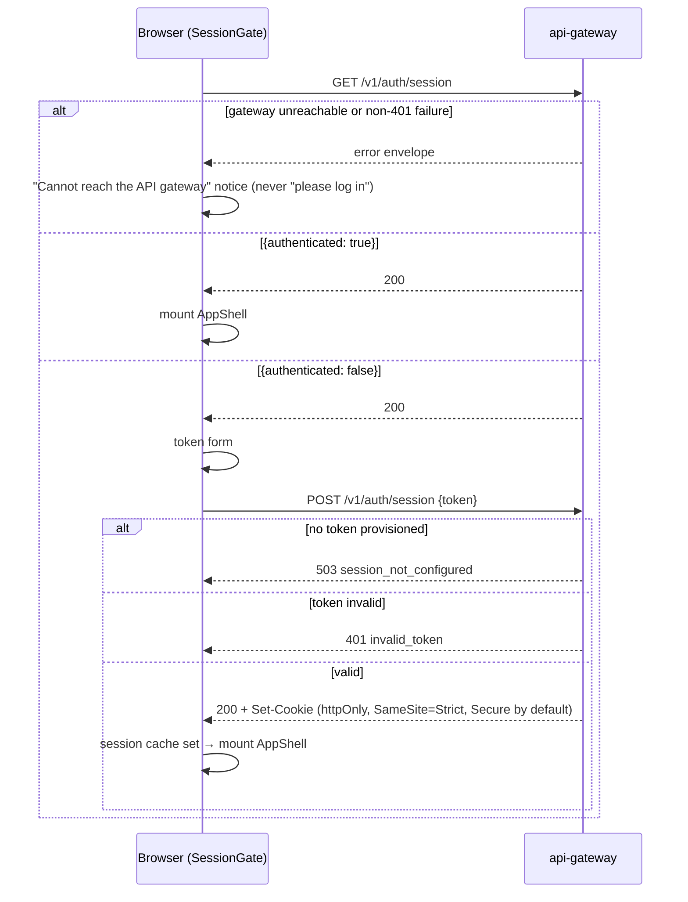
```mermaid
sequenceDiagram
  participant B as Browser (SessionGate)
  participant G as api-gateway
  B->>G: GET /v1/auth/session
  alt gateway unreachable or non-401 failure
    G-->>B: error envelope
    B->>B: "Cannot reach the API gateway" notice (never "please log in")
  else {authenticated: true}
    G-->>B: 200
    B->>B: mount AppShell
  else {authenticated: false}
    G-->>B: 200
    B->>B: token form
    B->>G: POST /v1/auth/session {token}
    alt no token provisioned
      G-->>B: 503 session_not_configured
    else token invalid
      G-->>B: 401 invalid_token
    else valid
      G-->>B: 200 + Set-Cookie (httpOnly, SameSite=Strict, Secure by default)
      B->>B: session cache set → mount AppShell
    end
  end
```

### 1.3 A REST read, and its failure rows (TDD 4A §7)

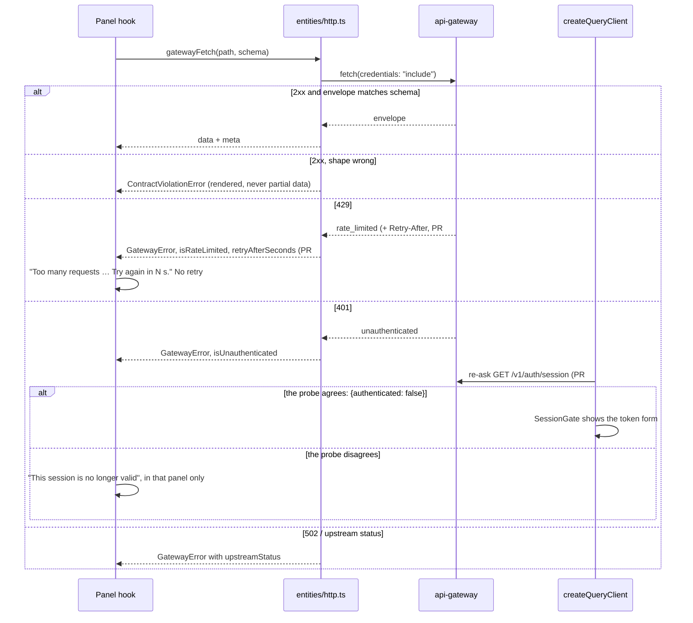
```mermaid
sequenceDiagram
  participant P as Panel hook
  participant H as entities/http.ts
  participant G as api-gateway
  participant QC as createQueryClient
  P->>H: gatewayFetch(path, schema)
  H->>G: fetch(credentials: "include")
  alt 2xx and envelope matches schema
    G-->>H: envelope
    H-->>P: data + meta
  else 2xx, shape wrong
    H-->>P: ContractViolationError (rendered, never partial data)
  else 429
    G-->>H: rate_limited (+ Retry-After, PR #43, not merged)
    H-->>P: GatewayError, isRateLimited, retryAfterSeconds (PR #47, not merged)
    P->>P: "Too many requests … Try again in N s." No retry
  else 401
    G-->>H: unauthenticated
    H-->>P: GatewayError, isUnauthenticated
    QC->>G: re-ask GET /v1/auth/session (PR #47, not merged)
    alt the probe agrees: {authenticated: false}
      QC->>QC: SessionGate shows the token form
    else the probe disagrees
      P->>P: "This session is no longer valid", in that panel only
    end
  else 502 / upstream status
    H-->>P: GatewayError with upstreamStatus
  end
```

### 1.4 Realtime

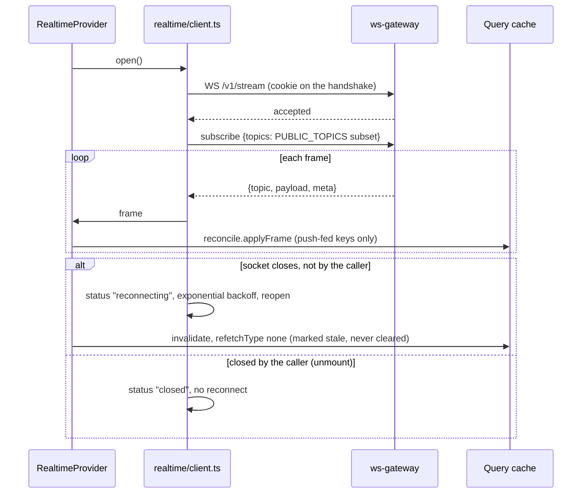
```mermaid
sequenceDiagram
  participant R as RealtimeProvider
  participant C as realtime/client.ts
  participant W as ws-gateway
  participant Q as Query cache
  R->>C: open()
  C->>W: WS /v1/stream (cookie on the handshake)
  W-->>C: accepted
  C->>W: subscribe {topics: PUBLIC_TOPICS subset}
  loop each frame
    W-->>C: {topic, payload, meta}
    C->>R: frame
    R->>Q: reconcile.applyFrame (push-fed keys only)
  end
  alt socket closes, not by the caller
    C->>C: status "reconnecting", exponential backoff, reopen
    R->>Q: invalidate, refetchType none (marked stale, never cleared)
  else closed by the caller (unmount)
    C->>C: status "closed", no reconnect
  end
```

A handshake refused for a lost session is not distinguishable here: the
browser API reports no HTTP status for a failed WebSocket handshake, so the
client keeps backing off until the next REST request's 401 returns the user to
the token form (PR #47, not merged).

---

## 2. `packages/nova-ui`

### 2.1 Components

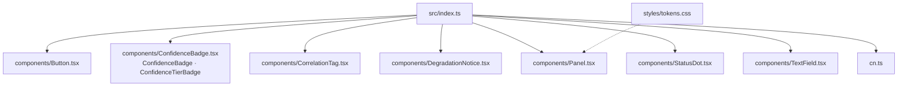
```mermaid
graph TD
  index[src/index.ts] --> Button[components/Button.tsx]
  index --> Conf[components/ConfidenceBadge.tsx<br/>ConfidenceBadge · ConfidenceTierBadge]
  index --> Corr[components/CorrelationTag.tsx]
  index --> Deg[components/DegradationNotice.tsx]
  index --> Panel[components/Panel.tsx]
  index --> Dot[components/StatusDot.tsx]
  index --> Text[components/TextField.tsx]
  index --> cn[cn.ts]
  tokens[styles/tokens.css] -.-> Panel
```

It holds presentational components only: no data fetching, no state store and
no request. It has **no multi-step flow**, so item 2 has nothing to draw. That
is a proposed N/A, which needs the owner's approval like every other N/A.

---

## 3. `api-gateway`

### 3.1 Components

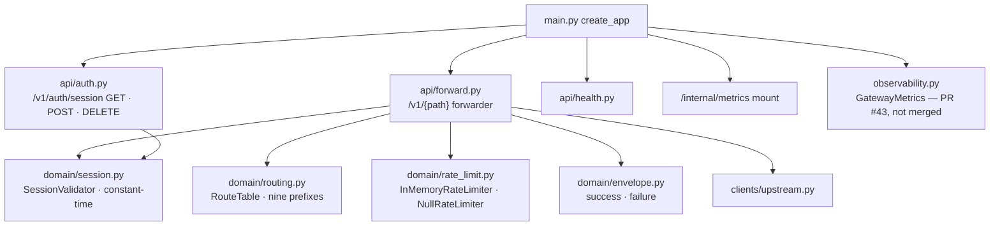
```mermaid
graph TD
  main[main.py create_app] --> auth[api/auth.py<br/>/v1/auth/session GET · POST · DELETE]
  main --> fwd["api/forward.py<br/>/v1/{path} forwarder"]
  main --> health[api/health.py]
  main --> metrics["/internal/metrics mount"]
  fwd --> rt[domain/routing.py<br/>RouteTable · nine prefixes]
  fwd --> rl[domain/rate_limit.py<br/>InMemoryRateLimiter · NullRateLimiter]
  fwd --> sess[domain/session.py<br/>SessionValidator · constant-time]
  fwd --> env[domain/envelope.py<br/>success · failure]
  fwd --> up[clients/upstream.py]
  auth --> sess
  main --> obs[observability.py<br/>GatewayMetrics — PR #43, not merged]
```

### 3.2 Forwarding one request

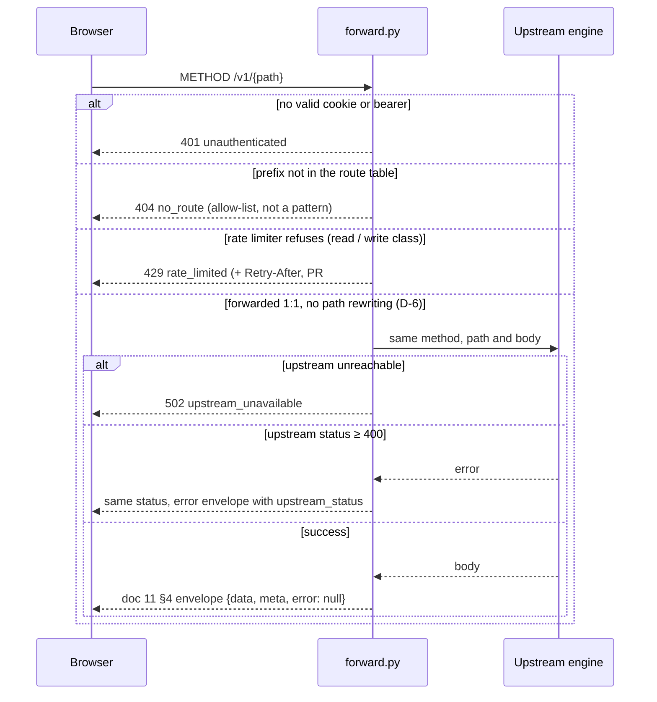
```mermaid
sequenceDiagram
  participant B as Browser
  participant F as forward.py
  participant U as Upstream engine
  B->>F: METHOD /v1/{path}
  alt no valid cookie or bearer
    F-->>B: 401 unauthenticated
  else prefix not in the route table
    F-->>B: 404 no_route (allow-list, not a pattern)
  else rate limiter refuses (read / write class)
    F-->>B: 429 rate_limited (+ Retry-After, PR #43, not merged)
  else forwarded 1:1, no path rewriting (D-6)
    F->>U: same method, path and body
    alt upstream unreachable
      F-->>B: 502 upstream_unavailable
    else upstream status ≥ 400
      U-->>F: error
      F-->>B: same status, error envelope with upstream_status
    else success
      U-->>F: body
      F-->>B: doc 11 §4 envelope {data, meta, error: null}
    end
  end
```

Every refusal and failure is logged with `correlation_id`, and counted by
outcome (PR #43, not merged).

---

## 4. `ws-gateway`

### 4.1 Components

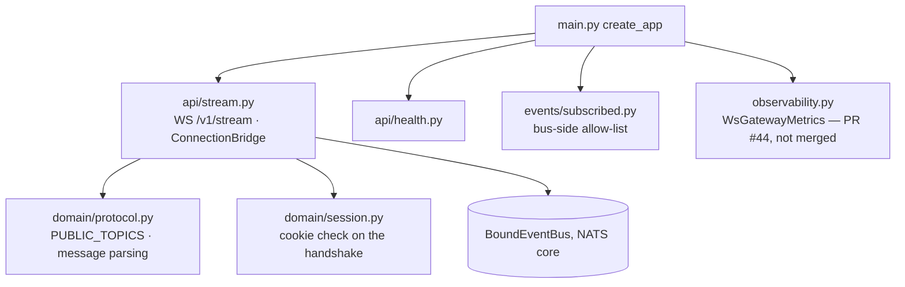
```mermaid
graph TD
  main[main.py create_app] --> stream[api/stream.py<br/>WS /v1/stream · ConnectionBridge]
  main --> health[api/health.py]
  stream --> proto[domain/protocol.py<br/>PUBLIC_TOPICS · message parsing]
  stream --> sess[domain/session.py<br/>cookie check on the handshake]
  stream --> bus[(BoundEventBus, NATS core)]
  main --> sub[events/subscribed.py<br/>bus-side allow-list]
  main --> obs[observability.py<br/>WsGatewayMetrics — PR #44, not merged]
```

### 4.2 One connection

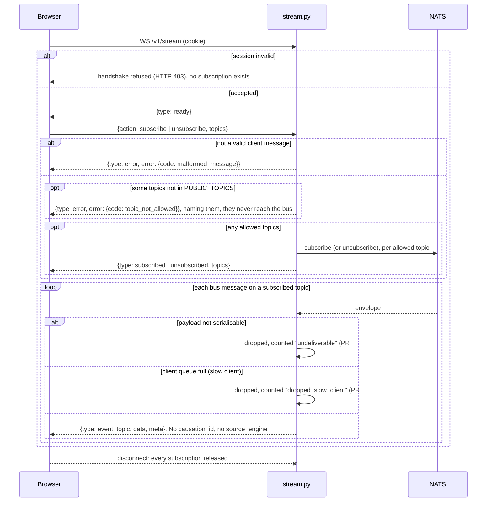
```mermaid
sequenceDiagram
  participant B as Browser
  participant S as stream.py
  participant N as NATS
  B->>S: WS /v1/stream (cookie)
  alt session invalid
    S-->>B: handshake refused (HTTP 403), no subscription exists
  else accepted
    S-->>B: {type: ready}
    B->>S: {action: subscribe | unsubscribe, topics}
    alt not a valid client message
      S-->>B: {type: error, error: {code: malformed_message}}
    else
      opt some topics not in PUBLIC_TOPICS
        S-->>B: {type: error, error: {code: topic_not_allowed}}, naming them, they never reach the bus
      end
      opt any allowed topics
        S->>N: subscribe (or unsubscribe), per allowed topic
        S-->>B: {type: subscribed | unsubscribed, topics}
      end
    end
    loop each bus message on a subscribed topic
      N-->>S: envelope
      alt payload not serialisable
        S->>S: dropped, counted "undeliverable" (PR #44, not merged)
      else client queue full (slow client)
        S->>S: dropped, counted "dropped_slow_client" (PR #44, not merged)
      else
        S-->>B: {type: event, topic, data, meta}. No causation_id, no source_engine
      end
    end
  end
  B--xS: disconnect: every subscription released
```

There is no replay: core NATS keeps nothing for a browser that joins late.

---

## 5. `autonomy-engine`

### 5.1 Components

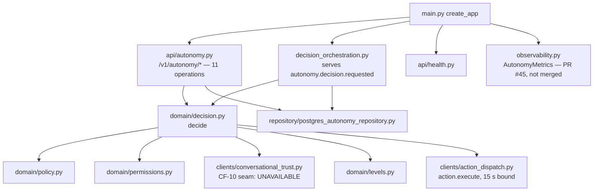
```mermaid
graph TD
  main[main.py create_app] --> api[api/autonomy.py<br/>/v1/autonomy/* — 11 operations]
  main --> orch[decision_orchestration.py<br/>serves autonomy.decision.requested]
  main --> health[api/health.py]
  orch --> decide[domain/decision.py<br/>decide]
  api --> decide
  decide --> policy[domain/policy.py]
  decide --> perms[domain/permissions.py]
  decide --> trust[clients/conversational_trust.py<br/>CF-10 seam: UNAVAILABLE]
  decide --> levels[domain/levels.py]
  decide --> dispatch[clients/action_dispatch.py<br/>action.execute, 15 s bound]
  api --> repo[repository/postgres_autonomy_repository.py]
  orch --> repo
  main --> obs[observability.py<br/>AutonomyMetrics — PR #45, not merged]
```

### 5.2 A triggered decision (`autonomy.decision.requested`)

The order is TDD 4D §4.3's and is binding: **policy, then permission, then
trust; the level is applied last.** So a policy deny at Level 0 reports `deny`,
not `observe_only`.

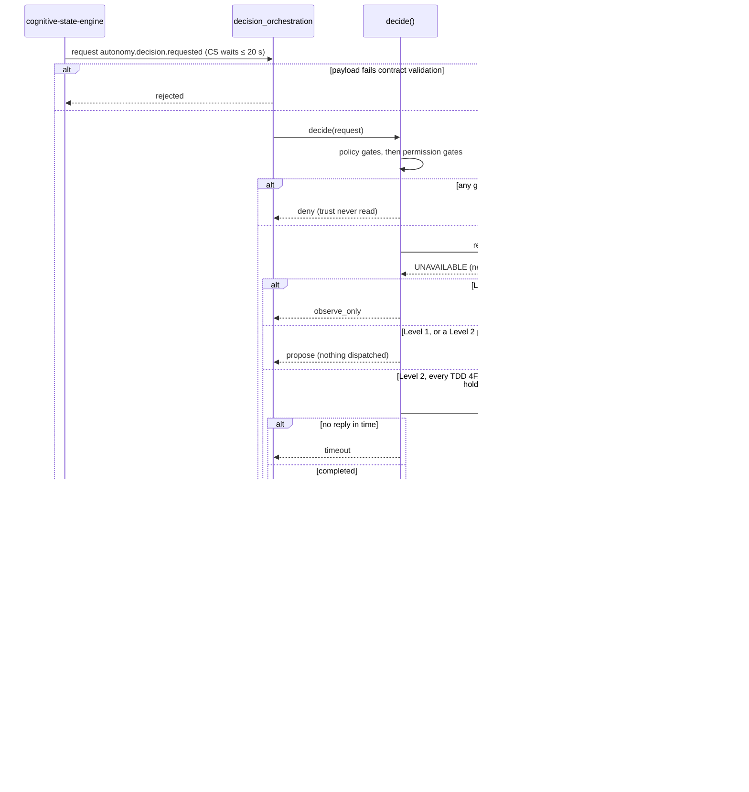
```mermaid
sequenceDiagram
  participant CS as cognitive-state-engine
  participant O as decision_orchestration
  participant D as decide()
  participant T as trust source (CF-10)
  participant A as action-engine
  CS->>O: request autonomy.decision.requested (CS waits ≤ 20 s)
  alt payload fails contract validation
    O-->>CS: rejected
  else
    O->>D: decide(request)
    D->>D: policy gates, then permission gates
    alt any gate denies
      D-->>O: deny (trust never read)
    else
      D->>T: read trust
      T-->>D: UNAVAILABLE (never refuses, CF-10 open)
      alt Level 0
        D-->>O: observe_only
      else Level 1, or a Level 2 precondition unmet
        D-->>O: propose (nothing dispatched)
      else Level 2, every TDD 4F.5 §22.4 precondition holds
        D->>A: action.execute (≤ 15 s, no retry)
        alt no reply in time
          D-->>O: timeout
        else completed
          D-->>O: execute
        else denied by action-engine
          D-->>O: propose
        else failed or any other terminal state
          D-->>O: execution_failed
        end
      end
    end
    O->>O: decision_log row
    alt decide() or the log write raised
      O-->>CS: degraded, with the error (Design A, A-4F6-5)
    else
      O-->>CS: reply {outcome, subject_id}
    end
  end
```

### 5.3 A suggestion-inbox decision (`POST /v1/autonomy/suggestions/{id}/decide`)

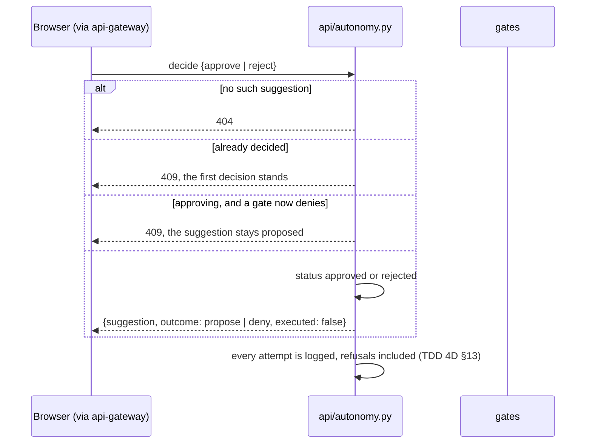
```mermaid
sequenceDiagram
  participant B as Browser (via api-gateway)
  participant R as api/autonomy.py
  participant D as gates
  B->>R: decide {approve | reject}
  alt no such suggestion
    R-->>B: 404
  else already decided
    R-->>B: 409, the first decision stands
  else approving, and a gate now denies
    R-->>B: 409, the suggestion stays proposed
  else
    R->>R: status approved or rejected
    R-->>B: {suggestion, outcome: propose | deny, executed: false}
  end
  R->>R: every attempt is logged, refusals included (TDD 4D §13)
```

**Approving executes nothing** (AC-5, FP-8). It records the decision only.
Rejecting is always permitted.

---

## 6. `cognitive-state-engine`

### 6.1 Components

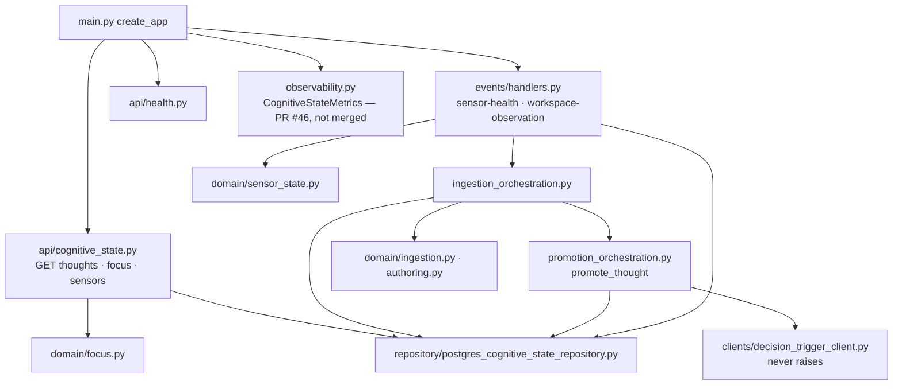
```mermaid
graph TD
  main[main.py create_app] --> api[api/cognitive_state.py<br/>GET thoughts · focus · sensors]
  main --> h[events/handlers.py<br/>sensor-health · workspace-observation]
  main --> health[api/health.py]
  h --> ingest[ingestion_orchestration.py]
  ingest --> promote[promotion_orchestration.py<br/>promote_thought]
  promote --> trig[clients/decision_trigger_client.py<br/>never raises]
  ingest --> dom[domain/ingestion.py · authoring.py]
  h --> ss[domain/sensor_state.py]
  api --> focus[domain/focus.py]
  api --> repo[repository/postgres_cognitive_state_repository.py]
  ingest --> repo
  promote --> repo
  h --> repo
  main --> obs[observability.py<br/>CognitiveStateMetrics — PR #46, not merged]
```

### 6.2 A workspace observation becomes, at most, one initiative

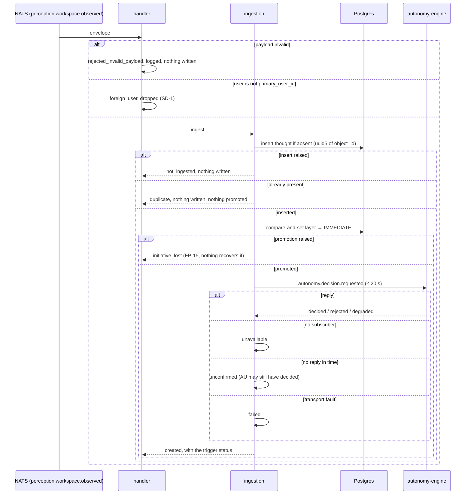
```mermaid
sequenceDiagram
  participant N as NATS (perception.workspace.observed)
  participant H as handler
  participant I as ingestion
  participant DB as Postgres
  participant AU as autonomy-engine
  N->>H: envelope
  alt payload invalid
    H->>H: rejected_invalid_payload, logged, nothing written
  else user is not primary_user_id
    H->>H: foreign_user, dropped (SD-1)
  else
    H->>I: ingest
    I->>DB: insert thought if absent (uuid5 of object_id)
    alt insert raised
      I-->>H: not_ingested, nothing written
    else already present
      I-->>H: duplicate, nothing written, nothing promoted
    else inserted
      I->>DB: compare-and-set layer → IMMEDIATE
      alt promotion raised
        I-->>H: initiative_lost (FP-15, nothing recovers it)
      else promoted
        I->>AU: autonomy.decision.requested (≤ 20 s)
        alt reply
          AU-->>I: decided / rejected / degraded
        else no subscriber
          I->>I: unavailable
        else no reply in time
          I->>I: unconfirmed (AU may still have decided)
        else transport fault
          I->>I: failed
        end
        I-->>H: created, with the trigger status
      end
    end
  end
```

None of these branches retries. The handler never raises, so one bad message
cannot stop the subscription.

### 6.3 A sensor-health report

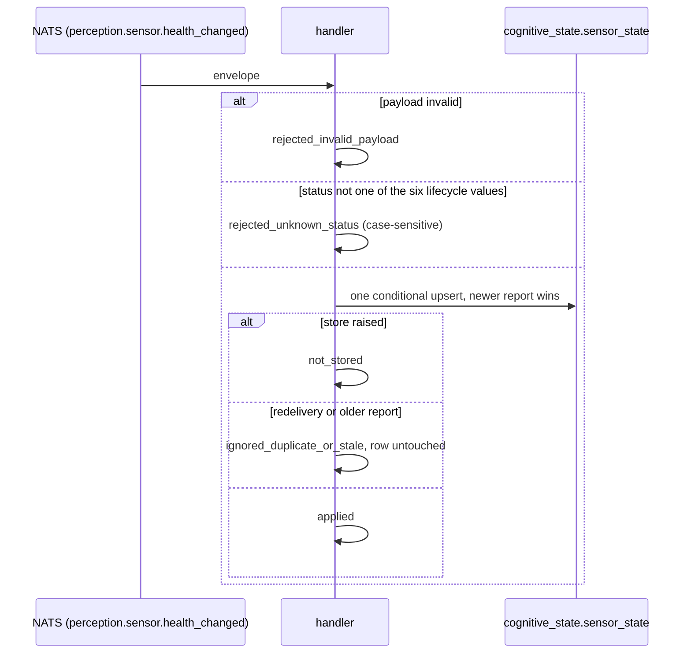
```mermaid
sequenceDiagram
  participant N as NATS (perception.sensor.health_changed)
  participant H as handler
  participant DB as cognitive_state.sensor_state
  N->>H: envelope
  alt payload invalid
    H->>H: rejected_invalid_payload
  else status not one of the six lifecycle values
    H->>H: rejected_unknown_status (case-sensitive)
  else
    H->>DB: one conditional upsert, newer report wins
    alt store raised
      H->>H: not_stored
    else redelivery or older report
      H->>H: ignored_duplicate_or_stale, row untouched
    else
      H->>H: applied
    end
  end
```

---

## 7. `companion/nova-companion` and `companion/sensors`

### 7.1 Components

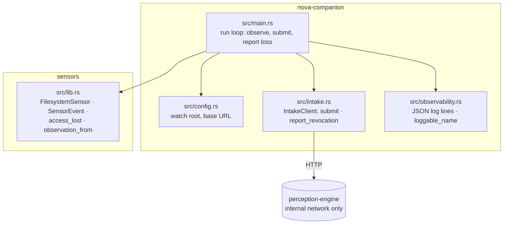
```mermaid
graph TD
  subgraph nova-companion
    main[src/main.rs<br/>run loop: observe, submit, report loss]
    config[src/config.rs<br/>watch root, base URL]
    intake[src/intake.rs<br/>IntakeClient: submit · report_revocation]
    obs[src/observability.rs<br/>JSON log lines · loggable_name]
  end
  subgraph sensors
    lib[src/lib.rs<br/>FilesystemSensor · SensorEvent ·<br/>access_lost · observation_from]
  end
  main --> config
  main --> intake
  main --> obs
  main --> lib
  intake -->|HTTP| pe[(perception-engine<br/>internal network only)]
```

The companion opens **no listening port**, never connects to NATS, and stores
nothing (TDD 4F §7).

### 7.2 Observing and submitting

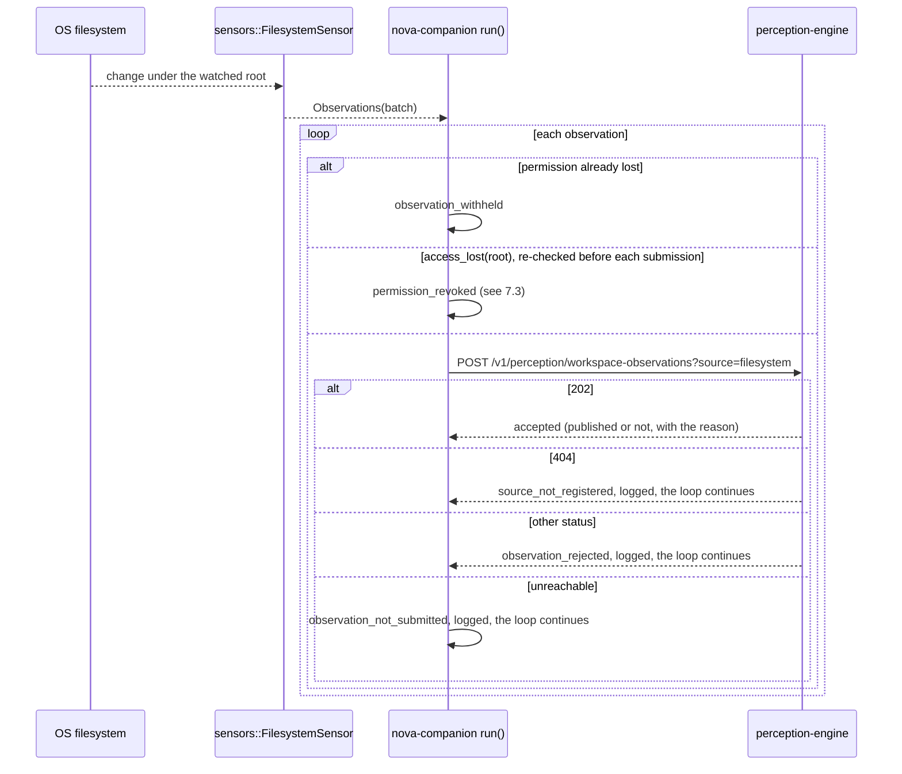
```mermaid
sequenceDiagram
  participant FS as OS filesystem
  participant S as sensors::FilesystemSensor
  participant C as nova-companion run()
  participant P as perception-engine
  FS-->>S: change under the watched root
  S-->>C: Observations(batch)
  loop each observation
    alt permission already lost
      C->>C: observation_withheld
    else access_lost(root), re-checked before each submission
      C->>C: permission_revoked (see 7.3)
    else
      C->>P: POST /v1/perception/workspace-observations?source=filesystem
      alt 202
        P-->>C: accepted (published or not, with the reason)
      else 404
        P-->>C: source_not_registered, logged, the loop continues
      else other status
        P-->>C: observation_rejected, logged, the loop continues
      else unreachable
        C->>C: observation_not_submitted, logged, the loop continues
      end
    end
  end
```

Inside `perception-engine`, an accepted observation is hashed (`object_id`,
with no raw path) and written to the outbox. The sensor's `running` gate drops
it if the sensor is not running. The outbox dispatch, a one-second cron with
`max_jobs = 1`, publishes `perception.workspace.observed`. AC-7's five-second
bound covers this whole path, and is asserted in CI.

### 7.3 Losing the OS permission (AC-7's revocation clause)

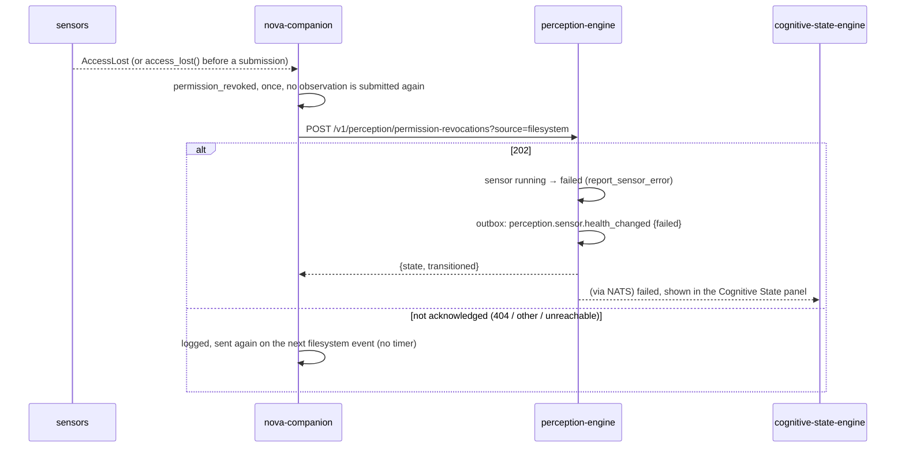
```mermaid
sequenceDiagram
  participant S as sensors
  participant C as nova-companion
  participant P as perception-engine
  participant CS as cognitive-state-engine
  S-->>C: AccessLost (or access_lost() before a submission)
  C->>C: permission_revoked, once, no observation is submitted again
  C->>P: POST /v1/perception/permission-revocations?source=filesystem
  alt 202
    P->>P: sensor running → failed (report_sensor_error)
    P->>P: outbox: perception.sensor.health_changed {failed}
    P-->>C: {state, transitioned}
    P-->>CS: (via NATS) failed, shown in the Cognitive State panel
  else not acknowledged (404 / other / unreachable)
    C->>C: logged, sent again on the next filesystem event (no timer)
  end
```

There is **no recovery** (A-4F8-1 (a2)): a re-granted permission takes effect
only after both processes restart. Nothing infers a revocation from silence.

---

## 8. What these diagrams do not settle

- **Timing.** §9.1 item 1's *"before implementation"* (above).
- **Traces.** No span is created anywhere in the repository, so no diagram
  shows trace propagation. That is an open decision, A9 in the closure matrix.
- **Performance targets** (§9.1 item 7). Only AC-7's five seconds is a ratified
  target. The others are proposals awaiting the owner.
- **Proposed N/As.** Where a subsystem has nothing to draw (`nova-ui` item 2),
  the N/A is a proposal until approved.
