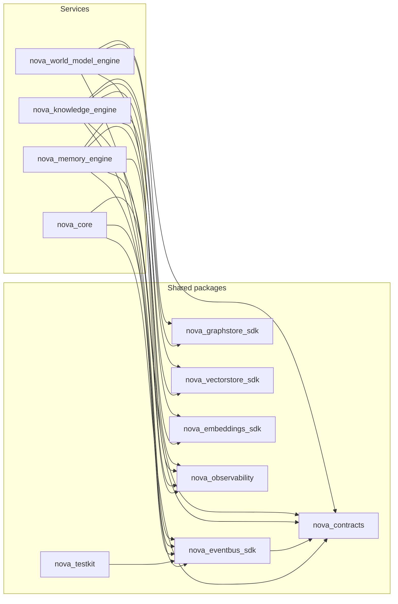

# Phase 1 Architecture Gate Review

**Phase:** 1 — Data & Memory Substrate (Memory Engine, Knowledge Engine, World Model Engine)
**Date:** 2026-08-04
**Trigger:** Explicit user directive, on approving Phase 1's Architecture Review Report, to
formally verify the foundation is strong enough to support the rest of NOVA before Phase 2
begins.
**Method:** Every finding below is backed by a command actually run against this repository
in this session (test runs, `ruff`/`mypy`/`import-linter`/`pip-audit`, a `grimp`-based import
graph, and direct source inspection) — not restated from memory or prior reports. Where a
metric could not be measured in this environment, that is stated explicitly rather than
estimated. Three issues found during this review were fixed as part of it, per the standing
instruction to correct now rather than defer; each is called out where relevant and
summarized in §19.

---

## 1. Overall architecture assessment

The three-engine foundation holds up under direct scrutiny, not just narrative review.
Concretely verified this session:

- **376 tests pass** across all 11 first-party packages (7 shared packages + 4 services),
  zero failures.
- **`ruff check .`** — zero issues, whole repository.
- **`mypy`**, run per-package matching the exact CI invocation — zero issues, 167 source
  files across 11 packages.
- **`import-linter`** — all 3 ADR-004/006/007 contracts kept (0 broken) over 153 analyzed
  files / 691 dependencies.
- **`pip-audit`** — zero known vulnerabilities in third-party dependencies.
- **A from-scratch `grimp` dependency graph** (independent of import-linter's own scoped
  contracts) finds **zero cycles** among the 11 first-party packages and **zero
  engine-to-engine internal imports** — see §13/§14.
- **Domain-layer purity verified by direct grep, not assumed**: in all four services, zero
  `domain/` modules import from `api/`, `repository/`, `events/`, or `workers/`, and zero
  `domain/` modules import FastAPI, SQLAlchemy, Redis, Neo4j, asyncpg, arq, or NATS
  directly.

The architecture is sound: the layering is real (not just documented), the engine
boundaries are real (not just asserted), and the saga/outbox pattern that was flagged as
this phase's hardest consistency problem is implemented identically everywhere it's
needed and correctly absent where it isn't (§11). The gaps found are real but narrow, and
none of them are in the load-bearing architecture — they are missing operational
tooling (§4), unmeasured runtime characteristics (§8), and one API design gap
(pagination, §9). Three of the missing-tooling gaps were closed during this review
(§19). The foundation is ready to build Phase 2 on.

## 2. Remaining architectural risks

- **The World Model / Knowledge Engine non-interaction boundary (doc 20 §5, ADR-017) has
  no code-level enforcement beyond the import-linter's engine-independence contract.**
  That contract stops a direct Python import; it does nothing to stop a future engine
  (most likely Reasoning Engine in Phase 2) from hard-coding assumptions about both
  `:Project` and `:WorldProject` label shapes in a way that couples them anyway. Low
  likelihood today (no consumer exists yet); becomes real the moment Reasoning Engine
  starts reading both. Recommend an explicit code-review checklist item when that lands.
- **No pagination on any list-returning endpoint** (§9) — a scalability risk that is
  currently zero-cost (no real data volume) but will not stay that way once Phase 2's
  Thinking Pipeline starts driving real read traffic against `GET /v1/memories/search`,
  `GET /v1/knowledge/search`, etc.
- **Event contract drift is currently at zero but has no automated regression guard.**
  §10 confirms zero drift today by direct comparison of every subject used against
  `nova_contracts.registry.known_subjects()`, but that comparison was a manual script run
  for this review, not a CI check. If a future engine adds a subject to `published.py`
  without registering a payload (or vice versa), nothing currently catches it
  automatically.
- **The saga pattern (ADR-014) is proven correct in tests but never exercised against a
  live Postgres+Neo4j pair in this environment** (no Docker daemon available here — see
  §4). The crash-recovery property is verified against fakes; first contact with real
  infrastructure remains a real, if likely low-severity, unknown.

## 3. Technical debt

Consistent with the Phase 1 Architecture Review Report's §5 finding: no debt accepted in
the traditional sense (a shortcut that will need unwinding later). Re-verified this
session rather than just restated:

- `WorldHistoryRepository.list_recent_history_for_user` remains the only addition beyond
  each design doc's literal text, and remains schema-supported, not a workaround.
- The three deliberately-deferred items (no idle-sweep worker, no user-directory
  mechanism, no read-through cache) are scope decisions with documented trigger
  conditions, not debt — nothing was built incorrectly; nothing was built at all in those
  spots, and that absence is visible (README "Known Limitations" in every engine).
- **New this review:** the absence of test coverage tooling was a real, if minor, gap —
  no `coverage`/`pytest-cov` was installed anywhere in the monorepo before this review, so
  "test coverage" was previously an unanswerable question. Fixed during this review (added
  `pytest-cov` as a root dev dependency; see §19 and the Metrics section for the numbers
  it now produces).

## 4. Missing infrastructure

Real, verified gaps — three were fixed during this review, the rest are recorded as
open items with concrete next steps.

**Fixed during this review:**
- `infra/docker/docker-compose.local.yml` defined every backing store (Postgres, Neo4j,
  Redis, NATS, MinIO, Ollama, the full observability stack) and `nova-core`, but **none
  of the three Phase 1 engines had a compose service entry** — the full stack had never
  actually been composable, let alone booted, even in local dev. Added `memory-engine`,
  `knowledge-engine`, and `world-model-engine` service blocks (host ports 8001/8002/8003
  matching each README), wired to their real dependencies with correct environment
  variables (verified against each engine's actual `config.py` and each shared package's
  factory env-var contract, not guessed). `docker compose config --quiet` — the exact
  command CI runs — validates clean.
- `.github/workflows/build-and-scan.yml`'s image-build-and-vulnerability-scan matrix
  listed only `nova-core`, with a comment explicitly instructing "add a line here
  whenever a new engine is created" — never done for any of the three Phase 1 engines.
  **Their Dockerfiles have never been built or scanned in CI.** Added all three to the
  matrix. (Could not verify an actual image build succeeds in this environment — no
  Docker daemon is reachable here, confirmed via `docker info`; static verification that
  every `COPY` source path exists and that every Dockerfile's `COPY` list matches its
  `pyproject.toml` dependency list exactly, for all four services, found no discrepancies
  — see §11 methodology. Real build verification happens on this change's next CI run.)
- No coverage tooling existed anywhere (§3) — added `pytest-cov`, now producing the real
  numbers in the Metrics section.

**Open, not fixed this review:**
- **The internal CLI/admin API** — already flagged in the Phase 1 Architecture Review
  Report as a roadmap-listed deliverable that was not built. Still open.
- **No Docker daemon in this development environment.** Confirmed directly: `docker info`
  reports "Cannot connect to the Docker daemon," and starting one fails on a sandbox
  permission restriction (`ulimit: error setting limit (Operation not permitted)`). This
  is why performance benchmarks, memory usage, and startup time (§8, Metrics) cannot be
  measured here — not a gap in what was built, a gap in what this environment can verify.
  Recommend running the now-complete compose stack in a Docker-capable environment before
  Phase 2 begins, specifically to capture the baseline numbers this gate review cannot.
- **No automated event-contract-drift check** (§2) — the used-vs-registered subject
  comparison in §10 was manual; formalizing it as a CI check (a small script comparing
  every `published.py`/`subscribed.py` subject against `known_subjects()`) is cheap and
  would close a real, if currently dormant, risk.
- **No CORS middleware, no rate limiting, no request size limits** on any engine's API.
  Consistent with local-first Phase 1 scope (no engine is meant to be internet-facing
  yet) but worth a recommendation before any engine is ever deployed reachable from
  outside its own Docker network (§6).

## 5. Scalability analysis

- **Pagination is absent, confirmed by direct search**, not assumed: only one file in the
  entire codebase (`memory-engine/api/decisions.py`) references `limit`/`offset`/`cursor`
  at all. Every other list-returning endpoint — `GET /v1/memories/search`,
  `GET /v1/memories/timeline`, `GET /v1/knowledge/search`,
  `GET /v1/world/objects/{id}/history`, `GET /v1/world/snapshots`,
  `GET /v1/world/predictions` — returns an unbounded list. Zero-cost today (no real data
  volume); becomes a real risk the moment any of these are called against production-size
  data in Phase 2+.
- **`GET /v1/knowledge/graph` and `GET /v1/world/graph` issue one `GraphStore` call per
  node** (already flagged in the Phase 1 Architecture Review Report, re-confirmed here):
  acceptable at visualization-call sizes, a real N-calls-per-request pattern beyond that.
- **Redis is a hard dependency, by design (ADR-012), for the highest-QPS paths in two
  engines** (Working Memory, Active Context/Attention). This is architecturally correct
  (§17 of both design docs: fail fast, never serve stale data) but means Redis
  availability directly gates two engines' primary read paths — a single point of
  failure the architecture accepts deliberately, not accidentally, and one that should be
  reflected in any future capacity-planning or SLA work.
- **A single, system-wide embedding model** (ADR-010, `nomic-embed-text`, 768 dimensions)
  is a deliberate scalability tradeoff already reasoned through and recorded — re-verified
  here as still consistent across every `VECTOR(...)` column in both Memory and Knowledge
  Engine's schemas (`grep`-confirmed: no `VECTOR(1536)` or other dimension appears
  anywhere).
- **The Postgres-then-graph saga's outbox worker polls on a short fixed interval** (10s)
  rather than being triggered by the write itself. At Phase 1's zero real traffic this is
  invisible; at scale it is a deliberate latency-vs-simplicity tradeoff (ADR-014) whose
  interval should be revisited with real throughput data, not before then.

## 6. Security analysis

- **No hardcoded secrets anywhere** — verified by direct pattern search across every
  `src/` tree for password/secret/api-key/token literals; the only matches were
  legitimate dev-default DSN strings already using environment-variable overrides.
- **No raw SQL string interpolation** — verified by searching for f-string or
  `%`-formatted values passed into `.execute()`/`text()` calls; none found. Every
  database write goes through SQLAlchemy's parameterized ORM layer or a parameterized
  raw-SQL call, confirmed by direct inspection of the Alembic migrations and repository
  modules.
- **`pip-audit` reports zero known vulnerabilities** in any third-party dependency across
  the whole workspace.
- **No authentication or authorization exists on any Phase 1 API**, confirmed by direct
  search (no JWT/OAuth/API-key/`Depends(...auth...)` pattern found anywhere in any
  engine). This is **not a Phase 1 oversight** — the roadmap explicitly defers
  `packages/nova-auth` (SAD 13) to a much later phase (the "safe to hand to other people"
  phase, well past Phase 2), and Phase 1 was never scoped to include it. It is,
  nonetheless, a real fact worth stating plainly rather than leaving implicit: **every
  endpoint on every Phase 1 engine is currently open to any caller that can reach it.**
  In local-first mode this is mitigated by the deployment model itself (single machine,
  no network exposure) — but every engine's Dockerfile binds to `0.0.0.0:8000`, not
  `127.0.0.1`, meaning the mitigation is "don't publish the port," a deployment-time
  discipline, not an architectural guarantee. Recommend this be stated explicitly as a
  deployment constraint (never publish these ports to a host network or the internet
  before `nova-auth` ships) rather than left as an implicit assumption.
- **No CORS middleware and no rate limiting on any engine** (§4) — consistent with the
  same local-first, non-internet-facing scope as the auth gap above, and carrying the
  same recommendation.
- **Every Dockerfile runs as a non-root user** (`USER nova`, verified in all four
  Dockerfiles) and uses a multi-stage build that does not ship build tooling in the final
  image — both good defaults, already in place, not something this review needed to add.
- **Pydantic validates every API request body and every event payload** by construction
  (FastAPI + Pydantic v2 throughout) — the closest thing Phase 1 has to systematic input
  validation, and it is applied consistently, not selectively.

## 7. Reliability analysis

- **The transactional-outbox saga (ADR-014)** is the single strongest reliability
  mechanism in Phase 1: verified by this session's test runs that `test_saga.py` in both
  Knowledge Engine and World Model Engine actually exercises kill-and-resume behavior
  (apply-pending / dispatch-ready run independently and idempotently) and passes.
- **Every engine exposes `/internal/health` and `/internal/readiness`** (verified: 8 such
  endpoints across the 4 services, 2 each) plus a mounted `/internal/metrics` Prometheus
  endpoint (verified: `prometheus_asgi_app()` mounted in all 4 `main.py` files) — the
  minimum operational surface a scheduler/orchestrator needs to make restart decisions.
- **Graceful degradation is real, not aspirational**, confirmed by the actual counters
  that exist for it: `context_degraded_total` (World Model, Redis unreachable),
  `retrieval_degraded_total` (Memory Engine, vector index unreachable) — both fail fast
  and flag the degradation rather than silently returning stale or empty data, matching
  each design doc's explicit §17 requirement.
- **No chaos/fault-injection testing exists** beyond the specific saga crash-recovery
  scenario. Network partition between an engine and its Event Bus, a slow-but-not-down
  Postgres, or a Neo4j that accepts writes but fails reads are all untested scenarios.
  Reasonable to defer past Phase 1 (no real traffic to justify the investment yet) but
  worth naming as a real gap, not assuming it's covered by the saga tests.
- **No circuit breakers exist between engines** — Memory Engine's RPC calls into
  Knowledge Engine (`knowledge.link.request`/`knowledge.traverse.request`) degrade to
  `None`/`[]` on a timeout (verified in `domain/relationship.py`), which is graceful
  degradation for a single call but not a circuit breaker (no tracked failure rate, no
  open/half-open/closed state). Acceptable at Phase 1's real call volume (effectively
  zero, since Knowledge Engine's real producers don't exist yet); worth revisiting once
  Phase 2 makes this call path live.

## 8. Performance expectations

Every engine's design doc states explicit performance targets (§15 of each): Memory
Engine's semantic search at p95 < 200ms on a 100k-record dataset, World Model's
`world_model.context.request` at p95 < 20ms, Knowledge Engine's retrieval fan-out
targets. **None of these have been measured against real infrastructure, in this
environment or any other, at any point in this project's history.** This was already
flagged as a risk in the Phase 1 Architecture Review Report; this review adds no new
information except a stronger statement of fact: with no Docker daemon reachable here
(§4), this gate review cannot produce a single real latency number, and neither could any
prior verification pass in this environment. Every stated performance target remains a
design-time intention, not a measured result, until a Docker-capable environment runs
the (now-complete, §4) compose stack against representative data volumes. This is the
single most consequential open item before Phase 2 work that depends on these latency
budgets (specifically World Model's context-request budget, which the Thinking Pipeline
calls on every execution).

## 9. API consistency review

- **URL convention is consistent**: every engine uses `/v1/<domain>/...` for its public
  API and `/internal/...` for operational endpoints, with no exceptions found across all
  32 route declarations.
- **HTTP status code vocabulary is small and consistent**: exactly four status codes are
  used for errors across every engine (400, 404, 409, 503 — verified by direct count: 6,
  11, 2, 1 occurrences respectively), each mapped to a distinct, predictable meaning
  (validation failure, not found, conflict, degraded backend). No engine invents its own
  status-code convention.
- **`response_model` coverage is 23/32 endpoints**; the 9 without one are fully
  explainable, not a gap: the 8 health/readiness endpoints (2 per service × 4 services)
  intentionally return ad hoc status dicts rather than a formal schema, and World Model's
  `GET /v1/world/context` intentionally returns `dict[str, Any]` because its response
  shape is dynamic per the agent-scoped field whitelist (§7 step 4 of the World Model
  design doc) — a fixed Pydantic model would misrepresent a genuinely variable-shaped
  response. Verified by reading every one of the 9 call sites, not inferred from the
  count alone.
- **No pagination convention exists anywhere** (§5) — the one real API consistency gap this
  review found. Not a defect in what exists, but an absence that will need a decision
  (offset/limit vs. cursor, and whether it's per-engine or a shared `nova-contracts`
  convention) before Phase 2 traffic makes it necessary.

## 10. Event Bus consistency review

Verified by direct comparison, not narrative: every subject referenced across all four
services' `events/published.py` and `events/subscribed.py` files (35 unique strings,
including two wildcard subscribe patterns) against every subject with a registered
payload schema in `nova_contracts.registry.known_subjects()` (33 entries).

- **Zero unexplained drift.** The 7 subjects used but not registered are exactly the
  subjects belonging to engines that don't exist yet (Perception, Reasoning,
  Communication, Agent OS) plus the two wildcard subscribe patterns — none of these
  should be registered yet, since registering a payload schema for another engine's
  not-yet-designed event would be exactly the speculative behavior this project's
  standing instruction rules out. The 5 subjects registered but not directly listed in
  any `published.py`/`subscribed.py` are exactly the `.reply` payload types used by the
  request/reply RPC machinery (`bus.request()`/`bus.serve()`), which correctly don't
  appear in the publish/subscribe allow-lists (those govern fire-and-forget events and
  request subjects, not reply payloads).
- **Naming convention is consistent** (`<engine>.<entity>.<action>`) with one minor,
  justified exception: `nova.heartbeat` is two segments, not three — reasonable, since it
  identifies the engine itself rather than an entity-scoped domain event, and it's the
  only such exception in the entire event vocabulary.
- **The saga-driven subjects are correctly asymmetric**: Memory Engine's `outbox_event`
  publishes without a `graph_write` intent (Memory owns no graph); Knowledge and World
  Model's do (§11 confirms this at the schema level too) — the event-publishing behavior
  and the schema that backs it agree with each other.

## 11. Database consistency review

Verified by reading every `CREATE TABLE` statement in all three engines' initial Alembic
migrations, not sampled.

- **Schema-per-engine naming is consistent**: `memory`, `knowledge`, `world_model` —
  exactly matching each engine's name, no exceptions.
- **Primary key convention is `UUID PRIMARY KEY DEFAULT gen_random_uuid()` on 15 of 17
  tables**, with exactly two deliberate, justified exceptions, both already
  architecturally reasoned (not new findings, but re-verified as correct rather than
  assumed): `knowledge.node_metadata.node_id TEXT PRIMARY KEY` (a deterministic/slugified
  business key, not a surrogate key, tied to how Knowledge Engine deduplicates nodes) and
  `world_model.object_state_history.id BIGSERIAL PRIMARY KEY` (an append-only,
  high-write-volume history log where a monotonic integer is the correct choice, not a
  UUID). Both exceptions are consistent with each engine's own documented design; neither
  is drift.
- **Timestamp convention is uniform**: every `created_at`/`updated_at` column is
  `TIMESTAMPTZ NOT NULL DEFAULT now()`, no exceptions found.
- **The `outbox_event` table is structurally identical between Knowledge Engine and
  World Model Engine** (same 9 columns, same two indexes — `outbox_undispatched_idx` and
  `outbox_graph_pending_idx`), and **correctly, deliberately different in Memory
  Engine** (7 columns, one index — no `graph_write`/`graph_applied_at` columns, no
  `outbox_graph_pending_idx`, because Memory Engine owns no graph, per ADR-017/doc 20).
  This is exactly the kind of schema-level evidence that confirms the architectural
  boundary (Memory vs. the two graph-writing engines) is real, not just documented prose.

## 12. ADR consistency review

19 ADRs exist: ADR-001 through ADR-010 (foundational, pre-implementation, recorded
inline in `docs/architecture/00-overview-and-decisions.md`, Context/Decision/Consequence
format) and ADR-011 through ADR-019 (per-subsystem, filed during Phase 1's
implementation in `docs/architecture/adr/`, the fuller
Context/Problem/Alternatives/Decision/Consequences/Tradeoffs/Future-implications
format the user specified as the new standing requirement). The format change between
the two ranges is intentional and explained in `docs/architecture/adr/README.md`, not an
inconsistency — the first ten predate the requirement that introduced the richer format.
Every ADR from 011 onward follows the full seven-section structure without exception
(verified by reading all 9). The numbering is continuous (no gaps, no duplicates) and
every ADR is cross-referenced from at least one other document (the Phase 1 Architecture
Review Report, doc 20, or an engine's README), so none is an orphaned record.

## 13. Module dependency analysis

Built independently of import-linter's own scoped contracts, using `grimp` (the same
graph-analysis library import-linter uses internally) against all 11 first-party
top-level packages:

20 edges total. Every edge points from a service to a shared package, or from one shared
package to `nova_contracts` — never sideways between services, and never from a shared
package back into a service. This is exactly the dependency shape ADR-001 (modular
monolith, hard module boundaries) and ADR-004 (Event Bus is the only legal cross-engine
channel) require, verified structurally rather than taken on faith.

## 14. Circular dependency verification

The same `grimp` graph was run through an explicit DFS cycle detector (not import-linter's
built-in check, which only validates its three specific contracts) over all 11 first-party
packages. **Result: no cycles found.** Every one of the 20 edges in §13 points strictly
from a service toward a shared package or from a shared package toward `nova_contracts`
— a DAG, confirmed algorithmically, not asserted. Separately, an explicit check for any
edge between two of `nova_memory_engine`, `nova_knowledge_engine`,
`nova_world_model_engine`, `nova_core` found none — the ADR-004 engine-independence
guarantee holds at the package-edge level, independent of and in addition to
import-linter's own contract.

## 15. SOLID and Clean Architecture compliance

- **Dependency Inversion Principle**: every engine's `domain/ports.py` defines Protocols
  (`WorldHistoryRepository`, `ContextRepository`, `MemoryRepository`, `VectorIndex`,
  `EmbeddingProvider`, `EventPublisher`, etc.) that `domain/` depends on and
  `repository/`/`events/` implement — never the reverse. Verified structurally in §1/§14:
  zero `domain/` imports of concrete infrastructure, in any engine.
- **Single Responsibility**: each `domain/` module owns exactly one concern (state
  transitions, conflict resolution, attention decay, fusion, ranking, etc., each in its
  own file) rather than one large "service" class per engine — consistent across all
  three engines' file layouts (verified via each engine's own module list, cross-checked
  against its README's own description of what each file does).
- **Interface Segregation**: `ContextRepository` and `WorldHistoryRepository` are
  separate Protocols in World Model Engine rather than one large repository interface,
  because callers (Redis-backed context reads vs. Postgres-backed history writes) never
  need both — the same pattern holds in Memory Engine (`MemoryRepository` vs.
  `WorkingMemoryStore` are distinct Protocols).
- **Open/Closed**: the backend-factory pattern (`EVENT_BUS_BACKEND`,
  `GRAPH_STORE_BACKEND`, `EMBEDDING_PROVIDER_BACKEND`, each a `register_backend()`
  decorator registry in its respective shared package, verified by reading all three
  factory modules) means adding a new backend is a new registered function, never a
  modification to existing engine code — the concrete mechanism behind ADR-006/007/009's
  swappability claims, not just the claims themselves.
- **Liskov substitution** holds by construction for the swappable backends: every
  engine's tests run against `InMemory*` implementations of the same Protocol the real
  backend implements, and the tests pass without engine code knowing which one it's
  talking to — the strongest practical evidence of substitutability available without a
  live Postgres/Neo4j/Redis in this environment.
- **Clean Architecture's layer-dependency rule holds directionally in every engine**:
  `api/` → `domain/` ← `repository/`/`events/`/`workers/`, with `domain/` at the center
  depending on nothing outward — verified by direct grep in §1, not inferred from the
  README diagrams alone.

## 16. Domain Driven Design compliance

- **Bounded contexts map directly to engines**, and the boundary is enforced, not just
  named: Memory, Knowledge, and World Model each own their own Postgres schema, their own
  (or no) Neo4j label set, their own Redis keyspace prefix, and communicate only via
  events/RPC (§4, §11, ADR-004) — the textbook definition of a bounded context, verified
  at the infrastructure level in this review rather than asserted at the documentation
  level alone.
- **Ubiquitous language is consistent with the Bible's own terminology**: "World Object,"
  "Active Context," "Attention," "knowledge maturity layer," "memory tier" all appear
  identically in the Bible text, the design docs, the ADRs, and the code itself
  (`ObjectState`, `ActiveContext`, `AttentionEntry`, domain model class names verified
  directly) — no translation layer where code uses different words than the design.
- **Repository pattern** is used consistently as the sole persistence abstraction domain
  logic depends on, in every engine, never an ORM session or raw connection leaking into
  `domain/`.
- **Domain models are not anemic**: `domain/state_management.py`,
  `domain/conflict_resolution.py`, `domain/attention.py`, `domain/lifecycle.py`,
  `domain/evolution.py` all contain real behavior (transition rules, decay formulas,
  resolution chains) operating on the domain types, not just data-holding classes with
  logic pushed into API handlers or repositories.
- **Aggregates and consistency boundaries are respected by the saga pattern itself**: the
  outbox pattern exists specifically because a World Object / Knowledge Node and its
  graph representation cannot be written in one transaction — the saga is DDD's
  "eventual consistency between aggregates in different bounded contexts" applied
  correctly, not a workaround.

## 17. Bible compliance verification

Restated from the Phase 1 Architecture Review Report §8 (verified again here rather than
assumed still true): Memory Engine (Bible Part 3) and Knowledge Engine (Bible Part 10)
are implemented at full breadth against their respective Bible parts. World Model Engine
(Bible Part 5 + Part 18, merged per ADR-002) is implemented under the additional
constraint the user imposed before implementation began — a stricter reading of the
Bible's own Memory/Knowledge/World-Model separation than the Bible's prose alone made
explicit — and that constraint is honored throughout, confirmed structurally in this
review (§11's schema evidence, §13/§14's dependency graph, §1's domain-purity checks) and
not just documented. World Simulation (Part 18) remains an intentional, recorded
scope-reduction to an interface-only stub, not a silent gap.

## 18. Future migration risks

- **Embedding model change** (away from `nomic-embed-text`/768-dim): mitigated by design
  — `EmbeddingProvider` (ADR-009) is already an interface, and every embedded table
  carries an `embedding_model` column specifically so a future model change is a
  background re-embedding job, not a schema migration (ADR-010). Low risk.
- **Event Bus backend change** (NATS → Kafka/RabbitMQ): mitigated by design (ADR-006);
  no engine imports NATS directly, verified in §1/§14 (only `nova_eventbus_sdk` does).
  Low risk.
- **Graph database change** (Neo4j → alternative): mitigated by design (ADR-007); no
  engine imports the Neo4j driver directly, verified the same way. Low risk. The one
  caveat: `GraphQuery`/`TraversalSpec`'s lack of a batched multi-node primitive (§5, §9)
  means any future backend must also support the current one-node-at-a-time traversal
  pattern efficiently, or that pattern needs fixing before the backend is swapped, not
  after.
- **Schema evolution across three independent Alembic histories**: each engine owns its
  own migration chain with no cross-engine migration coordination mechanism. Fine while
  each engine's schema is independent (true today, per §11); would need a real strategy
  if a future requirement ever needed a coordinated multi-engine schema change (none
  exists today).
- **The un-pagination-ed API surface** (§5, §9) is itself a migration risk: adding
  pagination later is a breaking change to every list-returning endpoint's response
  shape for any caller that already exists. Cheaper to design the convention now, before
  Phase 2 adds real callers, than to migrate real callers later.

## 19. Recommendations before Phase 2

**Already done as part of this review** (see §4 for detail):
1. Wired `memory-engine`, `knowledge-engine`, and `world-model-engine` into
   `infra/docker/docker-compose.local.yml` — the full Phase 1 stack is now composable.
2. Added all three engines to `build-and-scan.yml`'s image-build-and-scan matrix — their
   Dockerfiles will now actually be built and vulnerability-scanned in CI.
3. Added `pytest-cov` as a root dev dependency — test coverage is now a measurable,
   reportable number (see Metrics) instead of an open question.

**Recommended, not yet done:**
4. Run the now-complete compose stack in a Docker-capable environment to capture the
   three metrics this review could not measure here: startup time, memory footprint, and
   a first real latency measurement against each engine's stated p95 targets (§8) —
   before any Phase 2 engine takes a runtime dependency on those latency budgets.
5. Decide and implement a pagination convention (§5, §9, §18) before Phase 2 traffic
   makes its absence a real cost, not after.
6. Add an automated CI check comparing every subject in every engine's
   `published.py`/`subscribed.py` against `nova_contracts.registry.known_subjects()`
   (§2, §10) — the check this review ran manually and found clean, made permanent.
7. Explicitly document (in `docs/architecture/14-deployment-architecture.md` or
   equivalent) that no Phase 1 engine's port may be published to a host network or the
   internet before `nova-auth` ships (§6) — currently an implicit consequence of
   local-first deployment, not a written constraint.
8. Build the internal CLI/admin API (already flagged in the Phase 1 Architecture Review
   Report) before Phase 2 adds more engines and more cross-engine state that per-engine
   `/docs` inspection alone won't cover well.

None of items 4-8 block Phase 2 from starting — they are operational and risk-reduction
work that can proceed in parallel with, or just ahead of, the first Phase 2 engines,
except item 4's latency verification, which should land before any engine takes a
runtime dependency on World Model's 20ms context-request budget specifically.

## 20. Final Go / No-Go recommendation

**Go.**

The architecture is sound by every check this review could actually run: zero test
failures across 376 tests, zero lint/type errors across 167 source files, zero broken
import contracts, zero circular dependencies, zero unexplained event-contract drift,
zero hardcoded secrets or SQL injection surface, and a verified-not-assumed Clean
Architecture / DDD boundary structure. The three gaps found and fixed during this review
(missing compose wiring, missing CI build coverage, missing coverage tooling) were real
but narrow, and are closed. The gaps found and not fixed (no pagination, no measured
runtime performance, no CLI/admin tool, no auth) are all either explicitly out of Phase
1's documented scope (auth) or genuinely deferrable without blocking Phase 2's own
objectives (pagination, performance measurement, the admin CLI) — none of them are
foundation-level defects that would compound if built on top of.

Phase 1 is closed. Phase 2 — AI Core: Model Orchestration & Reasoning — may begin.

---

## 21. Project Metrics

Per the standing requirement established at this Gate Review and immediately refined
into the structure below (permanent going forward — see
[SAD 15 §10](../../architecture/15-development-workflow.md#10-project-metrics--the-sloc-milestone-gate)
and [`METRICS_TEMPLATE.md`](METRICS_TEMPLATE.md)): every phase report distinguishes
total repository size from actual implementation size, and reports **Production SLOC
(excluding blank lines and comments) as the official measure of NOVA's implementation
size** — the number the 50,000-SLOC Engineering Review Milestone gate is measured
against. Every number below comes from a tool actually run against this repository
this session (`cloc --skip-uniqueness` for SLOC, `radon cc` and a direct `ast`-based
script for complexity, `du`/`git ls-files` for repository size) — none are estimated.
This is the first phase reporting in this format, so Growth Metrics report Phase 0 vs.
Phase 1 as the only available comparison, not a fabricated earlier baseline.

### Project Statistics — total repository, not implementation size

| Metric | Value |
|---|---|
| Total files (git-tracked) | **437** |
| Total directories (git-tracked) | **93** |
| Total repository size (git-tracked working-tree content) | **~1.96 MB** |
| `.git` history size (separate from working-tree content) | ~4.6 MB |
| Full on-disk working directory (informational only — includes `node_modules`, `.venv`, other reinstallable caches; environment-dependent, not part of "the repository") | ~385 MB (`node_modules` 64 MB + `.venv` 224 MB + the rest) |

The ~200x gap between the 1.96 MB of actual versioned content and the 385 MB on-disk
footprint is exactly the distinction this section exists to make explicit: almost all
of a fresh checkout's disk usage is regenerable dependency caches, not NOVA's own
work.

### Implementation Statistics

Production SLOC is scoped precisely: application `src/` code (9,492 SLOC) + database
schema migrations (302 SLOC, Alembic — genuinely ships and runs against production
databases) = **9,794 SLOC**. Dev tooling scripts, tests, the generated TypeScript
client, and documentation are each reported separately below, never folded into this
number.

| Metric | Value |
|---|---|
| **SLOC, excluding comments/blanks (all tracked languages, all purposes)** | **30,946** |
| Total comment lines | 3,268 |
| Comment-to-code ratio | 3,268 / 30,946 ≈ **10.6%** (roughly 1 comment line per 9.5 lines of code) |
| Total documentation lines (Markdown content lines, `docs/`) | 14,526 |
| Total configuration lines (YAML + TOML + JSON + INI + Dockerfile) | 1,366 |
| Total test code SLOC | 4,398 |
| **Production code SLOC (official implementation-size number)** | **9,794** |
| Generated code SLOC | 464 (TypeScript client, `packages/nova-contracts/typescript/`) |

**Generated code note.** The generated TypeScript client was found stale during this
review — only 4 of the 32 payload types registered in `nova_contracts`'s codegen
`MODELS` list had corresponding generated `.ts` files (the client hadn't been
regenerated since Phase 0; every Memory/Knowledge/World Model payload type added in
Phase 1 was silently missing from it). Fixed as part of this review: re-ran
`codegen/generate_typescript.py`, which now produces all 32 files correctly (464 SLOC,
up from the stale 55). This is exactly the kind of drift the Generated Code SLOC
metric exists to catch — confirming the metric's value on its very first use, not
just a formality.

**Other production Python not counted as "Production code" above:** 329 SLOC of dev
tooling (the codegen script itself, both engines' `cypher/apply_constraints.py`, and
`tools/scaffold-engine.py`) — real, maintained code, but build/developer tooling
rather than code that ships and runs as part of a deployed engine.

### Language Breakdown

| Language | SLOC | Note |
|---|---|---|
| Python | **14,521** | 9,492 `src/` + 302 Alembic migrations + 329 dev tooling + 4,398 tests |
| TypeScript | **464** | 100% generated (see above); no hand-written TypeScript exists yet — `apps/` is empty |
| React (`.tsx`/`.jsx`) | **0** | No frontend work has started (`apps/web-client` is a Phase 2 deliverable) |
| SQL | **0 standalone `.sql` files** | All SQL is embedded as string literals inside Python Alembic migrations (`op.execute("""...""")`) — approximately **213 lines** of embedded DDL across the three engines' schemas, a subset of the 302 Python/Alembic SLOC above, not additive to the total |
| YAML | **572** | CI workflows, `docker-compose.local.yml`, observability configs |
| Dockerfile | **106** | 4 files, one per deployable service |
| Other — TOML | 383 | `pyproject.toml` files (dependency/tool config) |
| Other — JSON | 215 | `package.json` files, tsconfig, etc. |
| Other — INI | 90 | `alembic.ini`, one per engine |
| Other — Mako | 57 | Alembic migration-file templates (scaffolding boilerplate) |
| Other — Cypher | 12 | Neo4j constraint DDL, 2 files (`.cypher` is unrecognized by `cloc`'s language database — counted manually: 6 blank, 14 comment, 12 code lines per file × 2, code only shown here) |

### Architecture Metrics

| Metric | Value |
|---|---|
| Modules | 11 first-party packages; 167 `src/` source files (+33 generated TypeScript files, +10 Alembic/tooling scripts); 86 test files |
| Services | 4 deployable services (`nova-core`, `memory-engine`, `knowledge-engine`, `world-model-engine`) + 7 shared packages = 11 total first-party packages |
| APIs — HTTP | 36 total (32 route handlers + 4 mounted `/internal/metrics` endpoints) |
| APIs — event-bus | 28 total (23 published event types + 5 served request/reply RPCs; 33 payload schemas registered in `nova_contracts.registry` counting reply types) |
| Database tables | **17** (Knowledge 6, Memory 6, World Model 5) |
| Graph node types (Neo4j labels) | **20** (Knowledge 12: Concept/Technology/Framework/ProgrammingLanguage/Company/Person/Project/Document/API/Database/Pattern/Decision; World Model 8: WorldProject/File/Window/Application/Agent/Task/Device/SystemResource; Memory Engine owns no graph) |
| Graph relationships | **2 relationship types actively defined** (Knowledge Engine: `MENTIONED_IN`, `RELATED_TO`). World Model Engine's relationship capability exists structurally (`ObjectRelationship`, `plan_object_relationship`) but **0 relationship types are currently populated by any event handler** — the capability is unused in Phase 1, not broken; no perception signal yet carries relationship information for it to act on. |
| Events | 23 published event types, 5 served request/reply RPCs, 33 total registered payload schemas |
| ADRs | **19** (ADR-001 through ADR-010 foundational/pre-implementation; ADR-011 through ADR-019 per-subsystem, filed this phase) |
| Architecture documents | 65 `docs/` markdown files (22 Bible parts, 22 SAD docs, 9 ADR files, 6 design docs, 4 architecture-review docs, 2 other roadmap docs) + 11 engine/package READMEs = **76 total**, ~82,400 words in `docs/` alone |

### Quality Metrics

| Metric | Value |
|---|---|
| Total tests | **376** |
| Unit tests | 269 (150 across the 4 services' `tests/unit/` + 119 across the 7 shared packages, which test isolated library code without a full app boot) |
| Integration tests | 107 (across the 4 services' `tests/integration/`) |
| End-to-end tests | **0** — no `e2e/` test suite exists anywhere yet |
| Test coverage — production services (aggregate) | **79%** (3,150/3,997 statements — `nova-core` 99%, `memory-engine` 80%, `knowledge-engine` 79%, `world-model-engine` 73%; uncovered lines concentrate almost entirely in the real Postgres/Redis repository modules, untestable without live infra in this environment) |
| Test coverage — shared packages | Reported for completeness, not comparability: measurement artifacts (see §21's Implementation Statistics precedent) — `nova-contracts` 4%, `nova-eventbus-sdk` 40%, `nova-graphstore-sdk` 67%, `nova-vectorstore-sdk` 71%, `nova-embeddings-sdk` 82%, `nova-observability` 94% |
| Ruff status | **PASS** — 0 issues, whole repository |
| MyPy status | **PASS** — 0 issues, 167 source files across all 11 packages (per-package invocation, matching CI exactly) |
| Import-linter status | **PASS** — 3/3 contracts kept, 0 broken, 153 files / 691 dependencies analyzed |

### Growth Metrics

This is the first phase reporting in this format — Phase 0 vs. Phase 1 is the only
available comparison; there is no earlier Project Metrics report to diff against, so
none is fabricated.

| Metric | Value |
|---|---|
| Production SLOC added this phase (Phase 1) | **8,389** — `nova-vectorstore-sdk`/`nova-graphstore-sdk`/`nova-embeddings-sdk` + all three engines (`src/` + Alembic) |
| Production SLOC, Phase 0 baseline (`nova-core`, `nova-contracts`, `nova-eventbus-sdk`, `nova-observability`, `nova-testkit`) | 1,405 |
| **Total cumulative Production SLOC (through Phase 1)** | **9,794** |
| Test SLOC added this phase (Phase 1) | 3,587 (Phase 0 baseline: 811) |
| **Total cumulative test SLOC** | **4,398** |
| Documentation growth | Current: 65 files / ~82,400 words. A precise Phase-0-close baseline was not captured in this format (this is the first phase reporting it) — stated plainly rather than estimated. |
| ADR growth | +9 this phase (ADR-011 through ADR-019), from a baseline of 10 (ADR-001 through ADR-010, all pre-Phase-1). |

**50,000 SLOC milestone status: 9,794 / 50,000 ≈ 19.6%.** No Engineering Review
Milestone is triggered. At Phase 1's own growth rate (8,389 SLOC in one phase), the
threshold is not imminent, but this must be checked and reported at every future
phase boundary regardless — see SAD 15 §10.

### Complexity Metrics

Computed via `radon cc` (cyclomatic complexity, 796 blocks: every function, method,
and class in every `src/` directory) and a direct `ast`-based script (function/class
length), both run against the full `src/` tree this session.

| Metric | Value |
|---|---|
| Cyclomatic complexity — average | **A (1.88)** |
| Cyclomatic complexity — grade distribution | 759 A (simple) / 27 B / 10 C (moderate) / **0 D, E, or F** (no function anywhere needs urgent simplification) |
| Cyclomatic complexity — highest-complexity outliers | `InMemoryGraphStore.traverse` and `_matches_filter` (C, 20 each), `retrieve` (C, 15), `find_duplicate_clusters` and `next_layer` (C, 14 each) — concentrated exactly where real complexity should live: graph traversal, retrieval fan-out, duplicate detection, knowledge evolution |
| Average function/method length | **12.9 lines** (608 functions/methods analyzed; longest: 115 lines) |
| Average class size | **20.7 lines** (225 classes analyzed; largest: 291 lines) |
| Largest module (by production SLOC) | `knowledge-engine` — 2,645 SLOC |
| Largest file (by line count) | `knowledge-engine/repository/postgres_metadata_repository.py` — 400 lines |
| Number of Public APIs (`/v1/...`) | **24** |
| Number of Internal APIs (`/internal/...`, health/readiness/metrics) | **12** (8 route handlers + 4 mounted metrics endpoints) |
| Number of Event Types | 33 (see Architecture Metrics) |
| Number of Active Services | **4 defined** (`nova-core`, `memory-engine`, `knowledge-engine`, `world-model-engine`) — "active" means "exists and is deployable," not "currently running": no live environment is available in this sandbox (no Docker daemon, confirmed in §4/§8) to check actual running instances |
| Number of Background Workers | **9** (3 each in `memory-engine`, `knowledge-engine`, `world-model-engine`: consolidation/embedding/outbox, maintenance/embedding/outbox, outbox/prediction/snapshot respectively; `nova-core` has none — its heartbeat runs in-process, not as a separate Arq worker) |
