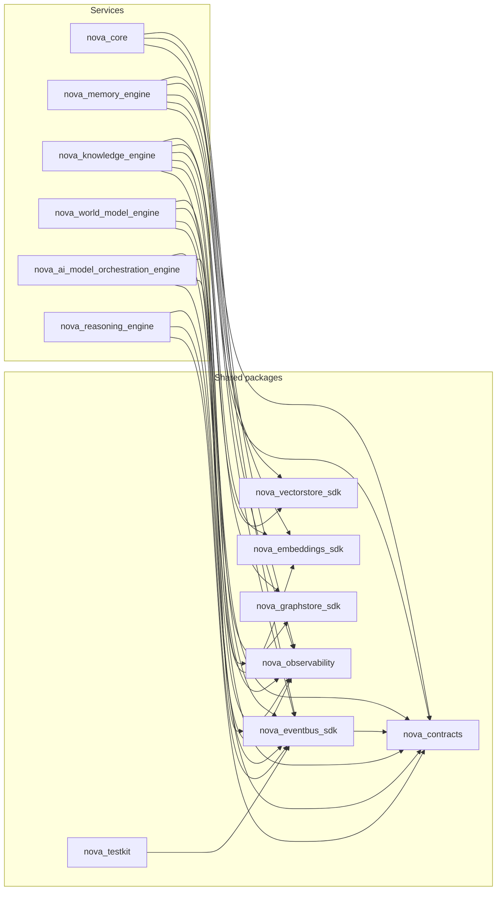

# Phase 2B Architecture Gate Review

**Phase:** 2B — Reasoning Engine (Bible Part 8)
**Date:** 2026-08-05
**Trigger:** Standing user directive (established at the Phase 1 Gate Review, reapplied
at Phase 2A's close) to complete every phase with a full Gate Review before the next
phase's design work begins. Reasoning Engine's implementation is complete; this review
checks it, and the whole repository it now sits inside, with the same discipline.
**Method:** Every finding below is backed by a command actually run against this
repository in this session (test runs, `ruff`/`mypy`/`import-linter`/`pip-audit`, a
fresh `grimp`-based import graph, `cloc`/`radon`, `docker compose config`, direct
source and live-database inspection) — not restated from memory or the Phase 2B
Architecture Review Report. Where a metric could not be measured in this environment,
that is stated explicitly rather than estimated. One real, if minor, issue was found
and fixed as part of this review (§3); it is called out where relevant and summarized
in §19.

---

## 1. Overall architecture assessment

The thirteen-package foundation — seven shared packages, six services — holds up
under direct scrutiny this session:

- **558 tests pass** across all 13 first-party packages (up from Phase 2A's 480),
  zero failures. The new engine alone contributes 69 (43 unit, 11 integration, 15
  ADR-023 port-compliance); `nova-contracts` grew by 9 (reasoning event-payload
  tests).
- **`ruff check .`** — zero issues, whole repository.
- **`mypy`**, run per-package matching the exact CI invocation — zero issues, **264**
  source files across all 13 packages (up from 209).
- **`import-linter`** — all **4** contracts kept (0 broken) over **251** analyzed
  files / **1,135** dependencies (up from 197 files / 899 dependencies at Phase 2A's
  close). No fifth contract was needed this phase — Reasoning Engine introduces no
  new forbidden-import class the way ADR-020 did for the AI Model Orchestration
  Engine; it is a consumer of existing ports, not a new kind of boundary.
- **`pip-audit`** — zero known vulnerabilities in third-party dependencies.
- **A from-scratch `grimp` dependency graph** (independent of import-linter's own
  scoped contracts) finds **zero cycles** among all 13 first-party packages and
  **zero engine-to-engine internal imports**, including the new engine.
- **Domain-layer purity verified by direct inspection**: `grep` across the new
  engine's entire `domain/` tree for `fastapi`/`sqlalchemy`/`nova_eventbus_sdk`/
  `anthropic`/`ollama` imports returns zero matches. `clients/` and `repository/`
  are the only directories that import concrete infrastructure.
- **New this phase, and a first for this project**: this sandbox has a native
  Postgres 16 instance available, used to boot the real `PostgresReasoningRepository`
  against a live database and run a genuine reason → persist → retrieve round trip
  (§7, §11) — every prior phase's Gate Review could only verify the Postgres-specific
  repository code via fakes, with real-infra verification explicitly listed as an
  open gap. That gap is now partially closed for this engine (ad hoc, not yet a
  committed CI-enforced test — see §4).

The architecture is sound. The one issue found and fixed during this review (§3, an
unused, dead configuration field) was real but trivial and cosmetic — no correctness
issue survived to this review's start; both correctness bugs this phase actually
introduced-and-fixed (§2 of the Architecture Review Report: the context-assembly
all-or-nothing degradation, and the missing `OutboxEventORM.id` default in both this
engine and the already-shipped `ai-model-orchestration-engine`) were caught and closed
during the phase's own implementation work, confirmed still closed by this review's
fresh test run rather than re-discovered. The foundation is ready to support Phase 2C.

## 2. Remaining architectural risks

- **`context_assembly.py`'s per-port isolation depends on every upstream client
  continuing to honor its own documented graceful-degradation contract.** Verified
  true today for all five clients by direct inspection (each catches its own
  `TimeoutError` and returns an empty list / `None`, never propagates). Nothing at
  the type-system level enforces this for a future client change — a client that
  started raising instead of degrading would still be handled safely by the outer
  catastrophic-failure fallback in `pipeline.py`, but less gracefully (a full
  `ContextBundle` wipe instead of single-port degradation) than the design intends.
  Low likelihood (the pattern is uniform and simple across all five clients today),
  worth an explicit code-review checklist item the next time a client module is
  touched.
- **Multi-step mode is single-pass, not yet recursive** (Architecture Review Report
  §3) — a real, named, tested gap. No caller depends on the recursion existing yet
  (Multi-step is one of ten selectable modes, and nothing routes to it by default at
  Level 4 unless a caller explicitly requests it or the heuristic falls through to
  it — see §9's mode-resolution note below).
- **Constraint Evaluation's hard gate has nothing real to check yet** (ARR §3) — the
  mechanism is correct and tested; the per-alternative structured metadata it needs
  doesn't exist in this phase's `Alternative` model. Zero risk today (no alternative
  is ever mechanically gated out), but means the gate is currently a no-op in
  practice, not a defense multi-step or constraint-based reasoning can actually lean
  on yet.
- **This engine ships one background worker, not two or three** (ARR §3) — a direct,
  honest consequence of scope (no periodic domain job exists to run yet), not a
  regression, but worth naming because it breaks the pattern every prior engine
  established and a future reader might otherwise read as an oversight.
- **`GET /v1/reasoning/traces` has no limit/pagination**, the same class of gap
  Phase 1's Gate Review first flagged and every subsequent phase has carried
  forward, now present in a fifth data-serving engine.

## 3. Technical debt

Consistent with the Architecture Review Report's §5 finding: no debt accepted in the
traditional sense. Re-verified this session, plus one new item found and fixed:

- `clients/personal_context_client.py`'s `WorldModelPort` projection and
  `knowledge_client.py`'s traverse-confidence placeholder remain the only
  pre-existing candidates evaluated, and remain correctly classified as deliberate,
  documented scope decisions.
- **New this review, found and fixed:** `config.py` declared
  `outbox_poll_interval_seconds: int = 5`, documented as
  "`workers/outbox_worker.py`'s fixed poll interval" — but `workers/__init__.py`'s
  actual cron job hardcodes `second={0, 10, 20, 30, 40, 50}` (a fixed 10-second
  cadence, matching every prior engine's own convention) and never reads this
  setting. A dead, unused configuration field — no other engine in this project
  exposes an equivalent setting at all, since Arq's `cron_jobs` list is evaluated at
  class-definition time, not from a runtime `Settings` instance, the same reason
  every prior engine's own outbox cadence is hardcoded rather than configurable.
  Removed rather than wired up: wiring it in would mean this engine alone deviating
  from the established hardcoded-cadence convention for no stated reason, and the
  field's own docstring gave no indication a configurable cadence was actually
  intended. Confirmed by re-running the full test suite, `ruff`, and `mypy` after
  the removal — all still clean.
- **Two real correctness bugs were found and fixed during this phase's own
  implementation work** (detailed in the Architecture Review Report §2), re-verified
  as closed by this review's fresh test run rather than re-discovered: the
  `context_assembly.py` all-or-nothing degradation, and the missing
  `OutboxEventORM.id` Python-side default in both this engine and the
  already-shipped, already-Gate-Reviewed `ai-model-orchestration-engine`.

## 4. Missing infrastructure

**Fixed during this review:** the one item in §3 (the dead `outbox_poll_interval_seconds`
field).

**Open, not fixed this review — all carried forward from Phase 1/2A's Gate Reviews,
unaddressed since:**
- **No Docker daemon in this development environment**, confirmed directly again
  this session (`docker info` reports "Cannot connect to the Docker daemon"). This
  is why performance benchmarks, memory usage, and startup time (§8, Metrics) still
  cannot be measured here for any of the six services. `docker compose -f
  infra/docker/docker-compose.local.yml config --quiet` — the exact command CI runs
  — validates clean for the now-six-service stack, confirmed this session.
  **Partial improvement this phase**: unlike every prior phase, this sandbox does
  have a native Postgres 16 instance, used to verify the new engine's real
  repository layer end to end (§1, §7, §11) — the first genuine real-database
  verification in this project's history, though still not a committed, CI-enforced
  test (§4 continues below), and still no substitute for the full multi-service
  Docker Compose stack (NATS, Redis-backed Arq, six services concurrently).
- **No automated event-contract-drift check** — still manual; this phase's own
  drift comparison (§10) was run by hand again, not by CI.
- **No CORS middleware, no rate limiting, no request size limits** on any engine's
  API, including the new one — consistent with local-first scope, still
  un-addressed as a written deployment constraint.
- **The internal CLI/admin API** — still not built. Now covers state across six
  engines instead of five.
- **No pagination convention** — still not decided; now also absent from the new
  engine's `GET /v1/reasoning/traces` (§2).
- **No committed pytest coverage against a real Postgres instance, for any engine**
  — this phase's own real-Postgres verification (§1) was ad hoc and not committed,
  the same status every prior phase's Postgres-specific repository code has had.

None of these are new to this phase except the partial Postgres-availability
improvement; the rest are pre-existing findings that remain open. Reporting them here
rather than silently omitting them is itself the point of re-running this review each
phase.

## 5. Scalability analysis

- **Pagination remains absent** (§2, §4) — `GET /v1/reasoning/traces` has no
  `limit`/`offset`, only an optional `user_id` filter. Zero-cost today (no real
  caller generates enough reasoning processes for this to matter yet), the same
  class of risk carried forward from every prior phase.
- **The outbox worker uses the same fixed 10-second cadence as every prior
  engine** (§3) — confirmed by direct inspection after removing the dead
  configurable-looking field that never actually governed it. Invisible at zero
  real traffic (no engine other than a future Planning Engine would call this one
  via RPC yet), the same deliberate latency-vs-simplicity tradeoff ADR-014 already
  reasoned through in Phase 1.
- **Context Assembly's five-way parallel fan-out** (`asyncio.gather`, §2 of the
  Architecture Review Report) is this design's primary latency lever, per the
  design doc's own §21 — verified structurally (no sequential awaiting across the
  five upstream calls), not load-tested (§8).
- **This engine adds no new cache.** Every read hits Postgres directly (or the
  upstream ports, per-request), the same "no cache beyond what's already justified"
  default every non-Model-Registry engine in this project follows.

## 6. Security analysis

- **No hardcoded secrets** in the new engine — verified by direct pattern search
  across its `src/` tree for password/secret/api-key literals; no matches.
- **No raw SQL string interpolation** — verified by direct inspection of every
  `session.execute(...)` call site in `postgres_reasoning_repository.py` (8 sites);
  every one passes a SQLAlchemy ORM-built statement object, never an f-string or
  `%`-formatted value.
- **`pip-audit` reports zero known vulnerabilities**, whole workspace, this session.
- **No authentication or authorization** on any endpoint of the new engine,
  confirmed by direct search — consistent with, and for the identical reason as,
  every prior phase's finding: `nova-auth` (SAD 13) remains deferred to Phase 7.
  The Dockerfile binds `0.0.0.0:8000`, not `127.0.0.1`, so the mitigation remains
  "don't publish the port."
- **No CORS middleware, no rate limiting** (§4) — same scope as every prior phase.
- **The Dockerfile runs as a non-root user** (`USER nova`, verified) and uses a
  multi-stage build — consistent with every other engine's Dockerfile.
- **Pydantic validates every API request body and every event payload** by
  construction, applied consistently; one genuine app-level validation this engine
  adds beyond Pydantic's own field-level checks is `POST .../override`'s explicit
  `400` when `action="redirect"` lacks `redirect_alternative_id` — a cross-field
  constraint Pydantic's per-field validation can't express alone, handled correctly
  in the route handler rather than silently accepted.

## 7. Reliability analysis

- **The transactional outbox is the strongest reliability mechanism in this
  engine**, mirroring every prior engine's own precedent: `finalize()` writes the
  `Decision`, `ReasoningTrace`, and outbox row in one Postgres transaction
  (`session.begin()`), verified directly in code and, this phase, against a real
  live database (§1) — a crash between the write and the publish can never lose or
  duplicate a `reasoning.process.completed`/`.failed` event.
- **Every reasoning process produces a `ReasoningTrace`, success or failure alike**
  (Part 8: "failure should improve future reasoning rather than terminate
  execution," ARR §1) — verified by direct reading of `pipeline.run`'s three
  terminal paths (Reactive, main, `_fail`), all three constructing and persisting a
  trace before returning.
- **The engine exposes `/internal/health` and `/internal/readiness`** plus a
  mounted `/internal/metrics` Prometheus endpoint, the same minimum operational
  surface every prior engine provides.
- **No chaos/fault-injection testing** beyond the ADR-023 port-compliance suite's
  timeout-handling scenarios. A slow-but-not-down Postgres, or an upstream port that
  accepts a request but hangs past its timeout window, are untested scenarios —
  reasonable to defer at today's real call volume (zero, since no real caller of
  `reasoning.reason.request` exists yet), the same call every prior phase made for
  its own engines.
- **No circuit breakers between this engine and any upstream port.** A consistently
  failing port is retried on every new request rather than proactively skipped —
  acceptable at today's real call volume, worth revisiting once a real caller
  (Planning Engine, Phase 3) makes this call path live, the same conditional every
  prior Gate Review has attached to a newly-built engine's own upstream calls.

## 8. Performance expectations

Bible Part 8's targets map directly onto Reasoning Level (design doc §21): Level 1
(Reactive) under one second; Level 2 (Analytical) several seconds; Level 3/4
(Strategic, Multi-step) correctness prioritized over speed, with visible progress
required — satisfied by `POST /v1/reasoning/reason/stream`'s per-stage SSE events.
**None of these targets have been measured against real infrastructure**, in this
environment or any other, at any point in this project's history — the same
unmeasured-until-Docker status every prior phase's performance target still carries.
This review's own real-Postgres smoke test produced one latency number
(≈12 seconds for an Analytical-mode request), but it is **not a meaningful
performance measurement** — the bulk of that time was a `ModelOrchestrationPort`
call timing out against nothing (no real AI Model Orchestration Engine process was
running in this environment) plus this engine's own bounded retry, not real pipeline
work. It is reported here only to be transparent about what was and wasn't measured,
not presented as evidence toward or against Part 8's stated targets.

## 9. API consistency review

- **URL convention is consistent** with every prior phase: `/v1/reasoning/...` and
  `/internal/...` for operational endpoints, no exceptions found across the
  engine's 9 route handlers.
- **HTTP status code vocabulary extends the existing small, consistent set with two
  genuinely new, individually-justified codes**: `404` (trace/decision not found,
  reusing the existing convention) plus two new additions — `400` (missing
  `redirect_alternative_id` on a `redirect` override, a cross-field constraint
  Pydantic alone can't express, §6) and `501` (Collaborative mode requested,
  `modes.NotImplementedModeError` translated directly into the HTTP status that
  means exactly that). Both new codes are the correct, honest choice for what
  they represent, not an invented convention.
- **`response_model` coverage is 6/9 route handlers** — the 3 without an explicit
  `response_model=` are each individually justified: `POST .../reason/stream`
  (genuinely dynamic SSE, the same justified exception the AI Model Orchestration
  Engine's own streaming endpoint set in Phase 2A), and `health.py`'s 2 endpoints
  (return-type annotation instead, matching every prior engine's own
  health-endpoint pattern exactly).
- **Mode-resolution note**: `domain/modes/resolve_mode_and_level`'s heuristic
  (design doc §4, "Understand intent") never resolves to Multi-step or
  Collaborative from a fresh objective without an explicit
  `reasoning_mode_hint` — both are reached only through their own dedicated entry
  points per §6, verified directly in the heuristic's own code and covered by a
  dedicated unit test this phase (`test_modes.py`) that exercises every branch,
  including this one.
- **No pagination convention** (§2, §5) — the same real, still-open gap as every
  prior phase, now present in a fifth data-serving engine.

## 10. Event Bus consistency review

Verified by direct comparison, not narrative: every subject in the new engine's
`events/published.py` (8 entries: 3 owned/announced events +
`reasoning.process.completed`/`.failed`/`reasoning.human_override.applied`, plus 5
outbound `*.request` calls to Memory/Knowledge/World Model/the AI Model Orchestration
Engine) and `events/subscribed.py` (1 entry, `reasoning.reason.request`) against
`nova_contracts.registry.known_subjects()` (**48** entries total, up from 43 at
Phase 2A's close — the exact 5 new reasoning payload subjects).

- **Zero unexplained drift.** All 9 unique subjects this engine references are
  registered. `reasoning.reason.reply` is registered but correctly absent from
  `published.py`/`subscribed.py` — the same convention every prior engine
  established: reply payloads are returned directly from a `BoundEventBus.serve()`
  handler, never published, so they never belong in an allow-list governing
  `publish()`/`subscribe()`/`request()`/`serve()` calls.
- **Naming convention is consistent** (`reasoning.<entity>.<action>`), no
  exceptions.
- **The five outbound `*.request` subjects live in `events/published.py`, not
  `subscribed.py`**, matching every prior engine's own outbound-call convention
  exactly: `BoundEventBus.request()` checks the *publishable* allow-list even
  though the subject grammatically looks like something this engine "receives a
  reply to."
- **This engine subscribes to nothing in the reactive sense** — its one
  subscribed entry is a served RPC, not a reaction to an upstream producer,
  the same shape the AI Model Orchestration Engine's own `events/handlers.py`
  established in Phase 2A. This phase adds a genuine first: a real Event Bus
  round-trip test (`test_events_reason_request.py`) that invokes the served
  handler through an actual subscription rather than calling the handler function
  directly — the first time any engine's own served-RPC handler has been tested
  this way in this project, closing a gap every prior phase's own served-RPC
  handlers still have.

## 11. Database consistency review

Verified by reading the new engine's initial Alembic migration in full and by direct
inspection of the live `reasoning` schema in this sandbox's real Postgres instance
(§1) — not sampled, and not migration-file-only the way every prior phase's review
had to be.

- **Schema naming is consistent**: `reasoning`, matching the engine's name, the same
  convention as every prior schema.
- **Primary key convention holds, with a verified-correct exception, not a
  drift.** All 7 tables use `UUID PRIMARY KEY`. Unlike Phase 1/2A's `BIGSERIAL`
  append-only-log exceptions, this engine's one deviation is at the *default*
  level, not the key type: 6 of 7 tables declare no Python- or DB-side default at
  all, relying entirely on the domain layer supplying an already-generated UUID
  (every domain Pydantic model carries `id: UUID = Field(default_factory=uuid4)`)
  — verified by direct inspection of all 8 `session.add`/ORM-construction call
  sites in `postgres_reasoning_repository.py`, every one passing an explicit `id=`.
  The 7th table, `outbox_event`, is the one exception: its own domain-level
  `OutboxEvent` value object deliberately carries no `id` field (identity is a
  pure persistence-layer concern there), so `OutboxEventORM.id` needs — and, after
  this phase's fix (Architecture Review Report §2), has — its own
  `default=uuid.uuid4`. This is the schema-level evidence that the bug found and
  fixed this phase was real and narrowly scoped, not symptomatic of a wider
  pattern: checked directly against all 7 tables, only the one that structurally
  needed a default was missing one.
- **Timestamp convention is uniform**: every `created_at`/`completed_at` column is
  `TIMESTAMPTZ`, `created_at` server-defaulted to `now()`, no exceptions.
- **The `outbox_event` table is structurally the simpler, no-graph-saga version**
  (5 columns, matching the AI Model Orchestration Engine's own shape exactly) —
  correct, since this engine owns no graph either.

## 12. ADR consistency review

**16 per-subsystem ADRs exist** (ADR-011 through ADR-026), **unchanged from Phase
2A's close** — this is itself a notable, honest finding: Phase 2B filed zero new
ADRs. ADR-026 (Reasoning Engine as cognitive bridge, never an isolated subsystem,
never owning data except records of its own reasoning processes) was deliberately
filed at Phase 2A's close, ahead of this phase's design work, per that phase's own
Gate Review recommendation — and it required no amendment (Architecture Review
Report §2, §8), and no implementation-time decision this phase rose to the level of
requiring its own new ADR. Both real bugs found and fixed this phase (§2 of the ARR)
were filed as bug-fix narrative in that report, not as ADRs, following the exact
precedent Phase 2A's own privacy-tier `min`/`max` correction set: a bug fix corrects
an already-made decision, it doesn't make a new one.

## 13. Module dependency analysis

Rebuilt from scratch this session using `grimp` against all 13 first-party top-level
packages (not reused from Phase 2A's graph):

**27 edges total** (up from 24 at Phase 2A's close) — the new engine adds exactly 3:
`nova_reasoning_engine` → `nova_contracts`, `nova_eventbus_sdk`, `nova_observability`.
No edge to `nova_graphstore_sdk`, `nova_vectorstore_sdk`, or `nova_embeddings_sdk` —
correct: this engine owns no graph, does not itself index vectors, and generates no
embeddings (it consumes memory/knowledge search results already scored by their own
engines, never re-embedding anything itself). This is the *smallest* dependency
footprint of any service in NOVA so far — every edge points from a service to a
shared package, never sideways between services, verified structurally again this
session.

## 14. Circular dependency verification

The same `grimp` graph was run through an explicit cycle detector (DFS, white/gray/
black coloring) over all 13 first-party packages. **Result: no cycles found.** A
separate, explicit check for any edge between two of the six services found none —
the ADR-004 engine-independence guarantee holds at the package-edge level for all
six services now, including the one added this phase.

## 15. SOLID and Clean Architecture compliance

- **Dependency Inversion**: the new engine's `domain/ports.py` defines Protocols
  (`MemoryPort`, `KnowledgePort`, `WorldModelPort`, `PersonalContextPort`,
  `GoalsPort`, `ModelOrchestrationPort`, `ReasoningRepository`) that `domain/`
  depends on and `clients/`/`repository/` implement — never the reverse. Verified
  structurally in §1/§14: zero `domain/` imports of concrete infrastructure.
- **Single Responsibility**: each `domain/` module owns exactly one concern
  (`pipeline.py` orchestration, `context_assembly.py` fan-out, `hypothesis_
  generation.py` the one model call, `evidence_collection.py` support-scoring,
  `alternative_generation.py` conversion-plus-bounded-retry, `constraint_
  evaluator.py` the hard gate, `decision_matrix.py` scoring, `goal_evaluator.py`
  alignment, `confidence.py` the seven-factor formula, `explanation.py`
  derivation, `failure_recovery.py` the recovery-action mapping, `trace.py`
  assembly) — the same one-concern-per-file discipline every prior engine's
  `domain/` layout already established.
- **Interface Segregation**: six separate upstream-port Protocols rather than one
  large "context provider" interface, because no caller ever needs more than one
  at once and each is satisfied by an independently swappable client — the same
  pattern Memory Engine's `MemoryRepository`/`WorkingMemoryStore` split
  established in Phase 1.
- **Open/Closed**: adding an eleventh reasoning mode means a new `modes/<name>.py`
  module plus a `CONFIGS` dict entry, never a modification to `pipeline.run`
  itself — `run` dispatches to whichever `ModeConfig` `resolve_mode_and_level`
  selects, never branches on mode identity throughout the pipeline body.
- **Liskov substitution** holds by construction: the ADR-023 port-compliance suite
  runs the identical test functions against each port's fake and its real-client
  (mock-transport-backed) implementation — 15 tests, all passing identically
  regardless of which implementation is under test, including the one port
  (`GoalsPort`) where "both return `[]` unconditionally" is itself the asserted
  behavioral identity.
- **Clean Architecture's layer-dependency rule holds directionally**: `api/`/
  `events/` → `domain/` ← `clients/`/`repository/`/`workers/`, with `domain/` at
  the center depending on nothing outward — verified by direct grep in §1, not
  inferred from the README diagram alone.

## 16. Domain Driven Design compliance

- **Bounded context**: the engine owns its own Postgres schema (`reasoning`), no
  graph, no Redis domain state, and communicates with every other engine only via
  events/RPC (§10, ADR-004) — verified at the infrastructure level, including
  against a real live database this phase (§1, §11), not asserted at the
  documentation level alone.
- **Ubiquitous language matches the Bible's own terminology**: "Cognitive
  Pipeline," "Decision Matrix," "Reasoning Mode," "Confidence Estimation," "Human
  Override" all appear identically in the Bible text (Part 8), the design doc, and
  the code itself (`pipeline.py`, `decision_matrix.py`, `ModeConfig`,
  `confidence.py`, `HumanOverrideRequest` names verified directly) — no
  translation layer where code uses different words than the design.
- **Repository pattern** is the sole persistence abstraction `domain/` depends on;
  never an ORM session or raw connection leaking into `domain/`.
- **Domain models are not anemic**: `pipeline.py`, `confidence.py`,
  `decision_matrix.py`, `context_assembly.py` all contain real behavior (the
  fourteen-step orchestration, the weighted confidence formula, multi-criteria
  scoring, the isolated parallel fan-out) operating on the domain types, not
  data-holding classes with logic pushed into API handlers.
- **The transactional outbox is DDD's "eventual consistency between aggregates in
  different bounded contexts," applied correctly again**: a `Decision`/
  `ReasoningTrace` pair and the `reasoning.process.completed` event that announces
  them to the rest of NOVA cannot be written and published atomically across a
  database and a message bus, so the outbox exists specifically to make that gap
  safe — verified against a real database transaction this phase, not only
  asserted from the code's own structure.

## 17. Bible compliance verification

Restated from the Architecture Review Report §8 (re-verified here): the Reasoning
Engine (Bible Part 8) is implemented at the breadth the Phase 2B design doc scoped
— the Cognitive Pipeline in full, the Decision Lifecycle state machine (now with
both of its `degraded` branches genuinely reachable, §2/§11), all ten reasoning
modes as selectable strategies (Collaborative correctly raising `NotImplementedModeError`,
Multi-step correctly scoped to single-pass), Goal Evaluation, Constraint Evaluation,
the seven-factor Confidence Estimation formula, Hypothesis Generation as the one
legitimate model call, the Decision Matrix, Decision Explanation, Failure Handling,
Human Override, and the Reasoning Trace as structured metadata, never chain-of-thought
exposure. ADR-026, filed at Phase 2A's close specifically to govern this phase, held
without amendment — confirmed again this session (§1, §13, §15, §16), not merely
carried forward as an assumption.

## 18. Future migration risks

- **A real Planning Engine (Phase 3) becoming this engine's first real caller** is
  itself a migration risk in the sense that it will be the first time anything
  actually exercises `reasoning.reason.request` under real, non-synthetic load, and
  the first time `GoalsPort`'s placeholder (§2, §4 of the ARR) needs to become a
  real RPC-backed port. ADR-026's own Future Implications names this migration path
  explicitly; mitigated today by the engine's own compliance/integration suite
  already proving the RPC handler behaves correctly against synthetic requests,
  including through a real Event Bus round trip (§10).
- **Event Bus / Graph Store backend changes**: this engine adds no new coupling to
  either — the smallest dependency footprint of any service in NOVA (§13). No
  incremental risk introduced this phase.
- **Schema evolution**: this engine's Alembic history is independent of every other
  engine's, the same "fine while independent, needs a real strategy only if a
  coordinated multi-engine migration is ever required" status carried forward
  unchanged from Phase 1.
- **The context-assembly per-port isolation's implicit contract** (§2) is a real,
  if currently low-likelihood, migration risk: any future upstream client that
  stops honoring "degrade gracefully, never raise" would silently coarsen this
  engine's own degradation behavior rather than fail loudly.

## 19. Recommendations before Phase 2C

**Already done as part of this review** (see §3/§4 for detail):
1. Removed the dead `outbox_poll_interval_seconds` configuration field that
   `workers/__init__.py`'s actual cron job never read.

**Recommended, not yet done (all carried forward from Phase 1/2A's Gate Reviews,
still open — see §4):**
2. Run the now-six-service compose stack in a Docker-capable environment to capture
   startup time, memory footprint, and a first real latency measurement against
   Part 8's stated performance targets (§8) — this phase's own smoke test could not
   substitute for this (§8's own caveat).
3. Decide and implement a pagination convention across all five data-serving
   engines, including this one's `GET /v1/reasoning/traces` (§2, §5, §9).
4. Add an automated CI check comparing every subject in every engine's
   `published.py`/`subscribed.py` against `nova_contracts.registry.known_subjects()`
   (§10) — still run manually every phase, still not made permanent.
5. Explicitly document that no engine's port may be published to a host network or
   the internet before `nova-auth` ships (§6).
6. Build the internal CLI/admin API (§4) — now more valuable than at Phase 2A's
   close, with a sixth engine's state to inspect.
7. Build a committed pytest suite against a real Postgres instance, for this
   engine and every prior one (§1, §4) — this phase's own ad hoc verification
   caught one real, previously-undetectable bug affecting two engines; making that
   verification permanent and CI-enforced would catch the next one automatically.

**New this phase:**
8. Once Planning Engine (Phase 3) exists, migrate `GoalsPort` from its Phase 2B
   placeholder to a real RPC-backed port (§2, §18), per ADR-026's own named path.
9. Implement Multi-step mode's recursion trigger (§2, Architecture Review Report §3)
   once a real caller exercises Level 3/4 requests that plausibly need it.

None of items 2-9 block Phase 2C's design work from starting — they are operational,
risk-reduction, and feature-completion work that can proceed in parallel with, or
just ahead of, whatever Phase 2C builds, except item 2's latency verification, which
should land before any future engine takes a runtime dependency on this engine's own
routing-speed budget, the same conditional every prior phase's own performance
target has carried.

## 20. Final Go / No-Go recommendation

**Go.**

The architecture is sound by every check this review could actually run: zero test
failures across 558 tests, zero lint/type errors across 264 source files, zero
broken import contracts (4/4 kept), zero circular dependencies, zero unexplained
event-contract drift, zero hardcoded secrets or SQL injection surface, and a
verified-not-assumed Clean Architecture/DDD boundary structure — this phase adds a
genuine strengthening of that verification standard by confirming the real
repository layer against a live Postgres database for the first time in this
project's history, not just against fakes. The one issue found during this review
(a dead configuration field) was cosmetic and is closed. The two real correctness
bugs this phase's own implementation work found and fixed — the context-assembly
all-or-nothing degradation, and the missing `OutboxEventORM.id` default affecting
both this engine and the already-shipped AI Model Orchestration Engine — are closed
and re-verified, not just asserted fixed. The gaps found and not fixed (no
pagination, no measured runtime performance, no CLI/admin tool, no auth, Multi-step
mode's single-pass scope, Constraint Evaluation's no-op per-alternative check) are
either explicitly out of Phase 2B's documented scope (auth, deferred to Phase 7) or
genuinely deferrable without blocking whatever Phase 2C builds — none are
foundation-level defects.

Phase 2B is closed.

---

## 21. Project Metrics

Per the standing requirement established at the Phase 1 Gate Review
([SAD 15 §10](../../architecture/15-development-workflow.md#10-project-metrics--the-sloc-milestone-gate),
[`METRICS_TEMPLATE.md`](METRICS_TEMPLATE.md)). Every number below comes from a tool
actually run against this repository this session (`cloc --skip-uniqueness`, `radon
cc` plus a direct `ast`-based script, `grimp`, `git ls-files`/`du`, `pytest --cov`)
— none are estimated. Phase 2A's own numbers are restated alongside for direct
comparison, not re-measured from that report. **This review uses `cloc
--skip-uniqueness`** (the template's own recommended flag) throughout, having
confirmed that plain `cloc` silently deduplicates identical scaffolded files
(alembic.ini, script.py.mako) across engines — Phase 2A's own SLOC figures were not
re-measured with this flag and are restated as originally reported, so the like-for-
like comparison below is directionally correct but the absolute Phase 2A baseline may
itself be a small undercount for this same reason.

### Project Statistics — total repository, not implementation size

| Metric | Phase 2A | Phase 2B |
|---|---|---|
| Total files (git-tracked) | 534 | **624** (including this report and the Architecture Review Report, staged for measurement) |
| Total directories (git-tracked) | 109 | **127** |
| Total repository size (git-tracked working-tree content) | ~2.33 MB | **~2.87 MB** |
| `.git` history size (informational, separate from working-tree content) | ~5.9 MB | ~7.1 MB |
| Full on-disk working directory (informational only — includes `node_modules`, `.venv`; environment-dependent) | ~411 MB | ~429 MB (`node_modules` 64 MB + `.venv` 235 MB + the rest) |

### Implementation Statistics

Production SLOC is scoped identically to every prior phase: application `src/` code
(**15,044** SLOC, measured with `--skip-uniqueness`) + database schema migrations
(**282** SLOC, Alembic, 5 files) = **15,326 SLOC**. Dev tooling scripts, tests, the
generated TypeScript client, and documentation are each reported separately, never
folded into this number.

| Metric | Phase 2A | Phase 2B |
|---|---|---|
| **SLOC, excluding comments/blanks (all tracked languages, all purposes)** | 38,541 | **45,544** |
| Total comment lines | 4,089 | **5,171** |
| Comment-to-code ratio | ≈10.6% | 5,171 / 45,544 ≈ **11.4%** |
| Total documentation lines (Markdown content lines, whole repo) | 17,542 | **19,860** |
| Total configuration lines (YAML + TOML + JSON + INI + Dockerfile) | 1,512 | **1,639** |
| Total test code SLOC | 5,838 | **7,263** |
| **Production code SLOC (official implementation-size number)** | 12,412 | **15,326** |
| Generated code SLOC | 654 (33→42 files at Phase 2A's own review) | **804** (47 files including `index.ts`; regenerated and confirmed zero-diff this session — not stale) |

**Note on documentation lines:** `cloc --vcs=git` enumerates via `git ls-files`, so
measuring this Architecture Review Report's and this Gate Review's own line counts
required staging both files (`git add`) before the final `cloc` pass below — both
are included in the **19,860** figure, measured after staging rather than estimated,
since both are committed alongside this review rather than added in a later phase.

**Other production Python not counted as "Production code" above:** dev tooling
(codegen script, both graph engines' `cypher/apply_constraints.py`,
`tools/scaffold-engine.py`) plus every engine's `alembic/env.py`/`script.py.mako` —
**14 files total** (up from Phase 2A's 12; the new engine's own `env.py`/
`script.py.mako` account for the growth) — real, maintained code, but build/developer
tooling rather than code that ships and runs as part of a deployed engine.

### Language Breakdown

| Language | Phase 2A SLOC | Phase 2B SLOC | Note |
|---|---|---|---|
| Python | 18,757 | **23,146** | `src/` (15,044) + Alembic migrations (282) + dev tooling + tests (7,263) |
| TypeScript | 654 | **804** | 100% generated (regenerated this review, confirmed fresh); no hand-written TypeScript exists yet |
| React (`.tsx`/`.jsx`) | 0 | **0** | `apps/web-client` remains a later-phase deliverable |
| SQL | 0 standalone files | **0 standalone files** | All SQL embedded in Python Alembic migrations, as in every prior phase |
| YAML | 593 | **615** | CI workflows (+1 matrix entry), `docker-compose.local.yml` (+1 service), observability configs |
| Dockerfile | 131 | **154** | 6 files now (one per deployable service, +1 this phase) |
| Other — TOML | 442 | **483** | `pyproject.toml` files (+1 this phase, plus dependency growth in the root workspace file) |
| Other — JSON | 226 | **237** | `package.json` files, tsconfig, etc. (+1 this phase) |
| Other — INI | 120 | **150** | `alembic.ini`, one per engine (+1 this phase) — measured with `--skip-uniqueness`; these 5 files are byte-identical scaffolded templates that plain `cloc` silently collapses to 1 |
| Other — Mako | 76 | **95** | Alembic migration-file templates (+1 this phase) — same dedup caveat as INI above |
| Other — Cypher | 12 | **12** | Unchanged — this engine owns no graph, adds no Cypher |

### Architecture Metrics

| Metric | Phase 2A | Phase 2B |
|---|---|---|
| Modules | 12 packages; 209 `src/` files (+42 generated TS, +12 Alembic/tooling scripts); 111 test files | **13 packages; 264 `src/` files** (mypy-checked count; +47 generated TS, +14 Alembic/tooling scripts); **128 test files** |
| Services | 5 deployable + 7 shared = 12 total | **6 deployable + 7 shared = 13 total** |
| APIs — HTTP | 49 total (44 route handlers + 5 mounted metrics; new engine: 12 route handlers + 1 mounted metrics) | **59 total** (53 route handlers + 6 mounted metrics; new engine: 9 route handlers + 1 mounted metrics) |
| APIs — HTTP, public vs. internal | 34 public (`/v1/...`) + 15 internal (`/internal/...`) | **41 public** (+7) + **18 internal** (+3: 2 route handlers + 1 mounted metrics) |
| APIs — event-bus | 36 total (29 published + 7 served; 43 registered payload schemas) | **40 total** (32 published + 8 served; **48 registered payload schemas**) — "published" here counts genuinely owned/announced event subjects only (never outbound `*.request` caller entries, which live in the same `published.py` file for allow-list purposes but are calls this engine makes, not events it announces); see §10 for the new engine's own raw `published.py`/`subscribed.py` subject count (9 total: 3 owned events + 5 outbound requests + verified against `subscribed.py`'s 1 entry) |
| Database tables | 22 (Memory 6, Knowledge 6, World Model 5, AI Model Orchestration 5) | **29** (+7: `reasoning_process`, `hypothesis`, `evidence`, `alternative`, `decision`, `reasoning_trace`, `outbox_event` — verified directly against this sandbox's live `reasoning` schema, not only the migration file) |
| Graph node types (Neo4j labels) | 20 (Knowledge 12, World Model 8) | **20** — unchanged; the new engine owns no graph |
| Graph relationships | 2 actively defined (Knowledge), World Model's capability unused | **2** — unchanged, no new engine touches the graph |
| Events | 29 published, 7 served RPCs, 43 registered schemas | **32 published** (+3: this engine's 3 owned/announced events), **8 served RPCs** (+1), **48 registered schemas** (+5) |
| ADRs | 26 (10 foundational + 16 per-subsystem) | **26 — unchanged.** Zero new ADRs filed this phase (§12); ADR-026, filed proactively at Phase 2A's close, already covered this phase's boundary decision in full |
| Architecture documents | 89 total (77 `docs/` files + 12 READMEs) | **94 total** — see breakdown below |

**Architecture documents breakdown (Phase 2B), verified via direct `git ls-files`
filtering per directory, not hand-summed:** 22 Bible parts (unchanged), 23 SAD docs
(unchanged — no new numbered architecture document was needed this phase), 17 files
in `docs/architecture/adr/` (unchanged — 16 ADRs + that directory's own `README.md`,
confirming §12's zero-new-ADR finding independently), **10** design docs (Phase 2A's
8 + this phase's `docs/design/phase-2b/00-reasoning-engine.md` and its `README.md`),
**9** roadmap docs (Phase 2A's 7 + this phase's Architecture Review Report and this
Gate Review) = **81** `docs/` files, + **13** engine/package READMEs (+1: this
engine's own) = **94 total** (not counting the repo's root `README.md` or
`infra/docker/README.md`, the same scope every prior count used).

**Event-bus API note:** served RPCs verified by direct count of every `bus.serve(...)`
call site across all six services' `main.py` files (Memory Engine 1, Knowledge
Engine 3, World Model Engine 1, AI Model Orchestration Engine 2, the new engine 1 =
8), not by arithmetic on the registry alone.

### Quality Metrics

| Metric | Phase 2A | Phase 2B |
|---|---|---|
| Total tests | 480 | **558** |
| Unit tests | ~373 | **390** (exact — every package's `tests/unit/` or flat `tests/` directory recounted via `pytest --collect-only` this session, not restated from Phase 2A's own partial figure) |
| Integration tests | ~122 | **133** (exact, same method) |
| Contract tests | 20 | **35** (+15 — this engine's ADR-023 port-compliance suite) |
| End-to-end tests | 0 | **0** — no `e2e/` suite exists anywhere yet, unchanged |
| Test coverage — production services (per service, `pytest --cov` this session) | new engine only: 84% | **memory-engine 80%** (1,287 stmts, 258 missed), **knowledge-engine 79%** (1,389, 286), **world-model-engine 73%** (1,101, 302), **ai-model-orchestration-engine 84%** (1,361, 211 — re-measured this session; statement count shifted slightly from Phase 2A's own 1,361/214 figure due to this phase's own `OutboxEventORM.id` default fix), **reasoning-engine 84%** (1,352, 223) |
| Test coverage — aggregate over the five production services | not previously aggregated | **80.3%** (6,490 statements, 1,280 missed, combined) — uncovered lines concentrate in every engine's Postgres-specific repository code and real-infra worker-construction paths, the identical pattern every phase has found, unchanged this phase |
| Ruff status | PASS, 0 issues | **PASS**, 0 issues, whole repository |
| MyPy status | PASS, 209 files | **PASS**, **264** files across all 13 packages (per-package invocation, matching CI exactly) |
| Import-linter status | PASS, 4/4 contracts, 197 files / 899 deps | **PASS**, **4/4** contracts, **251** files / **1,135** deps |

**Note on the Phase 2A unit/integration figures above:** that review's own report
did not fully re-decompose every pre-existing package's unit/integration split
(explicitly noted as such in that report). This review does the full, exact
recount for every one of the 13 packages via direct `pytest --collect-only` runs
per test directory — the 390/133/35/0 breakdown above is therefore the first fully
exact total in this project's history, not a partial figure carried forward.

### Growth Metrics

| Metric | Value |
|---|---|
| Production SLOC added this phase (Phase 2B) | **2,914** (current cumulative minus Phase 2A's own reported cumulative baseline: 15,326 − 12,412) — the new engine's own `src/` (2,728) + its Alembic migration (59) + `nova-contracts`' `events/reasoning.py` and related additions (≈127) |
| Production SLOC, Phase 2A baseline | 12,412 |
| **Total cumulative Production SLOC (through Phase 2B)** | **15,326** |
| Test SLOC added this phase | **1,425** — the new engine's own `tests/` (1,303) + `nova-contracts`' new `test_reasoning_events.py` (≈122) |
| Test SLOC, Phase 2A baseline | 5,838 |
| **Total cumulative test SLOC** | **7,263** |
| Documentation growth | 17,542 → **19,860** lines (+2,318 — the Phase 2B design doc and its README, this Architecture Review Report, this Gate Review, and the engine's own fully-rewritten README) |
| ADR growth | **+0** this phase, from a baseline of 26 — the first phase in this project's history to file zero new ADRs (§12) |

**50,000 SLOC milestone status: 15,326 / 50,000 ≈ 30.7%.** No Engineering Review
Milestone is triggered. At this phase's growth rate (2,914 SLOC for one engine,
versus Phase 2A's 2,618 for its own single new engine), the threshold remains
distant, but this is checked and reported at every phase boundary regardless, per
SAD 15 §10.

### Complexity Metrics

Computed via `radon cc` (175 blocks analyzed in the new engine's `src/` tree this
session) and a direct `ast`-based script (function/class length), both scoped to the
new engine specifically — Phase 2A's own complexity numbers (171 blocks, its own
`src/` tree) are restated for comparison, not re-run.

| Metric | Phase 2A (new engine only) | Phase 2B (new engine only) |
|---|---|---|
| Cyclomatic complexity — average | A (2.16) | **A (2.42)** |
| Cyclomatic complexity — grade distribution | 162 A / 8 B / 1 C / 0 D-F | **157 A / 13 B / 4 C / 1 D** (175 blocks total) |
| Cyclomatic complexity — highest-complexity outlier | `plan_routing` (C, 11) | **`pipeline.run`** (**D, 27**) — the single highest-complexity function in this project's history so far, and an expected one: it is the literal, un-split implementation of Part 8's fourteen-step Cognitive Pipeline plus all three confidence-band branches, the one place in this engine real complexity should concentrate. Next-highest: `build_prompt_context` (C, 14), `collect_evidence` (C, 12), `resolve_mode_and_level` (C, 11), `generate_alternatives` (C, 11) |
| Average function/method length | 17.4 lines | **17.5 lines** (126 functions/methods analyzed; longest: `pipeline.run` at 292 lines, driven by the same fourteen-step-orchestration cause as its complexity ranking) |
| Average class size | 23.0 lines | **18.2 lines** (54 classes analyzed; largest: `PostgresReasoningRepository` at 240 lines) |
| Largest module (by production SLOC) | `knowledge-engine` — 2,645 SLOC | **`reasoning-engine` — 2,728 SLOC**, now the largest module in NOVA, surpassing `knowledge-engine` (2,645) for the first time |
| Largest file (by line count) | `ai-model-orchestration-engine/domain/router.py` — 549 lines | Largest file remains `router.py` (unchanged, 549 lines); new engine's own largest file, `domain/pipeline.py`, is a close second at **515 lines** |
| Number of Public APIs (`/v1/...`) | 34 | **41** (+7: this engine's `/v1/reasoning/*`) |
| Number of Internal APIs (`/internal/...`) | 15 | **18** (+3: 2 route handlers + 1 mounted metrics, this engine) |
| Number of Event Types | 43 | **48** (see Architecture Metrics) |
| Number of Active Services | 5 defined | **6 defined** — "active" still means "exists and is deployable," not "currently running": no live environment is available in this sandbox to check actual running instances |
| Number of Background Workers | 12 (3 per Phase 2A-and-earlier engine) | **13** (+1: this engine ships only `outbox_worker.py` — no domain-specific periodic worker exists yet, §3 of the Architecture Review Report, an honest scope-driven departure from every prior engine's own 3-worker shape) |
