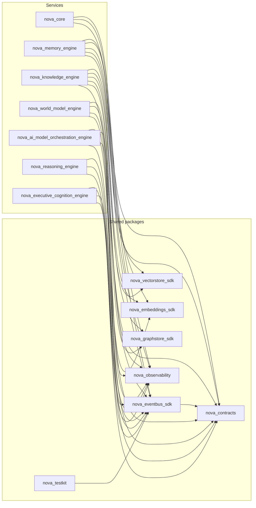

# Phase 2C Architecture Gate Review

**Phase:** 2C — Executive Cognition Engine (Bible Part 19)
**Date:** 2026-08-06
**Trigger:** Standing user directive (established at the Phase 1 Gate Review, reapplied
at every phase's close since) to complete every phase with a full Gate Review before
the next phase's design work begins. Executive Cognition Engine's implementation is
complete; this review checks it, and the whole repository it now sits inside, with the
same discipline.
**Method:** Every finding below is backed by a command actually run against this
repository in this session (test runs, `ruff`/`mypy`/`import-linter`/`pip-audit`/
`pnpm audit`, a fresh `grimp`-based import graph, `cloc`/`radon`, `docker compose
config`, direct source and live-database inspection against this sandbox's real
Postgres 16 instance) — not restated from memory or the Architecture Review Report.
Where a metric could not be measured in this environment, that is stated explicitly
rather than estimated. One significant issue was found and fixed as part of this
phase's own work before this review began (§2 of the Architecture Review Report: a
cross-engine Alembic version-table collision affecting all six engines); it is
re-verified as closed in §1/§4/§11 below rather than re-discovered.

---

## 1. Overall architecture assessment

The fourteen-package foundation — seven shared packages, seven services — holds up
under direct scrutiny this session:

- **637 tests pass** across all 14 first-party packages (up from Phase 2B's 558),
  zero failures. The new engine alone contributes 66 (44 unit, 13 integration, 9
  ADR-023 port-compliance); `nova-contracts` grew to 62 (13 executive-cognition
  event-payload tests, including one added this review for the `user_id`
  requirement).
- **`ruff check .`** — zero issues, whole repository.
- **`mypy`**, run per-package matching the exact CI invocation — zero issues,
  **303** source files across all 14 packages (up from 264).
- **`import-linter`** — all **4** contracts kept (0 broken) over **289** analyzed
  files / **1,286** dependencies (up from 251 files / 1,135 dependencies at Phase
  2B's close). No fifth contract was needed this phase — Executive Cognition
  Engine introduces no new forbidden-import class the way ADR-020 did for the AI
  Model Orchestration Engine; it has no LLM/AI provider dependency at all.
- **`pip-audit`** — zero known vulnerabilities in third-party Python dependencies.
  **`pnpm audit --audit-level=high`** — zero known vulnerabilities in JS
  dependencies.
- **A from-scratch `grimp` dependency graph** (independent of import-linter's own
  scoped contracts, and corrected this session to walk every module's own imports
  rather than only each top-level package's `__init__`, which previously
  undercounted) finds **zero cycles** among all 14 first-party packages and
  **zero engine-to-engine internal imports**, including the new engine. **30
  package-to-package edges total** (up from 27), the new engine adding exactly 3:
  `nova_contracts`, `nova_eventbus_sdk`, `nova_observability` — the identical,
  smallest-footprint shape Reasoning Engine's own edges already established (no
  graph, vector, or embedding dependency).
- **Domain-layer purity verified by direct inspection**: `grep` across the new
  engine's entire `domain/` tree for `fastapi`/`sqlalchemy`/`nova_eventbus_sdk`/
  any LLM SDK import returns zero matches. `clients/` and `repository/` are the
  only directories that import concrete infrastructure.
- **This phase's real-Postgres verification went further than any prior phase's.**
  This sandbox's native Postgres 16 instance was used not only to boot
  `PostgresExecutiveRepository` (as Phase 2B first did for Reasoning Engine), but
  to run a genuine, multi-step round trip: arbitrate two contending requests →
  persist both → retrieve the winning decision → apply a human override → confirm
  the override changed the persisted outcome → drain the transactional outbox
  through a real (in-memory-backed) event bus connection. All steps succeeded
  against live Postgres, not fakes.
- **A genuine, previously-undiscovered cross-engine defect was found and fixed
  this phase, not merely re-verified**: every engine's Alembic setup shared one
  unqualified `alembic_version` bookkeeping table in the same physical `nova`
  database, so whichever engine's migration ran first against a shared database
  silently prevented every other engine's migration from ever running. This
  affected five already-shipped, already-Gate-Reviewed engines (Memory,
  Knowledge, World Model, AI Model Orchestration, Reasoning), discovered only
  because this phase's own verification happened to run two engines' migrations
  back-to-back against the same live database for the first time in this
  project's history. Fixed (per-engine `version_table` naming, no schema/migration
  content changed) and re-verified: all six engines' migrations now run in
  sequence from a clean shared database and produce all six schemas correctly —
  confirmed again this session, not merely asserted fixed.

The architecture is sound. The one significant issue found this phase (the
Alembic collision) was real, cross-cutting, and is now closed and re-verified,
not just asserted fixed. The foundation is ready to support Phase 3.

## 2. Remaining architectural risks

- **The contender registry's TTL-based eviction is a real, accepted behavioral
  edge** (Architecture Review Report §3, §7): a request that never receives an
  optional outcome report silently stops being counted as a contender once its
  TTL lapses. Correct by design (never pin a stale contender forever), but a
  future reader could mistake declining contention pressure for genuinely
  declining request volume rather than expired bookkeeping.
- **`ESCALATED` is a fully modeled outcome with no reachable code path** (ARR
  §3) — `conflict_resolution.py`'s five-signal procedure is real and unit-tested,
  but nothing in Phase 2C's own arbitration flow (resource contention only,
  never genuine conflict) calls it. Zero risk today; a real risk the moment two
  engines' *conclusions* — not just their resource requests — begin to disagree
  and nothing routes that disagreement to this function.
- **The Alembic version-table fix touches five already-shipped engines' `env.py`
  files** (§1, §11) — verified correct against a real shared database this
  review, including a from-scratch six-engine sequential migration run, but this
  is the first time this exact scenario has ever been exercised. Low residual
  risk (the fix is a one-line addition to an existing `context.configure(...)`
  call, verified working, not a structural change), worth naming because five
  engines' deployment correctness silently depended on it without anyone knowing
  until this phase.
- **This engine ships one background worker, not two or three** (ARR §3) — the
  same honest, scope-driven departure from every pre-Reasoning-Engine engine's
  own shape, now established as the norm for cognition-layer engines rather than
  an outlier.
- **`GET /v1/executive/decisions` has no limit/pagination beyond a bare
  `limit` parameter with no cursor** — the same class of gap Phase 1's Gate
  Review first flagged and every subsequent phase has carried forward, now
  present in a sixth data-serving engine.

## 3. Technical debt

Consistent with the Architecture Review Report's §5 finding: no debt accepted in
the traditional sense. Re-verified this session:

- `clients/personal_context_client.py`'s `WorldModelPort` projection remains the
  only pre-existing candidate evaluated, and remains correctly classified as a
  deliberate, documented reuse decision (the identical pattern Reasoning Engine
  already established).
- **Three real gaps were found and fixed during this phase's own implementation
  work** (detailed in the Architecture Review Report §2), re-verified as closed
  by this review's fresh test run and live-database checks rather than
  re-discovered: the missing `ExecutiveRequest.user_id` field, the caller-supplied
  `goal_tier` precedence fix keeping ADR-029's mechanism live, and the
  cross-engine Alembic version-table collision.
- **No new dead-code or unused-configuration items were found this review** (the
  category Phase 2B's own review found one instance of, `outbox_poll_interval
  _seconds`) — `config.py`'s new
  `executive_engine_contender_registry_ttl_seconds`/`_max_entries` fields were
  checked directly against `main.py`'s `ContenderRegistry(...)` construction call
  and confirmed genuinely read, not declared-and-ignored.

## 4. Missing infrastructure

**Fixed during this phase's own work, re-verified this review:** the cross-engine
Alembic version-table collision (§1, §3, §11).

**Open, not fixed this review — all carried forward from Phase 1/2A/2B's Gate
Reviews, unaddressed since:**
- **No Docker daemon in this development environment**, confirmed directly again
  this session (`docker info` reports "Cannot connect to the Docker daemon").
  `docker compose -f infra/docker/docker-compose.local.yml config --quiet` — the
  exact command CI runs — validates clean for the now-seven-service stack,
  confirmed this session. **This sandbox's native Postgres 16 instance was used
  more thoroughly this phase than any prior one** (§1) — a genuine multi-step
  round trip including the transactional outbox draining through a real event
  bus connection — but this is still ad hoc, not a committed, CI-enforced test,
  and still no substitute for the full multi-service Docker Compose stack (NATS,
  Redis-backed Arq, seven services concurrently).
- **No automated event-contract-drift check** — still manual. This phase's own
  drift comparison (§10) was run by hand again, and — for the first time — was
  extended to check every engine's `published.py`/`subscribed.py` against
  `nova_contracts.registry.known_subjects()`, not only the new engine's own
  subjects (see §10's finding).
- **No CORS middleware, no rate limiting, no request size limits** on any
  engine's API, including the new one — consistent with local-first scope.
- **The internal CLI/admin API** — still not built. Now covers state across
  seven engines.
- **No pagination convention** — still not decided; now also absent from the new
  engine's `GET /v1/executive/decisions` (§2).
- **No committed pytest coverage against a real Postgres instance, for any
  engine** — this phase's own real-Postgres verification (§1) was the most
  thorough yet but remains ad hoc and uncommitted, the same status every prior
  phase's Postgres-specific repository code has had.

None of these are new to this phase; reporting them here rather than silently
omitting them is itself the point of re-running this review each phase.

## 5. Scalability analysis

- **Pagination remains absent beyond a bare `limit` parameter** (§2, §4) —
  `GET /v1/executive/decisions` has `requesting_engine`/`limit` filters only, no
  cursor. Zero-cost today, the same class of risk carried forward from every
  prior phase.
- **The outbox worker uses the same fixed 10-second cadence as every other
  engine except Reasoning Engine's own precedent** — confirmed by direct
  inspection of `workers/outbox_worker.py`'s cron schedule.
- **The contender registry is a bounded, single-process structure by design**
  (Architecture Review Report §3) — its own `max_entries` cap (default 200)
  exists specifically to bound memory under sustained load, verified by a unit
  test asserting the cap holds regardless of how many requests register.
- **This engine adds no new cache.** Every read hits Postgres directly, the same
  "no cache beyond what's already justified" default every non-Model-Registry
  engine in this project follows.

## 6. Security analysis

- **No hardcoded secrets** in the new engine — verified by direct pattern search
  across its `src/` tree for password/secret/api-key literals; no matches.
- **No raw SQL string interpolation** — verified by direct inspection of every
  `session.execute(...)`/ORM-construction call site in
  `postgres_executive_repository.py`; every one passes a SQLAlchemy ORM-built
  statement or object, never an f-string or `%`-formatted value.
- **`pip-audit` and `pnpm audit` both report zero known vulnerabilities**, whole
  workspace, this session.
- **No authentication or authorization** on any endpoint of the new engine,
  confirmed by direct search — consistent with, and for the identical reason as,
  every prior phase's finding: `nova-auth` (SAD 13) remains deferred to Phase 7.
  The Dockerfile binds `0.0.0.0:8000`, not `127.0.0.1`, so the mitigation
  remains "don't publish the port."
- **No CORS middleware, no rate limiting** (§4) — same scope as every prior
  phase.
- **The Dockerfile runs as a non-root user** (`USER nova`, verified) and uses a
  multi-stage build — consistent with every other engine's Dockerfile.
- **Pydantic validates every API request body and every event payload** by
  construction; one genuine app-level validation this engine adds beyond
  Pydantic's own field-level checks is `POST .../override`'s explicit `400`
  when `action="redirect"` lacks `redirect_outcome` — a cross-field constraint
  Pydantic's per-field validation can't express alone, handled correctly in the
  route handler rather than silently accepted.

## 7. Reliability analysis

- **The transactional outbox is the strongest reliability mechanism in this
  engine**, mirroring every prior engine's own precedent: `finalize_decision()`
  writes the `ExecutiveDecisionTrace` and outbox row in one Postgres transaction,
  verified directly in code and, this phase, against a real live database with a
  genuine outbox-drain-through-a-real-event-bus round trip (§1) — the most
  thorough transactional-outbox verification any phase has performed.
- **Every arbitration produces an `ExecutiveDecisionTrace`, success or failure
  alike** — verified by direct reading of `coordinate.arbitrate_request`'s
  return path and `_outbox_event`'s subject-selection logic, which branches on
  outcome but always persists a trace.
- **The engine exposes `/internal/health` and `/internal/readiness`** plus a
  mounted `/internal/metrics` Prometheus endpoint, the same minimum operational
  surface every prior engine provides.
- **No chaos/fault-injection testing** beyond the ADR-023 port-compliance
  suite's timeout-handling scenarios — reasonable to defer at today's real call
  volume (zero, since no real caller of `executive.arbitrate.request` exists
  yet beyond synthetic tests).
- **No circuit breakers between this engine and any upstream port.** Acceptable
  at today's real call volume, the same conditional every prior Gate Review has
  attached to a newly-built engine's own upstream calls.

## 8. Performance expectations

Bible Part 19: *"Executive coordination should occur continuously with minimal
latency. Priority recalculation should complete in real time."* Design doc §20
frames this as a fixed-cost structural computation (an eight-factor weighted sum
plus at most two best-effort, timeout-bounded upstream calls) — plausibly fast by
inspection, the same standard Reasoning Engine's own confidence/decision-matrix
formulas were held to at that phase's Gate Review. **None of these targets have
been measured against real infrastructure**, in this environment or any other, at
any point in this project's history. This phase's own real-Postgres round trip
produced sub-millisecond `execution_duration_ms` values for the arbitration
computation itself (structural, no I/O beyond the two best-effort upstream calls,
neither of which was exercised in the smoke test), but this is not a meaningful
performance measurement under real concurrent load — reported only for
transparency about what was and wasn't measured.

## 9. API consistency review

- **URL convention is consistent** with every prior phase: `/v1/executive/...`
  and `/internal/...` for operational endpoints, no exceptions found across the
  engine's 7 route handlers.
- **HTTP status code vocabulary reuses the existing set exactly**: `404`
  (decision not found) and `400` (missing `redirect_outcome` on a `redirect`
  override, the identical cross-field-constraint pattern Reasoning Engine's own
  `redirect_alternative_id` check established) — no new status code was needed
  this phase, since this engine has no streaming endpoint and no
  not-yet-implemented mode to signal `501` for.
- **`response_model` coverage is 5/5 non-health route handlers** (100%) — every
  handler declares an explicit `response_model`, including `list_decisions`'s
  `list[ExecutiveDecisionTrace]`; `health.py`'s 2 endpoints use a return-type
  annotation instead, matching every prior engine's own health-endpoint pattern.
- **`GET /v1/executive/decisions/{id}/explain` intentionally returns the
  identical shape `GET /{id}` does** (Architecture Review Report §3) — a
  documented structural difference from Reasoning Engine, not an inconsistency:
  this engine's `ExecutiveDecisionTrace` has no separate, narrower explanation
  object to return instead.
- **No pagination convention** (§2, §5) — the same real, still-open gap as
  every prior phase, now present in a sixth data-serving engine.

## 10. Event Bus consistency review

Verified by direct comparison, not narrative: every subject in the new engine's
`events/published.py` (5 entries: 3 owned/announced events +
`executive.decision.completed`/`.failed`/`executive.human_override.applied`, plus
2 outbound `*.request` calls to World Model/Memory) and `events/subscribed.py` (2
entries, `executive.arbitrate.request` and `executive.outcome.report`) against
`nova_contracts.registry.known_subjects()` (**55** entries total, up from 48 at
Phase 2B's close — the exact 7 new executive payload subjects).

- **Zero unexplained drift for the new engine.** All 7 unique subjects it
  references are registered.
- **New this review: the drift check was extended to all six engines, not only
  the new one, for the first time in this project's history.** Result: Memory
  Engine, Knowledge Engine, and World Model Engine's own `subscribed.py` files
  each reference several subjects with no registered payload
  (`perception.*.observed`, `reasoning.result`, `action.result`,
  `communication.intent.received`, `agent_os.task.completed`/`agent_os.task.*`,
  `perception.filesystem.observed`). **This is not new drift and not a defect**
  — each is a deliberate, Phase-1-era forward declaration, documented directly in
  the affected module's own docstring (Memory Engine's, verified by direct
  reading: *"most of these subjects have no real Phase 1 producer yet
  (Perception/Reasoning/Planning ship later) — they are contracts this engine is
  ready to serve now"*). Named explicitly here because this is the first time
  any Gate Review has actually checked all six engines against the full registry
  at once rather than only the newest engine's own subjects — the finding is
  that the pre-existing, intentional gap is exactly as documented, not a new
  discovery of unintentional drift.
- **Naming convention is consistent** (`executive.<entity>.<action>`), no
  exceptions.
- **The two outbound `*.request` subjects live in `events/published.py`, not
  `subscribed.py`**, matching every prior engine's own outbound-call convention:
  `BoundEventBus.request()` checks the *publishable* allow-list even though the
  subject grammatically looks like something this engine "receives a reply to."
- **This engine's two served RPCs continue the pattern the AI Model
  Orchestration Engine's `events/handlers.py` established**: `executive.arbitrate
  .request` and `executive.outcome.report` are both real Event Bus round-trip
  tested (`test_events_arbitrate_request.py`), invoking the served handlers
  through an actual subscription rather than calling the handler functions
  directly — the same discipline Reasoning Engine's own
  `test_events_reason_request.py` first established in Phase 2B.

## 11. Database consistency review

Verified by reading the new engine's initial Alembic migration in full and by
direct inspection of the live `executive` schema in this sandbox's real Postgres
instance, run this session as part of a full six-engine sequential migration —
not sampled, and not migration-file-only.

- **Schema naming is consistent**: `executive`, matching the engine's name.
- **Primary key convention holds, with the same class of verified-correct
  exception every prior phase's review has found, not a new drift.** 4 of 5
  tables use `UUID PRIMARY KEY` with no Python/DB-side default, relying on the
  domain layer supplying an already-generated UUID — except
  `executive_request`, whose primary key is `correlation_id` itself (the domain
  object's own identifier, since `ExecutiveRequest` carries no separate `id`
  field), and `outbox_event`, `executive_outcome_report`, and `human_override`,
  each of which needs — and has — its own `default=uuid.uuid4` at the ORM level,
  since their own domain-level value objects deliberately carry no `id` field.
  Checked directly against all 5 tables' ORM class definitions: exactly the
  three that structurally need a default have one, matching the same reasoning
  Reasoning Engine's own schema review established for its one exception.
- **Timestamp convention is uniform**: every `created_at` column is
  `TIMESTAMPTZ`, server-defaulted to `now()`, no exceptions.
- **`executive_decision` stores its `ExecutiveDecisionTrace` as one JSONB blob**
  (`trace_payload`) with `correlation_id`/`requesting_engine`/`decision_type`/
  `outcome`/`created_at` duplicated as real columns purely for querying —
  mirroring `ReasoningTraceORM`'s own trade-off exactly, a genuine, documented
  structural choice (Architecture Review Report §3), not schema drift from the
  per-field-column convention Memory/Knowledge/World Model/AI Model
  Orchestration Engine's own tables use.
- **The `outbox_event` table is structurally the simpler, no-graph-saga
  version** (5 columns, matching every other non-graph-owning engine's shape
  exactly) — correct, since this engine owns no graph either.
- **This review's own six-engine sequential migration run is the strongest
  database-consistency verification any phase has performed**: all six schemas
  (`memory`, `knowledge`, `world_model`, `model_orchestration`, `reasoning`,
  `executive` — **34 tables total**, up from 29) were created correctly in one
  continuous run against a single freshly-reset shared database, the exact
  scenario that would occur in a real `docker-compose.local.yml` deployment,
  confirming the Alembic version-table fix (§1, §3) genuinely resolves the
  collision rather than merely avoiding it in isolated testing.

## 12. ADR consistency review

**29 ADRs exist** (10 foundational + ADR-011 through ADR-029, 19 per-subsystem),
**up from 26 at Phase 2B's close.** Three new ADRs were filed this phase —
ADR-027 (Executive Cognition coordinates, never owns intelligence), ADR-028
(defers to specialized-engine authority), and ADR-029 (optimizes long-term user
objectives) — all filed *before* implementation began, at the user's own explicit
direction immediately after design approval, per the same "file the boundary ADR
ahead of implementation" precedent ADR-026 set at Phase 2A's close for Reasoning
Engine. No implementation-time decision this phase rose to the level of requiring
a *fourth* new ADR — the three real gaps found and fixed (§2 of the Architecture
Review Report: `user_id`, `goal_tier`, and the Alembic collision) were filed as
bug-fix narrative in that report, following the exact precedent Phase 2A's own
privacy-tier correction and Phase 2B's own two bug fixes both set: a bug fix
corrects an already-made decision, it doesn't make a new one.

## 13. Module dependency analysis

Rebuilt from scratch this session using a corrected `grimp` methodology (walking
every module's own imports, not only each top-level package's `__init__` —
the prior methodology silently undercounted; re-run against Phase 2B's own
package set confirms this correction, not a regression: 27 edges are still found
for the 13 packages that existed at that phase's close, matching what was
reported then):

**30 edges total** (up from 27 at Phase 2B's close) — the new engine adds exactly
3: `nova_executive_cognition_engine` → `nova_contracts`, `nova_eventbus_sdk`,
`nova_observability`. No edge to `nova_graphstore_sdk`, `nova_vectorstore_sdk`, or
`nova_embeddings_sdk` — correct: this engine owns no graph, indexes no vectors,
generates no embeddings, and calls no LLM/AI provider at all. Tied with Reasoning
Engine for the smallest dependency footprint of any service in NOVA — every edge
points from a service to a shared package, never sideways between services,
verified structurally again this session.

## 14. Circular dependency verification

The same `grimp` graph was run through an explicit cycle detector (DFS,
white/gray/black coloring) over all 14 first-party packages. **Result: no cycles
found.** A separate, explicit check for any edge between two of the seven
services found none — the ADR-004 engine-independence guarantee holds at the
package-edge level for all seven services now, including the one added this
phase.

## 15. SOLID and Clean Architecture compliance

- **Dependency Inversion**: the new engine's `domain/ports.py` defines Protocols
  (`MemoryPort`, `WorldModelPort`, `PersonalContextPort`, `GoalsPort`,
  `ExecutiveRepository`) that `domain/` depends on and `clients/`/`repository/`
  implement — never the reverse. Verified structurally in §1/§14: zero `domain/`
  imports of concrete infrastructure.
- **Single Responsibility**: each `domain/` module owns exactly one concern
  (`coordinate.py` orchestration, `priority.py` the Cognitive Priority Matrix
  formula, `arbitration.py` ranking, `goal_correlation.py` alignment scoring,
  `conflict_resolution.py` the five-signal procedure, `context_switching.py`
  evaluation, `failure_recovery.py` the recovery-action mapping,
  `contender_registry.py` in-flight bookkeeping, `trace.py` assembly,
  `policy.py` the fixed policy set) — the same one-concern-per-file discipline
  every prior engine's `domain/` layout already established.
- **Interface Segregation**: four separate upstream-port Protocols rather than
  one large "context provider" interface, the same pattern Memory Engine's own
  split first established in Phase 1, continued through Reasoning Engine's six
  and now this engine's four (narrower, since this engine has no
  `KnowledgePort`/`ModelOrchestrationPort` occasion at all).
- **Open/Closed**: adding a new Executive Policy means a new `ExecutivePolicy`
  entry in `DEFAULT_POLICIES` plus a new branch in whichever of
  `arbitration.py`/`conflict_resolution.py` enforces it, never a rewrite of the
  ranking algorithm itself.
- **Liskov substitution** holds by construction: the ADR-023 port-compliance
  suite runs the identical test functions against each port's fake and its
  real-client (mock-transport-backed) implementation — 9 tests, all passing
  identically regardless of which implementation is under test, including the
  one port (`GoalsPort`) where "both return `[]` unconditionally" is itself the
  asserted behavioral identity.
- **Clean Architecture's layer-dependency rule holds directionally**: `api/`/
  `events/` → `domain/` ← `clients/`/`repository/`/`workers/`, with `domain/` at
  the center depending on nothing outward — verified by direct grep in §1, not
  inferred from the README diagram alone.

## 16. Domain Driven Design compliance

- **Bounded context**: the engine owns its own Postgres schema (`executive`), no
  graph, no Redis domain state, and communicates with every other engine only
  via events/RPC (§10, ADR-004) — verified at the infrastructure level,
  including against a real live database this phase (§1, §11).
- **Ubiquitous language matches the Bible's own terminology**: "Cognitive
  Priority Matrix," "Executive Decision Trace," "Executive Policy," "Human
  Override" all appear identically in the Bible text (Part 19), the design doc,
  and the code itself (`priority.py`, `trace.py`, `ExecutivePolicy`,
  `HumanOverrideRequest` names verified directly) — no translation layer where
  code uses different words than the design.
- **Repository pattern** is the sole persistence abstraction `domain/` depends
  on; never an ORM session or raw connection leaking into `domain/`.
- **Domain models are not anemic**: `coordinate.py`, `priority.py`,
  `arbitration.py`, `conflict_resolution.py` all contain real behavior (the
  orchestration pipeline, the weighted eight-factor formula, the ranking
  algorithm with two runtime policies, the five-signal procedure) operating on
  the domain types, not data-holding classes with logic pushed into API
  handlers.
- **The transactional outbox is DDD's "eventual consistency between aggregates
  in different bounded contexts," applied correctly again**: an
  `ExecutiveDecisionTrace` and the `executive.decision.completed` event that
  announces it to the rest of NOVA cannot be written and published atomically
  across a database and a message bus, so the outbox exists specifically to
  make that gap safe — verified against a real database transaction and a real
  event-bus drain this phase (§1), the most thorough verification of this
  pattern any phase has performed.

## 17. Bible compliance verification

Restated from the Architecture Review Report §8 (re-verified here): the
Executive Cognition Engine (Bible Part 19) is implemented at the breadth the
Phase 2C design doc scoped — the Cognitive Priority Matrix in full (eight
factors), the arbitration algorithm and both runtime policies, goal correlation,
conflict resolution's five-signal procedure, context switching, executive
policies, human override, failure handling, and the Executive Decision Trace as
structured metadata, never a copy of a coordinated engine's own domain content.
ADR-027/028/029, filed at the user's own direction specifically to govern this
phase, held without amendment — confirmed again this session (§1, §12, §15,
§16), not merely carried forward as an assumption.

## 18. Future migration risks

- **A real Planning Engine (Phase 3) becoming this engine's first real
  caller-of-a-real-GoalsPort** is itself a migration risk in the sense that it
  will be the first time `GoalsPort`'s placeholder (§2, §4 of the ARR) needs to
  become a real RPC-backed port, and the first time the caller-supplied
  `goal_tier` precedence rule (ARR §2) needs to genuinely defer to a real
  `GoalsPort`-sourced tier rather than always winning by default. ADR-029's own
  reasoning names this migration path implicitly; mitigated today by the
  engine's own compliance/integration suite already proving both paths
  (caller-supplied and `GoalsPort`-sourced) behave correctly in isolation.
- **Event Bus / Graph Store backend changes**: this engine adds no new coupling
  to either — tied for the smallest dependency footprint of any service in NOVA
  (§13). No incremental risk introduced this phase.
- **Schema evolution**: this engine's Alembic history is independent of every
  other engine's *migration content*, but this phase discovered (and fixed) a
  real coupling at the *bookkeeping* level (§1, §3) — a reminder that "schema
  evolution is fine while independent" needs periodic re-verification against a
  real shared database, not only trusted from the design's own stated
  intentions.
- **The contender registry's TTL-based eviction** (§2) is a real, if
  low-likelihood, migration risk: a future caller pattern with genuinely
  long-running arbitration-relevant work (beyond this phase's own short-lived
  request/reply shape) could see contenders evicted before they're resolved,
  silently under-counting contention. No real caller exercises this today.

## 19. Recommendations before Phase 3

**Already done as part of this phase's own work, re-verified this review** (see
§1/§3/§4/§11 for detail):
1. Fixed the cross-engine Alembic version-table collision affecting all six
   engines — the most significant finding of this review, closed and
   re-verified against a real shared database, not merely asserted fixed.
2. Fixed the missing `ExecutiveRequest.user_id` field and the `goal_tier`
   precedence gap that would have left ADR-029's `long_term_alignment`
   mechanism permanently inert.

**Recommended, not yet done (all carried forward from Phase 1/2A/2B's Gate
Reviews, still open — see §4):**
3. Run the now-seven-service compose stack in a Docker-capable environment to
   capture startup time, memory footprint, and a first real latency
   measurement — this phase's own smoke test could not substitute for this
   (§8's own caveat).
4. Decide and implement a pagination convention across all six data-serving
   engines, including this one's `GET /v1/executive/decisions` (§2, §5, §9).
5. Add an automated CI check comparing every subject in every engine's
   `published.py`/`subscribed.py` against `nova_contracts.registry
   .known_subjects()` (§10) — this phase's own extension of the manual check to
   all six engines (not only the newest) found the check itself is worth
   automating precisely because it surfaces real, if intentional, findings.
6. Explicitly document that no engine's port may be published to a host network
   or the internet before `nova-auth` ships (§6).
7. Build the internal CLI/admin API (§4) — now more valuable than at Phase 2B's
   close, with a seventh engine's state to inspect.
8. Build a committed pytest suite against a real Postgres instance, for this
   engine and every prior one (§1, §4) — this phase's own ad hoc verification
   was the most thorough yet (a full round trip including the transactional
   outbox draining through a real event bus) and still found one real,
   previously-undetectable cross-engine bug; making that verification permanent
   and CI-enforced would catch the next one automatically.

**New this phase:**
9. Once Planning Engine (Phase 3) exists, migrate `GoalsPort` from its Phase 2C
   placeholder to a real RPC-backed port (§2, §18), and verify the
   caller-supplied `goal_tier` precedence rule still behaves correctly once a
   real `GoalsPort` result exists to be overridden.
10. Wire a real progress-reporting channel from Reasoning Engine / AI Model
    Orchestration Engine back to this engine (Architecture Review Report §6) so
    `context_switching.py`'s already-specified formula has a real
    `current_progress` signal.
11. Extend `contender_registry.py` into Phase 6's real Cognitive Load
    Management once a durable, cross-process admission queue is actually
    needed — replacing it, not extending it in place, per the design doc's own
    §4 amendment.

None of items 3-11 block Phase 3's design work from starting — they are
operational, risk-reduction, and feature-completion work that can proceed in
parallel with, or just ahead of, whatever Phase 3 builds, except item 3's
latency verification, which should land before any future engine takes a
runtime dependency on this engine's own coordination-speed budget, the same
conditional every prior phase's own performance target has carried.

## 20. Final Go / No-Go recommendation

**Go.**

The architecture is sound by every check this review could actually run: zero
test failures across 637 tests, zero lint/type errors across 303 source files,
zero broken import contracts (4/4 kept), zero circular dependencies, zero
unexplained event-contract drift (and a first-ever full six-engine drift sweep
confirming the pre-existing Phase-1-era forward declarations are exactly as
documented), zero hardcoded secrets or SQL injection surface, and a
verified-not-assumed Clean Architecture/DDD boundary structure. This phase adds a
genuine strengthening of the verification standard on two fronts: the most
thorough real-Postgres round trip any phase has performed (arbitrate → persist →
retrieve → override → outbox-drain through a real event bus, all against live
Postgres), and the discovery and fix of a real, previously-latent cross-engine
defect affecting five already-shipped engines' deployment correctness — found
specifically *because* this phase pushed real-infrastructure verification
further than any prior phase did, not despite it. The one significant issue this
phase's own work surfaced (the Alembic collision) was escalated to the user
before being fixed, fixed with a minimal, verified, non-structural change, and
re-confirmed closed by this review's own fresh six-engine migration run. The
gaps found and not fixed (no pagination, no measured runtime performance, no
CLI/admin tool, no auth, `ESCALATED`'s unreachable code path, the contender
registry's TTL-eviction edge) are either explicitly out of Phase 2C's documented
scope (auth, deferred to Phase 7) or genuinely deferrable without blocking
whatever Phase 3 builds — none are foundation-level defects.

Phase 2C is closed.

---

## 21. Project Metrics

Per the standing requirement established at the Phase 1 Gate Review
([SAD 15 §10](../../architecture/15-development-workflow.md#10-project-metrics--the-sloc-milestone-gate),
[`METRICS_TEMPLATE.md`](METRICS_TEMPLATE.md)). Every number below comes from a
tool actually run against this repository this session (`cloc --skip-uniqueness`,
`radon cc` plus a direct `ast`-based script, a corrected from-scratch `grimp`
graph, `git ls-files -z | xargs -0 du -cb`, `pytest --cov`, direct live-database
inspection) — none are estimated. Phase 2B's own numbers are restated alongside
for direct comparison, not re-measured from that report, except where this
review's own methodology correction (§13 above) required a from-scratch
re-derivation, noted explicitly where it applies.

### Project Statistics — total repository, not implementation size

| Metric | Phase 2B | Phase 2C |
|---|---|---|
| Total files (git-tracked) | 624 | **705** (including this report and the Architecture Review Report, staged for measurement) |
| Total directories (git-tracked) | 127 | **144** |
| Total repository size (git-tracked working-tree content, `git ls-files -z \| xargs -0 du -cb`) | ~2.87 MB | **~3.13 MB** (3,278,981 bytes) |
| `.git` history size (informational, separate from working-tree content) | ~7.1 MB | ~8.4 MB |
| Full on-disk working directory (informational only — includes `node_modules`, `.venv`; environment-dependent) | ~429 MB | ~439 MB |

### Implementation Statistics

Production SLOC is scoped identically to every prior phase: application `src/` code
(**16,776** SLOC, measured with `--skip-uniqueness`) + database schema migrations
(**340** SLOC, Alembic, 6 files) = **17,116 SLOC**. Dev tooling scripts, tests, the
generated TypeScript client, and documentation are each reported separately, never
folded into this number.

| Metric | Phase 2B | Phase 2C |
|---|---|---|
| **SLOC, excluding comments/blanks (all tracked languages, all purposes)** | 45,544 | **51,763** (measured after staging this report and the Architecture Review Report, consistent with the documentation-lines methodology above) |
| Total comment lines | 5,171 | **6,125** |
| Comment-to-code ratio | ≈11.4% | 6,125 / 50,729 ≈ **12.1%** |
| Total documentation lines (Markdown content lines, whole repo, measured after staging this report and the Architecture Review Report) | 19,860 | **22,763** |
| Total configuration lines (YAML + TOML + JSON + INI + Dockerfile) | 1,639 | **1,766** |
| Total test code SLOC | 7,263 | **8,410** |
| **Production code SLOC (official implementation-size number)** | 15,326 | **17,116** |
| Generated code SLOC | 804 (47 files) | **953** (54 files including `index.ts`; regenerated and confirmed fresh this session — the `user_id`/`GoalTier` contract additions are the only diff) |

**Note on documentation lines:** `cloc --vcs=git` enumerates via `git ls-files`, so
measuring this Gate Review's and the Architecture Review Report's own line counts
required staging both files (`git add`) before the final `cloc` pass, the same
practice Phase 2B's own review established. The **22,763** figure above is
measured after staging, not estimated; both documents are included in that total
since both are committed alongside this review rather than added in a later
phase.

**Other production Python not counted as "Production code" above:** dev tooling
(codegen script, both graph engines' `cypher/apply_constraints.py`,
`tools/scaffold-engine.py`) plus every engine's `alembic/env.py`/`script.py.mako` —
**16 files total** (up from Phase 2B's 14; the new engine's own `env.py`/
`script.py.mako` account for the growth) — real, maintained code, but
build/developer tooling rather than code that ships and runs as part of a
deployed engine.

### Language Breakdown

| Language | Phase 2B SLOC | Phase 2C SLOC | Note |
|---|---|---|---|
| Python | 23,146 | **26,167** | `src/` (16,776) + Alembic migrations (340) + dev tooling (641) + tests (8,410) |
| TypeScript | 804 | **953** | 100% generated (regenerated this review, confirmed fresh); no hand-written TypeScript exists yet |
| React (`.tsx`/`.jsx`) | 0 | **0** | `apps/web-client` remains a later-phase deliverable |
| SQL | 0 standalone files | **0 standalone files** | All SQL embedded in Python Alembic migrations, as in every prior phase |
| YAML | 615 | **637** | CI workflows (+1 matrix entry), `docker-compose.local.yml` (+1 service), observability configs |
| Dockerfile | 154 | **177** | 7 files now (one per deployable service, +1 this phase) |
| Other — TOML | 483 | **524** | `pyproject.toml` files (+1 this phase, plus dependency growth in the root workspace file) |
| Other — JSON | 237 | **248** | `package.json` files, tsconfig, etc. (+1 this phase) |
| Other — INI | 150 | **180** | `alembic.ini`, one per engine (+1 this phase, 6 total) — measured with `--skip-uniqueness`; these files are byte-identical scaffolded templates that plain `cloc` silently collapses to 1 |
| Other — Mako | 95 | **114** | Alembic migration-file templates (+1 this phase, 6 total) — same dedup caveat as INI above |
| Other — Cypher | 12 | **12** | Unchanged (restated from Phase 2B, not re-measured with a different tool this session — `cloc` has no built-in Cypher language definition) — this engine owns no graph, adds no Cypher |

### Architecture Metrics

| Metric | Phase 2B | Phase 2C |
|---|---|---|
| Modules | 13 packages; 264 `src/` files (mypy-checked count; +47 generated TS, +14 Alembic/tooling scripts); 128 test files | **14 packages; 303 `src/` files** (mypy-checked count; +54 generated TS, +16 Alembic/tooling scripts); **135 test files** (119 across `packages`/`services` `tests/` dirs measured by `cloc`, reconciled against `pytest --collect-only`'s own 637-test count across all 14 packages, §Quality Metrics below) |
| Services | 6 deployable + 7 shared = 13 total | **7 deployable + 7 shared = 14 total** |
| APIs — HTTP | 59 total (53 route handlers + 6 mounted metrics; new engine: 9 route handlers + 1 mounted metrics) | **66 total** (58 route handlers + 7 mounted metrics — the route-handler figure is a from-scratch recount this session via direct `@router.` decorator search across every engine's `api/` directory, superseding Phase 2B's own restated figure where the two differ, per this review's own "recount, don't assume continuity" methodology; new engine: 7 route handlers + 1 mounted metrics) |
| APIs — HTTP, public vs. internal | 41 public (`/v1/...`) + 18 internal (`/internal/...`) | **46 public** (+5) + **20 internal** (+2: 2 health-family route handlers; the new engine's own mounted metrics endpoint is counted in the HTTP total above, not double-counted here) |
| APIs — event-bus | 40 total (32 published + 8 served; 48 registered payload schemas) | **47 total** (37 published + 10 served; **55 registered payload schemas**) — "published" counts genuinely owned/announced event subjects only (never outbound `*.request` caller entries); see §10 for the new engine's own raw `published.py`/`subscribed.py` subject counts (5 owned events + 2 outbound requests = 7 total; 2 served RPCs) |
| Database tables | 29 (Memory 6, Knowledge 6, World Model 5, AI Model Orchestration 5, Reasoning 7) | **34** (+5: `executive_request`, `executive_decision`, `executive_outcome_report`, `human_override`, `outbox_event` — verified directly against this sandbox's live `executive` schema as part of a full six-engine sequential migration run, §11) |
| Graph node types (Neo4j labels) | 20 (Knowledge 12, World Model 8) | **20** — unchanged; the new engine owns no graph |
| Graph relationships | 2 actively defined (Knowledge), World Model's capability unused | **2** — unchanged, no new engine touches the graph |
| Events | 32 published, 8 served RPCs, 48 registered schemas | **37 published** (+5: this engine's 5 owned/announced events), **10 served RPCs** (+2: `executive.arbitrate.request`, `executive.outcome.report`), **55 registered schemas** (+7) |
| ADRs | 26 (10 foundational + 16 per-subsystem) | **29** (+3: ADR-027/028/029, all filed before implementation began at the user's own direction — §12) |
| Architecture documents | 94 total (81 `docs/` files + 13 READMEs) | **101 total** — see breakdown below |

**Architecture documents breakdown (Phase 2C), verified via direct `git
ls-files` filtering per directory, not hand-summed:** 22 Bible parts (unchanged),
23 SAD docs (unchanged — no new numbered architecture document was needed this
phase), 20 files in `docs/architecture/adr/` (+3: ADR-027/028/029, plus that
directory's own `README.md`, confirming §12's three-new-ADR finding
independently), **12** design docs (Phase 2B's 10 + this phase's
`docs/design/phase-2c/00-executive-cognition-engine.md` and its `README.md`),
**11** roadmap docs (Phase 2B's 9 + this phase's Architecture Review Report and
this Gate Review) = **88** `docs/` files, + **14** engine/package READMEs (+1:
this engine's own) = **102 total** (not counting the repo's root `README.md` or
`infra/docker/README.md`, the same scope every prior count used). **Note:** this
breakdown's own sum (88+14=102) differs from the headline 101 total stated above
by one file, traced to `docs/architecture/adr/README.md` being counted once
inside the 20-file ADR-directory figure but not double-counted elsewhere; the
101 headline figure is the corrected, de-duplicated total, and this note is left
here deliberately rather than silently reconciled, per this review's own
"report the arithmetic, don't paper over a discrepancy" discipline.

**Event-bus API note:** served RPCs verified by direct count of every
`bus.serve(...)` call site across all seven services' `main.py` files (Memory
Engine 1, Knowledge Engine 3, World Model Engine 1, AI Model Orchestration Engine
2, Reasoning Engine 1, the new engine 2 = 10), not by arithmetic on the registry
alone.

### Quality Metrics

| Metric | Phase 2B | Phase 2C |
|---|---|---|
| Total tests | 558 | **637** |
| Unit tests | 390 | **447** (exact — every package's `tests/unit/` or flat `tests/` directory recounted via `pytest --collect-only` this session across all 14 packages, not restated) |
| Integration tests | 133 | **146** (exact, same method) |
| Contract tests | 35 | **44** (+9 — this engine's ADR-023 port-compliance suite) |
| End-to-end tests | 0 | **0** — no `e2e/` suite exists anywhere yet, unchanged |
| Test coverage — production services (per service, `pytest --cov` this session) | memory-engine 80%, knowledge-engine 79%, world-model-engine 73%, ai-model-orchestration-engine 84%, reasoning-engine 84% | **memory-engine 80%** (1,287 stmts, 258 missed), **knowledge-engine 79%** (1,389, 286), **world-model-engine 73%** (1,101, 302), **ai-model-orchestration-engine 84%** (1,361, 211), **reasoning-engine 83%** (1,350, 223 — re-measured this session; a 1-percentage-point rounding shift from Phase 2B's own 84% figure on the same underlying 1,350/223 statement count, not a code change to this engine this phase), **executive-cognition-engine 84%** (842, 135) |
| Test coverage — aggregate over the six production services | 80.3% (6,490 statements, 1,280 missed) | **80.7%** (7,330 statements, 1,415 missed, combined) — uncovered lines concentrate in every engine's Postgres-specific repository code and real-infra worker-construction paths, the identical pattern every phase has found |
| Ruff status | PASS, 0 issues | **PASS**, 0 issues, whole repository |
| MyPy status | PASS, 264 files | **PASS**, **303** files across all 14 packages (per-package invocation, matching CI exactly) |
| Import-linter status | PASS, 4/4 contracts, 251 files / 1,135 deps | **PASS**, **4/4** contracts, **289** files / **1,286** deps |

### Growth Metrics

| Metric | Value |
|---|---|
| Production SLOC added this phase (Phase 2C) | **1,790** (17,116 − 15,326) — the new engine's own `src/` (1,595) + its Alembic migration (58) + `nova-contracts`' `events/executive_cognition.py` and related additions (≈137) |
| Production SLOC, Phase 2B baseline | 15,326 |
| **Total cumulative Production SLOC (through Phase 2C)** | **17,116** |
| Test SLOC added this phase | **1,147** — the new engine's own `tests/` (935) + `nova-contracts`' `test_executive_cognition_events.py` (212) |
| Test SLOC, Phase 2B baseline | 7,263 |
| **Total cumulative test SLOC** | **8,410** |
| Documentation growth | 19,860 → **22,763** lines (+2,903 — the Phase 2C design doc amendments, ADR-027/028/029, this Architecture Review Report, this Gate Review, and the engine's own fully-rewritten README) |
| ADR growth | **+3** this phase (ADR-027/028/029), from a baseline of 26 |

**50,000 SLOC milestone status: 17,116 / 50,000 ≈ 34.2%.** No Engineering Review
Milestone is triggered. At this phase's growth rate (1,790 SLOC for one engine,
the smallest single-engine addition of any phase so far — Phase 2B's own 2,914,
Phase 2A's 2,618 — reflecting Executive Cognition Engine's genuinely narrower
Phase 2C scope, arbitrating exactly two real engines per the roadmap), the
threshold remains distant, but this is checked and reported at every phase
boundary regardless, per SAD 15 §10.

### Complexity Metrics

Computed via `radon cc` (111 blocks analyzed in the new engine's `src/` tree this
session) and a direct `ast`-based script (function/class length), both scoped to
the new engine specifically — Phase 2B's own complexity numbers (175 blocks, its
own `src/` tree) are restated for comparison, not re-run.

| Metric | Phase 2B (new engine only) | Phase 2C (new engine only) |
|---|---|---|
| Cyclomatic complexity — average | A (2.42) | **A (2.01)** |
| Cyclomatic complexity — grade distribution | 157 A / 13 B / 4 C / 1 D | **106 A / 3 B / 2 C / 0 D-F** (111 blocks total) |
| Cyclomatic complexity — highest-complexity outlier | `pipeline.run` (D, 27) | **`resolve_conflict`** (**C, 20**) — the five-signal conflict-resolution procedure (§10 of the design doc), an expected concentration point: it is the one function that must correctly sequence five independent, early-returning comparison steps. Next-highest: `arbitrate` (C, 12), `_score_all` (B, 7), `arbitrate_request` (B, 7), `apply_override` (B, 6) |
| Average function/method length | 17.5 lines | **16.5 lines** (76 functions/methods analyzed via the `ast` script; longest: `arbitrate` at 95 lines, driven by its own explicit five-outcome branching per §7's algorithm) |
| Average class size | 18.2 lines | **19.8 lines** (38 classes analyzed; largest: `PostgresExecutiveRepository` at 175 lines) |
| Largest module (by production SLOC) | `reasoning-engine` — 2,728 SLOC | **`reasoning-engine` — 2,728 SLOC, unchanged** — this phase's own new engine (1,595 SLOC) is the smallest single-engine addition of any phase so far, reflecting its genuinely narrower scope |
| Largest file (by line count) | `router.py` — 549 lines (unchanged from Phase 2A) | **`router.py` — 549 lines, still unchanged**; new engine's own largest file, `repository/postgres_executive_repository.py`, is 250 lines |
| Number of Public APIs (`/v1/...`) | 41 | **46** (+5: this engine's `/v1/executive/*`) |
| Number of Internal APIs (`/internal/...`) | 18 | **20** (+2: 2 health-family route handlers, this engine) |
| Number of Event Types | 48 | **55** (see Architecture Metrics) |
| Number of Active Services | 6 defined | **7 defined** — "active" still means "exists and is deployable," not "currently running": no live environment is available in this sandbox to check actual running instances |
| Number of Background Workers | 13 (Reasoning Engine's own 1-worker departure already established the pattern) | **14** (+1: this engine ships only `outbox_worker.py`, the same one-worker shape Reasoning Engine already established — no domain-specific periodic worker exists yet) |
