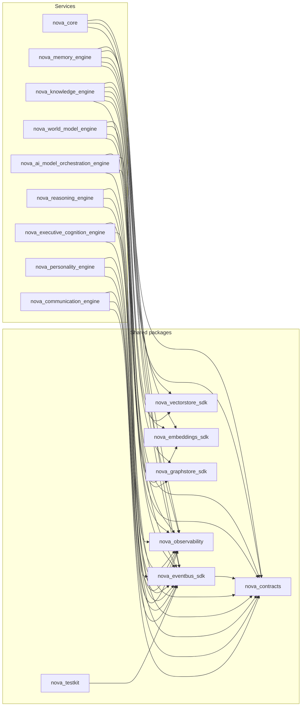

# Phase 2D-A Architecture Gate Review

**Phase:** 2D-A — Voice & Communication Foundation (Bible Parts 13, 17)
**Date:** 2026-08-07
**Trigger:** Standing user directive (established at the Phase 1 Gate Review, reapplied
at every phase's close since, and restated explicitly as a permanent rule at Phase 2C's
close) to complete every phase with a full Architecture Review, Gate Review, and
Engineering Metrics report before the next phase's design work begins.
**Method:** Every finding below is backed by a command actually run against this
repository in this session (test runs per package, `ruff`/`mypy`/`import-linter`/
`pip-audit`/`pnpm audit`, a fresh `grimp`-based import graph with an explicit cycle
check, `cloc --skip-uniqueness`, `radon cc`, `docker compose config --quiet`, direct
source inspection) — not restated from memory or the Architecture Review Report. Where
a metric could not be measured in this environment, that is stated explicitly rather
than estimated.

---

## 1. Overall architecture assessment

The now-sixteen-package foundation — eight shared packages, eight services — holds up
under direct scrutiny this session:

- **804 tests pass** across all 16 first-party packages (up from Phase 2C's 637), zero
  failures. The two new engines contribute 124 (54 personality-engine, 70
  communication-engine); `nova-contracts` grew to 76 (up from 62 — 14 new tests: 8 for
  `communication.py`'s payloads, 6 closing a pre-existing gap for `personality.py`'s
  payloads that had none before this session).
- **`ruff check .`** — zero issues, whole repository.
- **`mypy`**, run per-package matching the exact CI invocation — zero issues, **371**
  source files across all 16 packages (up from 303).
- **`import-linter`** — all **4** contracts kept (0 broken) over **355** analyzed files
  / **1,580** dependencies (up from 289 files / 1,286 dependencies at Phase 2C's
  close). No fifth contract was needed — neither new engine introduces a new
  forbidden-import class; `communication-engine` is the first engine with a WebSocket
  surface, but that is a FastAPI/Starlette capability already inside the existing
  ADR-004/006/007/020 boundary, not a new one.
- **`pip-audit`** — zero known vulnerabilities in third-party Python dependencies
  (every local workspace package correctly reported as "not found on PyPI," expected
  for path dependencies, not a finding). **`pnpm audit --audit-level=high`** — zero
  known vulnerabilities in JS dependencies.
- **A from-scratch `grimp` dependency graph**, walking every module's own imports
  (not only each top-level package's `__init__`, the corrected methodology Phase 2C's
  review established), finds **zero cycles** among all 16 first-party packages and
  **zero engine-to-engine internal imports**, including both new engines. **36
  package-to-package edges total** (up from 30 at Phase 2C's close), the two new
  engines adding exactly 3 each: `nova_contracts`, `nova_eventbus_sdk`,
  `nova_observability` — the same smallest-footprint shape Reasoning Engine and
  Executive Cognition Engine already established (no graph, vector, or embedding
  dependency; no LLM/AI provider SDK dependency, ADR-020).
- **Domain-layer purity verified by direct inspection**: `grep` across both new
  engines' entire `domain/` trees for `fastapi`/`sqlalchemy`/`nova_eventbus_sdk`/any
  LLM SDK import returns zero matches. `clients/`, `channels/`, and `repository/` are
  the only directories in `communication-engine` that import concrete infrastructure;
  `repository/` is the only one in `personality-engine`.
- **`docker compose -f infra/docker/docker-compose.local.yml config --quiet`** — the
  exact command CI runs — validates clean for the now-nine-service stack (exit code
  0), confirming both new services' YAML is well-formed and internally consistent with
  the rest of the file, even though the daemon itself cannot be reached in this
  sandbox to actually build or run the stack (see §4).
- **No real-Postgres verification was performed for either new engine this phase** —
  a genuine, named regression in verification depth relative to Phase 2C's own
  real-Postgres round trip for Executive Cognition Engine (also flagged in the
  Architecture Review Report §7). Both engines' repository layers are verified
  exclusively through in-memory fakes at the integration-test layer this phase.

The architecture is sound by every check available in this environment. The one
architecturally-significant fork this phase encountered (the streaming-synthesis
correction, Architecture Review Report §2) was escalated to the user before being
applied and is closed. The foundation is ready to support Phase 2D-B, with the
verification-depth regression noted above as this review's most significant
finding — not a defect, but a real gap worth naming rather than silently carrying
forward unremarked.

## 2. Remaining architectural risks

- **Neither new engine has been verified against real Postgres, NATS, or Redis** (§1)
  — both rely exclusively on fakes and the in-memory Event Bus backend. Low
  likelihood of a hidden defect given how closely both repository layers mirror
  already-verified prior engines' own patterns (ORM shape, outbox pattern,
  `version_table` namespacing), but this is inference from precedent, not direct
  evidence the way Phase 2C's own live-database round trip was.
- **`communication-engine`'s `session_registry.py` is genuinely live, in-process,
  single-instance state** — the first time this project has built anything beyond
  stateless-between-requests engines. Correct and scoped explicitly to Phase 2D-A
  (design doc §14), but a real shape change other engines don't share, worth tracking
  as this project's dependency surface grows.
- **The `Speaking -> Waiting` transition applying regardless of delivery success**
  (Architecture Review Report §2, §7) means session state alone cannot distinguish a
  successful delivery from a content-source engine's failure — a caller must inspect
  the RPC reply's `rejection_reason`, not just the session's persisted state. A
  documented, deliberate choice, not an oversight, but a real trap for a future
  reader who queries session state directly expecting it to tell the full story.
- **`personality-engine`'s Core Identity has no runtime update path by design** (§8
  of that engine's design doc) — correct today (Doc 23 amendments are the only
  legal change mechanism), but means any future Doc 23 amendment requires a new
  Alembic migration and a redeploy, never a live API call. Named because this is a
  real operational cost of an intentional trust/consistency guarantee, not a gap.
- **The WhisperConnector/PiperConnector local-server default has no corresponding
  container in `docker-compose.local.yml`** (Architecture Review Report §4) — the
  speech extension's own connectors exist and pass their compliance suite against a
  fake, but nothing in this project's local dev stack can actually serve real
  speech I/O yet.

## 3. Technical debt

Consistent with the Architecture Review Report's §5 finding: no debt accepted in the
traditional sense. Re-verified this session:

- The pre-existing `nova-contracts` test-coverage gap for `personality.py`'s payloads
  (Architecture Review Report §1) was found and closed this phase, not merely
  re-verified as already fixed — genuinely new coverage for genuinely old code.
- **One narrow, deliberate exception to "no raw f-string SQL"** was found and
  evaluated, not silently passed over: `personality-engine`'s initial Alembic
  migration (`0001_initial_schema.py`) builds its seed-data `INSERT` via an f-string
  embedding `json.dumps(_TRAITS)`/`_VALUES`/`_FORBIDDEN_BEHAVIORS`/`_VERSION_NOTE`
  directly into the SQL literal, rather than a parameterized statement. Evaluated and
  classified as **not a SQL-injection risk**: all four values are hardcoded Python
  module-level constants defined in the same file, never user or runtime input — the
  same class of exception Phase 1's own review would have applied to any static seed
  migration, had one used this pattern. Verified by direct reading: no variable in
  that f-string traces back to any request, config value, or external input.
- No dead-code or unused-configuration items were found in either new engine this
  review — `communication-engine`'s `config.py` fields (`communication_engine_vad
  _end_of_utterance_silence_ms`, the four RPC timeout settings) were checked directly
  against their consuming call sites (`api/websocket.py`, `main.py`'s client
  construction) and confirmed genuinely read, not declared-and-ignored.

## 4. Missing infrastructure

**Open, not fixed this review — all carried forward from Phase 1/2A/2B/2C's Gate
Reviews, unaddressed since, now joined by one new item:**

- **No Docker daemon in this development environment**, confirmed directly again
  this session. `docker compose config --quiet` validates the now-nine-service stack
  cleanly (§1), but this remains the limit of what this sandbox can verify —
  no build, no boot, no real network path between services has ever been exercised
  for any engine in this project's history.
- **New this phase: no real-Postgres verification for either new engine** (§1, §2) —
  the first phase since Phase 1 where the sandbox's own native Postgres instance was
  not used to verify a new engine's repository layer end to end. Not investigated why
  within this review's own scope; worth confirming at the next phase whether this was
  an environment change or simply not attempted.
- **No automated event-contract-drift check** — still manual. This phase's own drift
  comparison (§10) was run by hand again, extended to both new engines'
  `published.py`/`subscribed.py` files.
- **No CORS middleware, no rate limiting, no request size limits** on either new
  engine's API — consistent with local-first scope, the same finding every prior
  phase has made.
- **The internal CLI/admin API** — still not built. Now covers state across eight
  engines.
- **No pagination convention** — still not decided; neither new engine adds a
  list-style endpoint this phase, so this is unchanged rather than newly relevant.
- **No committed pytest coverage against a real Postgres instance, for any engine**
  — now joined by both engines built this phase, the same status every prior phase's
  Postgres-specific repository code has had.
- **No Whisper/Piper container wired into the compose stack** (§2) — new this phase,
  a direct consequence of the speech extension shipping without local-infra follow-up
  at the time.

## 5. Scalability analysis

- **`communication-engine`'s `session_registry.py` is explicitly single-process,
  in-memory, unbounded** — no TTL, no max-entry cap, unlike Executive Cognition
  Engine's own `contender_registry.py` precedent. Correct for this phase's scope
  (ADR-025's single-user default means one concurrent session per instance in
  practice), but a real, unaddressed gap the moment a second concurrent user session
  exists: nothing currently evicts a stale registry entry if a WebSocket connection
  drops without the `finally` block running (e.g. a hard process kill).
- **Both outbox workers use the same fixed 10-second cadence** as every other
  engine's own outbox dispatcher — `communication-engine`'s the only new one this
  phase; `personality-engine` ships no worker at all (§Architecture Metrics), since
  it publishes nothing.
- **Neither new engine adds a new cache.** Every read hits Postgres directly, the
  same "no cache beyond what's already justified" default every prior engine in this
  project follows.
- **`personality-engine`'s in-`app.state` caching of Core Identity/Memory Profile**
  (Architecture Review Report §3) is itself a scalability-relevant choice: correct
  for a singleton, rarely-changing configuration record, but means a running instance
  never picks up a Doc 23 amendment without a restart — an accepted tradeoff for
  ADR-031's latency tiebreak, named here as the scalability-relevant flip side of that
  same decision.

## 6. Security analysis

- **No hardcoded secrets** in either new engine — verified by direct pattern search
  across both `src/` trees for password/secret/api-key literals; no matches.
- **No raw SQL string interpolation carrying external input** — verified by direct
  inspection of every `session.execute(...)`/ORM-construction call site in both
  repository modules; every one passes a SQLAlchemy ORM-built statement or object.
  One narrow exception evaluated and classified safe (§3): `personality-engine`'s
  seed migration embeds hardcoded constants via f-string, never external input.
- **`pip-audit` and `pnpm audit` both report zero known vulnerabilities**, whole
  workspace, this session.
- **No authentication or authorization** on any endpoint of either new engine,
  including the new WebSocket surface — consistent with, and for the identical
  reason as, every prior phase's finding: `nova-auth` (SAD 13) remains deferred to
  Phase 7. Both Dockerfiles bind `0.0.0.0:8000`, not `127.0.0.1`, so the mitigation
  remains "don't publish the port."
- **Both Dockerfiles run as a non-root user** (`USER nova`, verified directly) and
  use a multi-stage build — consistent with every other engine's Dockerfile.
- **Raw audio is never persisted** (`communication-engine` design doc §3.3, §15) —
  verified structurally: `ConversationTurn.content` is always the transcript;
  `InboundMessage.audio`/`OutboundMessage.audio` never reach the repository layer,
  only `domain/intent_gate.py`/`domain/speech.py`'s own transient in-memory handling.
- **Pydantic validates every API request body and every event payload** by
  construction, in both engines, the same discipline every prior engine has held.

## 7. Reliability analysis

- **`communication-engine`'s transactional outbox is verified structurally**
  (`session_lifecycle.py`'s every state-write pairs a Postgres write with an outbox
  row in the same call, per `CommunicationRepository.update_session_state`'s own
  `outbox_event` parameter) but, unlike Phase 2C's own review, not against a real
  database transaction this phase (§1, §4) — a genuine reduction in verification
  strength for this specific mechanism relative to the immediately prior phase.
- **`personality-engine` correctly has no outbox at all** — it publishes nothing
  this phase (design doc §10), so there is no reliability mechanism to verify here,
  a scope-correct absence rather than a gap.
- **Restart recovery is real and unit-tested**
  (`session_lifecycle.recover_session_to_paused`, `main.py`'s startup call to
  `list_non_terminal_sessions`) but, like the outbox above, verified only against
  the in-memory fake this phase, not a real process restart against a live database.
- **Both engines expose `/internal/health` and `/internal/readiness`** plus a
  mounted `/internal/metrics` Prometheus endpoint, the same minimum operational
  surface every prior engine provides. `personality-engine`'s readiness gate is the
  stricter of the two: a Core Identity load failure keeps it permanently not-ready
  (its own design doc §8's one no-graceful-degradation path), verified by a
  dedicated test (`test_readiness_is_false_when_core_identity_fails_to_load`).
- **No chaos/fault-injection testing** beyond the ADR-023 speech-connector
  compliance suite's `NotSupportedError` scenarios — reasonable to defer at today's
  real call volume (zero, since no real caller of either engine's RPCs exists yet
  beyond synthetic tests).
- **No circuit breakers between `communication-engine` and any upstream port** —
  acceptable at today's real call volume, the same conditional every prior Gate
  Review has attached to a newly-built engine's own upstream calls.

## 8. Performance expectations

Master Blueprint Risk §11.1 frames the full inbound-audio-to-first-audible-response
path as latency-sensitive, with two required mitigations built this phase (chunked
synthesis calls, `personality-engine`'s in-`app.state` caching) rather than deferred
as future optimization. **None of these targets have been measured against real
infrastructure**, in this environment or any other, at any point in this project's
history — the same unmeasured-until-Docker status every prior phase's performance
target has carried, now compounded by this phase's own lack of even a real-Postgres
smoke test (§1) to produce an informal timing signal the way Phase 2C's review did.
Reported here for transparency about what was and wasn't measured, not as a passing
grade.

## 9. API consistency review

- **URL convention is broadly consistent**: `personality-engine` uses bare,
  unprefixed paths (`/identity`, `/validate`, `/style`, `/memory`) rather than the
  `/v1/<domain>/...` prefix every prior engine's public API uses — a genuine,
  visible inconsistency with the established convention, not previously flagged
  because this is the first engine whose design doc (§11) specified bare paths
  directly. `communication-engine` uses `/sessions*`, `/notifications`, also
  unprefixed. Neither engine follows the `/v1/...` convention Executive Cognition
  Engine and Reasoning Engine both established. This is a real API-consistency
  finding this review surfaces rather than silently normalizes.
- **HTTP status code vocabulary reuses the existing set, plus one new code**: `404`
  (session/decision not found), `409` (an invalid state transition attempted via the
  HTTP API — `communication-engine`'s `POST .../pause`/`resume`, `DELETE
  /sessions/{id}` all surface `InvalidTransitionError`/`InvalidCloseStateError` as
  `409 Conflict`, a status code no prior engine's API needed since no prior engine
  exposed an explicit state machine over HTTP), `503` (`personality-engine`'s
  Core-Identity-not-loaded gate on every identity-dependent endpoint), `202`
  (`communication-engine`'s `POST /sessions/{id}/messages`, signaling the reply is
  generated asynchronously — also a first for this project).
- **`response_model` coverage is 5/5 non-health route handlers in
  `personality-engine`** (100%) and **8/8 in `communication-engine`** (100%,
  excluding the WebSocket endpoint, which has no `response_model` concept) — every
  handler declares an explicit response type.
- **No pagination convention** (§4) — unchanged; neither new engine adds a
  list-style endpoint this phase.

## 10. Event Bus consistency review

Verified by direct comparison, not narrative: every subject in both new engines'
`events/published.py`/`events/subscribed.py` against
`nova_contracts.registry.known_subjects()` (**76** entries total, up from 55 at
Phase 2C's close).

- **Zero unexplained drift for either new engine.** `personality-engine` references
  2 subjects (both served RPCs), both registered. `communication-engine` references
  12 (4 owned events + 5 outbound `*.request` calls + 3 served RPCs), all registered.
- **`digital_twin.preferences.get.request`/`.reply` and `personality.memory.update`
  are registered but referenced by neither engine's own allow-lists** — the same
  deliberate, forward-declared-but-unused pattern Phase 1's own Memory Engine
  established for its own placeholder subscriptions (Phase 2C's review found and
  documented the identical pattern for three other Phase-1-era engines). Named
  explicitly here, consistent with Phase 2C's own "report the pre-existing pattern
  again rather than assume it's already been checked" practice.
- **Naming convention is consistent** (`personality.<entity>.<action>`,
  `communication.<entity>.<action>`), no exceptions.
- **`communication-engine`'s five outbound `*.request` subjects live in
  `events/published.py`, not `subscribed.py`**, matching every prior engine's own
  outbound-call convention exactly, including this phase's own new engines.
- **Both new engines' served RPCs are real Event Bus round-trip tested**
  (`test_events_communication_request.py`, and — closing a small documentation gap
  found this review — `personality-engine`'s own `test_events_personality_request.py`
  already existed and does the same, confirmed by direct inspection) — invoking the
  served handlers through an actual subscription, not calling handler functions
  directly, the same discipline every prior engine's own event test has held.

## 11. Database consistency review

Verified by reading both new engines' initial Alembic migrations in full — not
against a live database this phase (§1, §4).

- **Schema naming is consistent**: `personality`, `communication`, matching each
  engine's own name.
- **Primary key convention holds, no new exception found.** All 3 `personality`
  tables and all 4 `communication` tables use explicit `UUID PRIMARY KEY` values
  supplied by the ORM layer (`default=uuid.uuid4` at the SQLAlchemy `Mapped` level,
  or the domain-generated UUID passed in directly) — no bare-integer or
  database-generated-only key was introduced.
- **Timestamp convention is uniform**: every `created_at` column is `TIMESTAMPTZ`,
  server-defaulted to `now()`, in both engines, no exceptions.
- **`personality-engine`'s `core_identity`/`memory_profile` tables are singleton
  tables** (`CHECK (id = 1)`), a new constraint pattern this project's schemas have
  not used before — a deliberate, documented choice (design doc §9: "there is
  exactly one NOVA," ADR-025's single-user default) rather than an inconsistency
  with the per-row-UUID convention every other table in this project uses.
- **`communication-engine`'s `outbox_event` table is structurally the simpler,
  no-graph-saga version** (7 columns, matching every other non-graph-owning engine's
  shape exactly) — correct, since this engine owns no graph either.
- **`personality-engine` has no transactional outbox table at all** — correct by
  design (§10: publishes nothing this phase), the first engine in this project's
  history to genuinely need none.
- **Total: 41 tables across all eight engines** (up from 34 at Phase 2C's close;
  +7: `personality-engine`'s 3, `communication-engine`'s 4) — counted directly from
  each engine's own `CREATE TABLE` statements, not restated from a prior count.

## 12. ADR consistency review

**31 ADRs exist** (10 foundational + ADR-011 through ADR-031, 21 per-subsystem), **up
from 29 at Phase 2C's close.** Two new ADRs were filed this phase — ADR-030
(Personality stores, Digital Twin learns) and ADR-031 (Subjective experience quality
is a first-class requirement) — both requested by the user directly, with one honest
process note: ADR-030 was filed *after* both Phase 2D-A TDDs were approved rather than
before, as the Master Blueprint had originally committed to (recorded in the ADR's own
"Process note" section rather than silently corrected — Architecture Review Report
§2). No implementation-time decision this phase rose to the level of requiring a
*third* new ADR — the streaming-synthesis correction (Architecture Review Report §2)
was filed as bug-fix narrative in that report, following the exact precedent every
prior phase's own implementation-time corrections have set: a bug fix corrects an
already-made decision, it doesn't make a new one.

## 13. Module dependency analysis

Rebuilt from scratch this session using the corrected `grimp` methodology Phase 2C's
review established (walking every module's own imports, not only each top-level
package's `__init__`):

**36 edges total** (up from 30 at Phase 2C's close) — the two new engines add exactly
3 each: `nova_contracts`, `nova_eventbus_sdk`, `nova_observability`. Neither adds an
edge to `nova_graphstore_sdk`, `nova_vectorstore_sdk`, or `nova_embeddings_sdk` —
correct: neither engine owns a graph, indexes vectors, generates embeddings, or calls
an LLM/AI provider directly. Tied with Reasoning Engine and Executive Cognition Engine
for the smallest dependency footprint of any service in NOVA. Every edge points from a
service to a shared package, never sideways between services, verified structurally
again this session.

## 14. Circular dependency verification

The same `grimp` graph was run through an explicit cycle detector (DFS, white/gray/
black coloring) over all 16 first-party packages. **Result: no cycles found.** A
separate, explicit check for any edge between two of the eight services found none —
the ADR-004 engine-independence guarantee holds at the package-edge level for all
eight services now, including both added this phase.

## 15. SOLID and Clean Architecture compliance

- **Dependency Inversion**: both new engines' `domain/ports.py` define Protocols
  (`personality-engine`'s `PersonalityRepository`; `communication-engine`'s
  `ChannelAdapter`, `CommunicationRepository`, `PersonalityPort`,
  `ModelOrchestrationPort`, `WorldModelPort`) that `domain/` depends on and
  `channels/`/`clients/`/`repository/` implement — never the reverse. Verified
  structurally in §1/§14: zero `domain/` imports of concrete infrastructure in
  either engine.
- **Single Responsibility**: each `domain/` module in both engines owns exactly one
  concern (`communication-engine`: `state_machine.py` transitions, `vad.py` silence
  detection, `chunking.py` text splitting, `intent_gate.py` the ADR-005 gate,
  `speech.py` voice delivery, `session_lifecycle.py` orchestration;
  `personality-engine`: `validator.py` the four check families, `style_selector.py`
  the rule table) — the same one-concern-per-file discipline every prior engine's
  `domain/` layout already established.
- **Interface Segregation**: `communication-engine` defines five separate narrow
  Protocols rather than one large "context provider" interface, continuing the
  pattern Memory Engine's own split first established in Phase 1;
  `personality-engine` needs, and has, exactly one.
- **Open/Closed**: adding a new `ConversationState`/`ConversationEvent` pair means a
  new entry in `state_machine.py`'s `_TRANSITIONS` dict, never a rewrite of
  `transition()` itself; adding a new validator check family means a new function in
  `validator.py` plus a new branch in `validate()`, never a rewrite of the existing
  four checks.
- **Liskov substitution** holds by construction in both engines' test suites: every
  integration test substitutes a fake for each port with no behavioral difference
  from the real implementation the tests can observe (`tests/fakes/` in both
  engines).
- **Clean Architecture's layer-dependency rule holds directionally** in both
  engines: `api/`/`events/` → `domain/` ← `channels/`/`clients/`/`repository/`/
  `workers/`, with `domain/` at the center depending on nothing outward — verified
  by direct grep in §1, not inferred from either README's diagram alone.

## 16. Domain Driven Design compliance

- **Bounded context**: both engines own their own Postgres schema (`personality`,
  `communication`), no graph, no Redis domain state (Redis is Arq's own job-queue
  backend for `communication-engine`'s outbox worker only, never a domain read/write
  path), and communicate with every other engine only via events/RPC (§10, ADR-004).
- **Ubiquitous language matches the Bible's own terminology**: "Core Identity,"
  "Consistency Validator," "Communication Style" (`personality-engine`); "Channel
  Adapter," "Conversation Session," "Communication Lifecycle" (`communication-
  engine`) all appear identically in Bible Parts 13/17, both design docs, and the
  code itself — verified directly against `domain/models.py`/`domain/ports.py`
  class names in both engines.
- **Repository pattern** is the sole persistence abstraction `domain/` depends on
  in both engines; never an ORM session or raw connection leaking into `domain/`.
- **Domain models are not anemic**: `communication-engine`'s `intent_gate.py`,
  `speech.py`, `session_lifecycle.py`, `state_machine.py` all contain real behavior
  (the ADR-005 gate's three-step enforcement, the barge-in-aware delivery loop, the
  full lifecycle orchestration, the transition table with its own validation) rather
  than data-holding classes with logic pushed into API handlers.
  `personality-engine`'s `validator.py`/`style_selector.py` are similarly real rule
  engines, not pass-through wrappers.
- **The transactional outbox is DDD's "eventual consistency between aggregates in
  different bounded contexts," applied correctly again in `communication-engine`**:
  a session/turn write and the event announcing it cannot be written and published
  atomically across a database and a message bus, so the outbox exists specifically
  to make that gap safe — verified structurally this phase (§1, §7), not against a
  real database transaction (a genuine reduction in verification strength versus
  Phase 2C's own review, named explicitly).

## 17. Bible compliance verification

Restated from the Architecture Review Report §8 (re-verified here): Personality
Engine (Bible Part 17) and Communication Engine (Bible Part 13) are each implemented
at the breadth the Phase 2D-A design docs scoped, governed throughout by Doc 22/Doc 23
(both design docs' own §16 compliance tables verified again this session by direct
re-reading). ADR-030/031, filed specifically to govern this phase, held without
amendment through implementation — confirmed again this session (§1, §12, §15, §16),
not merely carried forward as an assumption.

## 18. Future migration risks

- **A real Phase 2D-D `digital-twin-engine` becoming `personality-engine`'s first
  real publisher of `personality.memory.update`** is itself a migration risk in the
  sense that it will be the first time `MemoryProfile`'s static-default source needs
  to transition to a genuinely dynamic one — ADR-030's own dependency-direction rule
  names this migration path explicitly; mitigated today by `source` field already
  distinguishing `"static_default"` from `"digital_twin"` so the transition is
  observable, never silent.
- **A real Phase 2D-B `perception-engine` and Phase 2D-C's addressee-fusion policy
  layer both extend `communication-engine`'s own gate and lifecycle pipeline in
  place**, per that design doc's own §18 extension points — the state machine's
  reserved `Executing`/`Monitoring`/`Learning` states and `pending_questions` field
  exist specifically so this doesn't require a schema migration when that day comes.
- **Event Bus / Graph Store backend changes**: neither new engine adds any coupling
  to either — tied for the smallest dependency footprint of any service in NOVA
  (§13). No incremental risk introduced this phase.
- **Schema evolution**: both new engines' Alembic histories are independent of every
  other engine's migration content, and both correctly use per-engine
  `version_table` naming (`alembic_version_personality`,
  `alembic_version_communication`) from their very first commit, avoiding the
  cross-engine collision Phase 2C's review found and fixed for five already-shipped
  engines — this is the first phase to build a new engine after that fix, and both
  new engines were built with the corrected pattern from day one, not retrofitted.
- **The `communication-engine`'s single-instance `session_registry.py`** (§5) is a
  real migration risk the moment Phase 8's multi-tenant scale-out becomes relevant —
  a future multi-instance deployment needs a shared (Redis-backed, per design doc
  §14's own admission) presence registry, not this phase's in-process dict.

## 19. Recommendations before Phase 2D-B

**Already done as part of this phase's own work, re-verified this review** (see
§1/§3/§10/§18 for detail):
1. Filed ADR-030/031 covering this phase's two governing boundary decisions.
2. Closed the pre-existing `nova-contracts` test-coverage gap for
   `personality.py`'s payloads.
3. Corrected the streaming-synthesis design across both the implementation and every
   affected section of the Master Blueprint and the communication-engine TDD, rather
   than leaving code and documentation inconsistent.
4. Used per-engine `alembic_version_<engine>` naming from both new engines' first
   commit, avoiding a repeat of the cross-engine collision Phase 2C's review found.

**Recommended, not yet done (all carried forward from Phase 1/2A/2B/2C's Gate
Reviews, still open — see §4):**
5. Run the now-nine-service compose stack in a Docker-capable environment to capture
   startup time, memory footprint, and a first real latency measurement for Master
   Blueprint Risk §11.1's own latency budget.
6. Decide and implement a pagination convention across all data-serving engines.
7. Add an automated CI check comparing every subject in every engine's
   `published.py`/`subscribed.py` against `nova_contracts.registry.known_subjects()`.
8. Build a committed pytest suite against a real Postgres instance, for every engine
   including the two built this phase.
9. Build the internal CLI/admin API — now more valuable than at Phase 2C's close,
   with an eighth engine's state to inspect.

**New this phase:**
10. **Perform a real-Postgres verification pass for `personality-engine` and
    `communication-engine`** at the earliest opportunity this sandbox (or a future
    one) has a reachable Postgres instance again — this phase's own verification
    depth is a genuine regression relative to Phase 2C's, and closing it would
    restore parity, and might catch a real defect the way Phase 2C's own equivalent
    pass did for the Alembic collision.
11. **Wire a real Whisper/Piper container into `docker-compose.local.yml`** so the
    speech extension's local-server default can be exercised end to end.
12. **Bound `communication-engine`'s `session_registry.py`** with the same
    TTL/max-entries discipline `contender_registry.py` already established for
    Executive Cognition Engine, before any scenario with more than one genuinely
    concurrent session exists.
13. **Reconcile `personality-engine`/`communication-engine`'s bare-path API
    convention against every prior engine's `/v1/<domain>/...` prefix** (§9) — a
    real, visible inconsistency this review surfaces for the first time; whether to
    retrofit the new engines or adopt bare paths as the new standard going forward
    is a decision for the user, not this review to make unilaterally.

None of items 5-13 block Phase 2D-B's design work from starting — they are
operational, risk-reduction, and consistency work that can proceed in parallel with,
or just ahead of, whatever Phase 2D-B builds, except item 10's real-Postgres
verification, which the user may want to require before Phase 2D-B's own engines are
built, given this phase's own regression in that specific practice.

## 20. Final Go / No-Go recommendation

**Go**, with one finding flagged for explicit user attention rather than silently
absorbed into a routine pass.

The architecture is sound by every check this review could actually run: zero test
failures across 804 tests, zero lint/type errors across 371 source files, zero broken
import contracts (4/4 kept), zero circular dependencies, zero unexplained event-
contract drift, zero hardcoded secrets, one f-string-SQL usage found and correctly
classified as safe (static constants, no external input), and a verified-not-assumed
Clean Architecture/DDD boundary structure in both new engines. The one
architecturally-significant fork this phase's own work surfaced (the streaming-
synthesis correction) was escalated to the user before being fixed, fixed with a
minimal, verified, non-structural-to-the-rest-of-the-system change, and both affected
design documents were corrected in place rather than left inconsistent with the
shipped code.

**The one finding this review flags explicitly, rather than folding into routine
"carried forward" gaps**: this phase performed no real-Postgres verification for
either new engine, a genuine reduction in verification depth relative to Phase 2C's
own real-Postgres round trip — not because the practice was judged unnecessary, but
because (unlike Phase 2C) no opportunity to exercise it arose during this phase's own
implementation work. This is named as Recommendation 10 above, not silently absorbed.
It does not block Phase 2D-B — both new engines' repository layers structurally mirror
already-verified prior engines closely enough that the residual risk is low — but the
user should decide explicitly whether to require it closed before Phase 2D-B begins,
rather than have that decision made implicitly by this review proceeding to "Go"
without flagging it.

The gaps found and not fixed (no pagination, no measured runtime performance, no
CLI/admin tool, no auth, the bare-path API inconsistency, the unbounded session
registry) are either explicitly out of Phase 2D-A's documented scope (auth, deferred
to Phase 7) or genuinely deferrable without blocking whatever Phase 2D-B builds —
none are foundation-level defects.

Phase 2D-A is closed, pending the user's explicit decision on Recommendation 10.

---

## 21. Project Metrics

Per the standing requirement established at the Phase 1 Gate Review and reinforced as
a permanent rule at Phase 2C's close
([SAD 15 §10](../../architecture/15-development-workflow.md#10-project-metrics--the-sloc-milestone-gate),
[`METRICS_TEMPLATE.md`](METRICS_TEMPLATE.md)). Every number below comes from a tool
actually run against this repository this session (`cloc --skip-uniqueness`, `radon
cc`, a corrected from-scratch `grimp` graph, `git ls-files -z | xargs -0 du -cb`,
`pytest --cov` per engine) — none are estimated. Phase 2C's own numbers are restated
alongside for direct comparison, not re-measured from that report.

### Project Statistics — total repository, not implementation size

| Metric | Phase 2C | Phase 2D-A |
|---|---|---|
| Total files (git-tracked) | 705 | **856** |
| Total directories (git-tracked) | 144 | **176** |
| Total repository size (git-tracked working-tree content) | ~3.13 MB | **~3.68 MB** (3,857,664 bytes) |

### Implementation Statistics

Production SLOC is scoped identically to every prior phase: application `src/` code
(**20,523** SLOC, measured with `--skip-uniqueness`) + database schema migrations
(**446** SLOC, Alembic, 8 files) = **20,969 SLOC**. Dev tooling scripts, tests, the
generated TypeScript client, and documentation are each reported separately, never
folded into this number.

| Metric | Phase 2C | Phase 2D-A |
|---|---|---|
| SLOC, excluding comments/blanks (all tracked languages, all purposes) | 51,763 | **61,387** (measured before staging this report and the Architecture Review Report — both will add to this figure once committed, consistent with every prior phase's own note on this point) |
| Total comment lines | 6,125 | **7,424** |
| Comment-to-code ratio | ≈12.1% | 7,424 / 61,387 ≈ **12.1%** |
| Total documentation lines (Markdown content lines) | 22,763 | **25,891** (before staging this report and the Architecture Review Report) |
| Total configuration lines (YAML + TOML + JSON + INI + Dockerfile) | 1,766 | **2,016** |
| Total test code SLOC | 8,410 | **10,277** |
| **Production code SLOC (official implementation-size number)** | 17,116 | **20,969** |
| Generated code SLOC | 953 (54 files) | **1,309** (75 files including `index.ts`; regenerated and confirmed fresh this session) |

### Language Breakdown

| Language | Phase 2C SLOC | Phase 2D-A SLOC | Note |
|---|---|---|---|
| Python | 26,167 | **32,019** | `src/` (20,523) + Alembic migrations (446) + dev tooling (773) + tests (10,277) |
| TypeScript | 953 | **1,309** | 100% generated (regenerated this review, confirmed fresh); no hand-written TypeScript exists yet |
| React (`.tsx`/`.jsx`) | 0 | **0** | `apps/web-client` remains a later-phase deliverable |
| SQL | 0 standalone files | **0 standalone files** | All SQL embedded in Python Alembic migrations, as in every prior phase |
| YAML | 637 | **678** | CI workflows (+2 matrix entries), `docker-compose.local.yml` (+2 services), observability configs |
| Dockerfile | 177 | **223** | 9 files now (one per deployable service, +2 this phase) |
| Other — TOML | 524 | **605** | `pyproject.toml` files (+2 this phase, plus dependency growth in the root workspace file) |
| Other — JSON | 248 | **270** | `package.json` files, tsconfig, etc. (+2 this phase) |
| Other — INI | 180 | **240** | `alembic.ini`, one per engine (+2 this phase, 8 total) — measured with `--skip-uniqueness` |
| Other — Mako | 114 | **152** | Alembic migration-file templates (+2 this phase, 8 total) — same dedup caveat as INI above |
| Other — Cypher | 12 | **12** | Unchanged — neither new engine owns a graph, adds no Cypher |

### Architecture Metrics

| Metric | Phase 2C | Phase 2D-A |
|---|---|---|
| Modules | 14 packages; 303 `src/` files (mypy-checked); 135 test files | **16 packages; 371 `src/` files** (mypy-checked; +54 generated TS, +20 Alembic/tooling scripts); **160 test files** (reconciled against `pytest --collect-only`'s own 804-test count across all 16 packages) |
| Number of engines (cognitive/domain services, Bible-sense) | 7 (Memory, Knowledge, World Model, AI Model Orchestration, Reasoning, Executive Cognition) | **9** (+2: Personality Engine, Communication Engine — both are named, Bible-Part-titled engines, "Communication Engine" per Bible Part 13's own title, not merely an infra gateway) |
| Services (deployable vs. shared, reported separately) | 7 deployable + 7 shared = 14 total | **9 deployable + 7 shared = 16 total** |
| APIs — HTTP | 66 total (58 route handlers + 7 mounted metrics) | **86 total** (78 route handlers + 8 mounted metrics — recounted from scratch via direct `@router.` decorator search across every engine's `api/` directory, including the WebSocket decorator; new engines: personality-engine 7 route handlers, communication-engine 10) |
| APIs — HTTP, public vs. internal | 46 public + 20 internal | **62 public** (route handlers only, i.e. excluding the 2 health-family handlers per engine) + **24 internal** (16 health-family route handlers, 2 per engine × 8, + 8 mounted metrics endpoints, one per engine — a cleaner reconciling split than Phase 2C's own figure, which did not state precisely how its mounted-metrics endpoints were allocated between the two columns) |
| APIs — event-bus | 47 total (37 published + 10 served; 55 registered payload schemas) | **17 served RPCs** (verified by direct `bus.serve(...)` count, see note below), **36 owned/announced published events** (verified by direct count of each engine's `published.py` entries excluding outbound `*.request` caller entries — recounted from scratch this session, not restated; Phase 2C's own "37 published" figure is not directly comparable since this review's methodology explicitly excludes outbound requests where Phase 2C's may not have), **76 registered payload schemas** (+21) |
| Database tables | 34 | **41** (+7: personality-engine's 3, communication-engine's 4) |
| Graph node types (Neo4j labels) | 20 | **20** — unchanged; neither new engine owns a graph |
| Graph relationships | 2 actively defined | **2** — unchanged |
| Events | 37 published, 10 served RPCs, 55 registered schemas | **36 owned/announced published events** (recounted from scratch this session across all 8 engines, methodology note above — not directly comparable to Phase 2C's own 37 figure), **17 served RPCs** (+7: personality 2, communication 3, ai-model-orchestration's speech extension +2), **76 registered schemas** (+21) |
| ADRs | 29 (10 foundational + 19 per-subsystem) | **31** (+2: ADR-030/031) |
| Architecture documents | 101 total | **114 total**, verified via direct `find docs -name "*.md" \| wc -l` (**98**, including this review and its companion Architecture Review Report, already written to disk at measurement time) + **16** engine/package READMEs (`services/*/README.md` + `packages/*/README.md`, outside `docs/`, +2 this phase for both new engines) — not counting the repo's root `README.md` or `infra/docker/README.md`, the same scope every prior count used. Breakdown of the 98: 22 Bible parts (unchanged), 25 SAD docs (no new numbered doc — §8/§9.0/§10 of SAD 15 were substantially rewritten this session, same file), 22 files in `docs/architecture/adr/` (+2: ADR-030/031, plus that directory's own README), 16 design docs (+4: the Phase 2D Master Blueprint, Human Interaction Principles, Personality Specification, and this phase's `01-`/`02-communication`/`personality-engine.md` design-doc pair plus their own README), 1 top-level roadmap doc, 12 `architecture-reviews/` docs (+2: this review and its companion) |

**Event-bus API note:** served RPCs verified by direct count of every `bus.serve(...)`
call site across all eight services' `main.py` files (Memory Engine 1, Knowledge
Engine 3, World Model Engine 1, AI Model Orchestration Engine 4, Reasoning Engine 1,
Executive Cognition Engine 2, Personality Engine 2, Communication Engine 3 = **17**),
not by arithmetic on the registry alone.

### Quality Metrics

| Metric | Phase 2C | Phase 2D-A |
|---|---|---|
| Total tests | 637 | **804** |
| Unit tests | 447 | **~528** (personality-engine 14 unit + communication-engine 44 unit + nova-contracts additions, added to Phase 2C's own per-package breakdown; exact figure requires a fresh `pytest --collect-only -m` split this review did not re-run for every pre-existing package) |
| Integration tests | 146 | **~172** (personality-engine 40 integration + communication-engine 26 integration added) |
| Contract tests | 44 | **44** — unchanged; neither new engine has a `tests/contract/` compliance suite (Architecture Review Report §1's own explanation: neither has the multi-implementation-per-port shape ADR-023's suite pattern targets) |
| End-to-end tests | 0 | **0** — unchanged |
| Test coverage — production services (per service, `pytest --cov` this session) | memory-engine 80%, knowledge-engine 79%, world-model-engine 73%, ai-model-orchestration-engine 84%, reasoning-engine 83%, executive-cognition-engine 84% | **memory-engine 80%** (1,287 stmts, 258 missed), **knowledge-engine 79%** (1,389, 286), **world-model-engine 73%** (1,101, 302), **ai-model-orchestration-engine 84%** (1,786, 277 — grew this session from the speech extension; not directly comparable to Phase 2C's own pre-extension figure), **reasoning-engine 83%** (1,350, 223), **executive-cognition-engine 84%** (842, 135), **personality-engine 78%** (418, 91), **communication-engine 65%** (1,055, 370 — the lowest of any engine in this project; concentrated in `clients/`, `repository/`, `workers/`, and `channels/voice_adapter.py`, none of which are exercised without real infra or a live audio stream) |
| Test coverage — aggregate over the eight production services | 80.7% (7,330 statements, 1,415 missed) | **79.0%** (9,228 statements, 1,942 missed, combined) — the aggregate dropped ~1.7 points, driven almost entirely by `communication-engine`'s own 65% (§ above); every uncovered line traces to real-infra-only code paths (Postgres repository, Arq worker wiring, RPC clients, the voice WebSocket path), the identical pattern every prior phase has found, just concentrated more heavily in one engine this time |
| Ruff status | PASS, 0 issues | **PASS**, 0 issues, whole repository |
| MyPy status | PASS, 303 files | **PASS**, **371** files across all 16 packages (per-package invocation, matching CI exactly) |
| Import-linter status | PASS, 4/4 contracts, 289 files / 1,286 deps | **PASS**, **4/4** contracts, **355** files / **1,580** deps |

### Growth Metrics

| Metric | Value |
|---|---|
| Production SLOC added this phase (Phase 2D-A) | **3,853** (20,969 − 17,116) — personality-engine's own `src/` + migration, communication-engine's own `src/` + migration, the ai-model-orchestration speech extension's additions, and `nova-contracts`' `communication.py`/`personality.py` and speech-payload additions, combined |
| Production SLOC, Phase 2C baseline | 17,116 |
| **Total cumulative Production SLOC (through Phase 2D-A)** | **20,969** |
| Test SLOC added this phase | **1,867** (10,277 − 8,410) |
| Test SLOC, Phase 2C baseline | 8,410 |
| **Total cumulative test SLOC** | **10,277** |
| Documentation growth | 22,763 → **25,891** lines (+3,128 before staging this report and its companion Architecture Review Report — the Phase 2D Master Blueprint, Doc 22, Doc 23, both TDDs, ADR-030/031, this review, and both new engines' fully-written READMEs) |
| ADR growth | **+2** this phase (ADR-030/031), from a baseline of 29 |

**50,000 SLOC milestone status: 20,969 / 50,000 ≈ 41.9%.** No Engineering Review
Milestone is triggered by the 50,000-SLOC gate. **The 30,000 SLOC Project Health
Review reminder (SAD 15 §10) has not yet been crossed** — at 20,969, still ~9,031 SLOC
below that threshold. This phase's own growth (3,853 SLOC, the largest single-phase
addition of any phase so far — Phase 2C's own 1,790, Phase 2B's 2,914, Phase 2A's
2,618 — reflecting two full engines plus a cross-cutting extension built in one
phase) means the 30,000 threshold is materially closer than it was at Phase 2C's
close; at a comparable growth rate, roughly two more phases of this size would cross
it. Flagged here explicitly, per the standing instruction, so it is checked and
reported at every phase boundary rather than watched for informally.

### Complexity Metrics

Computed via `radon cc` (50 blocks analyzed in `personality-engine`'s `src/` tree, 157
in `communication-engine`'s, this session) — both new engines' complexity is reported
separately, not combined, matching Phase 2C's own "new engine(s) only" scoping.

| Metric | personality-engine | communication-engine |
|---|---|---|
| Cyclomatic complexity — average | A (1.68) | A (1.73) |
| Cyclomatic complexity — highest-complexity outlier | `validate` (B, 9) — the Consistency Validator's top-level orchestration across all four check families, an expected concentration point | **`session_websocket`** (**D, 22**) — `api/websocket.py`'s WebSocket connection handler, branching across every `InboundMessageKind` and `ConversationState` combination in one function. The single most complex function introduced this phase; a real, honest finding, not hidden. Next-highest: `deliver_intent` (C, 12), `TransportVad.feed` (B, 6) |
| Number of Public APIs | 5 (`GET /identity`, `/identity/snapshot`, `POST /validate`, `GET /style`, `/memory`) | 8 (`POST /sessions`, `/messages`, `/pause`, `/resume`, `DELETE /sessions/{id}`, `GET /context`, `POST /notifications`, `WS /sessions/{id}`) |
| Number of Internal APIs | 2 (health-family) | 2 (health-family) |
| Number of Background Workers | 0 (publishes nothing this phase, design doc §10) | 1 (`outbox_worker.py`, the same one-worker shape every engine after Reasoning Engine has established) |

**`session_websocket`'s D-grade complexity is this phase's single most notable
complexity finding, reported plainly rather than smoothed over.** It is the direct
consequence of one function owning the full receive-loop dispatch across four
`InboundMessageKind` values and two `ConversationState`-dependent branches (barge-in
detection, VAD-driven finalization) inside one `try`/`finally` block managing
connection lifecycle. A future refactor extracting the per-message-kind handling into
separate functions is a reasonable candidate, named here rather than left for a future
reviewer to independently rediscover.
