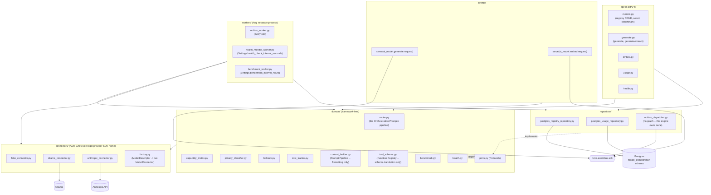

# ai-model-orchestration-engine

NOVA's AI Model Orchestration Engine (Bible Part 7, per `docs/design/phase-2a/
00-ai-model-orchestration-engine.md`). Phase 2A of the roadmap, and the first
engine built after Phase 1's Memory/Knowledge/World Model Engine trio.

## Responsibility -- and the boundary that shapes every other decision below

The user's standing architectural constraint for this engine, established
before implementation began: **"No subsystem should ever depend directly on
an LLM provider. Every interaction with any AI model must pass exclusively
through the AI Model Orchestration Layer. No exceptions."** (ADR-020). This
engine is a **stateless intelligence-provider gateway** -- it selects,
orchestrates, and communicates with AI models. It does not reason, plan,
remember, or know anything about the world; those are Reasoning Engine (2B),
Planning/NAOS (Phase 3), Memory Engine, and World Model Engine's jobs
respectively.

Concretely, in this engine:

- **`connectors/` is the only directory in the entire monorepo permitted to
  import an LLM/AI provider SDK** (`anthropic`, `ollama` via `httpx`), enforced
  automatically by a dedicated import-linter contract (ADR-020), not just
  documentation. Adding a new provider means adding one connector module and
  passing the ADR-023 compliance suite (`tests/contract/
  test_connector_compliance.py`) -- nothing else in the codebase changes.
- **Prompt Pipeline / Context Builder / Tool Calling / Function Registry are
  pure formatting mechanisms, never sourcing mechanisms** (design doc §0, the
  single most important boundary decision in this engine). `domain/
  context_builder.py` fits already-assembled, source-labeled
  `ContextComponent`s into a token budget; `domain/tool_schema.py` translates
  an already-defined `ToolSchema` into a provider's wire format. Neither ever
  calls Memory/Knowledge/World Model/Personality Engine itself, and neither
  knows what a tool *does* -- only how to format what it's given.
- **No conversation state, no memory, no world model** (ADR-022). The only
  permitted in-process state is a disposable Model Registry snapshot, cached
  for the router's hot path and refreshed on registry-mutation events -- if
  this engine's process were killed and restarted between two calls in the
  same conversation, nothing observable would break.
- **Every routing decision is deterministic and explainable** (ADR-021).
  `domain/router.py`'s `plan_routing` is a pure function of `(request, models,
  historical_success_rates)` -- same inputs, same `RoutingDecision`, every
  candidate's score visible, never just the winner's.

Within that boundary, the engine implements Part 7's nine-step "Orchestration
Principle" literally:

```
Receive Request -> Analyze Context -> Estimate Complexity -> Determine Required Skills
    -> Evaluate Available Models -> Select Best Model -> Execute -> Validate Output
    -> Store Experience (-> Improve Future Routing)
```

- **Complexity estimation** (`domain/router.estimate_complexity`): a
  structural heuristic over task type, context size, and tool count --
  explicitly not model-driven (classifying complexity by calling a model would
  be circular), the same honesty precedent as Knowledge Engine's
  `summarization.py` and World Model's `prediction.py`.
- **Capability scoring** (`domain/capability_matrix.py`): every
  privacy-eligible, healthy candidate scored by capability, cost, latency, and
  historical success rate, per
  [SAD 06 §1](../../docs/architecture/06-ai-layer-architecture.md#1-model-gateway-ai-model-orchestration-engine)'s
  formula.
- **Privacy management** (`domain/privacy_classifier.py`,
  `capability_matrix.eligible_candidates`): a `HIGHLY_SENSITIVE` request is
  only eligible for a model whose `max_privacy_tier` ceiling is itself
  `HIGHLY_SENSITIVE` (in practice, a local model) -- a hard gate, no override.
- **Fallback strategy** (`domain/fallback.py`, `router.route_and_execute`):
  retry, select another model, up to `max_attempts` total tries -- the
  sequence of models actually tried is exactly what `RoutingDecision.
  candidates` records, never an unrecorded retry loop.
- **Cost management** (`domain/cost_tracker.py`): local models cost `0.0` by
  definition (`cost_per_*_token` is `None`); `budget_status` evaluates
  alert/limit thresholds, though nothing yet calls it from the routing
  pipeline -- see Known Limitations.
- **Store Experience** (`router.execute_and_record` / `embed_and_record`):
  every request -- success, fallback-recovered success, or exhausted failure
  alike -- persists exactly one `UsageRecord` (ADR-021's mandated structured
  telemetry: provider, model, routing reason, complexity, latency, tokens,
  cost, retry count, fallback usage, privacy classification) with a
  same-transaction outbox event.

## Architecture



`domain/` never imports FastAPI, SQLAlchemy, or (critically, per ADR-020) any
LLM/AI provider SDK directly -- everything it needs is expressed as a
`Protocol` in `domain/ports.py` (`ModelConnector`, `ModelRegistryRepository`,
`UsageRepository`, `EventPublisher`). `ModelConnector` is defined here, not
promoted to a shared `nova-modelconnector-sdk` package the way
`GraphStore`/`VectorStore`/`EmbeddingProvider` were -- per ADR-020, this
engine is the only legitimate consumer, so there's no cross-engine sharing
need to justify a separate package.

This engine owns no graph (nothing in Bible Part 7 calls for one), so its
transactional outbox is the simpler Memory-Engine-shaped version -- no
`graph_write`/`graph_applied_at` columns, no two-phase apply step, unlike
Knowledge/World Model Engine's saga.

## Owned events

| Direction | Subject | Payload |
|---|---|---|
| Publishes | `ai_model.request.completed` | `RequestCompletedPayload` -- every successful (including fallback-recovered) request |
| Publishes | `ai_model.request.failed` | `RequestFailedPayload` -- fallback chain exhausted |
| Publishes | `ai_model.model.registered` / `.deregistered` | `ModelRegistryChangedPayload` |
| Publishes | `ai_model.model.health_changed` | `ModelHealthChangedPayload` -- only when a probe's status actually differs from the model's previous one |
| Publishes | `ai_model.budget.exceeded` | `BudgetExceededPayload` -- declared, not yet wired to a producer (see Known Limitations) |
| Serves | `ai_model.generate.request` / reply | `GenerateRequestPayload` / `GenerateReplyPayload` -- Event Bus RPC alternative to `POST /v1/models/generate`, same `execute_and_record` pipeline underneath |
| Serves | `ai_model.embed.request` / reply | `EmbedRequestPayload` / `EmbedReplyPayload` |
| Subscribes | *(none)* | This engine has no upstream producer to react to yet -- Reasoning Engine (2B) will be its first real caller |

`ai_model.generate.request`/`ai_model.embed.request` live in `events/
subscribed.py`, not `published.py` -- `BoundEventBus.serve()` checks the
*subscribable* allow-list, the same convention World Model Engine's own
`world_model.context.request` follows. `events/handlers.py` is deliberately
empty of reactive handlers (no subscribed subject exists yet); the two served
RPCs' handlers live in `main.py`.

**Streaming is deliberately not an Event Bus contract.** NATS request/reply is
one-request-one-reply; token-by-token delivery needs a genuinely streaming
transport. `POST /v1/models/generate/stream` (HTTP SSE) is the only streaming
path.

See `events/published.py` / `events/subscribed.py` for the enforced
allow-lists (checked by `nova_eventbus_sdk.boundary.BoundEventBus`).

## Owned APIs

- `POST /v1/models/generate` -- non-streaming generation.
- `POST /v1/models/generate/stream` -- same request shape, SSE response. Does
  not walk the fallback chain mid-stream (see Known Limitations).
- `POST /v1/models/embed` -- embedding generation; this engine *is* an
  embedding provider, not a consumer of one (§10) -- routes to whichever
  registered connector supports the `embedding` modality (Ollama by default,
  via `nova-embeddings-sdk` reuse).
- `GET /v1/models` -- list registry (filterable by provider/modality/health).
- `POST /v1/models` -- register a model (admin/config-time use).
- `GET /v1/models/{id}` -- detail.
- `DELETE /v1/models/{id}` -- deregister (soft: row remains for historical
  `usage_record` foreign-key integrity).
- `POST /v1/models/{id}/benchmark` -- trigger an out-of-cycle benchmark run.
- `GET /v1/models/select` -- dry-run routing decision (Part 7's "Select Model"
  API): the model that *would* be selected and why, without executing
  anything.
- `GET /v1/usage` -- cost/token statistics (Part 7 "Retrieve Statistics"),
  filterable by time range, model, requesting engine.
- `GET /internal/health`, `GET /internal/readiness`, `GET /internal/metrics`.

## Observability

`observability.py` defines `AiModelOrchestrationEngineMetrics`, created once
per process (API or worker) right after `configure_observability()` runs.
Note the distinction from ADR-021's structured telemetry: these are aggregate
operational counters for dashboards; the per-request explainable record is
`UsageRecord`/`usage_record`, queried via `GET /v1/usage`, not this module.

| Metric | Kind | Labels |
|---|---|---|
| `ai_model_orchestration_engine_generate_request_duration_seconds` | Histogram | -- |
| `ai_model_orchestration_engine_embed_request_duration_seconds` | Histogram | -- |
| `ai_model_orchestration_engine_requests_total` | Counter | `outcome` (`success`/`fallback`/`failed`) |
| `ai_model_orchestration_engine_fallback_used_total` | Counter | -- |
| `ai_model_orchestration_engine_retries_total` | Counter | -- |
| `ai_model_orchestration_engine_input_tokens_total` | Counter | -- |
| `ai_model_orchestration_engine_output_tokens_total` | Counter | -- |
| `ai_model_orchestration_engine_estimated_cost_total` | Counter | `provider` |
| `ai_model_orchestration_engine_health_checks_total` | Counter | `status` |
| `ai_model_orchestration_engine_benchmark_runs_total` | Counter | -- |
| `ai_model_orchestration_engine_models_registered_total` | Counter | -- |
| `ai_model_orchestration_engine_models_deregistered_total` | Counter | -- |
| `ai_model_orchestration_engine_budget_exceeded_total` | Counter | -- (declared, not yet incremented -- see Known Limitations) |
| `ai_model_orchestration_engine_outbox_dispatched_total` | Counter | `subject` |

Structured logs go through `nova_observability.get_logger`; both the FastAPI
process (`main.py`) and the Arq worker process (`workers/__init__.py`) call
`configure_observability()` independently, since they are separate OS
processes.

## Running locally

```bash
# from the repo root
docker compose -f infra/docker/docker-compose.local.yml up -d postgres redis nats ollama
uv run --package ai-model-orchestration-engine alembic -c services/ai-model-orchestration-engine/alembic.ini upgrade head
uv run --package ai-model-orchestration-engine uvicorn nova_ai_model_orchestration_engine.main:app --reload --port 8004

# separate process, same infra
uv run --package ai-model-orchestration-engine arq nova_ai_model_orchestration_engine.workers.WorkerSettings
```

Real Postgres is required to boot `main.py`/`workers/` without dependency
injection; `ANTHROPIC_API_KEY` is optional (the Anthropic connector is simply
absent from the live connector set when unset, per §18) -- this container has
no Docker, so that path is not exercised here; see Testing below for what *is*
verified without it.

## Testing

```bash
uv run --package ai-model-orchestration-engine pytest services/ai-model-orchestration-engine/tests
```

- `tests/unit/` -- pure domain logic (`router`, `capability_matrix`,
  `privacy_classifier`, `cost_tracker`, `fallback`, `context_builder`,
  `tool_schema`, `health`, `benchmark`), plus `connectors/factory.py` and
  `workers/health_monitor_worker.py`, no real network/database.
- `tests/contract/` -- ADR-023's compliance suite: one shared set of test
  functions parametrized over every `ModelConnector` implementation
  (`FakeConnector`, `OllamaConnector` via `httpx.MockTransport`,
  `AnthropicConnector` via a minimal fake SDK double) -- zero live-provider
  dependency, proving every connector behaves identically regardless of which
  one is in use.
- `tests/integration/` -- boots the real FastAPI app (lifespan-driven, real
  routes, real served RPCs) with `ModelRegistryRepository`/`UsageRepository`
  substituted for in-memory fakes (`tests/fakes/`) and a
  `connector_type="fake"` registered model (`ConnectorFactory` resolves
  `"fake"` to `FakeConnector`, no real provider involved). Exercises
  `/v1/models/generate`(`/stream`), `/v1/models/embed`, the full `/v1/models`
  registry CRUD + dry-run select + benchmark trigger, and `/v1/usage`.
  Postgres-specific code (`repository/postgres_registry_repository.py`,
  `repository/postgres_usage_repository.py`) and the real Ollama/Anthropic
  connectors' live-network paths are the one layer this suite cannot reach;
  validating them needs real infra via Docker Compose, the same limitation
  already accepted for Memory/Knowledge/World Model Engine.

Current count: 95 tests, all passing; `ruff check` and `mypy` both clean
across `src/` and `tests/`.

## Known limitations (Phase 2A)

- **Budget enforcement is not wired into routing.** `domain/cost_tracker.
  budget_status` and `UsageRepository`'s budget CRUD (`get_budget`/
  `list_budgets`/`upsert_budget`/`spend_this_period`) exist and are
  unit-tested, and `ai_model.budget.exceeded` is a declared, contract-tested
  publishable subject -- but nothing in `router.py` or the API layer yet
  calls `spend_this_period` + `budget_status` together to restrict routing to
  zero-cost candidates when a budget is exceeded, or to actually publish the
  event. Deferred rather than guessed at: which budget scope (global/
  provider/model) applies to a given request is a real design decision Part 7
  doesn't fully specify, and inventing a resolution order would be exactly
  the speculative behavior this project's standing instructions rule out.
- **Streaming does not walk the fallback chain.** `POST /v1/models/generate/
  stream` plans a route once and calls that connector's `stream()` directly;
  once a model has started emitting tokens, switching models mid-response
  isn't a meaningful recovery (no precedent in Part 7's fallback description
  covers a partially-streamed response), so a stream failure is recorded as a
  failed request rather than silently retried on a second model.
- **No vision/speech connectors.** `Modality` includes `text_generation`/
  `streaming`/`embedding`/`tool_calling` only; vision/speech are a named
  future extension point (§20), not a claimed capability.
- **No Google/Gemini connector yet.** ADR-020's import-linter contract
  deliberately omits `google.generativeai`/`google.genai` (import-linter
  rejects subpackages of external packages as invalid `forbidden_modules`
  entries) -- tracked for whenever a Google connector is actually built, not
  silently exempted.
- **Model integrity/signature verification is not implemented.** Provider,
  license, and (for local models) source are recorded fields on
  `model_registry`, reviewed at registration time -- there is no automated
  integrity/signature check, an honestly-scoped gap (no such mechanism is
  specified for Ollama-distributed models), not a claimed guarantee (§18).
- **Memory Engine and Knowledge Engine still call `nova-embeddings-sdk`'s
  `OllamaEmbeddingProvider` directly**, not through this engine's `POST
  /v1/models/embed`. ADR-020 names this explicitly as tracked migration debt,
  not silently exempted from the "only through orchestration" rule -- it
  predates this engine's existence and is out of Phase 2A's own scope
  (building the engine, not rewiring two already-shipped ones).
- **No read-through cache beyond the in-memory registry snapshot** mentioned
  in ADR-022/§9 -- every other read hits Postgres directly, mirroring every
  Phase 1 engine's same accepted gap.
- **Benchmark quality scoring is structural, never semantic**
  (`domain/benchmark.py`, §2): average `structural_confidence` and success
  rate across a small fixed prompt set -- "did this model respond coherently
  at all," never "was the answer correct," which is a Reasoning Engine
  concern (Phase 2B), outside this engine's boundary.
