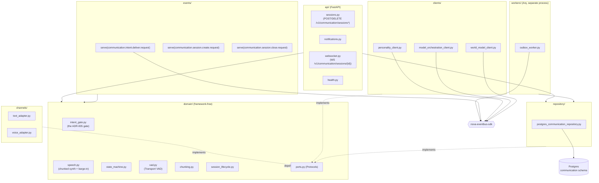

# communication-engine

The Communication Engine (Bible Part 13, per `docs/design/phase-2d/
01-communication-engine.md`) is NOVA's transport and lifecycle layer:
channel adapters, the `ConversationSession` state machine, and the
`communication.intent` gate -- the sole legal path to user-facing output
(ADR-005). Phase 2D-A of the roadmap, the larger of the two Voice &
Communication Foundation engines alongside `personality-engine`.

## Responsibility -- and the boundary that shapes every other decision below

Design doc §0.1-§0.2: this engine builds the *pipe* (transport and
lifecycle), not the *judgment* (Determine Intent / Select Communication
Strategy are deliberately pass-through this phase -- Phase 2D-C extends the
same service, it does not replace it). Concretely:

- **`communication-engine` is the only service that ever renders user-facing
  output (ADR-005, §0.2).** Every content-source engine (Reasoning, and
  later Planning/agents) expresses a desire to say something by publishing
  `communication.intent.deliver.request`; only `domain/intent_gate.py`'s
  `deliver_intent` ever calls a `ChannelAdapter.deliver`.
- **Every response passes through `personality-engine` before delivery
  (§0.5, §7 step 2).** A real, load-bearing synchronous dependency from day
  one -- unlike `digital-twin-engine` (Phase 2D-D `DigitalTwinPort`,
  supplementary and optional: no production call site supplies it yet, see
  §Known Limitations below) or `perception-engine` (§0.6, still a deferred,
  forward-declared port this document's own runtime never calls).
- **Speech never touches a Whisper/Piper SDK directly (§0.3, ADR-020).**
  `ai_model.transcribe`/`ai_model.synthesize` are both non-streaming RPCs --
  `EventBus.request()` cannot carry a stream (ADR-004) -- so perceived
  streaming is achieved by calling `synthesize` once per response chunk
  (`domain/chunking.py`), not by a transport-level stream.
- **Barge-in is unconditional and mechanical, never a policy judgment
  (§4, Master Blueprint §13.4).** `domain/speech.py`'s `speak_response`
  checks the barge-in signal before *and* after each chunk's synthesis call
  -- stops issuing further calls and discards audio already returned but
  not yet played. Whether the interruption was *appropriate* is 2D-C's.
- **The ten-state `ConversationSession` machine is explicit, not implicit
  flags (§3.1).** `domain/state_machine.py`'s transition table is the only
  way a session's state changes during live operation; restart recovery
  (§3.5) and WebSocket disconnects are the one documented exception --
  both force a session to `Paused` directly (`recover_session_to_paused`),
  bypassing the table, since "no channel connection is live" is true
  regardless of which state the session was in.
- **Raw audio is never persisted (§3.3, §15).** Only the transcript reaches
  a `ConversationTurn` -- the same "local processing default" discipline
  already established for Perception (Bible Part 11).

## Architecture



`domain/` never imports FastAPI, SQLAlchemy, `nova_eventbus_sdk`, or (per
ADR-020) any LLM/AI provider SDK directly. `session_registry.py` (process
root, not `domain/`) is the one piece of genuinely live, in-memory state --
a `session_id -> ChannelAdapter` map only a running WebSocket connection can
populate, which is why it lives outside the framework-free layer (design
doc §14's own single-instance-per-session admission for this phase).

## Owned events

| Direction | Subject | Payload |
|---|---|---|
| Serves | `communication.intent.deliver.request` / reply | The ADR-005 gate -- `CommunicationIntentDeliverRequestPayload` / `ReplyPayload` |
| Serves | `communication.session.create.request` / reply | `CommunicationSessionCreateRequestPayload` / `ReplyPayload` |
| Serves | `communication.session.close.request` / reply | `CommunicationSessionCloseRequestPayload` / `ReplyPayload` |
| Publishes | `communication.session.created` | On every `POST /v1/communication/sessions` (or the equivalent RPC) |
| Publishes | `communication.session.state_changed` | On every state transition -- the Live Communication Dashboard's data source |
| Publishes | `communication.session.completed` | On session close -- Memory Engine's intended (not yet wired) archival trigger |
| Publishes | `communication.turn.received` | Every inbound turn -- for Reasoning Engine to subscribe to |
| Requests (outbound) | `personality.validate_response.request`, `personality.style.select.request`, `ai_model.transcribe.request`, `ai_model.synthesize.request`, `world_model.context.request`, `reasoning.reason.request`, `digital_twin.preferences.get.request` | this engine as the *calling* side of each upstream port |

The seven outbound `*.request` subjects live in `events/published.py`, not
`subscribed.py` -- `BoundEventBus.request()` checks the *publishable*
allow-list even though the subject grammatically looks like something this
engine "receives a reply to," the same convention every prior engine's own
`events/published.py` follows. `digital_twin.preferences.get.request`
(Phase 2D-D §7.2) is wired -- `DigitalTwinClient` is a real, tested
`domain.ports.DigitalTwinPort` implementation, constructed by `create_app`
like every other port -- but it is not load-bearing on any hot path:
`domain.response_shaping.resolve_response_shaping` only calls it when a
caller supplies both `digital_twin_port` and `user_id`, and no production
call site does that yet (see §Known Limitations).

## Owned APIs

- `POST /v1/communication/sessions` -- Create Session.
- `POST /v1/communication/sessions/{id}/messages` -- Send Message (text);
  returns an acknowledgment only, since the actual reply is generated
  asynchronously and delivered through the intent gate (§6, §8.2).
- `WS /v1/communication/sessions/{id}` -- voice channel + streaming text
  (`api/websocket.py`).
- `POST /v1/communication/sessions/{id}/pause`,
  `POST /v1/communication/sessions/{id}/resume`.
- `DELETE /v1/communication/sessions/{id}` -- Close Session; 409 unless the
  session is in `Waiting` (§3.1's only documented close edge).
- `GET /v1/communication/sessions/{id}/context` -- Retrieve Context.
- `POST /v1/communication/notifications` -- Generate Notification (minimal
  this phase; no push-delivery integration exists yet).
- `GET /internal/health`, `GET /internal/readiness`, `GET /internal/metrics`
  (unprefixed by design -- ops/probe surface, not a versioned domain API).

`Broadcast Update`/`Synchronize Devices` (Bible Part 13) are not exposed
this phase (§12) -- multi-device continuity is out of Phase 2D's scope; the
`device_id` field already on every session exists so adding them later
doesn't require a schema change.

## Observability

`observability.py` defines `CommunicationEngineMetrics`, created once per
process right after `configure_observability()` runs.

| Metric | Kind | Labels |
|---|---|---|
| `communication_engine_intent_deliver_duration_seconds` | Histogram | -- |
| `communication_engine_intent_deliveries_total` | Counter | `outcome` |
| `communication_engine_personality_rpc_degraded_total` | Counter | -- |
| `communication_engine_barge_ins_total` | Counter | -- |
| `communication_engine_session_state_transitions_total` | Counter | `event` (declared, not yet incremented -- see Known Limitations) |
| `communication_engine_transcribe_failures_total` / `_synthesize_failures_total` | Counter | -- (declared, not yet incremented) |
| `communication_engine_outbox_dispatched_total` | Counter | `subject` |

## Running locally

```bash
# from the repo root
docker compose -f infra/docker/docker-compose.local.yml up -d postgres redis nats
uv run --package communication-engine alembic -c services/communication-engine/alembic.ini upgrade head
uv run --package communication-engine uvicorn nova_communication_engine.main:app --reload --port 8000

# separate process, same infra
uv run --package communication-engine arq nova_communication_engine.workers.WorkerSettings
```

Real Postgres is required to boot `main.py`/`workers/` without dependency
injection; this container has no Docker daemon, so that path is not
exercised here -- see Testing below for what *is* verified without it.

## Testing

```bash
uv run --package communication-engine pytest services/communication-engine/tests
```

- `tests/unit/` -- pure domain logic: every documented state transition and
  the undocumented ones that must raise (`test_state_machine.py`); Transport
  VAD's start/continue/end detection including the transient-gap tolerance
  boundary itself (`test_vad.py`); sentence/phrase chunking
  (`test_chunking.py`); the intent gate's every branch -- session-completed,
  personality hard-stop, the RPC-timeout degraded-mode fallback, no-live-
  channel, text delivery, voice delivery with chunking/barge-in/synthesis
  failure (`test_intent_gate.py`); and session creation/close/pause/resume/
  turn-recording/restart-recovery, each asserting the outbox event enqueued
  alongside the state change (`test_session_lifecycle.py`).
- `tests/integration/` -- boots the real FastAPI app (lifespan-driven, real
  routes) with every port substituted for an in-memory fake
  (`tests/fakes/`): the full session lifecycle through the HTTP API
  including the 409-on-premature-close path (`test_api_sessions.py`);
  notifications (`test_api_notifications.py`); a real Event Bus round-trip
  through all three served RPCs (`test_events_communication_request.py`);
  and a real WebSocket round-trip -- a text frame recorded as a turn, and
  disconnecting pausing the session (`test_websocket_text.py`).
- `tests/contract/` has no compliance suite this phase -- this engine has
  one repository port and three upstream RPC-client ports, each with
  exactly one real implementation; ADR-023's compliance-suite pattern
  applies to `ai-model-orchestration-engine`'s multiple connector
  implementations per modality, a shape this engine doesn't have.

Current count: 70 tests, all passing; `ruff check` and `mypy` both clean
across `src/`; `lint-imports` 4/4 contracts kept.

## Known limitations (Phase 2D-A)

- **`postgres_communication_repository.py` has no committed pytest coverage
  against a real Postgres instance** -- the same accepted gap every prior
  engine's own committed suite has; this sandbox has no Docker daemon.
- **Determine Intent and Select Communication Strategy are pass-through
  (§0.1, §6), by design.** No adaptive policy exists this phase -- that is
  2D-C's scope, extending this same service rather than replacing it.
- **A rejected or failed delivery still transitions `Speaking -> Waiting`**
  (`events/handlers.py`) rather than leaving the session stuck -- design doc
  §3.1's diagram defines no recovery edge for a failed delivery, and the
  alternative (a session permanently stuck in `Speaking`) would be a
  materially worse defect. Documented here as an implementation decision,
  not a literal requirement of the approved TDD.
- **The Transport VAD's silence-tick cadence in `api/websocket.py` is a
  100ms receive-timeout poll, not a continuous audio stream sample rate.**
  A reasonable stand-in given this sandbox has no real audio hardware to
  drive a genuine per-sample cadence; the VAD logic itself
  (`domain/vad.py`) is fully unit-tested independent of this cadence.
- **`communication_engine_session_state_transitions_total`,
  `transcribe_failures_total`, and `synthesize_failures_total` are declared
  but not yet incremented** -- `intent_deliveries_total`,
  `personality_rpc_degraded_total`, `barge_ins_total`,
  `intent_deliver_duration_seconds`, and `outbox_dispatched_total` are
  live.
- **No read-through cache** beyond what the Postgres repository provides
  directly -- every read hits Postgres, mirroring every prior engine's own
  accepted gap.
- **`Notification` delivery is recording-only this phase (§10, §12).** No
  push-notification channel integration exists yet -- `delivered_at` is
  never populated by any code path.
- **(Phase 2D-D) `DigitalTwinPort`/`DigitalTwinClient` exist and are fully
  tested against the real wire contract, but no production call site
  supplies `resolve_response_shaping`'s optional `digital_twin_port`/
  `user_id` arguments yet.** `conversation_pacing`/`habit_timing_hint` stay
  `None` in every real response-shaping result this phase -- the same
  pre-existing gap `resolve_response_shaping`'s own module docstring already
  discloses for `personality-engine`'s directive consumer (no such consumer
  exists in this codebase yet either). Wiring a real caller is out of this
  phase's approved scope (docs/design/phase-2d/06-personal-companion.md
  Sec7.2).
