# executive-cognition-engine

The Executive Cognition Engine (Bible Part 19, per `docs/design/phase-2c/
00-executive-cognition-engine.md`) is NOVA's coordination layer: it decides
*which cognitive subsystem should operate, under which policies, priorities,
and constraints* -- never producing reasoning content, knowledge, or plans of
its own. Phase 2C of the roadmap, arbitrating between Phase 2A's AI Model
Orchestration Engine and Phase 2B's Reasoning Engine.

## Responsibility -- and the boundary that shapes every other decision below

ADR-027/028/029: this engine coordinates, it never replaces the specialized
engines it arbitrates between. Concretely:

- **Policy-driven, not intelligence-driven (ADR-028).** This engine never
  outperforms, reinterprets, or second-guesses a specialized engine's own
  domain conclusion. Every step of `domain/conflict_resolution.py`'s
  five-signal procedure (evidence, confidence, policy, user objectives,
  historical outcomes) compares only magnitudes a specialized engine has
  already published -- never forms an independent judgment about which
  conclusion is *correct*.
- **The Cognitive Priority Matrix (`domain/priority.py`) is a fixed,
  structural formula -- never a model call.** Seven of its eight factors
  (urgency, importance, complexity, risk, learning_value, resource_cost,
  user_impact) are caller-supplied, trusted as declared (ADR-028's epistemic
  deference); only `long_term_alignment` (ADR-029) is this engine's own
  arithmetic, computed from data it already holds (a request's declared
  `goal_id`/`goal_tier` and sibling requests sharing that goal), never a
  guess.
- **Optimizes for the user's long-term objectives (ADR-029).** When multiple
  valid options exist, arbitration prefers whichever aligns best with the
  user's established goals -- `long_term_alignment`'s composite weight is
  deliberately modest by default; its designed effect is breaking ties
  (`domain/arbitration.py`'s tie-break order), not overriding a genuinely
  more urgent request that happens to lack long-term framing.
- **Advisory, never commanding.** This engine returns a decision
  (`proceed`/`proceed_reduced`/`wait`/`escalated`) to whichever engine asked;
  it never itself invokes the winner. `domain/coordinate.py`'s
  `arbitrate_request` is the single entry point tying priority scoring, goal
  correlation, arbitration, and trace assembly together for one incoming
  `ExecutiveRequest`.
- **Resource contention and genuine conflict are different problems, kept in
  separate modules.** `domain/arbitration.py` ranks requests competing for
  the same scarce budget; `domain/conflict_resolution.py` resolves two
  engines' *conclusions* actively disagreeing on the merits. An unresolved
  conflict becomes `ESCALATED`, routed to Human Override (§13) by
  construction, not a separate mechanism bolted on afterward.
- **Every arbitration produces an `ExecutiveDecisionTrace`** (§18), the
  direct analog of Reasoning Engine's own `ReasoningTrace` -- structured
  metadata *about* a decision, never the domain content of what was
  arbitrated. Persisted on every outcome, including failures.

## Architecture

```mermaid
flowchart TB
    subgraph API["api/ (FastAPI)"]
        arbitrate["arbitrate.py\n(POST /v1/executive/arbitrate)"]
        decisions["decisions.py\n(list, get, explain, override)"]
        health["health.py"]
    end

    subgraph Events["events/"]
        serveArbitrate["serve(executive.arbitrate.request)"]
        serveOutcome["serve(executive.outcome.report)"]
    end

    subgraph Domain["domain/ (framework-free)"]
        coordinate["coordinate.py\n(the top-level entry point)"]
        priority["priority.py\n(Cognitive Priority Matrix)"]
        arbitration["arbitration.py\n(§7 ranking + two policies)"]
        goalCorr["goal_correlation.py\n(long_term_alignment, ADR-029)"]
        conflictRes["conflict_resolution.py\n(five-signal procedure)"]
        contextSwitch["context_switching.py"]
        failureRecovery["failure_recovery.py"]
        trace["trace.py"]
        registry["contender_registry.py\n(in-process, bounded)"]
        ports["ports.py (Protocols)"]
    end

    subgraph Clients["clients/ (one adapter per upstream port)"]
        memoryClient["memory_client.py"]
        worldModelClient["world_model_client.py"]
        personalContextClient["personal_context_client.py\n(projects WorldModelPort)"]
        goalsClient["goals_client.py\n(honest Phase 2C placeholder)"]
    end

    subgraph Workers["workers/ (Arq, separate process)"]
        outboxWorker["outbox_worker.py\n(every 10s)"]
    end

    subgraph Repository["repository/"]
        pgRepo["postgres_executive_repository.py"]
        outboxDispatcher["outbox_dispatcher.py"]
    end

    API --> Domain
    Events --> Domain
    Domain -. depends on .-> ports
    Clients -. implements .-> ports
    Repository -. implements .-> ports
    API --> Repository
    Workers --> Repository
    pgRepo --> Postgres[(Postgres\nexecutive schema)]
    outboxDispatcher --> EventBus{{nova-eventbus-sdk}}
    serveArbitrate --> EventBus
    serveOutcome --> EventBus
    memoryClient --> EventBus
    worldModelClient --> EventBus
```



`domain/` never imports FastAPI, SQLAlchemy, `nova_eventbus_sdk`, or any
LLM/AI provider SDK directly (this engine has no LLM dependency at all --
unlike Reasoning Engine, it generates no content). Everything it needs is a
`Protocol` in `domain/ports.py` (`MemoryPort`, `WorldModelPort`,
`PersonalContextPort`, `GoalsPort`, `ExecutiveRepository`), satisfied by
exactly one adapter in `clients/` or `repository/`. No `KnowledgePort` or
`CapabilityPort` exists this phase -- named, honest scope decisions (§5.4,
§5.8), not oversights. `api/` and `events/` never import each other -- both
translate the same wire payload to a domain `ExecutiveRequest` and call the
same `domain.coordinate.arbitrate_request`, mirroring Reasoning Engine's own
`api/`/`events/handlers.py` split.

## Owned events

| Direction | Subject | Payload |
|---|---|---|
| Serves | `executive.arbitrate.request` / reply | `ExecutiveRequestPayload` / `ExecutiveArbitrateReplyPayload` -- Event Bus RPC alternative to `POST /v1/executive/arbitrate`, same `arbitrate_request` underneath |
| Serves | `executive.outcome.report` / reply | `ExecutiveOutcomeReportPayload` / `ExecutiveOutcomeReportReplyPayload` -- optional, genuinely opt-in (§7.3) |
| Publishes | `executive.decision.completed` | `ExecutiveDecisionCompletedPayload` -- every `proceed`/`proceed_reduced`/`wait`/`escalated` outcome |
| Publishes | `executive.decision.failed` | `ExecutiveDecisionFailedPayload` -- arbitration itself could not produce an outcome |
| Publishes | `executive.human_override.applied` | `ExecutiveHumanOverrideAppliedPayload` -- every `POST .../override` call |
| Requests (outbound) | `world_model.context.request`, `memory.retrieve.request` | this engine as the *calling* side of each upstream port |

The two outbound `*.request` subjects live in `events/published.py`, not
`subscribed.py` -- `BoundEventBus.request()` checks the *publishable*
allow-list even though the subject grammatically looks like something this
engine "receives a reply to," the same convention every prior engine's own
`events/published.py` follows. See `events/published.py` /
`events/subscribed.py` for the enforced allow-lists.

## Owned APIs

- `POST /v1/executive/arbitrate` -- runs `arbitrate_request` synchronously,
  returns `ExecutiveArbitrateReplyPayload`.
- `GET /v1/executive/decisions` -- list decisions (`requesting_engine`/
  `limit` filters).
- `GET /v1/executive/decisions/{id}` -- one `ExecutiveDecisionTrace`, 404 if
  missing.
- `GET /v1/executive/decisions/{id}/explain` -- returns the same trace
  `GET .../{id}` does: unlike Reasoning Engine (whose `Decision` and
  `ReasoningTrace` are separate objects), this engine's trace already *is*
  the queryable-field explanation Bible Part 19's four questions map to
  (`priority_scores`, `rejected_reasons`, `conflict_resolution_signals`) --
  there is no separate, wider object to narrow from.
- `POST /v1/executive/decisions/{id}/override` -- `confirm` (unchanged),
  `redirect` (requires `redirect_outcome`, 400 otherwise -- overwrites the
  recorded `ArbitrationOutcome`, never presented as if the Priority Matrix
  itself had chosen it), or `reject` (recorded via `human_override` alone --
  `ArbitrationOutcome` has no separate "abandoned" state; that is what an
  `executive.outcome.report` of `abandoned` is for).
- `GET /internal/health`, `GET /internal/readiness`, `GET /internal/metrics`.

## Observability

`observability.py` defines `ExecutiveCognitionEngineMetrics`, created once
per process right after `configure_observability()` runs. As with every
prior engine, these are aggregate operational counters for dashboards -- the
per-decision explainable record is the `ExecutiveDecisionTrace`, queried via
`GET /v1/executive/decisions`, not this module.

| Metric | Kind | Labels |
|---|---|---|
| `executive_cognition_engine_arbitration_duration_seconds` | Histogram | -- |
| `executive_cognition_engine_arbitration_decisions_total` | Counter | `outcome` |
| `executive_cognition_engine_composite_priority_score` | Histogram | -- |
| `executive_cognition_engine_long_term_alignment_score` | Histogram | -- |
| `executive_cognition_engine_policies_applied_total` | Counter | `policy` |
| `executive_cognition_engine_conflicts_escalated_total` | Counter | -- (declared, not yet incremented -- see Known Limitations) |
| `executive_cognition_engine_human_overrides_total` | Counter | `action` |
| `executive_cognition_engine_failures_total` | Counter | `stage` (declared, not yet incremented -- see Known Limitations) |
| `executive_cognition_engine_outbox_dispatched_total` | Counter | `subject` |

Structured logs go through `nova_observability.get_logger`; both the FastAPI
process (`main.py`) and the Arq worker process (`workers/__init__.py`) call
`configure_observability()` independently, since they are separate OS
processes.

## Running locally

```bash
# from the repo root
docker compose -f infra/docker/docker-compose.local.yml up -d postgres redis nats
uv run --package executive-cognition-engine alembic -c services/executive-cognition-engine/alembic.ini upgrade head
uv run --package executive-cognition-engine uvicorn nova_executive_cognition_engine.main:app --reload --port 8000

# separate process, same infra
uv run --package executive-cognition-engine arq nova_executive_cognition_engine.workers.WorkerSettings
```

Real Postgres is required to boot `main.py`/`workers/` without dependency
injection; this container has no Docker daemon, so that path is not exercised
here -- see Testing below for what *is* verified without it.

## Testing

```bash
uv run --package executive-cognition-engine pytest services/executive-cognition-engine/tests
```

- `tests/unit/` -- pure domain logic: the Cognitive Priority Matrix formula,
  long-term-alignment scoring, conflict resolution's five-signal procedure,
  context-switch evaluation, and failure-recovery mapping
  (`test_domain_modules.py`); the arbitration ranking algorithm including a
  regression test for the resource-budget bug fixed during implementation
  and both runtime policies (`test_arbitration.py`); the contender registry's
  TTL/max-entries/resolve behavior (`test_contender_registry.py`); the
  top-level `arbitrate_request` orchestration including a regression test
  for the `goal_tier` fix (`test_coordinate.py`); and client-level unit
  tests (`test_clients.py`).
- `tests/contract/` -- ADR-023's compliance suite: one shared set of test
  functions parametrized over every upstream port's fake and real-client
  (mock-transport-backed) implementation, proving the two behave identically
  -- including `GoalsPort`'s Phase 2C placeholder, where "both return `[]`
  unconditionally" is itself the asserted behavioral identity (§5.7).
- `tests/integration/` -- boots the real FastAPI app (lifespan-driven, real
  routes) with `GoalsPort` and the repository substituted for in-memory fakes
  (`tests/fakes/`): the full `/v1/executive/arbitrate` ->
  `/decisions`(`/explain`)/`.../override` round trip (`test_api_arbitrate.py`,
  `test_api_decisions.py`), and a real Event Bus round-trip through the
  served `executive.arbitrate.request`/`executive.outcome.report` RPCs
  (`test_events_arbitrate_request.py`) -- the one place `events/handlers.py`'s
  handlers are invoked through an actual subscription rather than called as
  bare functions. `repository/postgres_executive_repository.py`'s real-Postgres
  path and `workers/`/`repository/outbox_dispatcher.py` are the one layer
  this suite cannot reach without real infra, the same accepted limitation
  every prior engine's own committed suite has (verified against `create_app`
  wiring and an in-memory ORM metadata comparison ad hoc during development
  instead).

Current count: 66 tests, all passing; `ruff check` and `mypy` both clean
across `src/`; 84% statement coverage (`--cov=nova_executive_cognition_engine`).

## Known limitations (Phase 2C)

- **`GoalsPort` is an honest Phase 2C placeholder.** Planning Engine (Bible
  Part 9, Phase 3) doesn't exist yet, so `clients/goals_client.py` returns
  `[]` unconditionally -- goals are accepted as explicit, caller-supplied
  `goal_id`/`goal_tier` fields on `ExecutiveRequest` instead (§5.7, §8,
  ADR-029). Without the caller-supplied `goal_tier`, `long_term_alignment`
  would be permanently `0.0` in the real system; this was found and fixed
  during implementation, with a regression test in `test_coordinate.py`.
- **The contender registry is single-process, in-memory, bounded (§4's
  implementation amendment).** Phase 2C has no durable, cross-process
  admission queue -- `domain/contender_registry.py` is the simplest
  mechanism that makes "rank against other in-flight requests" (§3) real
  without inventing a queue this phase has no other use for. A process
  restart loses no state beyond in-flight requests mid-arbitration at that
  moment (§15's own honest scope note); Phase 6's Cognitive Load Management
  replaces this wholesale, it does not extend it.
- **No progress-reporting channel exists from Reasoning Engine or AI Model
  Orchestration Engine back to this engine yet.** `domain/context_switching.py`
  is specified in full and unit-tested, but no real caller supplies
  `current_progress` -- Monitor Progress and Adapt Strategy (Bible Part 19's
  own cycle) are out of scope this phase (§3, §24).
- **`ESCALATED` is a fully modeled outcome with no reachable code path yet.**
  `domain/conflict_resolution.py`'s five-signal `resolve_conflict` (the only
  place that can produce `ESCALATED`) is specified in full and unit-tested,
  but `domain/coordinate.py`'s `arbitrate_request` never calls it --
  Phase 2C's real, testable scenario (two contenders competing for the same
  resource budget) is resource contention, never genuine conflict between
  two engines' conclusions, so nothing in the current wiring exercises the
  conflict path. `ArbitrationOutcome.ESCALATED` and Human Override's
  `POST .../override` endpoint are ready for it the moment a real conflict
  source exists to call `resolve_conflict`.
- **`conflicts_escalated_total` and `failures_total` are declared but not
  yet incremented**, the direct consequence of the point above:
  `arbitration_decisions_total`, `composite_priority_score`,
  `long_term_alignment_score`, `policies_applied_total`,
  `arbitration_duration_seconds`, and `human_overrides_total` are live
  (`api/arbitrate.py`, `api/decisions.py`); `domain/failure_recovery.py`'s
  `recommend_recovery` is likewise unit-tested in isolation but has no
  calling code path from `coordinate.py` yet either.
- **No read-through cache** beyond what the Postgres repository provides
  directly -- every read hits Postgres, mirroring every prior engine's own
  accepted gap.
- **`postgres_executive_repository.py` has no committed pytest coverage
  against a real Postgres instance** -- every prior engine's own committed
  suite has the identical gap (fakes only); verified instead via ORM
  metadata comparison against the hand-written Alembic migration and
  `isinstance()` Protocol-compliance checks against a real (unconnected)
  `PostgresExecutiveRepository` during development.
