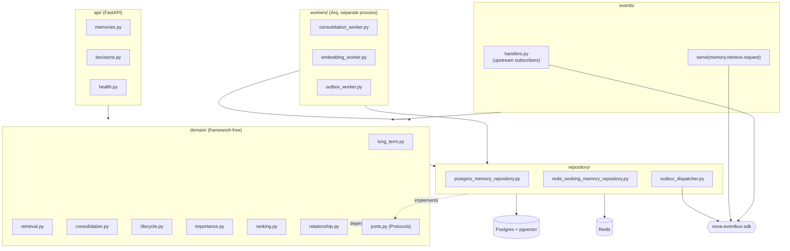

# memory-engine

NOVA's memory subsystem (Bible Part 3 / `docs/design/phase-1/01-memory-engine.md`).
Owns every tier of memory -- sensory, working, short-term, and long-term (episodic,
semantic, procedural, preference, project, decision) -- plus the lifecycle,
importance scoring, consolidation, and retrieval logic that ties them together. It
is the only engine that ever writes to `memory.*` Postgres tables, `mem:*` Redis
keys, or the `memory_records` vector collection.

## Responsibility

- **Write path** (`domain/long_term.py`, `domain/short_term.py`, `domain/working.py`,
  `domain/sensory.py`, and the thin per-type modules `episodic.py` / `semantic.py` /
  `procedural.py` / `preference.py` / `project.py` / `decision.py`): validates,
  scores importance (`domain/importance.py`), and persists a memory, enqueuing an
  outbox row in the same transaction rather than publishing directly.
- **Retrieval** (`domain/retrieval.py`): fans out semantic (vector) and timeline
  search concurrently, merges and ranks results (`domain/ranking.py`), and degrades
  gracefully to timeline-only if the vector index is unreachable.
- **Lifecycle** (`domain/lifecycle.py`): the `active → dormant → archived →
  scheduled_for_deletion → deleted` state machine, driven by access patterns, idle
  time, and three explicit triggers (user delete, low confidence, duplicate merge).
- **Consolidation** (`domain/consolidation.py`, `workers/consolidation_worker.py`):
  a scheduled job that finds near-duplicate memories (cosine similarity, scoped per
  `user_id`/`project_id` so it never merges across users), advances idle memories
  through the lifecycle, and hard-deletes records whose deletion grace period has
  elapsed.
- **Async embedding** (`workers/embedding_worker.py`): decouples write latency from
  embedding latency -- a memory is written with no vector, then embedded in batch
  off the write path.
- **Cross-engine relationships** (`domain/relationship.py`): a thin RPC client into
  the (future) Knowledge Engine for `knowledge.link`/`knowledge.traverse`, degrading
  to `None`/`[]` on timeout since Knowledge Engine doesn't exist yet in this phase.

## Architecture



`domain/` never imports FastAPI, SQLAlchemy, Redis, or an event-bus client --
everything it needs is expressed as a `Protocol` in `domain/ports.py`
(`MemoryRepository`, `WorkingMemoryStore`, `VectorIndex`, `EmbeddingProvider`,
`EventPublisher`), matching `docs/architecture/03-backend-architecture.md` §1's
framework-free rule. `api/`, `events/`, `repository/`, and `workers/` are the only
layers that implement or wire those ports to real infrastructure.

## Owned events

| Direction | Subject | Payload |
|---|---|---|
| Publishes | `memory.short_term.created` | `ShortTermMemoryCreatedPayload` |
| Publishes | `memory.long_term.created` | `LongTermMemoryCreatedPayload` |
| Publishes | `memory.long_term.updated` | `LongTermMemoryUpdatedPayload` |
| Publishes | `memory.consolidation.started` | `ConsolidationStartedPayload` |
| Publishes | `memory.consolidation.completed` | `ConsolidationCompletedPayload` |
| Publishes | `memory.lifecycle.transitioned` | `LifecycleTransitionedPayload` |
| Publishes | `memory.decision.recorded` | `DecisionRecordedPayload` |
| Publishes | `memory.embedding.completed` | `EmbeddingCompletedPayload` |
| Requests | `knowledge.link.request` / reply | `KnowledgeLinkRequestPayload` / `KnowledgeLinkReplyPayload` |
| Requests | `knowledge.traverse.request` / reply | `KnowledgeTraverseRequestPayload` / `KnowledgeTraverseReplyPayload` |
| Serves | `memory.retrieve.request` / reply | `MemoryRetrieveRequestPayload` / `MemoryRetrieveReplyPayload` |
| Subscribes | `perception.*.observed` | (placeholder handler -- no upstream producer yet) |
| Subscribes | `reasoning.result` | (placeholder handler) |
| Subscribes | `action.result` | (placeholder handler) |
| Subscribes | `communication.intent.received` | (placeholder handler) |
| Subscribes | `agent_os.task.completed` | (placeholder handler) |
| Subscribes | `knowledge.contradiction.detected` | (placeholder handler) |

See `events/published.py` / `events/subscribed.py` for the enforced allow-lists
(checked by `nova_eventbus_sdk.boundary.BoundEventBus` at publish/subscribe/serve
time). Most subscribed subjects have no real Phase 1 producer yet -- Perception,
Reasoning, and Planning engines ship in later phases; the handlers in
`events/handlers.py` are documented placeholders, defensive against missing fields
rather than raising.

## Owned APIs

- `POST /v1/memories` -- create a long-term memory (mostly internal/system use;
  most writes originate from event subscribers, not this endpoint).
- `GET /v1/memories/search` -- semantic + timeline retrieval.
- `GET /v1/memories/timeline` -- chronological listing.
- `GET /v1/memories/{id}`, `PATCH /v1/memories/{id}`, `DELETE /v1/memories/{id}`
  (schedules deletion, never a hard delete), `POST /v1/memories/{id}/reactivate`.
- `GET /v1/decisions/search`, `GET /v1/decisions/{id}`.
- `GET /internal/health`, `GET /internal/readiness`, `GET /internal/metrics`
  (Prometheus scrape).

## Observability

`observability.py` defines `MemoryEngineMetrics`, created once per process (API or
worker) right after `configure_observability()` runs, then threaded explicitly
through request handlers, API routes, and worker functions -- never a module-level
global, so instrument creation always happens after the real `MeterProvider` is
installed:

| Metric | Kind | Labels |
|---|---|---|
| `memory_engine_write_duration_seconds` | Histogram | -- |
| `memory_engine_retrieval_duration_seconds` | Histogram | -- |
| `memory_engine_writes_total` | Counter | `memory_type` |
| `memory_engine_retrieval_degraded_total` | Counter | -- |
| `memory_engine_consolidation_records_total` | Counter | `outcome` (`merged`/`advanced`/`deleted`) |
| `memory_engine_embeddings_total` | Counter | -- |
| `memory_engine_outbox_dispatched_total` | Counter | `subject` |

Structured logs go through `nova_observability.get_logger`; both the FastAPI
process (`main.py`) and the Arq worker process (`workers/__init__.py`) call
`configure_observability()` independently, since they are separate OS processes
(`docs/architecture/03-backend-architecture.md` §2's embedded-vs-standalone
distinction, applied at the process level).

## Running locally

```bash
# from the repo root
docker compose -f infra/docker/docker-compose.local.yml up -d postgres redis nats
uv run --package memory-engine alembic -c services/memory-engine/alembic.ini upgrade head
uv run --package memory-engine uvicorn nova_memory_engine.main:app --reload --port 8001
curl localhost:8001/internal/health

# separate process, same infra
uv run --package memory-engine arq nova_memory_engine.workers.WorkerSettings
```

Real Postgres (pgvector), Redis, and an embedding provider (Ollama, per ADR-010)
are required to boot `main.py`/`workers/` without dependency injection -- this
container has no Docker, so that path is not exercised here; see Testing below for
what *is* verified without it.

## Testing

```bash
uv run --package memory-engine pytest services/memory-engine/tests
```

- `tests/unit/` (77 tests) -- pure domain logic (`importance`, `lifecycle`,
  `ranking`, `consolidation`, `models`), no I/O.
- `tests/integration/` (46 tests) -- boots the real FastAPI app (lifespan-driven,
  real routes, real event subscriptions) with `MemoryRepository`, `VectorIndex`,
  and `EmbeddingProvider` all substituted for in-memory fakes/backends via
  `create_app()`'s dependency-injection parameters (`tests/fakes/`,
  `nova-vectorstore-sdk`'s `InMemoryVectorStore`,
  `nova-embeddings-sdk`'s `InMemoryEmbeddingProvider`). This exercises real
  request/response and event-handling code paths -- Postgres/Redis/Ollama-specific
  code (`repository/postgres_memory_repository.py`,
  `repository/redis_working_memory_repository.py`) is the one layer this suite
  cannot reach; validating it needs the real backends via Docker Compose, same
  limitation already accepted for Phase 0 (`docs/architecture/16-testing-strategy.md`
  §3's real-backend suite).

## Known limitations (Phase 1)

- **No read-through cache.** The design doc's §9 caching strategy
  (`mem:cache:record:<id>`, `mem:cache:search:<query_hash>`) is not implemented --
  Redis is used for Working Memory (a primary store, per `domain/working.py`), not
  as a cache in front of Postgres reads. Every `GET`/search hits Postgres directly.
- **Relationship traversal is informational only.** `domain/relationship.py`'s
  `traverse()` call in `retrieval.py` cannot yet inject new candidates into search
  results -- there is no Knowledge Engine capability defined for "which memories
  reference this graph node," since Knowledge Engine does not exist yet. Results
  from a traversal are currently unused by ranking.
- **Event handlers in `events/handlers.py` are placeholders.** They exist to
  demonstrate the subscription wiring and degrade defensively (log-and-skip) on
  missing fields, but there is no real upstream payload contract to validate
  against until Perception/Reasoning/Planning ship.
