# reasoning-engine

The Reasoning Engine (Bible Part 8, per `docs/design/phase-2b/
00-reasoning-engine.md`) is NOVA's cognitive bridge: it transforms information
from Long-Term Memory, the Knowledge Engine, the World Model, Personal
Context, Current Goals, and Available Capabilities into decisions. Phase 2B of
the roadmap, built directly on Phase 1's Memory/Knowledge/World Model trio and
Phase 2A's AI Model Orchestration Engine.

## Responsibility -- and the boundary that shapes every other decision below

ADR-026: this engine is a cognitive bridge, never an isolated subsystem, and
it **owns no system of record for any of its six inputs** -- it owns only
records of its own reasoning processes (`reasoning_process`, `decision`,
`reasoning_trace`, `hypothesis`, `evidence`, `alternative`). Concretely:

- **The Cognitive Pipeline (`domain/pipeline.py`) is the single entry point.**
  Bible Part 8's fourteen steps -- Receive objective, Understand intent, Load
  memories, Load World Model, Retrieve knowledge, Generate hypotheses,
  Evaluate alternatives, Estimate risks, Predict outcomes, Choose strategy,
  Validate internally, Execute, Review results, Learn -- implemented
  literally, once, as `pipeline.run()`. Every one of the ten reasoning modes
  (§6) is a `ModeConfig` strategy `run()` selects and configures (minimum
  hypothesis count, confidence penalty, step depth), never a separate
  pipeline copy-pasted per mode.
- **Every *scoring* mechanism is a fixed, structural formula -- never a model
  call.** Confidence Estimation (§10), the Decision Matrix (§15), Goal
  Evaluation (§8), Constraint Evaluation (§9), and Decision Explanation (§16)
  are all pure functions over already-computed inputs, the identical
  discipline the AI Model Orchestration Engine's `router.py`/
  `capability_matrix.py` established in Phase 2A. Only *generation* steps
  (Hypothesis Generation, §12) legitimately call a model, and even then
  always through `ModelOrchestrationPort` -- this engine has no LLM/AI
  provider SDK dependency of its own (ADR-020 forbids it outside
  `ai-model-orchestration-engine/connectors/`).
- **Context Assembly isolates its five upstream calls from each other.**
  `domain/context_assembly.py` fans out to `MemoryPort`, `KnowledgePort`,
  `WorldModelPort`, `PersonalContextPort`, and `GoalsPort` in parallel via
  `asyncio.gather(..., return_exceptions=True)`; a single port that breaks its
  own documented graceful-degradation contract (an empty result on timeout,
  §7.2/§7.3 -- never a raised exception) degrades only that port's own
  contribution to the `ContextBundle`, never the whole bundle. This is what
  makes §5's `degraded --> decided: reduced-confidence decision still
  produced` transition a real, reachable path rather than dead code: the
  still-healthy ports' data alone can be enough to still reach a decision.
- **The Decision Lifecycle (§5) and the Cognitive Pipeline (§4) are distinct
  concepts kept in sync by construction, not by hand.** The pipeline is the
  *processing steps* one call moves through; the lifecycle
  (`received -> context_assembling -> ... -> decided | failed | abandoned`)
  is the *persisted state* on the `reasoning_process` row, visible via `GET
  /v1/reasoning/traces/{id}` independent of whether the originating call is
  still open. `degraded` is a transient lifecycle state, not a terminal one
  -- it always resolves to `decided` or `failed`, while the *trace's own*
  `outcome` field is what records that a decision was reached from
  reduced/degraded context.
- **Confidence bands gate autonomy, never quality.** >= `verify_threshold`
  (default 0.6) auto-proceeds; between `override_threshold` (default 0.35)
  and `verify_threshold` runs Self-evaluation mode's bounded gap-check penalty
  and still proceeds to `decided`; below `override_threshold` stops at
  `awaiting_human_override` -- ADR-025: the user is always the final
  authority, and override is available on *any* decision, not only
  low-confidence ones (`POST /v1/reasoning/decisions/{id}/override`).
- **Every failure still produces a `Decision` and a `ReasoningTrace`** (§17,
  §19) -- Part 8: "failure should improve future reasoning rather than
  terminate execution." A failed `ReasoningProcess` is a process with a full
  record, never a process with none, the same "telemetry on every request"
  discipline ADR-021 established for the AI Model Orchestration Engine.

## Architecture

```mermaid
flowchart TB
    subgraph API["api/ (FastAPI)"]
        reason["reason.py\n(reason, reason/stream)"]
        traces["traces.py"]
        decisions["decisions.py\n(get, explain, override)"]
        health["health.py"]
    end

    subgraph Events["events/"]
        serveReason["serve(reasoning.reason.request)"]
    end

    subgraph Domain["domain/ (framework-free)"]
        pipeline["pipeline.py\n(the 14-step Cognitive Pipeline)"]
        modes["modes/\n(one ModeConfig per reasoning mode)"]
        contextAsm["context_assembly.py"]
        hypGen["hypothesis_generation.py\n(the one step that calls a model)"]
        evidence["evidence_collection.py"]
        altGen["alternative_generation.py"]
        constraintEval["constraint_evaluator.py\n(hard gate)"]
        decisionMatrix["decision_matrix.py"]
        goalEval["goal_evaluator.py"]
        confidence["confidence.py"]
        explanation["explanation.py"]
        failureRecovery["failure_recovery.py"]
        trace["trace.py"]
        ports["ports.py (Protocols)"]
    end

    subgraph Clients["clients/ (one adapter per upstream port)"]
        memoryClient["memory_client.py"]
        knowledgeClient["knowledge_client.py"]
        worldModelClient["world_model_client.py"]
        personalContextClient["personal_context_client.py\n(projects WorldModelPort)"]
        goalsClient["goals_client.py\n(honest Phase 2B placeholder)"]
        modelClient["model_orchestration_client.py"]
    end

    subgraph Workers["workers/ (Arq, separate process)"]
        outboxWorker["outbox_worker.py\n(every 5s)"]
    end

    subgraph Repository["repository/"]
        pgRepo["postgres_reasoning_repository.py"]
        outboxDispatcher["outbox_dispatcher.py"]
    end

    API --> Domain
    Events --> Domain
    Domain -. depends on .-> ports
    Clients -. implements .-> ports
    Repository -. implements .-> ports
    API --> Repository
    Workers --> Repository
    pgRepo --> Postgres[(Postgres\nreasoning schema)]
    outboxDispatcher --> EventBus{{nova-eventbus-sdk}}
    serveReason --> EventBus
    memoryClient --> EventBus
    knowledgeClient --> EventBus
    worldModelClient --> EventBus
    modelClient --> EventBus
```



`domain/` never imports FastAPI, SQLAlchemy, `nova_eventbus_sdk`, or any
LLM/AI provider SDK directly -- everything it needs is a `Protocol` in
`domain/ports.py` (`MemoryPort`, `KnowledgePort`, `WorldModelPort`,
`PersonalContextPort`, `GoalsPort`, `ModelOrchestrationPort`,
`ReasoningRepository`), satisfied by exactly one adapter in `clients/` or
`repository/`. `PersonalContextPort`'s only implementation projects
`WorldModelPort`'s own snapshot rather than a separate upstream call --
Personal Context (Bible Part 6) has no dedicated engine of its own yet, so
this is an honest reuse, not a placeholder claiming a real integration that
doesn't exist. `api/` and `events/` never import each other -- both
translate the same wire payload to a domain `ReasoningRequest` and call the
same `domain.pipeline.run`, mirroring the AI Model Orchestration Engine's own
`api/`/`main.py` split.

## Owned events

| Direction | Subject | Payload |
|---|---|---|
| Publishes | `reasoning.process.completed` | `ReasoningProcessCompletedPayload` -- every `decided`/`degraded` outcome |
| Publishes | `reasoning.process.failed` | `ReasoningProcessFailedPayload` -- includes the `FailureRecovery` (stage, action, reason) |
| Publishes | `reasoning.human_override.applied` | `HumanOverrideAppliedPayload` -- every `POST .../override` call |
| Serves | `reasoning.reason.request` / reply | `ReasoningRequestPayload` / `ReasoningReplyPayload` -- Event Bus RPC alternative to `POST /v1/reasoning/reason`, same `pipeline.run` underneath |
| Requests (outbound) | `memory.retrieve.request`, `knowledge.retrieve.request`, `knowledge.traverse.request`, `world_model.context.request`, `ai_model.generate.request` | this engine as the *calling* side of each upstream port |
| Subscribes | *(none, reactively)* | `reasoning.reason.request` is the only subscribable subject, served rather than reacted to |

The five outbound `*.request` subjects live in `events/published.py`, not
`subscribed.py` -- `BoundEventBus.request()` checks the *publishable*
allow-list even though the subject grammatically looks like something this
engine "receives a reply to," the same convention `nova_memory_engine.events.
published` established for its own outbound `knowledge.*.request` calls. See
`events/published.py` / `events/subscribed.py` for the enforced allow-lists.

**Streaming is deliberately not an Event Bus contract.** `POST
/v1/reasoning/reason/stream` (HTTP SSE) is the only path that reports
pipeline-stage progress in real time, via `pipeline.run`'s `on_stage`
callback -- the same "NATS request/reply is one-request-one-reply, streaming
needs a genuinely streaming transport" precedent the AI Model Orchestration
Engine's own `POST /v1/models/generate/stream` established.

## Owned APIs

- `POST /v1/reasoning/reason` -- runs the full pipeline synchronously, returns
  `ReasoningReplyPayload`. Returns `501` for `reasoning_mode_hint:
  "collaborative"` (§6, §25 -- depends on NAOS, Phase 3+, not implemented).
- `POST /v1/reasoning/reason/stream` -- same request shape, SSE response with
  one `data:` event per real lifecycle-stage transition plus a final
  `event: complete` (or `event: error`).
- `GET /v1/reasoning/traces` -- list traces (`user_id`/`limit` filters).
- `GET /v1/reasoning/traces/{id}` -- one trace, 404 if missing.
- `GET /v1/reasoning/decisions/{id}` -- one decision, 404 if missing.
- `GET /v1/reasoning/decisions/{id}/explain` -- returns the `DecisionExplanation`
  directly (chosen reason, rejected reasons per alternative, remaining
  uncertainty, strongest evidence).
- `POST /v1/reasoning/decisions/{id}/override` -- `confirm` (unchanged),
  `redirect` (requires `redirect_alternative_id`, 400 otherwise -- updates
  `selected_alternative_id` only, recorded as a human correction and never
  presented as if the Decision Matrix itself had chosen it, see Known
  Limitations), or `reject` (moves the process to `abandoned`, no `Decision`).
- `GET /internal/health`, `GET /internal/readiness`, `GET /internal/metrics`.

## Observability

`observability.py` defines `ReasoningEngineMetrics`, created once per process
right after `configure_observability()` runs. As with every prior engine,
these are aggregate operational counters for dashboards -- the per-request
explainable record is the `ReasoningTrace`/`Decision`, queried via `GET
/v1/reasoning/traces` and `.../decisions`, not this module.

| Metric | Kind | Labels |
|---|---|---|
| `reasoning_engine_reasoning_request_duration_seconds` | Histogram | `reasoning_mode` |
| `reasoning_engine_reasoning_requests_total` | Counter | `outcome` (`decided`/`degraded`/`failed`/`abandoned`) |
| `reasoning_engine_confidence_score` | Histogram | -- |
| `reasoning_engine_hypotheses_generated_total` | Counter | -- (declared, not yet incremented -- see Known Limitations) |
| `reasoning_engine_alternatives_generated_total` | Counter | -- (declared, not yet incremented -- see Known Limitations) |
| `reasoning_engine_alternatives_below_minimum_total` | Counter | -- (declared, not yet incremented -- see Known Limitations) |
| `reasoning_engine_constraint_violations_total` | Counter | -- (declared, not yet incremented -- see Known Limitations) |
| `reasoning_engine_human_overrides_total` | Counter | `action` (declared, not yet incremented -- see Known Limitations) |
| `reasoning_engine_failures_total` | Counter | `stage` (declared, not yet incremented -- see Known Limitations) |
| `reasoning_engine_outbox_dispatched_total` | Counter | `subject` |

Structured logs go through `nova_observability.get_logger`; both the FastAPI
process (`main.py`) and the Arq worker process (`workers/__init__.py`) call
`configure_observability()` independently, since they are separate OS
processes.

## Running locally

```bash
# from the repo root
docker compose -f infra/docker/docker-compose.local.yml up -d postgres redis nats
uv run --package reasoning-engine alembic -c services/reasoning-engine/alembic.ini upgrade head
uv run --package reasoning-engine uvicorn nova_reasoning_engine.main:app --reload --port 8005

# separate process, same infra
uv run --package reasoning-engine arq nova_reasoning_engine.workers.WorkerSettings
```

Real Postgres is required to boot `main.py`/`workers/` without dependency
injection; this container has no Docker daemon, so that path is not exercised
here -- see Testing below for what *is* verified without it.

## Testing

```bash
uv run --package reasoning-engine pytest services/reasoning-engine/tests
```

- `tests/unit/` -- pure domain logic: the full pipeline against in-memory
  fakes for every port and the repository (`test_pipeline.py`, covering every
  reasoning mode reachable in Phase 2B, all three confidence bands, the
  context-degradation path, and failure recovery), the mode-resolution
  heuristic (`test_modes.py`), and the confidence/decision-matrix/
  goal-evaluator/explanation formulas in isolation (`test_domain_modules.py`),
  plus client-level unit tests (`test_clients.py`).
- `tests/contract/` -- ADR-023's compliance suite: one shared set of test
  functions parametrized over every upstream port's fake and real-client
  (mock-transport-backed) implementation, proving the two behave identically
  -- including `GoalsPort`'s Phase 2B placeholder, where "both return `[]`
  unconditionally" is itself the asserted behavioral identity (§7.1).
- `tests/integration/` -- boots the real FastAPI app (lifespan-driven, real
  routes) with every port and the repository substituted for in-memory fakes
  (`tests/fakes/`): the full `/v1/reasoning/reason`(`/stream`) ->
  `/traces`/`/decisions`(`/explain`)/`.../override` round trip
  (`test_api_reason.py`), and a real Event Bus round-trip through the served
  `reasoning.reason.request` RPC (`test_events_reason_request.py`) -- the one
  place `events/handlers.py`'s handler is invoked through an actual
  subscription rather than called as a bare function.
  `repository/postgres_reasoning_repository.py`'s real-Postgres path and
  `workers/`/`repository/outbox_dispatcher.py` are the one layer this suite
  cannot reach without real infra, the same accepted limitation every prior
  engine's own committed suite has (verified against a real local Postgres
  instance ad hoc during development instead, catching a real bug -- see
  Known Limitations).

Current count: 69 tests, all passing; `ruff check` and `mypy` both clean
across `src/`; 84% statement coverage (`--cov=nova_reasoning_engine`).

## Known limitations (Phase 2B)

- **`GoalsPort` is an honest Phase 2B placeholder.** Planning Engine (Bible
  Part 9, Phase 3) doesn't exist yet, so `clients/goals_client.py` returns
  `[]` unconditionally rather than fetching real Current Goals -- goals are
  accepted as an explicit, caller-supplied parameter on `ReasoningRequest`
  instead (§7.1). ADR-026's own Future Implications names this migration
  path explicitly.
- **Multi-step mode runs a single pipeline pass, not yet a recursive chain.**
  §11 specifies recursion with a hard depth cap (`MultiStepConfig.max_depth`,
  each step its own `ReasoningProcess` row linked via `parent_process_id`,
  aggregate confidence as the *minimum* across the chain). `modes/
  multi_step.py`'s `ModeConfig` is wired and selectable, but `pipeline.run`
  does not yet detect an unresolved sub-question mid-analysis and recurse --
  named and scoped, not stubbed with fake chaining behavior.
- **Constraint Evaluation's hard gate is currently a documented no-op.**
  `domain/constraint_evaluator._violates` always returns `False` -- Phase 2B
  has no per-alternative structured cost/privacy/time/resource metadata to
  check a constraint against yet (real wiring depends on the AI Model
  Orchestration Engine's budget concept, itself deferred per that engine's
  own Known Limitations). The gate itself (rejection, violation recording,
  never silently dropping an alternative) is real and tested; only the
  per-alternative check has nothing real to evaluate yet.
- **`KnowledgeClient.traverse()` uses a placeholder confidence.**
  `knowledge.traverse.reply` (Phase 1) returns bare `connected_node_ids`, no
  name/layer/confidence per node -- `traverse()` labels each result with its
  own node ID as `name` and a fixed neutral confidence (0.5) rather than
  fabricating data that has no real basis. Not currently exercised by any
  pipeline path (§13's evidence collection uses only `retrieve()`'s results).
- **Human Override's `redirect` action does not re-score.** `POST
  .../override` with `action: "redirect"` updates `Decision.
  selected_alternative_id` to the human-chosen alternative but does not
  re-derive `DecisionMatrixScores`/`DecisionExplanation` for it -- no
  repository method exists yet to look up an `Alternative`'s original scoring
  inputs by ID. The row's `human_override` field makes clear this was a
  human correction, never presented as if the matrix itself had chosen it
  (§18).
- **Most `ReasoningEngineMetrics` counters are declared but not yet
  incremented.** `reasoning_requests_total`, `confidence_score`, and
  `reasoning_request_duration_seconds` are live (`api/reason.py`); the
  per-stage counters (`hypotheses_generated_total`,
  `alternatives_generated_total`, `alternatives_below_minimum_total`,
  `constraint_violations_total`, `human_overrides_total`, `failures_total`)
  are defined and unit-testable but nothing yet calls `.add()` on them --
  deferred rather than wired with placeholder label values.
- **No read-through cache** beyond what the Postgres repository provides
  directly -- every read hits Postgres, mirroring every prior engine's own
  accepted gap.
- **`postgres_reasoning_repository.py` has no committed pytest coverage
  against a real Postgres instance** -- every prior engine's own committed
  suite has the identical gap (fakes only); a real-Postgres bug (a missing
  `default=uuid.uuid4` on `OutboxEventORM.id`, also present in the
  already-shipped `ai-model-orchestration-engine`) was caught via an ad hoc,
  not-committed verification script during this engine's development, not by
  the committed test suite.
